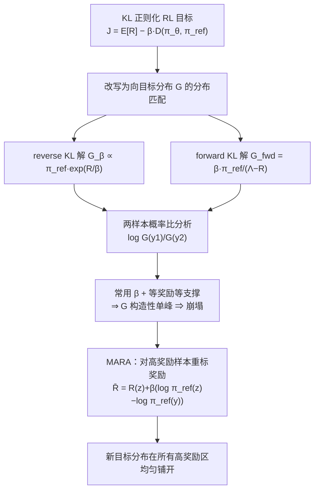

# KL-Regularized Reinforcement Learning for Generative Modelling is Designed to Mode Collapse

**会议**: ICLR 2026  
**OpenReview**: [https://openreview.net/forum?id=flBRtdIihA](https://openreview.net/forum?id=flBRtdIihA)  
**代码**: 待确认  
**领域**: 强化学习 / 生成式后训练  
**关键词**: KL-regularized RL, 模式崩塌, 多样性, 变分推断, RLHF, 奖励重标定  

## 一句话总结
本文从变分推断视角证明：KL 正则化 RL 的多样性崩塌不是优化算法的锅，而是目标分布本身被构造成了单峰——在常用超参下，即使完美求解全局最优，策略也注定只覆盖单个高奖励模式；据此提出仅改两行代码的 MARA（模式锚定奖励增广），让目标分布在所有高奖励区域均匀铺开。

## 研究背景与动机
**领域现状**：RL 已是基础模型后训练（RLHF / RLVR）的主流手段，其核心是一个 KL 正则化的（上下文）老虎机问题——最大化外部奖励 $R(y)$ 的同时，用 $\beta D(\pi_\theta, \pi_{\text{ref}})$ 把策略拴在参考模型附近以保持连贯性。输出多样性在创意写作、科学发现、探索式训练里都至关重要。

**现有痛点**：大量实证观察到 RL 后训练"提质降多样"，现有补救手段五花八门——显式多样性奖励、改 KL 方向、挑多样数据、基于计数的探索奖励。但这些都把问题当成"优化没探索好"来治，属于头痛医头。

**核心矛盾**：经典直觉认为 reverse KL"寻峰"（mode-seeking）、forward KL"覆盖"（mass-covering），于是有人以为换成 forward KL 就能保多样。本文指出这套直觉只在**变分族不够灵活**（如一维高斯）时成立；对基础模型这种灵活分布族，把任一 KL 优化到全局最优都能逼近复杂后验，"寻峰/覆盖"的二分根本不适用。真正决定形状的是被**隐式最小化的目标分布** $G$，而不是正则项里那个 $D(\pi_\theta, \pi_{\text{ref}})$。

**本文目标**：退一步问一个更本质的问题——我们正在优化的目标，它的全局最优解本身到底多样不多样？**核心 idea**：把 KL 正则化 RL 重写为"向一个目标分布 $G$ 做分布匹配"，证明在常用设置下 $G$ 被构造成单峰，因而崩塌是"正确求解"的必然产物；再通过**奖励重标定**直接把 $G$ 构造成奖励多峰，从源头解决。

## 方法详解

### 整体框架
全文先做"诊断"再开"药方"。诊断部分把两种 KL 正则化目标各自的最优解析解写出来，发现最大化正则化目标等价于向某个目标分布 $G$ 做（隐式）散度最小化；再用"两样本概率比"这把尺子刻画 $G$ 的形状，证明常用超参下 $G$ 必然单峰。药方部分（MARA）只对高奖励样本的奖励做一次重标定，就把 $G$ 改造成"高奖励区均匀、低奖励区贴近 $\pi_{\text{ref}}$"的多峰分布，且对 reverse / forward KL 都适用。

### 关键设计
**1. 正则化 RL = 向目标分布做分布匹配：** 论文把目标 $J_\beta(\pi_\theta)=\mathbb{E}_{\pi_\theta}[R]-\beta D_{\mathrm{KL}}(\pi_\theta\|\pi_{\text{ref}})$ 的梯度证明为向目标分布 $G_\beta$ 的 reverse KL 梯度，$\nabla_\theta D_{\mathrm{KL}}(\pi_\theta\|G_\beta)\propto-\nabla_\theta J_\beta$，其中最优解 $G_\beta(y)=\frac{1}{\zeta}\pi_{\text{ref}}(y)\exp\!\big(R(y)/\beta\big)$。换 forward KL 正则化时最优解变成完全不同的分布族 $G_{\text{fwd}}(y)=\frac{\beta\,\pi_{\text{ref}}(y)}{\Lambda-R(y)}$（$\Lambda>\max_y R(y)$），而且关键在于——forward KL 正则化的梯度**并不等于**一个 forward KL 梯度，所以"换成 forward KL 就能 mass-covering"的直觉站不住。这一步把研究对象从"正则项 $D(\pi_\theta,\pi_{\text{ref}})$"转移到"被隐式最小化的 $D(\pi_\theta, G)$"，是全文的支点。

**2. 用概率比尺子证明"构造性单峰"：** 因为归一化常数在比值里抵消，任意两样本在最优解下的对数概率比有闭式 $\log\frac{G_\beta(y_1)}{G_\beta(y_2)}=\log\frac{\pi_{\text{ref}}(y_1)}{\pi_{\text{ref}}(y_2)}+\frac{1}{\beta}\big(R(y_1)-R(y_2)\big)$。由此推出两个杀伤性结论：其一，等支撑下 $\frac{G_\beta(y_1)}{G_\beta(y_2)}=\exp\!\big(\frac{\Delta R}{\beta}\big)$，奖励的**线性**差被指数放大——$\Delta R=0.1$ 配常用 $\beta=10^{-3}$ 时，高奖励样本概率被推高到 $2.6\times10^{43}$ 倍，解几乎全压在最高奖励峰上；其二，等奖励（可验证奖励的标准设置：对得 1、错得 0）下 $\frac{G_\beta(y_1)}{G_\beta(y_2)}=\frac{\pi_{\text{ref}}(y_1)}{\pi_{\text{ref}}(y_2)}$，**与 $\beta$ 无关**，意味着 KL 正则化 RL 在等奖励时永远不会提升低支撑正确答案的相对概率——这不是探索不够，而是目标本身就不偏好它。两条对 reverse / forward KL 都成立。

**3. 把 $\beta$ 看成"模式选择旋钮"：** 当两条轨迹奖励不同、参考概率也不同时，存在唯一的 $\beta$ 让二者在目标分布里等概率，条件为 $R(y_2)-R(y_1)=\beta\big(\log\pi_{\text{ref}}(y_1)-\log\pi_{\text{ref}}(y_2)\big)$。这把 $\beta$ 的真实角色点破：它不是简单的"贴近参考强度"，而是在"高奖励-低支撑解"与"低奖励-高支撑解"之间做权衡的开关。论文据此能预测出 Figure 2 里偏好翻转的临界 $\beta\approx0.132$，并在实验中验证。

**4. MARA 模式锚定奖励增广（两行改动）：** 既然 Remark 4.4 给出了"两样本等概率"的条件，就反过来用它构造多峰目标。在一个采样 batch 内，先选支撑最高的高奖励样本作锚点 $z=\arg\max_{y}\pi_{\text{ref}}(y)\ \text{s.t.}\ R(y)\ge\tau$，再对所有高奖励样本重标奖励：

$$\bar R(y)=\begin{cases}R(y) & R(y)<\tau\\ R(z)+\beta\big(\log\pi_{\text{ref}}(z)-\log\pi_{\text{ref}}(y)\big) & R(y)\ge\tau\end{cases}$$

低奖励样本原封不动（目标分布在低奖励区贴近 $\pi_{\text{ref}}$ 保持有效性），高奖励样本被增广后在目标分布里获得**均匀**的高密度，从而抹平不同模式因支撑差异导致的概率鸿沟。阈值 $\tau$ 在奖励范围已知时设常数，未知时按 batch 取上分位（非可验证任务取 90 分位）。整段改动相对标准 RL 只有两行（选锚点 + 改高奖励样本奖励），可直接插进 GRPO / RLOO / REINVENT。

## 实验关键数据

### 主实验：非可验证创意问答（Qwen3-1.7B + WildChat，Table 1）

| 方法 | In-dist Reward↑ | Out-dist Reward↑ | Ngrams EAD↑ | Semantic Div↑ | Mean Distinct↑ |
|---|---|---|---|---|---|
| Base Model | 10.94 | 1.166 | 0.413 | 0.220 | 4.01 |
| GRPO | 14.80 | 1.317 | 0.497 | 0.193 | 3.96 |
| RLOO | 15.56 | 1.280 | 0.514 | 0.192 | 3.88 |
| Entropy 正则 | 1.44 | 0.786 | 0.267 | 0.228 | 3.45 |
| Unlikely | 10.04 | 1.381 | 0.532 | 0.191 | 4.24 |
| BoN Training | 16.88 | 0.596 | 0.541 | 0.162 | 2.29 |
| **MARA (rev)** | 15.42 | 1.451 | 0.543 | 0.186 | 4.14 |
| **MARA (fwd)** | 15.33 | **1.604** | **0.568** | 0.193 | **4.62** |

MARA（forward KL 版）在分布外奖励和绝大多数多样性指标上全面领先所有多样性专用基线；Entropy 正则虽然语义多样性高但奖励崩到 0.786，BoN 提质却严重伤多样性，反衬 MARA 的质量-多样性平衡。

### 可验证 1-2 任务（Qwen2.5-3B）
让模型均匀生成"1"或"2"，正确格式得 1 分。朴素 KL 正则化跨多个 $\beta$ 和种子几乎全部崩塌成只生成单一答案（多数塌到先验似然更高的"1"）；MARA 多个 run 学会近均匀生成 1 和 2，同时保持正确格式。Pareto 前沿显示 MARA 在 reverse / forward KL 下都能匹配 vanilla 的正确率，同时多样性显著更高。

### 药物发现 CLM（REINVENT，SYNTH 任务，Table 2a 节选）

| Screen | 算法 | Yield↑ | OB100↓ | IntDiv1↑ | #Circles↑ |
|---|---|---|---|---|---|
| 0.80 | REINVENT | 6569 | 1042 | 0.766 | 67 |
| 0.80 | MARA (τ=0.80) | **6834** | **1015** | 0.761 | 59 |
| 0.85 | REINVENT | 1614 | 4114 | 0.701 | 7 |
| 0.85 | MARA (τ=0.85) | **2196** | 4010 | 0.703 | 7 |

把 $\tau$ 设成筛选阈值时 Yield（发现的独特高奖励分子数）最高、OB100（找到分子所需奖励函数调用数）更低，且在它并不显式优化的"全局多样性"（IntDiv1 / #Circles）上仍与基线持平。

### 关键发现
- **崩塌是目标的构造性产物，与算法无关**：即使有无限算力、完美数据、完美优化，常用超参下全局最优解依然单峰。
- **降低 $\beta$ 治不了等奖励下的低支撑模式遗漏**：因为等奖励概率比与 $\beta$ 无关。
- **同一份重标定对 reverse 和 forward KL 都有效**，而朴素用任一 KL 都会失败。

## 亮点与洞察
- **从"算法视角"切换到"目标分布视角"**：把多样性崩塌的归因从"优化/探索没做好"翻转为"目标本身被定义成单峰"，是一个干净、可证伪、并能直接导出修法的诊断框架。
- **打破 reverse/forward KL 的 mode-seeking/mass-covering 迷信**：明确这套直觉只在受限变分族下成立，对基础模型不适用，并指出 forward KL 正则化梯度根本不是 forward KL 梯度（顺带解释了 GRPO 可能"无意中估了 forward KL"）。
- **改动极小、即插即用**：两行伪代码，能直接套进 GRPO / RLOO / REINVENT，且无需任何外部多样性信号或奖励模型。
- **跨域验证**：LLM 可验证任务、非可验证对齐、化学语言模型药物发现三个差异极大的场景一致受益，说明结论是关于目标本身的普适性质。

## 局限与展望
- **非序列设置**：分析建立在上下文老虎机（单步生成）框架上，未覆盖序列决策 / MDP；虽然该非序列设置在生成模型 RL 里很常用，但 token 级 credit assignment 下的形状是否一致仍待验证。
- **依赖锚点与阈值 $\tau$**：MARA 需在 batch 内选到高奖励锚点，当 batch 内高奖励样本稀少或奖励范围未知时，$\tau$（分位数）选取会影响表现（附录显示降分位略掉点）。
- **"奖励模式"的定义偏理想化**：Definition 3.5 把多峰定义为"高奖励区近似等密度"，对连续奖励、模式边界模糊的真实任务，"模式"如何界定仍有主观性。
- **只对齐局部相对概率**：MARA 显式优化的是高奖励样本间的相对密度，对分子这类需要"全局结构多样性"的任务只是"竞争性持平"而非主动提升，留有改进空间。

## 相关工作与启发
- **目标分布 / VI 视角的后训练**：与 Korbak、Go、DPO（Rafailov）、Zhang & Ranganath 等把 RLHF 解析解写成 $\pi_{\text{ref}}\exp(R/\beta)$ 的工作同源，但本文把焦点从"解长什么样"推进到"解的多样性是否由构造决定"。
- **过滤式方法的重新诠释**：把 STaR、RAFT 这类筛高奖励轨迹做最大似然的方法解读为对目标 $G_\beta$ 的拒绝采样近似，给了它们一个统一的分布匹配解释。
- **多样性补救基线**：相对显式多样性奖励、entropy 正则、Unlikely、BoN、weight ensembling 等"事后补救"，MARA 主张"先把目标改对"，是一条更根本的路线。
- **启发**：任何"提质降多样"的后训练抱怨，先别急着加探索/多样性奖励，应先问"我优化的目标全局最优本身多样吗"——若答案是否定的，再多的算法技巧也救不回来。

## 评分
- **新颖性**: ⭐⭐⭐⭐⭐ 把多样性崩塌从"优化问题"重新诊断为"目标构造问题"，并打破 KL 方向的经典直觉，视角转换干净且有理论支撑。
- **实验充分度**: ⭐⭐⭐⭐ 从 didactic 仿真到 LLM 可验证/非可验证再到化学语言模型三域验证，且有多基线对比；略欠序列/大规模真实 RLHF 验证。
- **写作质量**: ⭐⭐⭐⭐⭐ 论证层层递进（解析解→概率比→构造性单峰→重标定），每节配 didactic 实验，take-away 醒目，可读性极佳。
- **价值**: ⭐⭐⭐⭐⭐ 诊断本质、修法两行即插即用、跨域有效，对所有做 RL 后训练且关心多样性的人都有直接指导意义。

<!-- RELATED:START -->

## 相关论文

- [\[ICLR 2026\] The Choice of Divergence: A Neglected Key to Mitigating Diversity Collapse in Reinforcement Learning with Verifiable Reward](the_choice_of_divergence_a_neglected_key_to_mitigating_diversity_collapse_in_rei.md)
- [\[ICLR 2026\] GAR: Generative Adversarial Reinforcement Learning for Formal Theorem Proving](gar_generative_adversarial_reinforcement_learning_for_formal_theorem_proving.md)
- [\[ICLR 2026\] GRACE: Generative Representation Learning via Contrastive Policy Optimization](grace_generative_representation_learning_via_contrastive_policy_optimization.md)
- [\[ICML 2026\] Offline Reinforcement Learning with Generative Trajectory Policies](../../ICML2026/reinforcement_learning/offline_reinforcement_learning_with_generative_trajectory_policies.md)
- [\[NeurIPS 2025\] Convergence Theorems for Entropy-Regularized and Distributional Reinforcement Learning](../../NeurIPS2025/reinforcement_learning/convergence_theorems_for_entropy-regularized_and_distributional_reinforcement_le.md)

<!-- RELATED:END -->
