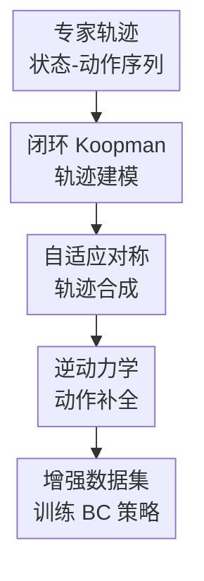

# Koopman-Assisted Trajectory Synthesis: A Data Augmentation Framework for Offline Imitation Learning

**会议**: ICLR 2026  
**OpenReview**: [https://openreview.net/forum?id=UAZCKdd4R7](https://openreview.net/forum?id=UAZCKdd4R7)  
**代码**: 待发布  
**领域**: 强化学习 / 离线模仿学习 / 轨迹合成  
**关键词**: 离线模仿学习、Koopman算子、轨迹级数据增强、逆动力学模型、协变偏移  

## 一句话总结
KATS把专家闭环行为学习成 Koopman 潜空间里的线性动力学，再用与该动力学近似对易的潜空间对称变换整条合成新轨迹，并通过逆动力学补回动作，从而在低数据多样性的离线模仿学习与少样本离线强化学习任务上显著提升策略性能。

## 研究背景与动机
**领域现状**：离线模仿学习通常从固定专家数据集里训练策略，最基础的行为克隆把问题写成监督学习：给定状态 $s$，预测专家动作 $a$。这种做法简单、稳定，也很适合不能在线交互的机器人控制、导航和操作任务。但它的前提很脆弱：训练时策略只见过专家访问过的状态，部署时一旦动作有小误差，状态分布就会偏离专家轨迹，后续动作又在没见过的区域里继续出错，形成典型的 covariate shift。

**现有痛点**：缓解分布偏移有两条路线。一类是算法中心方法，例如保守正则、模型回滚、支持集约束；另一类是数据中心方法，也就是扩充离线数据。后者的吸引力在于不用重新采样环境，只要生成更多合理的状态-动作样本，就可能让策略在专家轨迹附近更稳。问题是，简单的单步扰动、Mixup 或噪声注入只关心局部 transition，容易把状态扰到物理上不一致的位置；而直接用前向动力学模型递推整条轨迹，又会把一步预测误差沿时间滚大。GAN、diffusion 等生成模型虽然表达力强，但在专家演示很少时缺少足够数据支撑，容易生成看似多样但行为不可信的轨迹。

**核心矛盾**：离线模仿学习真正需要的是“整条轨迹级”的增强，而不是独立 transition 的拼贴；同时这种增强又不能靠长时 rollout，否则模型误差会随时间累积。换句话说，方法要同时满足三个条件：生成结果必须动态一致，必须保留专家行为风格，还必须在少量演示下可训练、可扩展。

**本文目标**：作者希望构造一个离线数据增强框架，以专家轨迹为基本单位生成新的状态-动作序列；生成的状态轨迹要服从专家闭环动力学，动作要能与合成状态转移匹配，增强过程还要避免先前 Koopman 增强方法在动作维度上扩展不佳的问题。

**切入角度**：论文从 Koopman 算子理论切入。Koopman 方法把非线性动力学提升到高维观测空间，在该空间中用线性算子描述演化。如果能找到与 Koopman 动力学对易的对称变换 $\sigma$，那么对已有轨迹逐点施加 $\sigma$ 后，新轨迹仍应沿同一个线性动力学演化。这个性质天然适合“整条轨迹一起变换”，因为它不是从第一个状态一步步预测未来，而是把原专家轨迹的每个时刻映射到一个新的、结构一致的位置。

**核心 idea**：KATS用专家闭环 Koopman 动力学替代动作条件 Koopman 动力学，再学习对易的潜空间对称变换来整条合成轨迹，并用逆动力学模型为合成状态转移补齐动作。

## 方法详解

### 整体框架
KATS的输入是一批离线专家轨迹 $D_E=\{\tau_i\}$，输出是扩充后的轨迹数据集 $D_{final}=D_E\cup D_{aug}$，随后仍可用普通行为克隆训练策略。与一步一步 rollout 不同，KATS先学习“专家策略驱动下的闭环动力学” $s_{t+1}\approx G(s_t)$，再在 Koopman 潜空间中找近似对易变换 $\sigma$，把整条专家状态轨迹同时映射成一条新状态轨迹，最后用逆动力学模型从相邻状态对推回动作。

这套流程的关键是把动作从 Koopman 动力学里解耦出去：Koopman 模型只负责专家闭环状态演化，动作由单独的 IDM 负责补齐。这样既避免了 KFC 这类 action-equivariant Koopman 方法对每个动作维度维护算子的成本，也避免了把原动作硬贴到新状态上的状态-动作不匹配。

### 关键设计
**1. 闭环 Koopman 轨迹建模：把专家策略吸收到状态动力学里**

先前 Koopman 增强方法通常建模开环动力学 $s_{t+1}=F(s_t,a_t)$，并学习动作相关算子，例如 KFC 中的双线性形式 $z_{t+1}\approx (K_0+\sum_k K_k a_{t,k})z_t$。这在动作维度高时很吃亏：模型复杂度和推理成本都会随动作维度上升，而且单步 transition 增强仍然难以保证长时行为一致。KATS改成建模专家策略诱导的闭环系统 $s_{t+1}\approx G(s_t)$，也就是把“专家在这个状态会怎么动作”的信息隐式压进状态转移里。

具体做法是训练一个自编码器 $(E_\phi,D_\psi)$ 和一个动作无关的 Koopman 矩阵 $K$。编码器把状态映射为潜变量 $z_t=E_\phi(s_t)$，Koopman 矩阵负责线性推进 $z_{t+1}\approx Kz_t$，解码器负责从潜空间还原状态。训练目标包含重构损失和 Koopman 预测损失：$L_{recon}=\mathbb{E}_{s\sim D_E}\|s-D_\psi(E_\phi(s))\|^2$，$L_{koopman}=\mathbb{E}_{(s_t,s_{t+1})\sim D_E}\|E_\phi(s_{t+1})-K E_\phi(s_t)\|^2$。因为 $K$ 直接从专家相邻状态对学习，它描述的是专家闭环行为，而不是任意动作下的环境动力学；后续对称变换只要与这个 $K$ 对易，合成轨迹就更容易保持专家行为风格。

**2. 对易对称的轨迹级合成：一次变换整条轨迹，绕开 rollout 误差累积**

KATS的理论核心是 policy-equivariance。若闭环动力学 $F_\pi$ 对某个状态变换 $\sigma$ 等变，即 $F_\pi(\sigma\cdot s)=\sigma\cdot F_\pi(s)$，那么对应 Koopman 算子满足对易关系 $K_\pi\sigma=\sigma K_\pi$。这件事的直观含义很直接：先把状态做对称变换再沿专家闭环动力学走一步，和先走一步再做同样变换，结果应当一致。

因此，给定一条专家潜轨迹 $z^E_0,z^E_1,\ldots,z^E_T$，KATS不是从 $\sigma z^E_0$ 开始递推 $K$ 生成未来，而是逐点构造 $\hat z_t=\sigma z^E_t$。如果 $K\sigma\approx \sigma K$，那么新轨迹也近似满足 $\hat z_{t+1}\approx K\hat z_t$。这种“整条轨迹同时映射”的方式保留了原轨迹的时间结构，避免了前向模型 rollout 中一步误差滚到多步的问题。解码后得到 $\hat s_t=D_\psi(\hat z_t)$，整条状态序列就成为一条新的、与专家闭环动力学一致的候选轨迹。

**3. 自适应对称学习：把 Koopman 误差变成增强时的重点约束**

有限维 Koopman 表示不可能处处精确，特别是在专家数据稀疏、状态变化很小或动力学更复杂的区域，预测误差会更大。如果此时还无差别地学习或应用对称变换，增强数据可能会把模型偏差放大。论文给出的误差分解说明了问题来源：若专家潜轨迹的一步误差为 $\epsilon_t=z^E_{t+1}-Kz^E_t$，对易误差为 $\Delta=\sigma K-K\sigma$，则变换后轨迹的一步误差满足 $\hat\epsilon_t=\sigma\epsilon_t+\Delta z^E_t$，并有 $\|\hat\epsilon_t\|\le \|\sigma\|\|\epsilon_t\|+\|\Delta\|\|z^E_t\|$。所以增强质量不仅取决于 Koopman 预测准不准，也取决于 $\sigma$ 是否真的和 $K$ 对易。

KATS据此不再只求解固定的齐次 Sylvester 方程 $K\sigma-\sigma K=0$，而是用带权目标学习变换：$L_\sigma=\mathbb{E}_{(s_t,s_{t+1})\sim D_E} w_{s_t}\|\sigma(z_{t+1})-K\sigma(z_t)\|^2$，其中 $w_{s_t}=\exp(\tau\|z_{t+1}-Kz_t\|)$。局部 Koopman 误差越大，权重越高，训练就越强迫 $\sigma$ 在这些脆弱区域满足对易一致性。这个设计有点反直觉：它不是直接避开困难区域，而是在困难区域更严格地约束对称变换，从而让增强集中补足原策略最容易偏离的状态附近。

**4. 逆动力学动作补全：状态轨迹合成后再推断匹配动作**

闭环 Koopman 设计带来一个新问题：合成时只产生了状态序列 $s'_0,\ldots,s'_T$，没有动作。如果直接沿用原轨迹动作，状态变化已经被 $\sigma$ 改过，动作和转移可能不再匹配。KATS用独立的逆动力学模型 $f_{IDM}:S\times S\rightarrow A$ 解决这个缺口，让动作从合成后的相邻状态对里推断出来。

IDM在专家数据上训练，目标为 $L_{IDM}=\mathbb{E}_{(s_t,a_t,s_{t+1})\sim D_E}\|a_t-f_{IDM}(s_t,s_{t+1})\|^2$。生成阶段，对每个合成状态对 $(s'_t,s'_{t+1})$，动作取 $a'_t=f_{IDM}(s'_t,s'_{t+1})$，于是得到完整 tuple $(s'_t,a'_t,s'_{t+1})$ 或完整轨迹 $\tau'$。最后把 $D_E$ 与 $D_{aug}$ 合并，用常规 BC 损失训练策略即可。也就是说，KATS的增强模块本身是一个前处理器，不要求下游 imitation learner 改结构。

### 一个完整示例
可以把 AntMaze 中一条专家轨迹想成“从起点绕过几个拐角到达目标”的状态序列。普通单步增强可能只对某个 transition 加扰动，导致某一步看起来还合理，但前后轨迹的走向不连续；模型 rollout 则会从起点开始预测，若第 10 步已经偏了，后面几十步会越来越离谱。KATS先把整条专家状态序列编码成 $z_0,z_1,\ldots,z_T$，再用学到的 $\sigma$ 同时得到 $\sigma z_0,\sigma z_1,\ldots,\sigma z_T$。如果这个对称变换对应“在迷宫局部几何中换一条对称但可行的路径”，那么解码出的新路径仍会在拐角处保持一致的方向变化，而不是由孤立 transition 拼成。

动作生成发生在最后一步。对于合成后的相邻状态 $(s'_t,s'_{t+1})$，IDM判断专家在类似状态变化下应当采取什么动作，例如向右推进、转弯或减速。这样得到的新数据不只是“看起来像轨迹”的状态序列，而是可以直接用于行为克隆训练的状态-动作轨迹。

### 损失函数 / 训练策略
训练分为四个阶段。第一阶段预训练 Koopman 自编码器和线性算子，联合最小化重构损失 $L_{recon}$ 与潜空间预测损失 $L_{koopman}$；论文实现中使用 MLP 编码器/解码器，Koopman 潜空间维度为 $N_z=32$。第二阶段训练逆动力学模型，用相邻状态预测动作。第三阶段训练 sigma 模型，用带权对易损失 $L_\sigma$ 学习潜空间变换，权重由 Koopman 局部预测误差决定，温度参数为 $\tau=1.5$。第四阶段把原始数据和增强数据混合，用行为克隆训练最终策略；连续动作任务使用均方误差，离散动作任务使用交叉熵。

论文的一个工程细节是，KATS本身并不绑定某个特定 imitation learner。主实验里主要展示 KATS+BC，但兼容性实验也把 KATS作为预处理增强器接到 BC 和 SRA 前面，说明它可以作为 plug-and-play 数据增强模块使用。离线 RL 实验中，为了给合成 transition 分配 reward，作者沿用 KFC 的简单做法：复用源轨迹相同步的 reward。

## 实验关键数据

### 主实验
论文在 D4RL 的三类任务上评估：AntMaze 导航、Gym/MuJoCo 运动控制和 Adroit 手部操作。主对比包括 BC、SRA、MILO、KFC+BC 和 KATS+BC。KATS在表 1 的 15 个离线模仿学习任务上全部取得最佳结果，尤其在数据稀疏和人类演示噪声较重的任务上提升明显。

| 数据集 / 任务 | 指标 | 本文 KATS+BC | 强基线 | 提升 |
|--------|------|------|----------|------|
| antmaze-umaze | D4RL score | 96.9 ± 0.8 | SRA 85.3 ± 1.1 | +11.6 |
| antmaze-large-play | D4RL score | 59.3 ± 1.5 | SRA 48.3 ± 2.0 | +11.0 |
| halfcheetah-medium-expert | D4RL score | 81.2 ± 6.7 | SRA 63.4 ± 3.5 | +17.8 |
| hopper-medium-expert | D4RL score | 112.7 ± 3.6 | SRA 104.5 ± 3.3 | +8.2 |
| pen-cloned | D4RL score | 81.3 ± 4.7 | MILO 57.1 ± 2.0 | +24.2 |
| door-human | D4RL score | 37.2 ± 2.1 | MILO 27.0 ± 1.0 | +10.2 |

与直接前身 KFC+BC 的比较更能说明方法差异。KFC仍是 Koopman 思路，但它是动作耦合、单步 transition 风格；KATS在 antmaze-umaze 上从 KFC+BC 的 79.1 提到 96.9，在 pen-cloned 上从 38.3 提到 81.3。这支持作者的判断：对专家闭环轨迹建模，比对单步动作条件动力学做增强更适合离线模仿学习。

论文还测试了少样本离线 RL 设置，数据量被压到 0.5%、1% 或 10% 等低比例。虽然 KATS只用简单 reward 复用启发式，但 KATS+BC 在 12 个任务中有 10 个达到最优，说明高保真轨迹增强本身能让简单 BC 追上甚至超过复杂离线 RL 算法。

| 任务 | 数据量 | 本文 KATS+BC | 最强对比方法 | 说明 |
|------|---------|------|------|------|
| Hopper-e | 10k (1%) | 97.1 ± 10.4 | KFC+CQL 89.1 ± 7.6 | 少量专家数据下仍明显提升 |
| Halfcheetah-e | 10k (1%) | 102.7 ± 8.1 | POR 86.2 ± 5.2 | 超过离线 RL 强基线 |
| Walker2d-e | 10k (1%) | 109.4 ± 11.2 | KFC+CQL 86.4 ± 12.2 | 增强轨迹对 locomotion 很有效 |
| Antmaze-u | 0.1M (10%) | 83.1 ± 7.2 | TELS 88.7 ± 7.7 | 本文非最优，但仍强于多数方法 |
| Antmaze-m-p | 0.1M (10%) | 71.3 ± 15.2 | KFC+CQL 67.5 ± 9.3 | 中等迷宫仍有收益 |
| Antmaze-l-p | 0.1M (10%) | 51.4 ± 13.1 | KFC+CQL 49.1 ± 8.1 | 大迷宫提升较小但保持领先 |

### 消融实验
消融主要验证三个组件：可学习的 $\sigma_\theta$、逆动力学模型 IDM、以及动作解耦设计。作者在 AntMaze 和 Maze2d 上比较完整 KATS、固定解析矩阵版本 KATS-$\sigma_A$、去掉 IDM 的 KATS w/o IDM，以及动作耦合的 KFC+BC。

| 配置 | 关键指标 | 说明 |
|------|---------|------|
| KATS (Ours) | antmaze-umaze 96.9 ± 0.8 | 完整模型，最佳 |
| KATS-$\sigma_A$ | antmaze-umaze 87.3 ± 2.6 | 固定解析对称不如自适应学习 |
| KATS w/o IDM | antmaze-umaze 78.4 ± 4.8 | 去掉动作补全后状态-动作匹配变差 |
| KFC+BC | antmaze-umaze 79.1 ± 3.4 | 动作耦合 Koopman 单步增强弱于轨迹级增强 |
| KATS (Ours) | maze2d-large 100.1 ± 7.2 | 大迷宫上仍显著领先 |
| KATS-$\sigma_A$ | maze2d-large 89.2 ± 12.2 | 可学习 $\sigma$ 更能捕捉有效对称 |
| KATS w/o IDM | maze2d-large 41.5 ± 15.8 | 动作推断缺失在复杂路径上损失很大 |

### 关键发现
- KATS的最大收益来自“轨迹级 + 闭环专家动力学”这两个选择的组合。它不是给单个 transition 加噪声，而是把专家轨迹作为整体变换，所以在 AntMaze 这类长时任务上更能保持路径连贯性。
- IDM是必要组件。消融中 KATS w/o IDM 经常接近甚至低于 KFC+BC，说明只生成新状态还不够，离线模仿学习最终训练的是动作策略，合成动作必须与合成转移匹配。
- 自适应 $\sigma$ 比固定解析矩阵稳定。KATS-$\sigma_A$ 在各任务上也有提升，说明 Koopman 对称增强本身有价值；但完整 KATS 进一步提升，说明根据局部 Koopman 误差学习对称变换能产生更有效的数据。
- KATS可以作为通用增强器。图 3 显示，给 BC 和 SRA 都接上 KATS 后性能提升，尤其 BC 受益最大；这符合预期，因为 BC 最容易被 covariate shift 击穿。

## 亮点与洞察
- 这篇论文最巧的地方是把 Koopman 建模对象从“动作条件环境动力学”换成“专家闭环动力学”。这个变化看似只是去掉动作，但实际把行为合理性内化到了 $K$ 里，让轨迹合成围绕专家策略的结构展开。
- 轨迹级增强比单步增强更贴近离线 IL 的失败模式。covariate shift 不是某一个 transition 坏掉，而是策略走到训练分布外后连续犯错；KATS用整条轨迹补覆盖，正好对准这个问题。
- 误差分解给增强质量提供了清晰诊断：合成轨迹错，不只是 Koopman 模型预测差，也可能是对称变换不够对易。这个视角可以迁移到其他潜空间生成方法里，用“生成变换是否保持动力学结构”来约束数据增强。
- IDM的解耦很实用。它让状态轨迹生成和动作补全各司其职，也使 KATS 更像一个可插拔的数据预处理模块，而不是必须重写下游算法的完整新 learner。

## 局限与展望
- 作者承认当前 Koopman 模型相对简单，主要是 MLP 编码器/解码器加一个有限维线性矩阵。面对更强非线性、更高维视觉观测或多模态机器人输入时，这种表示可能不足，需要更复杂的 Koopman 架构或不确定性建模。
- 方法依赖专家闭环动力学具有可学习的近似对称性。如果任务本身对称结构弱，或者数据只覆盖很窄且不具代表性的行为模式，$\sigma$ 学到的变换可能无法产生真正有用的新轨迹。
- IDM质量会直接限制最终数据质量。在动作多解、接触动力学复杂或状态观测不完整的场景里，同一个状态转移可能对应多个动作，简单 MLP 逆动力学可能给出平均化动作。
- 离线 RL 实验中复用源轨迹 reward 是一个务实但粗糙的启发式。若合成状态偏离源状态较多，原 reward 未必严格正确；后续可以结合 learned reward model、环境可用的 reward 函数或保守 reward 校准。
- 当前实验主要是低维 D4RL 控制任务。若要进入真实机器人视觉模仿，仍需验证图像观测编码、长期任务层次结构和物理接触安全性。

## 相关工作与启发
- **vs 行为克隆 BC**: BC只在原专家状态分布上做监督学习，部署时容易因 covariate shift 崩掉；KATS在训练前扩充专家附近的动态一致轨迹，使同样的 BC 损失获得更好的状态覆盖。
- **vs SRA / MILO**: SRA、MILO更偏算法或模型约束路线，用反向增强、策略约束等方式缓解分布偏移；KATS偏数据中心路线，不直接改 imitation learner，而是提供更高质量的增强数据，因此可以和这类方法互补。
- **vs KFC / Koopman Q-learning**: KFC使用 action-equivariant Koopman 结构并多用于单步数据增强，动作维度会带来模型和计算开销；KATS使用 state/policy-equivariant 的闭环 Koopman 表示，用单个 $K$ 合成整条轨迹，更适合轨迹型离线模仿学习。
- **vs diffusion / GAN 轨迹生成**: 生成模型可以直接拟合轨迹分布，但在小数据离线场景下容易数据饥饿；KATS的 Koopman 对称性提供了强动力学归纳偏置，用较少数据也能生成结构化轨迹。
- **启发**: 对于其他离线决策任务，可以考虑先学习“策略诱导的闭环潜动力学”，再寻找保持该动力学的变换，而不是直接学习开放环境模型。这种思路尤其适合专家行为结构强、但演示数量有限的机器人与导航任务。

## 评分
- 新颖性: ⭐⭐⭐⭐ Koopman 对称增强并非全新，但把它提升到专家闭环轨迹级合成，并用 IDM 解耦动作，组合很有针对性。
- 实验充分度: ⭐⭐⭐⭐ 覆盖 D4RL 的 IL、少样本 offline RL、plug-and-play 和消融，证据较完整；但还缺真实机器人或高维视觉任务验证。
- 写作质量: ⭐⭐⭐⭐ 理论动机和算法流程较清楚，误差分解有帮助；个别表述如 state-equivariant / policy-equivariant 命名略易混淆。
- 价值: ⭐⭐⭐⭐⭐ 对离线模仿学习的数据增强路线很有参考价值，尤其适合低数据多样性和长时轨迹任务。

<!-- RELATED:START -->

## 相关论文

- [\[ICML 2026\] Trajectory-Level Data Augmentation for Offline Reinforcement Learning](../../ICML2026/reinforcement_learning/trajectory-level_data_augmentation_for_offline_reinforcement_learning.md)
- [\[ICLR 2026\] Trajectory Generation with Conservative Value Guidance for Offline Reinforcement Learning](trajectory_generation_with_conservative_value_guidance_for_offline_reinforcement.md)
- [\[ICLR 2026\] GAS: Enhancing Reward-Cost Balance of Generative Model-assisted Offline Safe RL](gas_enhancing_reward-cost_balance_of_generative_model-assisted_offline_safe_rl.md)
- [\[ICLR 2026\] Goedel-Prover-V2: Scaling Formal Theorem Proving with Scaffolded Data Synthesis and Self-Correction](goedel-prover-v2_scaling_formal_theorem_proving_with_scaffolded_data_synthesis_a.md)
- [\[ICLR 2026\] On Discovering Algorithms for Adversarial Imitation Learning](on_discovering_algorithms_for_adversarial_imitation_learning.md)

<!-- RELATED:END -->
