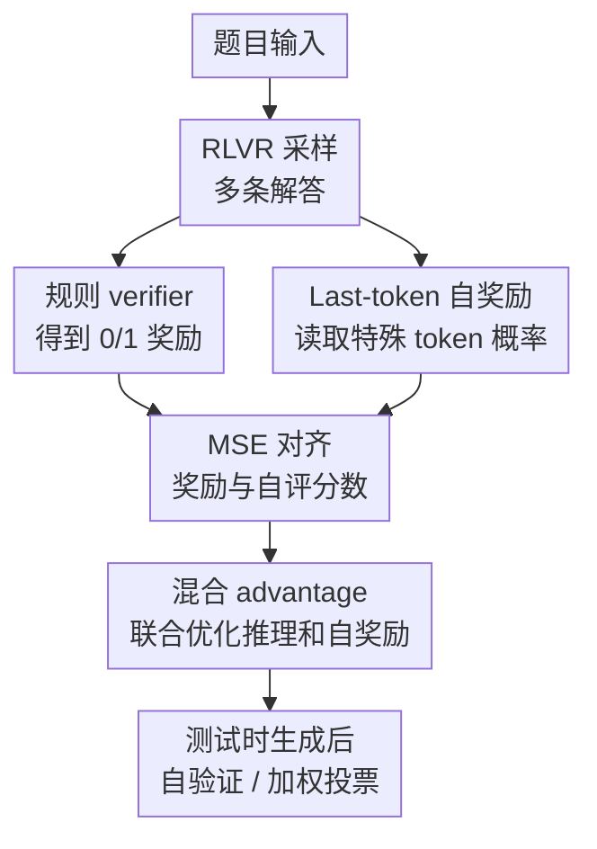

# LaSeR: Reinforcement Learning with Last-Token Self-Rewarding

**会议**: ICLR 2026  
**OpenReview**: [https://openreview.net/forum?id=1OhgEmix20](https://openreview.net/forum?id=1OhgEmix20)  
**代码**: https://github.com/RUCBM/LaSeR  
**领域**: 强化学习 / LLM 后训练 / 自奖励  
**关键词**: [RLVR, 自奖励, 自验证, GRPO, 测试时扩展]

## 一句话总结
LaSeR 把 LLM 对自己答案的正确性判断压缩到“答案最后一个 token 之后某个特殊 token 的 log-prob”里，用一个 MSE 辅助损失把这个 last-token self-rewarding score 对齐到 verifier 奖励，从而在几乎不增加推理成本的情况下同时提升 RLVR 推理能力和测试时自验证能力。

## 研究背景与动机
**领域现状**：LLM 数学推理后训练里，Reinforcement Learning with Verifiable Rewards（RLVR）已经成为很核心的一类方法。它通常让模型对同一道题采样多个解答，再用规则 verifier 检查最终答案是否等价于标准答案，并把 0/1 反馈送进 PPO、GRPO 等策略优化算法。DeepSeek-R1、OpenAI o1 这类系统背后的共同经验是：只要任务有可验证答案，RLVR 能把模型推向更长、更审慎、更会自我检查的推理轨迹。

**现有痛点**：标准 RLVR 的奖励只在训练时可用，因为训练集有标准答案，测试时却没有 ground truth。要在测试时做 candidate ranking、weighted majority voting 或 continual self-improvement，模型还需要知道“自己这条答案大概对不对”。已有路线要么训练额外 reward model / verifier，要么让同一个 LLM 先生成解答、再用另一个 prompt 生成自验证判断。这两类做法都很重：外部 verifier 要额外模型和训练成本，自验证 prompt 则会把每个样本的生成开销近似翻倍。

**核心矛盾**：RLVR 已经在训练中知道哪些答案对、哪些答案错，但这个监督没有自然留在模型的输出分布里；而测试时最需要的不是再写一段长评审，而是一个低成本、可校准、能排序候选解的标量分数。问题的关键变成：能不能在不额外生成自验证文本的前提下，让模型在生成答案的同时给出自己的 correctness score？

**本文目标**：作者希望把推理能力和自奖励能力联合训练到同一个 policy model 里，并且这个自奖励信号要满足三个条件：训练时能和 RLVR 无缝合并，测试时能在生成答案后马上得到，成本最多只多一次 token inference；分数还要足够准，能用于自验证和候选答案加权投票。

**切入角度**：论文从 RL 目标的闭式解出发观察到，验证任务的最优奖励可以写成 policy model 与 reference model 在某个 verification token 上的 log-prob ratio。进一步地，如果这个 token 选成未使用的特殊 token，那么 reference model 在答案结束位置预测它的 log-prob 几乎是一个稳定常数。这样一来，原本需要完整 verifier 生成的问题，就被简化成读取答案最后位置的 next-token probability。

**核心 idea**：用最后一个答案 token 后的特殊 token log-prob 构造自奖励分数，并用 MSE 把它对齐到规则 verifier 的 0/1 奖励，让 LLM 在 RLVR 过程中顺手学会“生成完就知道自己大概对不对”。

## 方法详解

### 整体框架
LaSeR 可以看成标准 RLVR/GRPO 上的一条轻量旁路：模型照常对题目生成多条解答，规则 verifier 仍然给每条解答打 0/1 奖励；但在每条解答结束后，LaSeR 额外读取 policy model 对预设特殊 token $z_c$ 的 next-token log-prob，并把它变成 last-token self-rewarding score $r_s$。训练时，$r_s$ 通过 MSE loss 对齐 verifier reward；等自奖励能力稳定后，$r_s$ 还能和 verifier reward 一起构造 advantage，给 RL 更新提供更细粒度的信号。测试时没有标准答案，模型只需要生成答案并多看一次特殊 token 概率，就能得到用于自验证、排序和加权投票的分数。

### 关键设计
**1. Last-token 自奖励：把验证判断压进答案结束位置的特殊 token 概率**

传统自验证方法会要求模型在解答之后再生成一段“这条答案是否正确”的判断，LaSeR 的核心反直觉之处在于：它不让模型写判断，而是让判断体现在答案结束位置的 next-token distribution 里。给定题目 $x$ 和模型生成的解答 $y$，预先指定一个代表“正确”的特殊 token $z_c$，例如 Qwen 模型里的 `<vision_start>` 或 LLaMA 系里的 reserved special token。LaSeR 定义自奖励分数为 $r_s=\beta_v\log\pi_\theta(z_c\mid x,y)-\beta_v c_{ref}$，其中 $c_{ref}$ 近似等于 reference model 在同一位置对 $z_c$ 的平均 log-prob。

这个设计解决的是推理后自验证的成本问题。模型在 RL 训练里本来就需要计算生成序列的 token log-prob，因此训练时只要把第一个 padding 位置替换成特殊 token 再取 log-prob，几乎不需要额外前向；推理时也只需在答案结束后多做至多一次 token inference。更重要的是，分数来自答案最后状态，它天然条件化于完整解答，而不是像全序列 implicit reward 那样把每个 token 的 log-ratio 累加起来，因而避免了“长答案分数绝对值更大”的长度偏置。

**2. 从验证 RL 闭式解到 MSE 对齐：用理论把 0/1 verifier 奖励变成可学习标量**

论文先把验证任务写成一个 RL 目标：给定题目 $x$ 和候选答案 $y$，模型输出验证 token $z$，如果 $z$ 与 verifier 判断一致就得 1，否则得 0。这个目标的最优解满足类似 DPO/implicit reward 的形式：验证奖励可以表示为 $\beta_v\log\frac{\pi_\theta(z\mid x,y)}{\pi_{ref}(z\mid x,y)}$ 加上 partition function 项。作者进一步指出，当 $z_c$ 和 $z_i$ 是在答案结束位置概率极小的 token 时，$Z(x,y)\approx 1$，因此 $\log Z(x,y)\approx 0$。

在“答案正确”对应的 token $z_c$ 上，这个关系变成 $r_v(x,y)\approx\beta_v\log\frac{\pi_\theta(z_c\mid x,y)}{\pi_{ref}(z_c\mid x,y)}$。于是训练 self-verification 不需要另跑一次 RL，也不需要 BCE 把 $z_c$ 的概率硬推到 1，而是只需最小化 $(r_s-r_v)^2$。这点很关键：如果用 SFT/BCE，正确样本会驱动 $\pi_\theta(z_c\mid x,y)$ 接近 1，容易强烈干扰原本的语言建模和推理生成；LaSeR 通过 $\beta_v$ 控制目标概率，比如 $\pi_{ref}(z_c\mid x,y)=e^{-23}$、$\beta_v=0.1$ 时，正确答案只需要把概率推到约 $e^{-13}$，仍然是很小的概率，不会把输出分布掰坏。

**3. Reference 常数化与类别重加权：让自奖励训练既省算力又不偏科**

如果每次都要同时跑 policy model 和 reference model 来计算 log-prob ratio，自奖励虽然不生成文本，仍然会带来明显开销。LaSeR 的简化来自一个实证观察：在答案结束位置，reference model 对未使用特殊 token $z_c$ 的 log-prob 在不同题目、不同答案、不同训练 step 上都很稳定。论文用 300 个输入输出对显示，Qwen2.5 使用 `<vision_start>` 时 $-\log\pi_{ref}(z_c\mid x,y)$ 约为 $23.11\pm0.04$，OctoThinker 使用 reserved token 时约为 $24.87\pm1.18$。因此可以预先估计 $c_{ref}$，训练和推理时直接用 policy log-prob 减常数。

另一个实际问题是正确与错误解答比例会动态变化。比如训练早期错误答案多，自奖励 MSE 很容易学成“多数答案都错”；训练后期正确答案变多，又可能对错误答案识别变差。LaSeR 在每个优化 step 内统计正确样本数 $N_c$ 和错误样本数 $N_i$，用 $w_c=\frac{N_c+N_i}{2N_c}$、$w_i=\frac{N_c+N_i}{2N_i}$ 给两类样本重加权。这样 self-rewarding loss 不是简单追随 batch 里的类别分布，而是始终逼模型同时学会给正确答案高分、给错误答案低分。

**4. 混合 advantage 与分阶段 warm-up：先学会自评，再把自评放回 RL 更新**

LaSeR 不只把 $r_s$ 当测试时排序分数，还把它放回 RL 训练本身。以 GRPO 为例，标准做法会在同题目的多条采样解之间用 verifier reward 计算相对 advantage；LaSeR 则再计算一份 self-rewarding-based advantage，并用 $\hat A=(1-\tau)A_v+\tau A_s$ 混合。直觉上，规则 verifier 只有 0/1，且在答案格式复杂时可能误判；$r_s$ 是连续值，可以在同为正确或同为错误的候选之间给出更细粒度差别。

但论文也很谨慎地承认，完全依赖自奖励会不稳定：附录里只用 self-rewarding score 做 RL 信号的实验在额外训练约 60 step 后崩掉。因此 LaSeR 采用 warm-up 策略。对于 base model，先跑一段标准 RLVR 暖启动推理能力；随后只训练 self-rewarding MSE，让最后 token 分数能比较可靠地区分正误；再在分数方差足够大时把 $A_s$ 混入 advantage。若某个同题采样组里的 $r_s$ 标准差低于阈值 $T=0.1$，就令 $\tau=0$，避免把没有区分度的自评分数变成噪声。

### 一个完整示例
假设一道 AIME 风格数学题在一次 GRPO rollout 中采样出 8 条解答。规则 verifier 根据最终答案给出 3 条正确、5 条错误，因此每条解答都有一个 $r_v\in\{0,1\}$。标准 RLVR 到这里就只能说“这 3 条给正 advantage、那 5 条给负 advantage”，但它不知道两条同为错误的解答里，哪一条其实只是在最后化简时写错，哪一条从第一步建模就偏了。

LaSeR 在每条解答生成结束后读取特殊 token $z_c$ 的 log-prob。若某条正确解答得到 $\log\pi_\theta(z_c\mid x,y)=-13.5$，参考常数 $c_{ref}=-23.0$，且 $\beta_v=0.1$，则它的自奖励分数约为 $r_s=0.1\times(-13.5+23.0)=0.95$；另一条错误解答若对应 log-prob 为 $-21.0$，则 $r_s\approx0.20$。MSE loss 会推动这些分数贴近 verifier 的 1 或 0，而 advantage integration 会在组内把 $r_s$ 归一化后作为补充信号。到测试时，如果同一道题采样 32 条解答，模型不再需要另写 32 段自评文本，只需用这些 $r_s$ 给候选答案加权投票：高分答案的投票权更大，低分答案即使出现次数不少也会被压低。

### 损失函数 / 训练策略
LaSeR 的基础仍是任意 RLVR 算法，主实验选择 GRPO。对同一道题采样 $K$ 条解答 $y_i$ 后，规则 verifier 给出 $r_v(x,y_i)\in\{0,1\}$，GRPO 用组内均值和标准差归一化得到 verifier advantage。新增的自奖励损失是按类别重加权的 MSE：

$$
l=\frac{1}{N_c+N_i}\sum_x\sum_y [w_c\mathbf{1}_{r_v=1}+w_i\mathbf{1}_{r_v=0}]\left[\beta_v\log\pi_\theta(z_c\mid x,y)-\beta_v c_{ref}-r_v(x,y)\right]^2.
$$

当 self-rewarding warm-up 结束后，LaSeR 还会构造 $r_s^i=\beta_v\log\pi_\theta(z_c\mid x,y_i)-\beta_v c_{ref}$，并在组内归一化得到 $A_s^i$，再与 verifier advantage 混合：

$$
\hat A_t^i=(1-\tau)\frac{r_v^i-\mathrm{mean}(r_v^1,\ldots,r_v^K)}{\mathrm{std}(r_v^1,\ldots,r_v^K)}+\tau\frac{r_s^i-\mathrm{mean}(r_s^1,\ldots,r_s^K)}{\mathrm{std}(r_s^1,\ldots,r_s^K)}.
$$

主实验中 LaSeR 设定 $\beta_v=0.1$、MSE loss 权重 $\alpha=0.1$、self-rewarding advantage 权重 $\tau=0.1$。Qwen2.5-7B-Base 和 OctoThinker-3B-Short-Base 先进行 200 step reasoning warm-up；所有模型都进行 200 step self-rewarding warm-up。训练数据是 DeepMath-103K，rollout 数为 8，最大 response length 为 8192，温度和 top-p 都设为 1.0。

## 实验关键数据

### 主实验
论文在 OctoThinker-3B-Short-Base、Qwen2.5-7B-Base 和 Open-Reasoner-Zero-7B 三类起点上评估 LaSeR。测试集覆盖 MATH500、AMC23、AIME24、AIME25 和 OlympiadBench，指标包括推理平均准确率与 self-verification F1。总体结论是：LaSeR 的平均推理准确率略高于 GRPO，同时自验证 F1 大幅提升到约 72% 到 80%。

| 模型起点 | 方法 | 平均推理准确率 | 平均自验证 F1 | 主要变化 |
|--------|------|----------------|---------------|----------|
| OctoThinker-3B-Short-Base | Base | 2.0 | 15.7 | 几乎没有可用数学推理能力 |
| OctoThinker-3B-Short-Base | GRPO | 30.8 | 51.0 | RLVR 显著提升推理，但自验证仍一般 |
| OctoThinker-3B-Short-Base | LaSeR | 32.8 | 72.5 | 推理继续提升，自验证大幅增强 |
| Qwen2.5-7B-Base | Base | 14.8 | 32.9 | 具备一定初始推理与弱自评能力 |
| Qwen2.5-7B-Base | GRPO | 41.8 | 49.2 | 推理增强，自验证提升有限 |
| Qwen2.5-7B-Base | LaSeR | 42.7 | 79.6 | 自验证 F1 接近 80%，推理也略升 |
| Open-Reasoner-Zero-7B | Base | 44.0 | 43.3 | 已是 RL 强化后的推理模型 |
| Open-Reasoner-Zero-7B | GRPO | 45.0 | 38.8 | 继续 GRPO 推理略升但自验证退化 |
| Open-Reasoner-Zero-7B | LaSeR | 45.5 | 77.6 | 自奖励能力被重新训练出来，推理最好 |

在与外部 reward model 的比较里，Open-Reasoner-Zero-7B-LaSeR 对自己生成答案的平均验证 F1 为 77.6，略低于同 backbone 训练的 Open-Reasoner-Zero-7B-RM 的 78.9，但高于 Qwen2.5-Math-PRM-7B 的 75.9，并接近 Qwen2.5-Math-RM-72B 的 76.8。这个结果很有分量，因为 LaSeR 不需要额外 verifier 模型；它的分数来自生成模型自身最后 token 的一个概率。

| 验证器 | MATH500 | AMC23 | AIME24 | AIME25 | OlympiadBench | 平均 F1 |
|--------|---------|-------|--------|--------|---------------|---------|
| Qwen2.5-Math-7B-PRM800K | 56.3 | 42.5 | 51.4 | 50.8 | 38.5 | 47.9 |
| Qwen2.5-Math-PRM-7B | 86.0 | 79.6 | 70.8 | 67.3 | 76.0 | 75.9 |
| Qwen2.5-Math-RM-72B | 86.8 | 79.4 | 71.0 | 71.4 | 75.5 | 76.8 |
| Open-Reasoner-Zero-7B-RM | 85.9 | 78.1 | 73.8 | 79.2 | 77.3 | 78.9 |
| LaSeR self-rewarding | 87.2 | 79.7 | 64.6 | 77.7 | 78.7 | 77.6 |

### 消融实验
作者做了多组分析来确认 LaSeR 不是单靠某个偶然设置生效。去掉 self-rewarding-based advantages（表中记为 -SWA）后，推理准确率通常略低或接近完整 LaSeR，但自验证 F1 仍然很高，说明 MSE 对齐是自奖励能力的主要来源，而混合 advantage 主要给推理训练带来额外收益。把 reference log-prob 近似为常数与不近似的结果几乎一致，但能省掉 reference model 前向。

| 消融项 | 观察指标 | 结果 | 说明 |
|------|----------|------|------|
| LaSeR vs LaSeR -SWA | 平均推理准确率 | Qwen2.5: 42.7 vs 41.1；ORZ: 45.5 vs 45.4 | 混合 self-rewarding advantage 对推理有小幅帮助 |
| LaSeR vs LaSeR -SWA | 平均自验证 F1 | Qwen2.5: 79.6 vs 79.9；ORZ: 77.6 vs 76.7 | 自验证主要由 MSE loss 学到，SWA 不是必要条件 |
| reference log-prob 常数化 | 平均推理准确率 | 45.1 vs 45.0 | 常数化基本不影响推理 |
| reference log-prob 常数化 | 平均自验证 F1 | 79.4 vs 79.3 | 常数化基本不影响自验证，但节省一半 score 计算成本 |
| 只用自奖励做 RL | training reward | 额外约 60 step 后崩溃 | 自评分数不能完全替代 verifier reward，需要混合使用 |
| SFT/BCE vs MSE | training reward | SFT 明显干扰推理训练 | 直接把特殊 token 概率推到 1 太激进，MSE 更温和 |

### 关键发现
- LaSeR 最稳定的收益不是把 Pass@1 拉高很多，而是把“生成模型自己判断答案对错”的能力从弱信号提升到接近外部 reward model 的水平。对测试时采样多个解答再加权投票的场景，这比单纯训练一个更强 generator 更省资源。
- Self-rewarding score 的校准性较好。以 Open-Reasoner-Zero-7B-LaSeR 为例，论文报告其在多个数学测试集上的平均 ECE 为 0.090，而 Qwen2.5-Math-RM-72B 为 0.251；这说明最后 token 分数不只是能排序，也更像概率意义上的 confidence。
- 分数和长度呈负相关，平均 Spearman 相关系数约为 -0.42。这个现象呼应“同题更短推理链往往更可取”的近期观察，也说明 LaSeR 避免了全序列 implicit reward 中“越长累计 log-ratio 越大”的反向偏置。
- 泛化到通用推理任务时收益变弱。WebInstruct-verified + Qwen3-4B-Base 的实验中，LaSeR 不损害 MMLU-Pro / GPQA-Diamond 的平均准确率，但自奖励分数对正误的区分 AUROC 只有约 0.6，明显弱于数学任务；这可能来自通用 verifier 噪声更大，也来自模型本身通用推理能力上限更低。

## 亮点与洞察
- 这篇论文最漂亮的地方是把“自验证”从一段显式文本生成变成一个 log-prob 读数。它利用了 RL 闭式解、reference 特殊 token 概率稳定、答案末状态包含完整解答信息这三个条件，最后落到一个工程上极简单的公式。
- LaSeR 对 reward modeling 的启发在于：并不是所有 verifier 都必须长成一个单独模型或一个完整 judging prompt。有些判断能力可以被压缩进生成模型内部的某个 latent readout，只要这个 readout 有合适的监督目标和训练位置。
- MSE 而不是 BCE 是一个很关键的温和设计。它让特殊 token 概率只移动到能表达 0/1 奖励的尺度，而不是把一个本来几乎不该出现的 token 强行变成高概率输出，因此更不容易破坏生成分布。
- 混合 advantage 的思路也值得迁移：在 verifier 奖励稀疏、离散或偶尔误判的任务中，一个经过对齐的连续自评分数可以作为辅助 shaping signal，但论文的崩溃实验提醒我们，辅助信号最好不要完全取代可验证奖励。
- 测试时 weighted majority voting 是 LaSeR 最自然的落点。对于需要采样 8、16、32 条推理链的数学、代码和科学推理任务，生成后顺手得到一个自信分数，比再跑大型 PRM/ORM 更适合高吞吐部署。

## 局限与展望
- LaSeR 目前最依赖可验证训练奖励。数学题、部分代码题、结构化问答很适合，但开放式写作、偏好对齐、安全判断等任务的 verifier 噪声更大，last-token score 能否学到可靠自评仍不确定。
- 方法把“正确”压到单个特殊 token 的概率上，这个 readout 很高效，但可解释性有限。它能给分，却不能告诉用户哪里错了；因此在需要错误定位或过程反馈的场景里，仍可能需要 PRM 或生成式 critique。
- 论文主要评估 self-verification F1、ECE、AUROC 和加权投票，对长期在线自改进的安全性讨论还不够。若模型未来用自己的 $r_s$ 反复训练自己，仍有自我确认偏差和 reward hacking 风险。
- 泛化到通用推理时，self-rewarding score 的正误分布重叠明显。后续可以研究更强 verifier supervision、多 token readout、过程级 last-step score，或者把 LaSeR 与外部 PRM 的蒸馏结合起来。
- 论文提到可以直接从 `<EOS>` 位置预测特殊 token，理论上实现零额外 token inference；但训练中偶尔会真的采到特殊 token 并影响稳定性。如何让这个零成本版本稳定下来，是很有价值的工程后续。

## 相关工作与启发
- **vs 标准 RLVR / GRPO**: 标准 RLVR 只用 verifier 奖励优化生成能力，测试时没有评分信号；LaSeR 在同一训练过程中额外学出一个自奖励 readout，使生成模型能在测试时给自己的答案打分。
- **vs 外部 ORM / PRM**: 外部 reward model 可以做答案排序或过程评分，但要额外训练、部署和推理；LaSeR 的分数来自 policy model 自身，成本极低，但目前主要提供 outcome-level confidence，不提供详细过程诊断。
- **vs 生成式自验证方法**: 生成式 verifier 会让 LLM 针对候选答案再写一段评审或输出 Yes/No，表达力强但成本高；LaSeR 用最后 token 概率近似这个判断，牺牲解释文本换来近零成本。
- **vs implicit reward / DPO-style log-ratio 分析**: 直接用整条序列的 implicit reward 会受长度偏置影响，错误长解反而可能分高；LaSeR 只取答案结束位置的特殊 token log-ratio，把信号固定在“完整答案后的一个判断位”上。
- **vs SFT/BCE 自验证训练**: BCE 会把正确答案后的 $z_c$ 概率推向 1，容易干扰正常生成；LaSeR 的 MSE 目标由 $\beta_v$ 控制，可以让概率仍保持很小，只把 log-prob 的相对变化作为分数读取。

## 评分
- 新颖性: ⭐⭐⭐⭐⭐ 最后 token 特殊 token 概率作为自奖励 readout 的想法非常简洁，而且有 RL 闭式解支撑，不只是工程 trick。
- 实验充分度: ⭐⭐⭐⭐ 覆盖三类模型、多个数学 benchmark、外部 RM 对比、校准和多项消融；通用推理实验也有，但开放式任务和安全场景还不够。
- 写作质量: ⭐⭐⭐⭐ 论文主线清楚，公式推导和工程技巧衔接自然；个别表述如 “self-rewarding” 与 “self-verification” 混用时需要读者自己对齐概念。
- 价值: ⭐⭐⭐⭐⭐ 对 RLVR 后训练和测试时扩展都很实用，尤其适合需要高并发采样、又不想部署额外 verifier 的数学/代码推理系统。

<!-- RELATED:START -->

## 相关论文

- [\[ICLR 2026\] Spotlight on Token Perception for Multimodal Reinforcement Learning](spotlight_on_token_perception_for_multimodal_reinforcement_learning.md)
- [\[ICLR 2026\] Token Hidden Reward: Steering Exploration-Exploitation in Group Relative Deep Reinforcement Learning](token_hidden_reward_steering_exploration-exploitation_in_group_relative_deep_rei.md)
- [\[ICLR 2026\] Self-Harmony: Learning to Harmonize Self-Supervision and Self-Play in Test-Time Reinforcement Learning](self-harmony_learning_to_harmonize_self-supervision_and_self-play_in_test-time_r.md)
- [\[ICLR 2026\] Shop-R1: Rewarding LLMs to Simulate Human Behavior in Online Shopping via Reinforcement Learning](shop-r1_rewarding_llms_to_simulate_human_behavior_in_online_shopping_via_reinfor.md)
- [\[ICML 2026\] LASER: Learning Active Sensing for Continuum Field Reconstruction](../../ICML2026/reinforcement_learning/laser_learning_active_sensing_for_continuum_field_reconstruction.md)

<!-- RELATED:END -->
