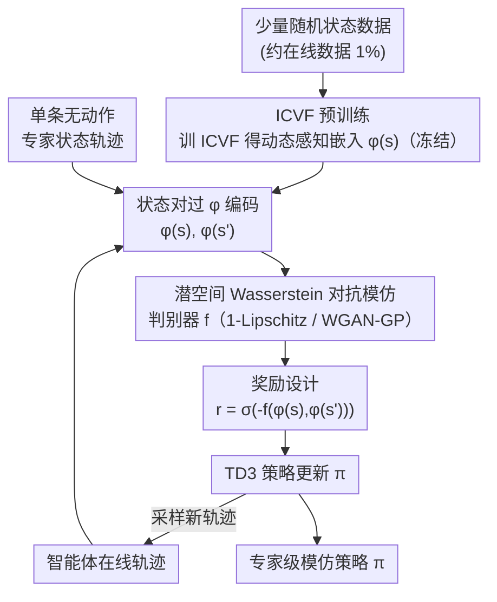

# Latent Wasserstein Adversarial Imitation Learning

**会议**: ICLR 2026  
**arXiv**: [2603.05440](https://arxiv.org/abs/2603.05440)  
**代码**: [GitHub](https://github.com/JackyYang258/LWAIL)  
**领域**: 模仿学习/强化学习  
**关键词**: Wasserstein距离, ICVF, 动态感知嵌入, 状态观测模仿, 少样本

## 一句话总结
提出LWAIL方法，用ICVF从少量随机数据学习动态感知的潜空间表示，将Wasserstein距离的"地面度量"从欧氏距离升级为潜空间距离，仅用单条状态轨迹即可达到专家级模仿性能。

## 研究背景与动机

**领域现状**：模仿学习从专家演示中学习策略。对抗式模仿学习(AIL)通过匹配智能体与专家的状态分布来学习，f-散度和Wasserstein距离是两种主要分布度量。

**现有痛点**：(1) f-散度需要分布支撑集重叠，当使用低质量非专家数据时难以满足；(2) 基于KR对偶的Wasserstein方法虽然更鲁棒，但1-Lipschitz约束隐含假设了欧氏距离作为地面度量——这无法捕捉环境动态。例如，状态B虽然在欧氏空间离专家状态C更近，但如果B无法到达C，它就不如更远的A有价值。

**核心矛盾**：Wasserstein距离需要一个好的地面度量来衡量状态间距离，但欧氏距离忽略了转移动态——距离近的状态可能在环境中完全不可达。

**切入角度**：用ICVF（意图条件值函数）从少量随机状态数据学到动态感知的嵌入空间 $\phi(s)$，在此空间中欧氏距离自然捕捉可达性关系。

**核心 idea**：用ICVF学到的动态感知潜空间替换Wasserstein AIL中的欧氏空间。

## 方法详解

### 整体框架
LWAIL 要解决的是 Wasserstein 对抗模仿学习里"地面度量被锁死成欧氏距离"的问题。整条管线分两阶段：先用极少量（约在线数据 1%）的随机状态转移数据离线训一个 ICVF（意图条件值函数），得到一个动态感知的状态嵌入 $\phi(s)$ 并冻结；再把原本在原始状态空间上做的 Wasserstein 对抗模仿，整体搬到 $\phi$ 空间里做——智能体轨迹与专家轨迹都先过 $\phi$ 编码，判别器 $f$ 在潜空间状态对上做分布匹配，其输出经整形后当作奖励喂给 TD3 优化策略，策略再产出新轨迹回灌这一循环。换句话说，判别器、1-Lipschitz 约束、状态分布匹配都不变，唯一的改动是先把每个状态 $s$ 过一遍 $\phi(\cdot)$，让"两个状态有多远"由可达性而非坐标欧氏距离来定义。

### 关键设计

**1. ICVF 预训练：让欧氏距离重新变得"动态感知"**

KR 对偶下的 Wasserstein 之所以隐含假设欧氏地面度量，是因为 1-Lipschitz 约束是对欧氏距离定义的；而坐标上接近的两个状态在环境里可能根本不可达。LWAIL 的办法是先学一个嵌入 $\phi_\theta(s)$，让"在 $\phi$ 空间里欧氏距离近"等价于"在环境动态里可达性强"。具体用意图条件值函数（ICVF）做分解式建模：

$$V_\theta(s, s_+, z) = \phi_\theta(s)^\top T_\theta(z)\, \psi_\theta(s_+)$$

其中 $\phi_\theta(s)$ 是要拿来当地面度量的状态嵌入，$T_\theta(z)$ 是意图 $z$ 对应的转移矩阵，$\psi_\theta(s_+)$ 编码目标状态，整个 $V$ 用 IQL 这类离线 RL 目标在随机转移数据上训练。这样学出来的 $\phi(s)$ 编码的是状态的可达性结构而非外观坐标。Theorem 3.1 给了这一步的理论支撑：状态对占据概率 $d_{ss}^{\pi_z}(s,s')$ 近似是 $\phi(s)$ 的线性组合，意味着 $\phi$ 空间天然适配后面的 Wasserstein 状态对匹配。

**2. 潜空间 Wasserstein 对抗模仿：约束不变，度量变了**

有了 $\phi$，就把状态对分布匹配从原始空间整体移到潜空间。优化目标仍是 KR 对偶形式的 min-max：

$$\min_\pi \max_{\|f\|_L \leq 1}\ \mathbb{E}_{d_{ss}^\pi}\big[f(\phi(s), \phi(s'))\big] - \mathbb{E}_{d_{ss}^E}\big[f(\phi(s), \phi(s'))\big]$$

智能体的状态对占据 $d_{ss}^\pi$ 要去逼近专家的 $d_{ss}^E$，判别器 $f$ 在 1-Lipschitz 约束下找最大间隔。关键区别在于：$f$ 现在吃的是 $\phi(s),\phi(s')$，所以那条 1-Lipschitz 约束对应的欧氏距离已经是动态感知的——坐标近但不可达的状态不再被误判为"相似"。这也是为什么它能用单条无动作的状态轨迹就把专家模仿到位：匹配的是动态意义上的状态分布，而非表面坐标。

**3. 奖励设计：把判别器输出整形成稳定的 RL 信号**

下游策略用 TD3 优化，需要把判别器 $f$ 的输出转成 per-step 奖励：

$$r(s,s') = \sigma\big(-f(\phi(s), \phi(s'))\big)$$

取负号是因为 $f$ 对专家状态对给高值、对智能体给低值，加负号后智能体被推向专家分布；外面套 sigmoid 把奖励压到 $[0,1]$，避免判别器对抗训练早期输出量级剧烈波动冲垮 TD3 的值估计，从而稳住整个在线模仿过程。

## 实验关键数据

### 主实验
MuJoCo环境，单条状态轨迹（无动作）：

| 环境 | LWAIL | WDAIL | GAIfO | IQlearn | 专家得分 |
|------|-------|-------|-------|---------|---------|
| Hopper | ~专家 | 低 | 中 | 中 | 113.23 |
| HalfCheetah | ~专家 | 低 | 低 | 中 | 88.42 |
| Walker2D | ~专家 | 低 | 中 | 低 | 106.84 |
| Ant | ~专家 | 低 | 低 | 低 | 116.97 |

### 消融实验

| 配置 | 性能 | 说明 |
|------|------|------|
| LWAIL (完整) | 最优 | ICVF嵌入 + Wasserstein |
| 无ICVF (欧氏距离) | 显著下降 | 验证嵌入的重要性 |
| 不同随机数据量 | 1%即够 | 数据效率极高 |

### 关键发现
- ICVF只需1%的在线数据量的随机转移数据就能学到有效嵌入
- t-SNE可视化清晰显示：ICVF嵌入空间中状态按动态关系组织（奖励高的状态聚在一起），而原始空间不具备此性质
- 在Maze2D上，LWAIL甚至超越了用真实稀疏奖励的TD3——因为ICVF提供了更密集的奖励信号

## 亮点与洞察
- **地面度量的重要性**：点出了KR对偶Wasserstein方法中被广泛忽视的问题——1-Lipschitz约束将度量锁定为欧氏距离。这个insight对整个Wasserstein IL社区有价值。
- **随机数据的惊人价值**：仅用随机策略收集的1%状态转移数据，就能学到足够好的动态感知嵌入。这意味着"垃圾数据"在正确利用后也有大价值。
- **理论与实践的优美结合**：Theorem 3.1为 $\phi$ 空间的Wasserstein匹配提供了理论依据。

## 局限与展望
- ICVF的乘法分解结构 $V = \phi^T T \psi$ 是否限制了表达力？
- 仅在连续控制MuJoCo上验证，高维观测（图像）场景未探索
- 单条专家轨迹的实验设置较极端，5-10条轨迹下的表现未报告
- 需要环境交互收集随机数据，纯离线设置下ICVF的效果待验证

## 相关工作与启发
- **vs WDAIL/IQlearn**: 共享KR对偶框架但忽略了地面度量问题，LWAIL用ICVF直接解决
- **vs SMODICE**: 用f-散度需要分布覆盖假设，LWAIL用Wasserstein更鲁棒
- **vs 基于primal Wasserstein的方法**: primal形式避免了度量问题但引入了其他复杂性

## 评分
- 新颖性: ⭐⭐⭐⭐ 动态感知地面度量的思路简洁有洞察力
- 实验充分度: ⭐⭐⭐⭐ 多环境、多baseline、消融充分
- 写作质量: ⭐⭐⭐⭐ 问题动机阐述清晰，理论与实验结合好
- 价值: ⭐⭐⭐⭐ 对Wasserstein IL方法有直接改进价值

<!-- RELATED:START -->

## 相关论文

- [\[ICLR 2026\] On Discovering Algorithms for Adversarial Imitation Learning](on_discovering_algorithms_for_adversarial_imitation_learning.md)
- [\[ICLR 2026\] Model Predictive Adversarial Imitation Learning for Planning from Observation](model_predictive_adversarial_imitation_learning_for_planning_from_observation.md)
- [\[ICLR 2026\] Near-Optimal Second-Order Guarantees for Model-Based Adversarial Imitation Learning](near-optimal_second-order_guarantees_for_model-based_adversarial_imitation_learn.md)
- [\[ICLR 2026\] Minimax Optimal Adversarial Reinforcement Learning](minimax_optimal_adversarial_reinforcement_learning.md)
- [\[ICLR 2026\] Learning to Generate Unit Test via Adversarial Reinforcement Learning](learning_to_generate_unit_test_via_adversarial_reinforcement_learning.md)

<!-- RELATED:END -->
