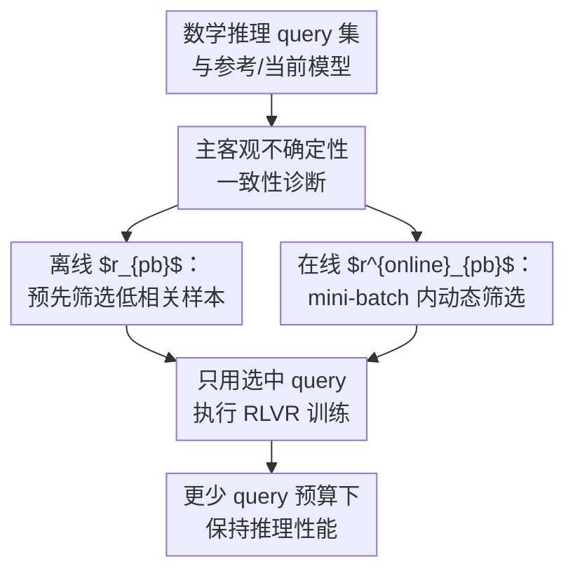

# Learn More with Less: Uncertainty Consistency Guided Query Selection for RLVR

**会议**: ICLR2026  
**OpenReview**: [https://openreview.net/forum?id=OOTokVgBY6](https://openreview.net/forum?id=OOTokVgBY6)  
**代码**: https://github.com/yihao-123/uncertainty-consistency  
**领域**: 强化学习 / RLVR / LLM训练数据选择  
**关键词**: RLVR, 主客观不确定性一致性, 主动学习, 查询选择, 数学推理  

## 一句话总结
这篇论文把主动学习引入 RLVR 数学推理训练，发现“模型觉得难”和“客观答错概率高”必须一致才真正有价值，并用离线 $r_{pb}$ 与在线 $r^{online}_{pb}$ 指标在只用 30% query 的情况下接近甚至超过全量 RLVR 训练效果。

## 研究背景与动机
**领域现状**：LLM 的数学推理能力越来越依赖 RLVR 这类带可验证奖励的强化学习后训练。像 GRPO、RLOO、REINFORCE++、DAPO 这类方法不需要训练额外 reward model，也不需要 critic，而是直接用答案是否正确这样的规则奖励来估计 advantage，再推动策略模型生成更高质量的推理链。

**现有痛点**：RLVR 的成本并不只来自 GPU，还来自 query 预算和答案标注。数学题虽然能用规则检查最终答案，但要构造、筛选和维护大量训练 query 仍然昂贵；更重要的是，训练数据并不是越多越好，糟糕的 query 选择可能造成梯度方差升高、熵过早坍缩、训练不稳定，最后反而限制推理能力提升。

**核心矛盾**：经典主动学习通常相信“模型越不确定的样本越值得标注”，于是会按 perplexity、entropy、margin 或 embedding 覆盖率来选样本。但在 RLVR 里，模型的主观不确定性并不等同于训练价值：有些样本模型生成概率很低却答对了，或模型很自信却答错了，这类主客观信号不一致的样本会带来异常大的 policy gradient，容易把训练推向高方差区域。

**本文目标**：作者想回答一个很具体的问题：在数学推理 RLVR 中，能不能用更少 query 达到全量训练的效果？进一步说，应该选“最难的题”“模型最不确定的题”，还是选那些主观不确定性和客观正确性关系更稳定的题？

**切入角度**：论文先做了一个 warm-up 实验：在 Qwen2.5-0.5B + MATH 上，只用 10% 数据时，PPL、Entropy、K-center、K-means、AskLLM 等经典 AL 方法都没有明显超过 random。这个负结果促使作者转向“主观不确定性是否和客观不确定性一致”这一观察，而不是继续堆更复杂的 AL 打分器。

**核心 idea**：不要单独追逐高不确定样本，而是优先选择“模型低概率时更容易错、模型高概率时更容易对”的一致性样本；离线时用点二列相关系数 $r_{pb}$ 度量这种关系，在线 RLVR 时用 advantage 与当前模型不确定性的组合指标 $r^{online}_{pb}$ 做 mini-batch 内动态选择。

## 方法详解

### 整体框架
这篇论文的整体流程可以看成“先诊断传统主动学习为什么失效，再把诊断转成 RLVR 可用的选样准则”。输入是一组待训练数学 query 和一个参考/当前策略模型；输出不是新的 RL 算法本体，而是在 RLVR 训练前或训练中保留哪些 query 的决策。

离线版本先用参考模型对每个 query 采样多条回答，计算每条回答的主观不确定性和二值奖励，再用 $r_{pb}$ 给 query 排序，取 $r_{pb}$ 最小的一部分做 RL 训练。在线版本不再预先固定子集，而是在每个 mini-batch 里用当前模型生成回答、计算 advantage 与不确定性，按 $r^{online}_{pb}$ 动态保留 top-$p\%$ query，再用常规 RLVR loss 更新策略。

### 关键设计
**1. 主客观不确定性一致性：把“难样本”从单一分数改成关系判断**

经典 AL 的失败点在于它只看模型自己的不确定性，例如某条回答的 perplexity 很高，就认为这个 query 信息量大。但 RLVR 的训练信号来自二值奖励，真正重要的是模型概率和正确性之间的关系：如果模型低概率生成的回答确实更常错、高概率回答确实更常对，那么这个 query 的梯度方向更可解释；反过来，如果模型很不确定却答对，或者很自信却答错，策略梯度会试图大幅提高或压低概率，容易产生离群梯度。

论文把这种关系叫作 uncertainty consistency。直观地说，一致样本不是“最难样本”，而是“模型自己的不确定性和可验证奖励对得上的样本”。这使选样目标从“挑最大 PPL/Entropy”转成“挑主观不确定性 $U$ 与客观奖励 $R$ 之间呈稳定负相关的 query”，也解释了为什么单独按客观难度选 top-hard 样本会失败：如果全是奖励接近 0 的题，RLVR 几乎拿不到有效正向梯度。

**2. 离线 $r_{pb}$：用点二列相关系数量化每个 query 的一致性**

在离线场景中，作者用参考模型 $\pi_{ref}$ 对每个 query $x^{(i)}$ 采样 $K$ 条回答，并为每条回答计算主观不确定性 $U_k^{(i)}$。主文默认用 PPL：

$$
PPL_k^{(i)} = \exp\left(-\frac{1}{|y_k^{(i)}|}\sum_t \log \pi_{ref}(y_{k,t}^{(i)}\mid x^{(i)}, y_{k,<t}^{(i)})\right).
$$

同时，数学题有可验证答案，因此每条回答得到二值奖励 $R\in\{0,1\}$。对同一个 query，作者把正确回答组的平均不确定性记作 $\bar U_1$，错误回答组记作 $\bar U_0$，再用点二列相关系数：

$$
r_{pb}(x^{(i)}) = \frac{\bar U_1 - \bar U_0}{s_K}\sqrt{\frac{K_0K_1}{K^2}}.
$$

如果一个 query 上正确回答通常更低 PPL、错误回答通常更高 PPL，那么 $\bar U_1-\bar U_0$ 会更负，$r_{pb}$ 也更小。离线筛选因此选择 $r_{pb}$ 最小的 top-$p\%$ query，而不是选择 PPL 最大的 query。这个设计的关键是，它把“模型是否知道自己知道/不知道”纳入了训练数据选择。

**3. 在线 $r^{online}_{pb}$：用 advantage 替代难以稳定估计的离线相关性**

离线 $r_{pb}$ 需要每个 query 采样很多次，并且假设参考模型的输出分布能代表后续训练过程。但在线 RLVR 中，策略模型每一步都在变化，mini-batch 内可承受的采样数也有限，直接估计 $r_{pb}$ 既贵又不稳定。为此，作者设计了在线指标：

$$
r^{online}_{pb}(x^{(i)}) = \frac{1}{K}\left(\sum_{A_j>0}\frac{\hat A_j}{U_j^\theta}+\gamma\sum_{A_j<0}\frac{\hat A_j}{U_j^\theta}\right).
$$

这里 $\hat A_j$ 是 GRPO 等 RLVR 算法给第 $j$ 条回答的归一化 advantage，$U_j^\theta$ 是当前模型估计的主观不确定性，$\gamma>0$ 用来平衡正负回答。这个式子很像把 RL 训练信号和模型不确定性直接相乘：正 advantage 的回答如果不确定性低，会得到较大正贡献；负 advantage 的回答如果不确定性结构合理，也会被纳入一致性判断。训练时，每个 mini-batch 先生成回答并计算 $r^{online}_{pb}$，再选择 top-$p\%$ query 更新策略。

论文还证明了两个关键性质。第一，在同一个模型下，$r^{online}_{pb}$ 与离线 $r_{pb}$ 严格负相关，因此最大化在线指标对应选择离线意义上的一致样本。第二，在样本不确定性梯度近似正交、梯度范数有界的条件下，选择最大 $r^{online}_{pb}$ 的样本等价于在一步优化中最大化样本不确定性的下降。这个理论结果把“经验上好用的打分”连接回了 RLVR 的优化过程。

**4. 只选 30% query 的训练接口：不改 RLVR loss，只改每步参与更新的数据**

方法本身并不替换 GRPO、RLOO、DAPO 或 REINFORCE++。RLVR loss 仍然是常规形式：对同一 query 采样多条回答，用规则奖励归一化得到 advantage，再加权 token log-probability。以 GRPO 为例，回答级 advantage 来自 $R(y_k\mid x)$ 在同组回答中的均值和标准差归一化。

这种“只改 query selection、不改优化器主体”的好处是迁移成本低。离线版本可以在训练前生成一个较小训练集；在线版本可以作为 mini-batch 过滤器插入现有 RLVR pipeline。论文主实验统一使用 $p=30$，也就是每次只让 30% query 参与更新，却希望保留与 full-data RLVR 接近的有效梯度，同时减少那些主客观信号不一致、容易带来高方差的样本。

### 一个完整示例
假设某个 mini-batch 里有 4 道数学题，每道题由当前策略采样 8 条回答。第一道题的回答大多低 PPL 时正确、高 PPL 时错误，归一化 advantage 与不确定性方向一致，因此 $r^{online}_{pb}$ 很高；第二道题虽然平均 PPL 更高，但模型低概率生成的几条回答反而是正确答案，高概率回答却错，导致 advantage 和不确定性关系混乱；第三道题几乎全错，客观奖励没有足够区分度；第四道题过于简单，几乎全对，也缺少训练信号。

传统 PPL 策略可能会偏向第二道题，因为它“看起来最不确定”；按客观难度选则可能偏向第三道题，因为它“最难”。本文方法会优先保留第一道题，因为它既有可用的正负反馈，又能让策略更新沿着稳定方向移动：提高本来就较可信的正确推理概率，降低不确定且错误的推理概率。这样一来，少量 query 也能贡献接近全量数据的有效梯度。

### 损失函数 / 训练策略
训练主体沿用 RLVR。论文统一写成：

$$
L_{RLVR}(\theta\mid x^{(i)})=-\frac{1}{K}\sum_{k=1}^{K}\frac{1}{|y_k^{(i)}|}\sum_{t=1}^{|y_k^{(i)}|}\hat A_{k,t}^{(i)}\log \pi_\theta(y_{k,t}^{(i)}\mid x^{(i)}).
$$

数学推理任务的奖励是最终答案是否等于参考答案：正确为 1，错误为 0。实验主要用 GRPO 验证，训练温度为 1.0，最大响应长度 2048，每个 query 在线采样 $K=8$ 条回答，batch size 为 256，总训练步数 50，AdamW 学习率 $1\times10^{-6}$，并加入系数 0.001 的 KL 正则。$\gamma$ 从 $\{0.1,0.5,1.0,1.5,2.0\}$ 中选择，消融显示较小的 $\gamma$，尤其是 0.1，更适合该任务。

## 实验关键数据

### 主实验
论文在 GSM8K 与 MATH 上评估 Qwen2.5-7B、Qwen2.5-3B、Llama-3.1-8B-Instruct，指标是 greedy decoding Pass@1。主实验采样比例固定为 30%，比较 full data、random、经典 AL baselines 与本文一致性选择。

| 模型 | 数据集 | Full | Random Offline | $r_{pb}$ Offline | Random Online | $r^{online}_{pb}$ Online |
|------|--------|------|----------------|------------------|---------------|--------------------------|
| Qwen2.5-7B | GSM8K | 91.5 | 88.6 | 90.1 | 88.1 | 91.7 |
| Qwen2.5-7B | MATH | 73.2 | 70.8 | 72.1 | 68.2 | 72.9 |
| Qwen2.5-3B | GSM8K | 85.2 | 82.4 | 83.6 | 81.2 | 84.9 |
| Qwen2.5-3B | MATH | 63.8 | 62.2 | 63.3 | 58.8 | 64.0 |
| Llama-3.1-8B-Instruct | GSM8K | 90.2 | 87.0 | 88.7 | 88.0 | 89.9 |
| Llama-3.1-8B-Instruct | MATH | 52.0 | 50.9 | 51.5 | 50.6 | 52.5 |

这个表最重要的信号是在线版本：只选 30% query 时，$r^{online}_{pb}$ 在 Qwen2.5-7B/GSM8K、Qwen2.5-3B/MATH、Llama-3.1-8B/MATH 上达到或超过 full-data 结果；在其他设置里也明显优于 random，并且接近 full data。

论文还在 warm-up 中展示经典 AL 的局限：Qwen2.5-0.5B 在 MATH 上用 10% 数据时，Random 为 31.0，PPL 为 30.8，Entropy 为 29.9，K-center 为 31.1，AskLLM 为 30.9，都没有稳定超过随机选择，而 Full 为 33.2。

### 消融实验
| 配置 | 关键指标 | 说明 |
|------|----------|------|
| Bottom 30% $r_{pb}$ | 明显优于 Top 30% $r_{pb}$ | 离线选择一致样本比选择不一致样本更适合 RLVR，不一致样本甚至弱于 random |
| $\gamma=0.1$ | MATH/GSM8K 上效果最好或接近最好 | 在线指标对正负回答权重敏感，较小 $\gamma$ 更稳定 |
| 采样比例 10% | 低于 full，在线 MATH 约降 1.8%、GSM8K 约降 1.5% | 太少 query 会损伤 RL 训练，即使选择准则合理也会缺信号 |
| 采样比例 50% | 接近 full，但提升不明显 | 继续增加样本比例的边际收益下降，30% 是成本与效果较好的折中 |
| Top Hard 30% | Qwen2.5-7B MATH 68.3，低于 $r_{pb}$ 的 72.1 | 只选客观最难样本会造成训练集难度失衡，且正向奖励不足 |

跨 RLVR 算法的结果也支持方法的通用性。Qwen2.5-7B 在 MATH 上，Random/Full/$r^{online}_{pb}$ 对 GRPO 分别为 68.2/73.2/72.9，对 RLOO 为 72.0/74.8/74.3，对 DAPO 为 70.6/73.5/73.2，对 REINFORCE++ 为 71.7/73.9/73.9。GSM8K 上同样能接近 full，说明该方法不是只对 GRPO 的偶然调参。

### 关键发现
- 主观不确定性本身不是可靠选样标准。PPL/Entropy 在 online 场景比 random 略好，但仍不如 $r^{online}_{pb}$，说明 RLVR 需要同时看 reward/advantage 侧的信息。
- 一致样本能降低梯度不稳定性。论文的梯度范数分析显示，不一致样本的 actor gradient 方差显著更高；在 Qwen2.5-7B + GSM8K 上，不一致样本方差为 42.8631，而一致样本为 4.0307。
- 在线动态筛选比离线固定筛选更强。离线 $r_{pb}$ 已经优于 random 和经典 AL，但仍略低于 full；在线 $r^{online}_{pb}$ 能随策略分布变化更新选择，因此更接近实际训练状态。
- 一致性采样还能影响训练动态。作者观察到它能让 response length 更接近 full-data RL，并在早期保持较高 entropy，避免全量训练中过快熵下降带来的探索受限。

## 亮点与洞察
- 这篇论文最有价值的地方是把主动学习在 RLVR 中的失败讲清楚了：不是 AL 没用，而是“只看模型主观不确定性”这个假设在带二值奖励的策略梯度训练中不够。这个诊断比单纯提出一个新打分函数更有启发性。
- $r_{pb}$ 的选择很巧妙，因为它天然处理一个连续变量和一个二值变量之间的关系。数学推理 RLVR 正好有“PPL/Entropy 连续不确定性 + 正误二值奖励”这一结构，所以指标和任务形态匹配。
- 在线 $r^{online}_{pb}$ 的实用性强。它不要求为每个 query 离线采样 64 次，也不需要额外训练 selector，而是复用 RLVR 已经计算的 advantage 和当前模型概率，比较容易插到现有训练系统里。
- 论文提醒我们，数据效率不只是“删掉重复样本”或“选择难题”。对 RL 后训练来说，更重要的是选出能产生稳定、方向明确、不会过度破坏探索的梯度样本。

## 局限与展望
- 实验集中在数学推理数据集 GSM8K、MATH、DAPO-MATH-17K，奖励是相对干净的可验证最终答案。对于代码、工具调用、多轮任务或开放式偏好对齐，reward 更噪、更稀疏，主客观一致性是否仍然这样稳定，需要进一步验证。
- 在线指标依赖当前模型的不确定性估计和 advantage 质量。如果 reward parser 有误、答案格式导致 false negative，或者 advantage 在小 batch 内噪声很大，$r^{online}_{pb}$ 也会被误导。
- 理论证明使用了样本不确定性梯度近似正交、梯度范数有界等假设。论文用小模型实验说明近似正交有经验支持，但这些假设在更大模型、更长推理链、更复杂采样温度下是否仍成立，还需要更多分析。
- 方法主要节省 query 使用比例，但不一定显著减少每步生成开销。在线筛选仍要先对 mini-batch 内 query 采样回答并计算指标，真正的系统加速取决于实现中能否减少反向传播、reward checking 或后续标注成本。
- 后续可以把一致性指标和 curriculum learning 结合：早期偏向稳定一致样本维持探索，中后期逐渐提高难度或引入部分不一致样本，可能比固定 30% 更灵活。

## 相关工作与启发
- **vs 经典主动学习**: PPL、Entropy、Margin、K-center 等方法主要从模型不确定性或表示空间覆盖率出发，适合监督标注预算有限的场景；本文指出 RLVR 的训练价值还取决于二值奖励和策略梯度，因此必须把客观正确性纳入选样标准。
- **vs GRPO/DAPO/RLOO/REINFORCE++**: 这些工作改进的是 RLVR 优化器、advantage 估计或训练稳定技巧；本文不替代它们，而是在数据进入这些算法前做 query 选择，因此可以作为插件式增强。
- **vs entropy/exploration 视角的 RLVR 分析**: 相关工作强调 entropy collapse 或高熵 token 对推理训练的重要性；本文进一步说明，不是所有高不确定样本都值得训练，关键是高低不确定性要和 reward 信号方向一致。
- **对后续研究的启发**: 如果一个任务有可验证 reward，就可以检查模型 confidence 与 reward 的关系，而不是直接堆更多数据。类似思路可能迁移到代码单测、形式化证明、工具调用成功率等可验证任务。

## 评分
- 新颖性: ⭐⭐⭐⭐☆ 从主客观不确定性一致性解释 RLVR 选样，比常规主动学习打分更贴近策略梯度训练。
- 实验充分度: ⭐⭐⭐⭐☆ 覆盖 3 个模型、2 个主数据集、hard dataset 和多种 RLVR 算法，但任务类型仍主要是数学推理。
- 写作质量: ⭐⭐⭐⭐☆ 方法主线清楚，公式和算法流程完整；部分英文表述有小 typo，但不影响理解。
- 价值: ⭐⭐⭐⭐⭐ 30% query 接近 full-data RLVR 的结论很实用，对低成本 LLM reasoning 后训练有直接参考意义。

<!-- RELATED:START -->

## 相关论文

- [\[ICLR 2026\] Sample More to Think Less: Group Filtered Policy Optimization for Concise Reasoning](sample_more_to_think_less_group_filtered_policy_optimization_for_concise_reasoni.md)
- [\[ICLR 2026\] Less is More: Clustered Cross-Covariance Control for Offline RL](less_is_more_clustered_cross-covariance_control_for_offline_rl.md)
- [\[ACL 2026\] LENS: Less Noise, More Voice — Reinforcement Learning for Reasoning via Instruction Purification](../../ACL2026/reinforcement_learning/less_noise_more_voice_reinforcement_learning_for_reasoning_via_instruction_purif.md)
- [\[ICML 2026\] Single-Rollout Hidden-State Dynamics for Training-Free RLVR Data Selection](../../ICML2026/reinforcement_learning/single-rollout_hidden-state_dynamics_for_training-free_rlvr_data_selection.md)
- [\[ICLR 2026\] Beyond Binary Rewards: Training LMs to Reason About Their Uncertainty](beyond_binary_rewards_training_lms_to_reason_about_their_uncertainty.md)

<!-- RELATED:END -->
