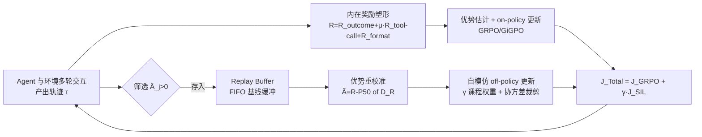

# Learn the Ropes, Then Trust the Wins: Self-imitation with Progressive Exploration for Agentic Reinforcement Learning

**会议**: ICLR 2026  
**OpenReview**: [https://openreview.net/forum?id=Kssko33Ekq](https://openreview.net/forum?id=Kssko33Ekq)  
**代码**: 已开源（Tencent Youtu Lab，含 Data & Checkpoints）  
**领域**: 强化学习 / Agentic RL / LLM 工具调用  
**关键词**: 自模仿学习, 渐进式探索, 内在奖励塑形, 课程调度, 多轮工具调用, 熵控制  

## 一句话总结
SPEAR 用"课程调度的自模仿学习 + 内在奖励塑形"，让 agentic LLM 在训练早期靠工具交互大胆探索、后期靠回放成功经验稳健利用，在不依赖外部专家示范的前提下实现"先学规矩、再信战果"的渐进式探索-利用平衡。

## 研究背景与动机
**领域现状**：RL（尤其 GRPO 系）是当下打磨 LLM 长程、稀疏奖励 agent 任务工具调用能力的主流范式，核心难点是探索-利用权衡。现有工作普遍从**策略熵**视角刺激探索——熵下降意味着过度自信、探索不足，于是用各类熵正则去最大化熵。

**现有痛点**：把熵正则直接搬到 LLM agent 上很脆弱。多轮交互中环境反馈不断引入低概率 token，造成严重的**分布漂移**，机械地最大化熵要么导致 mode collapse（熵塌缩），要么导致持续熵增、训练发散（runaway divergence）。冷启动 SFT 或 RL+SFT 混合方案虽稳，但又把策略框死在 SFT 语料里、丧失了发现新策略的能力。

**核心矛盾**：agent 既要利用预训练知识和过往交互去最大化奖励，又要通过工具集成推理探索新行为；纯熵控制无法在多轮分布漂移下"既不塌缩也不发散"地动态调度何时探索、何时利用。

**本文目标**：回答一个核心问题——能否在**策略自身经验的引导下**平滑调度探索到利用的过渡，而不走向熵塌缩或失控发散两个极端？作者假设：早期应让熵增长以进行广泛的**技能级探索**（快速习得工具调用、试错），训练推进后应让熵收敛、转向**动作级探索**（在熟悉环境后挑更有效的动作、稳定演化路径）。

**核心 idea**：**[渐进式自模仿]** 在 vanilla 自模仿学习（SIL，把高回报经验存进 replay buffer 做 off-policy 更新）基础上，引入**课程调度**把内在奖励塑形与自模仿协同起来——开篇靠频繁工具交互加速探索，收敛时强化对成功战术的利用，从而把策略熵约束在一个随时间演化的"动态可控区间"内。

## 方法详解

### 整体框架
SPEAR（Self-imitation with Progressive Exploration for Agentic Reinforcement learning）是一套即插即用的课程式 RL 配方，叠加在 GRPO/GiGPO/Dr.BoT 等基础算法之上。agent 先与环境交互产出一批轨迹，轨迹经**内在奖励塑形**与优势估计走 on-policy 更新；同时被筛选存入 **replay buffer**，经**自模仿**机制做 off-policy 更新。两条路径协同：自模仿最大化复用过去成功经验、扩大有效探索空间，内在奖励则缓解多轮交互的持续不确定性。三处针对 agent 熵动态的改造——课程化整合技能级/动作级探索、优势重校准应对 off-policy、正则化稳定熵——共同实现"先学规矩、再信战果"。

### 关键设计

**1. 优先级经验回放的自模仿：只复用"赢过基线"的轨迹**。SPEAR 维护一个独立 replay buffer $D=\{(\tau_j, R_j, \hat{A}_j)\}$，只保留正优势的轨迹来鼓励高回报动作。其自模仿目标是 GRPO 目标乘上一个指示函数 $J^{SIL}_{GRPO}(\pi_\theta)=\mathbb{E}\sum_j J^j_{GRPO}\cdot \mathbb{1}(\hat{A}_j>0)$，buffer 中的轨迹不仅来自上一步策略 $\pi_{\theta_{old}}$，也来自更早几步的策略。这相当于给稀疏奖励、长程任务的 agent 准备了一份"通关攻略"：在早期成功率极低（<15%）时，重放成功轨迹能让 agent 快速摸清交互逻辑、积累战术，大幅减少盲目试错。

**2. 优势重校准应对 off-policy 漂移**。buffer 里的轨迹来自旧策略，随着策略持续改进，旧轨迹的观测回报与当前策略越来越脱节。vanilla SIL 用 per-state 经验回报做上包络投影来估计优势，GRPO 则靠组内奖励均值做基线但仍依赖当前策略采样、额外耗算力。SPEAR 改为维护一个 **FIFO 基线缓冲** $D_R=\{\bar{R}_j\}$，用最近 $N_{D_R}$ 条轨迹的**第 50 百分位** $P_{50}(D_R)$ 作为对策略基线的保守而稳健的估计，并仿照 Dr.GRPO 去掉组内标准差项，得到重校准优势 $\tilde{A}^i_t = R_i - P_{50}(D_R)$。这带来三重收益：基线随策略变化而动、过时经验可用 $\hat{A}_j>0$ 且 $\tilde{A}_j>0$ 双条件过滤掉、组归一化的难度偏置被缓解。更新后的 off-policy 目标对 $\hat{A}_j>0\ \&\ \tilde{A}_j>0$ 的轨迹做 PPO 式 clip。

**3. 内在奖励的课程化调制：工具调用奖励是把双刃剑**。作者发现不给工具调用奖励，agent 会因负反馈（缺模块导入、引用未定义变量、缩进错、忘记 print）很快放弃写代码、退化成纯文本推理；但强加工具调用奖励又会刺激交互轮数无限增长，与结果奖励竞争、挤占上下文导致准确率震荡下降。SPEAR 用复合奖励 $R_i = R^i_{outcome} + \mu\cdot R^i_{tool\text{-}call} + R^i_{format}$，并让工具调用权重 $\mu$ **随训练步数衰减**：早期靠它加速掌握工具用法、快速向新任务分布迁移，后期衰减以避免奖励竞争和"刷长交互"的 reward hacking，让 agent 专注于用更聪明的动作提升准确率。

**4. 课程化经验利用与协方差裁剪稳定熵**。在总目标 $J_{Total}(\pi_\theta)=J_{GRPO}(\pi_\theta)+\gamma\cdot\tilde{J}^{SIL}_{GRPO}(\pi_\theta)$ 上，自模仿项用一个 **warm-up 权重 $\gamma$**：早期分布向多样动作迁移比模仿有限解法模式更重要，故先压低 $\gamma$、随后递增，逐步从技能级探索过渡到动作级探索。同时引入**协方差裁剪**，把那些 log 概率与优势增益高度相关的"过度自信 token"剔出优化，避免少数可用成功轨迹被早早过拟合导致熵塌缩、探索收缩。这套"课程调度 + 协方差裁剪"是 SPEAR 相比 vanilla replay 能在 AIME 上稳步增长而非停滞的关键。

此外作者还把 DAPO、Dr.GRPO 等工业界验证过的 RL 技巧打包成强基线 **Dr.BoT**（bag-of-tricks 版 GRPO），以证明 SPEAR 的增益不是相对弱基线刷出来的。

## 实验关键数据

### 主实验表格（ALFWorld & WebShop 成功率，Qwen2.5-1.5B/7B-Instruct）

| 基础算法 | ALFWorld(All) | WebShop(SR) |
|---|---|---|
| GRPO (1.5B) | 72.8 | 56.8 |
| + SPEAR | **88.9 (+16.1%)** | **77.5 (+20.7%)** |
| Dr.BoT(GRPO) | 79.1 | 62.9 |
| + SPEAR | 87.7 (+8.6%) | 76.8 (+13.9%) |
| GiGPO w/o std | 86.1 | 67.4 |
| + SPEAR | 91.2 (+5.1%) | 79.3 (+11.8%) |
| GRPO (7B) | 77.6 | 66.1 |
| + SPEAR | 85.2 (+7.6%) | 84.6 (+18.5%) |

SPEAR 对 GRPO/GiGPO/Dr.BoT 三类基础算法、1.5B/7B 两种规模都稳定增益，WebShop 最高 +20.7%。

### AIME24/25 数学工具集成推理（Qwen2.5-32B / Qwen3-32B + 代码解释器）

| 方法 | 上下文 | AIME24 | AIME25 |
|---|---|---|---|
| Dr.BoT(GRPO) Qwen2.5-32B | 16K | 64.7 | 54.0 |
| + SPEAR | 16K | 66.3 (+1.6%) | **60.1 (+6.1%)** |
| Dr.BoT(GRPO) Qwen2.5-32B | 32K | 67.2 | 55.1 |
| + SPEAR | 32K | 71.0 (+3.8%) | 61.0 (+5.9%) |
| Dr.BoT(GRPO) Qwen3-32B | 32K | 82.5 | 77.3 |
| + SPEAR | 32K | 85.6 (+3.1%) | 80.5 (+3.2%) |

### 消融实验表格（SI=自模仿, IR=内在奖励）

| 配置 | ALFWorld(All) | WebShop(SR) |
|---|---|---|
| GRPO (1.5B) | 72.8 | 56.8 |
| + SI | 77.3 (+4.5%) | 74.2 (+17.4%) |
| + SI + IR (SPEAR) | **88.9 (+16.1%)** | **77.5 (+20.7%)** |
| GRPO (7B) | 77.6 | 66.1 |
| + SI | 90.6 (+13.0%) | 83.4 (+17.3%) |
| + SI + IR (SPEAR) | 85.2 (+7.6%) | 84.6 (+18.5%) |

### 关键发现
- **自模仿单独就很有用**：在早期成功率<15% 时，回放成功轨迹能显著加速收敛、防止小模型机械试错（WebShop 单加 SI 即 +17.4%）。
- **内在奖励是把双刃剑**：AIME 消融中单加 SI 会让 AIME24 略降（-0.9%），因为多工具调用样本被模仿后交互轮数暴涨、训练不稳；必须配合衰减式内在奖励（IR）才能既学会工具又不刷长交互。
- **几乎零额外开销**：增益只带来 10%–25% 的理论复杂度，实际单步运行时间几乎不变，即插即用可扩展。

## 亮点与洞察
- **把熵控制从"机械最大化"换成"经验引导的渐进调度"**：用 agent 自己的成功经验当锚，避免了熵正则在多轮分布漂移下塌缩/发散的两难，思路比直接堆熵 bonus 更契合 LLM agent。
- **"先学规矩、再信战果"的课程隐喻很到位**：早期技能级探索（学会用工具）→ 后期动作级探索（在熟悉环境里挑好动作），$\gamma$ 递增 + $\mu$ 衰减两条课程曲线一升一降，对应得很干净。
- **优势重校准用 P50 百分位 + 去标准差**：以极低成本解决 off-policy 漂移和组归一化难度偏置，工程上很务实。
- **额外贡献 Dr.BoT**：把工业 RL 技巧打包成强基线，证明增益不是相对弱基线的虚高，提升了结论可信度。

## 局限与展望
- 作者自承熵控制仍带**刚性**：依赖基于先验的课程调度和协方差裁剪，这套调度/裁剪设计未必对所有任务最优。
- 协方差裁剪目前基于有界随机采样，未来可改为**依赖 token 概率**的裁剪，作者留作 future work。
- 实验主要在 ALFWorld/WebShop/AIME 三类任务、Qwen 系模型上验证，跨更多模型族和更开放的 agent 环境（如真实 Web、GUI）的泛化性仍待检验。

## 相关工作与启发
- **RL 算法谱系**：PPO→GRPO（去 critic 用组基线）→DAPO（动态采样+clip higher）→Dr.GRPO（去长度/难度偏置），SPEAR 把这些工业技巧融成 Dr.BoT 强基线。
- **自模仿/经验回放**：建立在 SIL（Oh 2018）、SAIL（off-policy 扩展）、SILfD/GSIL 等之上，但指出 vanilla SIL 在 agent RL 上会诱发熵塌缩，故用课程+内在奖励协同来救。
- **探索方法对比**：相比好奇心驱动、count-based、技能发现、熵正则等传统手法，SPEAR 放弃手工启发式，完全依靠 agent 自身经验强化有效模式——对做多轮工具 agent 训练的人是一条值得借鉴的稳态探索路线。

## 评分
- **新颖性**: ⭐⭐⭐⭐ — 把自模仿 + 内在奖励用课程调度协同来管理 agent 策略熵的"渐进探索"视角较新颖，优势重校准（P50 + 去 std）是实用小创新；但单项技术（SIL、内在奖励、课程）都非首创，胜在系统整合。
- **实验充分度**: ⭐⭐⭐⭐ — 覆盖 3 类任务、2 个模型族、1.5B–32B 多规模，叠加 GRPO/GiGPO/Dr.BoT 三基础算法，含 SI/IR 逐项消融与开销分析，较扎实；开放真实环境与更多模型族的验证略缺。
- **写作质量**: ⭐⭐⭐⭐ — 动机递进清晰（熵控制的脆弱性→渐进调度假设），双刃剑发现讲得有画面，公式与图表配合到位。
- **价值**: ⭐⭐⭐⭐ — 即插即用、近零开销、对低成功率任务增益显著，对工业界训练多轮工具 agent 有直接落地价值。

<!-- RELATED:START -->

## 相关论文

- [\[ICLR 2026\] GEM: A Gym for Agentic LLMs](gem_a_gym_for_generalist_llms.md)
- [\[ICLR 2026\] Self-Harmony: Learning to Harmonize Self-Supervision and Self-Play in Test-Time Reinforcement Learning](self-harmony_learning_to_harmonize_self-supervision_and_self-play_in_test-time_r.md)
- [\[ICLR 2026\] One Life to Learn: Inferring Symbolic World Models for Stochastic Environments from Unguided Exploration](one_life_to_learn_inferring_symbolic_world_models_for_stochastic_environments_fr.md)
- [\[ICLR 2026\] TROLL: Trust Regions improve Reinforcement Learning for Large Language Models](troll_trust_regions_improve_reinforcement_learning_for_large_language_models.md)
- [\[ICLR 2026\] Unsupervised Learning of Efficient Exploration: Pre-training Adaptive Policies via Self-Imposed Goals](unsupervised_learning_of_efficient_exploration_pre-training_adaptive_policies_vi.md)

<!-- RELATED:END -->
