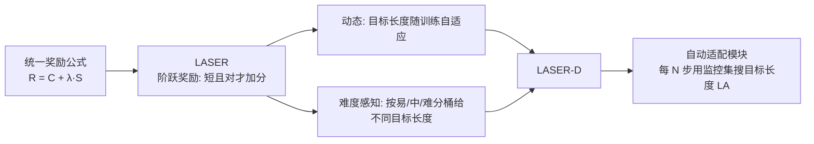

# Learn to Reason Efficiently with Adaptive Length-based Reward Shaping

**会议**: ICLR 2026  
**arXiv**: [2505.15612](https://arxiv.org/abs/2505.15612)  
**代码**: [hkust-nlp/Laser](https://github.com/hkust-nlp/Laser)  
**领域**: 强化学习 / 高效推理 / Large Reasoning Models  
**关键词**: 长度奖励塑形、过度思考、RL、CoT 压缩、难度感知、动态目标长度  

## 一句话总结
本文把各种"压缩长推理链"的 RL 方法统一进一个"长度奖励塑形"框架，并基于该视角提出阶跃式奖励 LASER 及其动态、难度感知版本 LASER-D，在 1.5B–32B 五个推理模型上同时提升准确率与 token 效率（AIME24 上 +5.3 准确率、-64% token）。

## 研究背景与动机
**领域现状**：DeepSeek-R1、Kimi-k1.5 等大推理模型（LRM）靠 RL 学会生成长 CoT 来解决复杂问题，但这些长输出往往充满冗余——对"1+1=?"这种小学题都能输出上千 token 反复"自我反思"，即所谓 over-thinking。近期最有效的压缩手段是 RL：在正确性奖励之外引入长度相关的惩罚/奖励，逼模型短而准。

**现有痛点**：作者把现有 RL 压缩方法分成三类，各有硬伤。**Budget（预算式）**给固定目标长度（如 L1、E1），但人工预算天生次优——对难题太紧、对易题太松；且大上下文窗口下目标分布稀疏，奖励震荡训练不稳。**Adaptive（双模式切换）**让模型自己决定"思不思考"（如 Thinkless、AutoThink），实践中却退化成"易题直接不思考、难题照样啰嗦"的极端模式。**Full（全量压缩）**追求所有难度上都更高效（如 ThinkPrune、Kimi-k1.5），但很难在压缩的同时还涨准确率，不少方法还得靠多阶段 SFT 拼凑。

**核心矛盾**：几乎没有方法能**同时**做到——在硬题（AIME）上砍掉 >50% token、且准确率不降反升、且单阶段训练不需要额外 SFT。最简单的"截断 baseline"（把上下文窗口砍小、超长当错）效率提升明显但对硬题伤害过大（AIME 准确率掉 4–9.7 点），因为它把"长但对"的探索和"错误"一样狠罚。

**本文目标**：沿 full-mode 路线，用简洁、单阶段、原理化的方法同时改善推理效率和准确率。**核心 idea**：① **统一视角**——把截断及各种长度奖励纳入同一公式，看清各方法的本质差异；② **阶跃奖励 LASER**——只奖励"短且对"，不惩罚"长但对"；③ **动态难度感知 LASER-D**——目标长度随训练演化、按题目难度自动分配。

## 方法详解

### 整体框架
论文先用一个统一公式把所有 RL 长度压缩方法表达成"正确性项 + 长度项"的组合，从而暴露各方法在三个设计位（正确性项 C、控制变量 λ、长度奖励 S）上的取舍；在此框架下提出阶跃奖励 LASER，再叠加"动态 + 难度感知"两层升级成 LASER-D。整套训练用 GRPO 在线 RL、单阶段完成、无需额外 SFT。

### 关键设计
**1. 统一长度奖励公式：把所有方法摆到同一张桌子上。** 作者定义塑形后的奖励 $\hat{R}(x,y) = C(y) + \lambda(y)\cdot S(y)$，其中 $C(y)$ 是正确性项、$S(y)$ 是长度奖励、$\lambda(y)$ 是控制长度奖励何时生效的开关。这个公式的威力在于一眼区分各家路数：vanilla 截断是 $C(y)=0$、超长直接给负奖励 $\rho$（与错误同罚）；ThinkPrune 把固定目标长度 $L_T$ 换成可迭代调整的 $L_A$；group-based（Efficient Reasoning、Kimi）用组内相对长度排名给奖励，但易引发"reward hacking"——模型对简单题生成极短答案骗奖励，训练准确率反降；budget-based（L1）用 $-\alpha|L(y)-L_T|$ 惩罚偏离目标，缓解了 hacking 但在大窗口下奖励震荡。看清这些后，改进方向自然浮现。

**2. LASER —— 阶跃奖励，只奖"短且对"不罚"长且对"。** 截断 baseline 最大的问题是把"长但正确的探索"和"错误"一视同仁地狠罚，过度打压有益的长推理。LASER 改成阶跃式：长度奖励 $S(y) = \alpha\cdot \mathbb{I}(L(y)\le L_T)$，且令 $\lambda(y)=\mathbb{I}(R)$——**只有答对时长度奖励才激活**。同时把上下文窗口设得远大于目标长度（如 16384 vs 4096），让真正的截断几乎不发生。直觉上，LASER 与截断几乎一样，唯一区别是：不再砍掉长答案，而是给"不超过目标长度的正确答案"发一笔 bonus。系数取 $\alpha=0.5$ 平衡正确性与长度，且对 $\alpha$ 取值鲁棒。这一改让 LASER 成为首个在硬题 AIME24 上同时显著提升准确率和 token 效率的方法。

**3. LASER-D 的动态化：目标长度随训练自动演化。** LASER 仍是固定目标长度，但模型推理行为在训练中不断变化，最优长度也该随之变。LASER-D 把 $L_T$ 换成动态的 $L_A$，由一个**自动适配模块**驱动：从训练数据抽一个约 500 条的小监控集 $D_M$，每 $N$ 步（如 20）重新搜一遍目标长度。搜法基于一个 **Expected Correct Responses** 指标 $\text{ECR}_d(l) = P_{l,d}\cdot C_d$，其中 $P_{l,d}$ 是长度不超过 $l$ 的 rollout 占比（经验覆盖率），$C_d$ 是该难度判定所需的最少正确 rollout 数。对每个难度从下界 $L_T$ 枚举到窗口上限，**取满足 $\text{ECR}_d\ge 1$ 的最小长度**作为 $L_A$——即"至少能期望出一条完整正确答案"的最短长度：再短会害正确率，再长则冗余。监控只占额外约 3.5% 计算。

**4. LASER-D 的难度感知：易题短、难题长的差异化目标。** 作者主张长度奖励不该一刀切地鼓励所有题变短，而要 difficulty-aware。LASER-D 把每个 query 按 rollout batch 内的正确率分成易/中/难三桶（$k$ 个 rollout 用 $k/3$、$2k/3$ 两个阈值切分），三桶各自维护独立的目标长度 $L_A$。难度评估直接复用训练时的 rollout batch、实时进行，开销可忽略。最终易题被压到很短的目标长度、难题保留较大预算，从而实现"快慢思考"的组合：trivial 题直接给答案，硬题保留充分推理。整个机制全自动、无需任何手工调度。

## 实验关键数据
**设置**：五个 LRM（DeepSeek-R1-Distill-Qwen 1.5B/7B/32B、OpenReasoning-Nemotron-1.5B、DeepSeek-R1-Distill-Llama-8B），DeepScaleR 40K 数学数据，GRPO 在线 RL，$\alpha=0.5$。评测 MATH500 / AIME2024 / AMC2023 / OlympiadBench。

### 主实验表格（1.5B，准确率 % / 平均 token）

| 方法 | AIME 准确率 | AIME token | 四项均值准确率 | 均值 token |
|---|---|---|---|---|
| Original | 28.9 | 15956 | 56.9 | 10177 |
| T8192（截断） | 24.8 | 4465 | 55.3 | 2915 |
| L1-Max-4096 | 20.0 | 1718 | 51.4 | 1245 |
| AutoThink（adaptive） | 34.6 | 9514 | 57.6 | 5581 |
| LAPO（full） | 29.3 | 8318 | 59.1 | 5581 |
| LASER (LT=8192) | 31.5 | 6589 | 60.2 | 4509 |
| **LASER-D (LT=4096)** | **34.2** | 5750 | **60.3** | **3520** |

LASER-D 在 AIME 上 34.2%（比原模型 +5.3）同时 token 减 64%；均值上 60.3% 准确率仅用 3520 token（原 10177）。adaptive 类（AutoThink/Thinkless）虽省 token，但 AIME 上仍耗约 1 万 token，难题压不动。

### 大模型 / 跨家族（7B & 32B）

| 模型/方法 | AIME 准确率 | AIME token | 均值准确率 | 均值 token |
|---|---|---|---|---|
| 7B Original | 53.1 | 13414 | 73.3 | 8213 |
| 7B LASER | 54.4 | 6320 | 73.6 | 4158 |
| **7B LASER-D** | **58.3 (+5.2)** | **5379** | **75.4** | **3315** |
| 32B Original | 71.7 | 10335 | 80.9 | — |

7B 上 LASER-D AIME +5.2 且 token 从 13414 砍到 5379；32B 因训练集已饱和（>76%）准确率持平但 token 大降。

### 消融实验

| 消融项 | 结论 |
|---|---|
| 去掉 difficulty-aware | 各 benchmark 准确率一致下降，证明按难度调目标长度是关键 |
| 系数 $\alpha$ / 分桶阈值 / ECR 阈值 | 全部稳定、性能保持，框架对超参鲁棒 |

### 关键发现
- LASER 是首个在 AIME24 上同时涨准确率、省 token 的方法；LASER-D 进一步刷新 full-mode 前沿。
- RL 压缩产出的是真正"更简洁的推理模式"——冗余的"自我反思"显著减少，而非简单截断。
- 难度感知 + 动态目标长度是同时拿到"硬题大幅压缩 + 准确率提升"的核心。

## 亮点与洞察
- **统一视角的方法论价值**：一个 $\hat{R}=C+\lambda S$ 公式把截断、group-based、budget、LASER 全部装进去，直接暴露各方法"为什么不行"（如截断把长且对当错罚、group 易 hacking），改进点是被框架"推导"出来的而非拍脑袋。
- **阶跃奖励的极简优雅**：从截断到 LASER 的关键改动只有一句话——"别砍长答案，改成给短答案发 bonus，且只在答对时发"，却换来质变。
- **全自动难度自适应**：ECR≥1 的"最短可正确长度"判据物理意义清晰，配合实时 in-batch 难度估计，几乎零额外开销（+3.5%），不需要任何人工调度或多阶段拼接。

## 局限与展望
- 实验集中在数学推理（DeepScaleR），代码、科学、通用推理等域的迁移性未充分验证。
- 32B 上准确率提升受限，作者归因于训练集已接近饱和，需要更难更多样的数据才能体现 LASER-D 的进一步增益。
- 难度分桶用 rollout 正确率近似，对正确率极低/极高的题（信号稀疏）划分可能不稳；三桶粒度是否最优、能否连续化值得探索。
- 监控集大小、搜索间隔 $I$、更新频率 $N$ 等仍是需要设定的工程超参，虽证明鲁棒但非完全无参。

## 相关工作与启发
- **CoT 压缩三流派**：budget（L1、E1、AnytimeReasoner）、adaptive（Thinkless、AutoThink）、full（ThinkPrune、Kimi-k1.5、LAPO）。本文属 full 流派且把三者统一表达。
- **over-thinking 研究**：延续对 LRM 冗余推理的批判（Chen et al. 2025），但给出可训练的奖励侧解法。
- **启发**：把一族经验性方法纳入统一参数化框架，是定位改进点的高效范式；"只在答对时才施加效率压力"这一条件激活思想，可推广到其他多目标 RL 奖励设计（如安全 vs 有用、简洁 vs 完整）。

## 评分
- **新颖性**: ⭐⭐⭐⭐ 统一长度奖励框架 + 阶跃奖励 + 动态难度感知三连，框架视角有方法论贡献，单点创新（阶跃、ECR 判据）扎实但不颠覆。
- **实验充分度**: ⭐⭐⭐⭐ 五模型 1.5B–32B、跨家族、四 benchmark、与三流派代表对比，消融覆盖难度感知与多超参鲁棒性，trade-off 曲线证据充分。
- **写作质量**: ⭐⭐⭐⭐ 从截断 baseline 一步步推到统一框架再到 LASER-D，逻辑链清晰，Table 3 的公式可视化对照很到位。
- **价值**: ⭐⭐⭐⭐ 单阶段、无需 SFT、全自动，开源 Models/Code/Data，对工业界做高效推理模型有直接落地价值。

<!-- RELATED:START -->

## 相关论文

- [\[ICLR 2026\] Learning to Reason Efficiently with Discounted Reinforcement Learning](learning_to_reason_efficiently_with_discounted_reinforcement_learning.md)
- [\[ICLR 2026\] Stop Unnecessary Reflection: Training LRMs for Efficient Reasoning with Adaptive Reflection and Length Coordinated Penalty](stop_unnecessary_reflection_training_lrms_for_efficient_reasoning_with_adaptive_.md)
- [\[ICLR 2026\] Causally Robust Reward Learning from Reason-Augmented Preference Feedback](causally_robust_reward_learning_from_reason-augmented_preference_feedback.md)
- [\[NeurIPS 2025\] Training Language Models to Reason Efficiently](../../NeurIPS2025/reinforcement_learning/training_language_models_to_reason_efficiently.md)
- [\[ICLR 2026\] TIPS: Turn-Level Information-Potential Reward Shaping for Search-Augmented LLMs](tips_turn-level_information-potential_reward_shaping_for_search-augmented_llms.md)

<!-- RELATED:END -->
