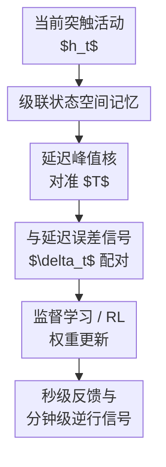

# Learning From the Past with Cascading Eligibility Traces

**会议**: ICLR2026  
**OpenReview**: [https://openreview.net/forum?id=yQ7ssakeKM](https://openreview.net/forum?id=yQ7ssakeKM)  
**代码**: https://github.com/avecplezir/CET  
**领域**: 强化学习 / 生物可解释信用分配  
**关键词**: [资格迹, 延迟信用分配, 强化学习, 生物可解释学习, 状态空间模型]

## 一句话总结
本文把传统指数衰减资格迹推广成由多个状态串联而成的级联资格迹，让突触记忆在指定延迟 $T$ 附近集中达到峰值，从而在秒级行为反馈和分钟级逆行轴突信号两类延迟场景下更准确地把误差信号归因到过去活动。

## 研究背景与动机
**领域现状**：资格迹是强化学习和神经可塑性里处理延迟反馈的经典工具。
在三因子学习规则、reward-modulated Hebbian learning、actor-critic 等框架中，系统通常会把过去的突触活动保存成一个随时间衰减的痕迹，等奖励、误差或调制信号到来时再用这个痕迹更新权重。
这种思路很适合“反馈马上到，或者中间事件很少”的情况，也解释了不少行为时间尺度上的突触可塑性实验。

**现有痛点**：真实生物学习里的延迟并不总是接近零。
运动动作到视觉反馈可能有几十到几百毫秒延迟，奖励可能隔几秒才出现，更极端的是逆行轴突化学信号可能需要几分钟才能从突触传回胞体。
传统资格迹的核是指数衰减，最大权重永远给最近的活动；如果延迟固定为非零值，真正应该被归因的是 $t-T$ 时刻的活动，而指数痕迹会把 $t$ 附近许多无关活动混进来。
当输入变化频繁、任务非 i.i.d. 或网络层数较深时，这种时间混叠会直接把梯度方向拉偏。

**核心矛盾**：延迟信用分配需要两个看似冲突的性质。
一方面，突触需要用局部、在线、低成本的状态保存过去活动，不能简单缓存完整历史；另一方面，学习信号到达时又希望只读取一个很窄的过去时间窗，最好像理想延迟核 $\delta(t-T)$ 一样精确。
指数资格迹满足前者，却不满足后者：它便宜但不够“准时”。

**本文目标**：作者想回答一个具体问题：如果把突触内部的记忆看成一串生化反应级联，而不是单个衰减变量，能否得到一个既局部可实现、又能对准固定延迟的资格迹？
在这个问题下，论文进一步检验三件事：CET 能不能在监督学习中承受秒级延迟；能不能在强化学习中改善 delayed actor update；能不能支撑分钟级、逐层累积的逆行信号假设。

**切入角度**：作者从生物化学级联出发。
许多突触过程本来就不是单个变量在衰减，而是 kinase cascade、磷酸化链条或酶促反应层层传递。
如果一个输入先进入第一个状态，再逐步传到后续状态，那么最后一个状态天然会在一段时间后达到峰值；状态越多，峰越窄，越接近一个延迟记忆。

**核心 idea**：用 $n$ 个串联状态构成的级联资格迹（Cascading Eligibility Trace, CET）替代单指数资格迹，让资格迹核在目标延迟 $T$ 附近峰值最大，从而减少延迟信用分配中的时间混叠。

## 方法详解

### 整体框架
本文的方法可以看成把“突触保存什么历史”这一步重新设计。
对于每个权重，系统不再只维护一个指数衰减变量，而是维护一串局部状态；当前 Hebbian-like 活动先写入第一个状态，再以相同衰减率逐级传递到最后一个状态。
当延迟后的误差信号或 TD 信号到来时，更新不直接乘当前活动，而是乘最后一级 CET 输出，这个输出近似代表 $T$ 秒前的活动。

在监督学习中，论文从普通梯度更新出发。
若神经元活动为 $z_t=f(x_t^\top w)$，损失对权重的负梯度可写成 $-\delta_t f'(x_t^\top w)x_t$。
延迟出现后，时间 $t$ 收到的 $\delta_t$ 实际上应该与 $t-T$ 时刻的输入项配对，而在线系统只能看到当前输入。
CET 的角色就是用一个局部状态变量近似保存 $f'(x_{t-T}^\top w)x_{t-T}$。

在强化学习中，作者把 CET 嵌入 actor-critic。
Critic 仍用标准反向传播更新，Actor 的 policy-gradient 部分则用 ET/CET 近似 $\nabla_\theta \log \pi_\theta(a_t|s_t)$ 的延迟版本，再与 TD error 或 $\lambda$-return 结合。
这样设置把研究重点压到“actor 的信用分配信号延迟后，哪种资格迹更能保留正确更新方向”。

论文还专门构造了两种延迟场景。
第一种是行为时间尺度：每个输入持续约 200ms，延迟从 0.2s 到数十秒不等，误差信号同时广播到各层。
第二种是逆行轴突信号时间尺度：单层传播约 2 分钟，越早的层收到信号越晚，形成逐层堆叠的延迟。
后者是更激进的生物可解释假设，用来检验 CET 是否足以让非常慢的化学信号参与信用分配。

### 关键设计
**1. 级联状态空间资格迹：把“最近活动最大”改成“目标延迟最大”**

传统资格迹可以写成 $h^{ET}_t=\int_0^t e^{-\gamma(t-s)}h_s ds$，也就是用指数核卷积过去活动。
它的优点是局部、在线、便宜；缺点是核在 $s=t$ 处最大，因此延迟信号到来时，最近发生的无关事件反而比真正相关的 $t-T$ 活动权重大。
CET 把这个单状态系统扩展为一串状态：$\dot h^1_t=-\alpha h^1_t+h_t$，$\dot h^k_t=-\alpha h^k_t+h^{k-1}_t$，最后一级 $h^{CET}_t$ 用作资格迹。

这个级联的闭式核为 $h^{CET}_t=\frac{1}{(n-1)!}\int_0^t (t-s)^{n-1}e^{-\alpha(t-s)}h_s ds$。
当设置 $\alpha=(n-1)/T$ 时，核 $g(\tau)\propto \tau^{n-1}e^{-\alpha\tau}$ 的峰值落在 $\tau=T$ 附近。
这正是本文的关键：它没有把历史完整存下来，而是用一个 Gamma-like 延迟核让突触在“该被读取的时刻”最敏感。
$n=1$ 退化为经典 ET；$n$ 增大时，峰更窄，时间分辨率更高。

**2. 用状态数控制时间精度：越复杂的任务越怕时间混叠**

CET 的状态数不是装饰性超参，而是控制核宽度的主要旋钮。
两状态 CET 已经能产生非零延迟峰，但窗口仍然较宽；六状态、十状态会把质量更集中地推向目标延迟。
论文的 Laplace 域分析说明，随着 $n$ 增大，归一化核的 Laplace transform 逐点趋近 $e^{-sT}$，也就是理想延迟算子的形式。
直观地说，CET 不是在“记住所有过去”，而是在用低通、有限状态的方式逼近一个固定延迟。

这解释了实验中一个反复出现的现象：MNIST 这种简单、近似 i.i.d. 的任务对时间混叠比较宽容，经典 ET 在 1-2 秒延迟下仍能工作；CIFAR-10、TinyImageNet 和 MinAtar/SpaceInvaders 更复杂，输入频谱更丰富，错误地混入邻近时刻会更伤梯度方向。
因此，CET 状态数越高，梯度与真实 backprop 梯度的 cosine similarity 越高，测试性能也越稳定。
这个设计的价值不只是提升最终分数，而是给出了“为什么高阶生化级联可能有学习意义”的规范解释。

**3. 两种延迟模型：同时覆盖广播反馈和逐层累积的慢信号**

作者没有只在一个方便的 delayed-feedback benchmark 上测试 CET，而是把延迟拆成两类神经学习里很不同的机制。
行为时间尺度实验假设 $\delta$ 信号可以同时广播到所有层，比如直接反馈对齐、局部三因子规则或神经调制信号都可近似成这种形式。
在这里，每层面对的延迟相同，CET 主要解决的是“信号晚到但不随深度进一步变晚”的问题。

逆行轴突实验则更苛刻。
如果误差信息沿着突触和轴突慢慢向后传，每跨一层都多等一个 $T$，那么最后一层几乎无延迟，倒数第二层延迟 2 分钟，更早层可能延迟 4 分钟、6 分钟。
论文还加入 salience gating：只让 top 1.25% 高损失样本进入 CET，以减少长时间窗口内需要保存的事件数量。
这个设定承认“分钟级延迟 + 密集输入”本身太难，因此用 surprise / prediction error 触发塑性的想法把事件变稀疏。

**4. 用梯度对齐检验机制：不只看分数，也看更新方向是否更像真实梯度**

延迟资格迹的核心承诺是改善信用分配，所以只看准确率或 return 不够。
作者额外计算 ET/CET 产生的权重更新向量与真实 backprop 梯度之间的 cosine similarity，即 $a^\top b/(\|a\|\|b\|)$。
如果 CET 真的减少了时间混叠，那么它不仅应该让任务分数更高，也应该让近似梯度更接近真实梯度。

实验结果基本支持这个链条。
在 CIFAR-10 的 1s、2s、4s 延迟下，高阶 CET 的平均 cosine similarity 高于 ET，且短延迟时差距更清楚。
在逆行信号实验中，越早层因为延迟越长，对齐度会下降；但在同一层内，高阶 CET 通常仍比低阶 CET 更接近真实梯度。
这个诊断很重要，因为它把“CET 有用”从经验分数提升，连接到了信用分配的具体机制。

### 一个完整示例
设想一个在线分类网络每 200ms 接收一张图像，某张图像在时间 $t_0$ 进入网络，但误差信号要到 2s 后才抵达。
这意味着在误差信号到来前，网络已经处理了约 10 个时间步，传统 ET 会给最近几张图像的活动很高权重，而 $t_0$ 的活动已经明显衰减。
如果这 10 个输入标签不同、梯度方向不同，传统 ET 产生的更新就像把多张图的责任揉在一起。

CET(10) 的行为不同。
$t_0$ 的 Hebbian-like 活动先进入第 1 个状态，然后逐步流向第 10 个状态；作者把 $\alpha$ 调到让最后一级在 2s 左右峰值最大。
当 $\delta_{t_0}$ 到达时，最后一级状态恰好主要表示 $t_0$ 附近的活动，而不是刚刚出现的输入。
因此，权重更新更接近“这张图当时导致了这个错误”的理想更新。

在 RL 里可以用类似方式理解。
Actor 在状态 $s_t$ 选择动作 $a_t$，奖励和 TD error 过一段时间才变得可用。
CET 保存的不是完整轨迹，而是每个参数对应的 policy-gradient 因子随时间流过级联后的痕迹；当 TD error 到来时，更新用延迟对齐后的痕迹，而不是当前动作的梯度。
这让 delayed actor update 不至于把后续动作错误地拿来承担过去奖励的责任。

### 损失函数 / 训练策略
监督学习实验使用 cross-entropy loss 和 AdamW。
在视觉任务中，作者把 batch 维度视为时间维度，用矩阵卷积高效计算 CET 输出；行为时间尺度实验 batch size 为 128，逆行时间尺度实验 batch size 为 1280，并只保留 top 1.25% loss 样本作为 salient events。
MNIST 使用三层 MLP，CIFAR-10 使用小型 CNN，TinyImageNet 附录实验使用改造后的 ResNet-20。

强化学习实验使用 actor-critic。
Critic 用标准 $\lambda$-return 更新，Actor 用 RL eligibility traces；对于 ET，衰减因子 $\beta$ 在若干候选值上调参，对于 CET，输出归一化可用 area 或 peak normalization。
CartPole、LunarLander 用状态输入的三层 MLP，MinAtar/SpaceInvaders 用像素输入和 CNN。
论文报告 3 个 seed 的均值，附录给出标准差和主要超参。

逆行轴突实验中的时间假设更特殊。
视觉任务中每个单层逆行传播约 2 分钟，并在层间累积；RL 中为了简化，单步按 300ms 计，第二层延迟 400 frames，第一层延迟 800 frames。
作者还假设激活函数导数在合适延迟下可获得；附录进一步用额外 CET 或复用 CET 近似 ReLU 导数，作为更生物可实现的初步版本。

## 实验关键数据

### 主实验
下面表格摘取了主文中最能说明问题的行为时间尺度结果。
在简单 MNIST 上，ET 到 2s 仍基本能学；在 CIFAR-10 上，同样延迟下高阶 CET 的优势更明显，说明复杂视觉流更依赖精确时间窗口。

| 任务 | 延迟 | ET / CET(1) | CET(2) | CET(6) | CET(10) | Backprop |
|------|------|-------------|--------|--------|---------|----------|
| MNIST test accuracy | 4s | 0.95 | 0.97 | 0.98 | 0.98 | 0.99 |
| MNIST test accuracy | 10s | 0.89 | 0.91 | 0.95 | 0.97 | 0.99 |
| CIFAR-10 test accuracy | 2s | 0.62 | 0.66 | 0.74 | 0.77 | 0.81 |
| CIFAR-10 test accuracy | 10s | 0.47 | 0.53 | 0.57 | 0.60 | 0.81 |

强化学习结果同样呈现“延迟越长、状态数越重要”的趋势。
CartPole 和 LunarLander 比较简单，即使长延迟也可能维持可用表现；SpaceInvaders 是像素、非 i.i.d.、更复杂的序列任务，CET 虽然优于 ET，但离无延迟 backprop 仍有明显差距。

| 环境 | 延迟 | ET / CET(1) | CET(2) | CET(5) | CET(8) | CET(10) | Backprop |
|------|------|-------------|--------|--------|--------|---------|----------|
| CartPole-v1 return | 64s | 120 | 365 | 486 | 490 | 493 | 493 |
| CartPole-v1 return | 128s | 159 | 244 | 406 | 468 | 493 | 493 |
| LunarLander-v2 return | 32s | 107 | 173 | 211 | 236 | 224 | 254 |
| LunarLander-v2 return | 128s | -14 | 148 | 184 | 192 | 192 | 254 |
| SpaceInvaders-v0 return | 8s | 34 | 52 | 66 | 62 | 85 | 298 |

### 消融实验
论文没有采用单一“去掉模块”的消融，而是通过状态数、延迟分布、峰值位置、神经元模型和任务复杂度来拆解机制。
这些分析共同指向同一个结论：CET 的收益来自更合适的时间核，而不是某个训练技巧偶然变好。

| 分析设置 | 关键指标 | 结果与说明 |
|----------|----------|------------|
| TinyImageNet，1s 延迟 | Top-1 / Top-5 | ET 为 0.0973 / 0.2658，CET(10) 为 0.3431 / 0.6136，Backprop 为 0.4060 / 0.6791 |
| CIFAR-10 变量延迟，均值 2s | accuracy | $T_{var}=0$ 时 ET 0.62，CET(10) 0.72；$T_{var}=2.0$ 时 ET 0.64，CET(10) 0.65，分布接近均匀后优势缩小 |
| LunarLander，真实延迟 32s，改变 CET 峰值 $T'$ | return | 峰值在 30-38s 附近通常较好；高阶 CET 对峰值错配更敏感，符合窄核直觉 |
| LIF 神经元 LunarLander | return | 32s 延迟下 ET 为 -136，CET(5) 为 122；64s 下 ET 为 -89，CET(5) 为 64 |
| POMDP LunarLander + reservoir | avg return | 无 recurrent MLP + CET(5) 约 0，reservoir + ET 约 0，reservoir + CET(5) 大于 200 |

### 关键发现
- CET 的最大收益出现在“延迟非零且输入变化快”的条件下；如果任务简单或延迟很短，传统 ET 仍可能够用。
- 状态数越高，核越窄，梯度对齐通常越好，但高阶 CET 也更依赖延迟估计准确；峰值错配时会更快掉性能。
- 逆行轴突信号并非完全不可用于信用分配：CET 加 salience gating 后能在分钟级延迟上学习，但层数一深，累积延迟仍会明显破坏早期层梯度。
- 变量延迟下 CET 仍优于 ET，前提是延迟分布比较单峰；当延迟分布接近均匀，指数核的劣势变小，高阶窄核优势也随之下降。
- 复杂非 i.i.d. 任务是 CET 的压力测试；SpaceInvaders 和 TinyImageNet 结果显示 CET 能显著改善 ET，但仍无法完全替代理想无延迟梯度。

## 亮点与洞察
- 这篇论文最漂亮的地方是把“资格迹形状”讲成了一个可调的状态空间模型，而不是只把 ET 当成固定工具。
  单指数衰减对应 $n=1$，CET 对应 $n>1$，理想延迟对应 $n\to\infty$，这条连续谱让方法、理论和实验很自然地连起来。
- 论文把生物机制和机器学习诊断结合得比较扎实。
  生物侧用 biochemical cascade 和 retrograde axonal signaling 提供动机，机器学习侧用 CIFAR/RL/gradient alignment 检验是否真的改善信用分配。
- salience gating 是一个有启发的折中。
  它承认分钟级延迟下保存所有事件不现实，于是只让高 prediction error 或高 loss 事件进入长时间记忆；这和神经调制、surprise-driven learning、节能塑性都有自然联系。
- CET 可迁移到其他 delayed-feedback 问题。
  例如异步 RL、慢奖励的机器人控制、长 horizon credit assignment、甚至 decoupled forward/backward training，都可以把“选择什么时间核”作为一个可学习组件。
- 梯度对齐分析比单看 return 更有说服力。
  它直接测量 ET/CET 是否把更新方向拉向真实梯度，让读者知道性能提升不是训练噪声或调参偶然。

## 局限与展望
- CET 需要知道或估计目标延迟 $T$。
  论文附录展示了用 weight perturbation 学 $\alpha$ 的初步结果，但这仍是粗粒度方案；真实生物或复杂 RL 环境中的延迟可能多峰、任务相关、随状态变化。
- 高阶 CET 提升时间精度，同时增加每个突触的状态数。
  虽然复杂度只随 $n$ 线性增长，但在大模型或真实神经系统里，长期维护多级状态仍有代谢和存储成本。
- 逆行轴突实验依赖较强假设。
  主实验默认延迟后的激活函数导数可得，并用 salience gating 稀疏化输入；这些假设合理但还不是完整生物实现。
- 实验主要是 feedforward 架构。
  附录有 reservoir、LIF 神经元和 POMDP 初步结果，但还没有系统验证 spiking network、recurrent cortical circuit 或更复杂连续控制任务。
- CET 不能消除深层网络的累积延迟问题。
  分钟级逆行信号跨多层时，早期层梯度对齐仍显著恶化，说明如果大脑真的用类似机制，还需要直接奖励通路、局部误差信号或更强的分层 credit assignment。

## 相关工作与启发
- **vs 传统 Eligibility Traces**: 传统 ET 用指数核保留最近活动，适合近零或不确定短延迟；本文用 Gamma-like 级联核对准固定非零延迟，优势是时间分辨率高，代价是要设定或学习峰值位置。
- **vs LTP/LTD 双痕迹组合**: He et al. 和 Huertas et al. 一类方法通过兴奋/抑制两条痕迹相减产生延迟峰；本文指出这种两状态近似窗口较宽，而更高阶 CET 可以继续收窄时间窗。
- **vs BPTT / e-prop 类在线信用分配**: e-prop 等方法也用 eligibility traces 近似时序梯度，但关注 recurrent network 的在线近似；本文更聚焦固定内部延迟和生物化学级联如何形成时间精准的突触记忆。
- **vs Feedback Alignment / 生物可解释反传**: Feedback alignment 主要处理 weight transport 和误差信号传播路径；CET 处理误差信号到达时的时间对齐，两者可以组合。
- **vs Synthetic Gradients / Decoupled Training**: Synthetic gradients 用预测模块解耦前后向计算；CET 不预测梯度，而是保存过去活动，让迟到的真实或近似误差信号仍能配对到正确时间。
- **启发**: 对 delayed RL 来说，资格迹不一定只能调一个 decay factor；可以把 trace kernel 参数化为状态空间模型，甚至让环境根据 reward-delay distribution 学习合适的核形状。

## 评分
- 新颖性: ⭐⭐⭐⭐⭐ 资格迹本身很经典，但把它推广成可解释的级联状态空间核，并系统连接到逆行轴突延迟，切入点很有辨识度。
- 实验充分度: ⭐⭐⭐⭐ 覆盖监督学习、RL、行为延迟、分钟级延迟、变量延迟和多种附录分析；不足是复杂 RL 与真实生物网络仍偏初步。
- 写作质量: ⭐⭐⭐⭐ 论文主线清晰，公式和图能支撑直觉；部分逆行实验假设需要读附录才能完全理解。
- 价值: ⭐⭐⭐⭐⭐ 对强化学习的 delayed credit assignment 和神经科学里的可塑性建模都有参考价值，尤其适合作为“资格迹核设计”这一方向的起点。

<!-- RELATED:START -->

## 相关论文

- [\[ICML 2026\] The Shape of Reasoning: Topological Analysis of Reasoning Traces in Large Language Models](../../ICML2026/reinforcement_learning/the_shape_of_reasoning_topological_analysis_of_reasoning_traces_in_large_languag.md)
- [\[ICLR 2026\] How to Lose Inherent Counterfactuality in Reinforcement Learning](how_to_lose_inherent_counterfactuality_in_reinforcement_learning.md)
- [\[ICLR 2026\] Boolean Satisfiability via Imitation Learning](boolean_satisfiability_via_imitation_learning.md)
- [\[ICLR 2026\] Efficient Offline Reinforcement Learning via Peer-Influenced Constraint](efficient_offline_reinforcement_learning_via_peer-influenced_constraint.md)
- [\[ICLR 2026\] Adaptive Scaling of Policy Constraints for Offline Reinforcement Learning](adaptive_scaling_of_policy_constraints_for_offline_reinforcement_learning.md)

<!-- RELATED:END -->
