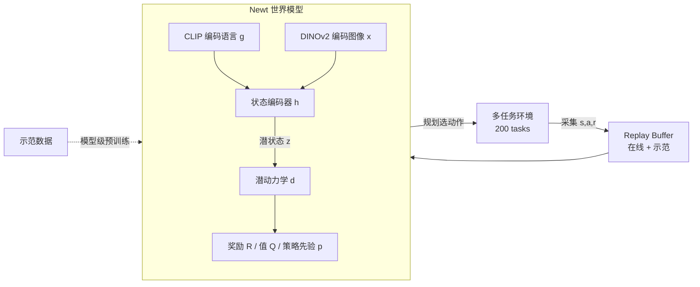

# Learning Massively Multitask World Models for Continuous Control

**会议**: ICLR 2026  
**OpenReview**: [https://openreview.net/forum?id=MPabX9LEds](https://openreview.net/forum?id=MPabX9LEds)  
**代码**: [https://www.nicklashansen.com/NewtWM](https://www.nicklashansen.com/NewtWM)  
**领域**: reinforcement learning  
**关键词**: 多任务强化学习, 世界模型, 在线 RL, TD-MPC2, 连续控制, 语言条件策略  

## 一句话总结
作者提出了首个面向"大规模多任务在线 RL"的基准 MMBench（200 个任务、10 个领域）和一个语言条件世界模型 Newt（基于 TD-MPC2），通过"先用示范预训练、再在所有任务上联合在线交互优化"的范式，证明单个智能体确实能用在线 RL 同时学会数百个连续控制任务。

## 研究背景与动机
**领域现状**：通用控制需要智能体跨任务、跨形态地行动，而当下主流做法是用监督学习在海量近专家轨迹（多由人类遥操作采集）上训一个大策略。视频游戏和推理领域已经验证了"大规模预训练 + 轻量 RL"的基础模型配方，但连续控制社区却长期被单任务或纯离线设定主导。

**现有痛点**：纯模仿学习有两个硬伤——(i) 训练数据量被遥操作采集能力卡死，(ii) 策略性能上限被示范质量封顶。而在线 RL 这条"持续自我提升"的路在连续控制里几乎没人敢碰，社区普遍相信"在线 RL 在这个领域无法 scale"。

**核心矛盾**：要做通用控制就得跨数百个任务在线学习，但大规模在线多任务 RL 同时面临探索困难、观测/动作空间异构、奖励尺度差异巨大、任务难以区分、训练时间不可接受这五重挑战，没有现成算法能全扛下来。

**本文目标**：直接挑战"在线 RL 不 scale"的成见，回答一个问题——**单个策略能否用在线 RL 一次性训好数百个控制任务？**

**核心 idea**：**[基准]** 先造一个 200 任务的 MMBench，每个任务都配语言指令、示范和可选图像观测；**[方法]** 再把单任务模型基 RL 算法 TD-MPC2 扩展成语言条件的多任务世界模型 Newt，用"示范预训练 + 全任务联合在线优化"的基础模型配方把它学出来。

## 方法详解

### 整体框架
Newt 是一个基于 TD-MPC2 的语言条件、可选图像条件的多任务世界模型：它在学到的潜空间里做轨迹优化（规划）来选动作，整个流程分两阶段——先在示范数据上**模型级预训练**获得任务感知的表征与动作先验，再在全部 200 个任务上**联合在线交互**持续优化。智能体不断与多任务环境交互采数据、再在采到的数据上更新世界模型，世界模型吃状态向量、语言指令和可选 RGB 图像，通过规划输出动作。

### 关键设计

**1. 自预测多任务世界模型：把异构任务塞进一个无解码器架构** TD-MPC2 用联合嵌入预测（自预测动力学）、奖励预测和 TD-learning 来训世界模型，而非像生成式世界模型那样解码原始未来观测。这种无解码器设计不仅省掉解码器算力，更关键的是"以控制为中心"——它直接学着在给定动作序列下准确预测回报。Newt 把它扩展成六个组件：语言编码 $g=\text{CLIP}_{\text{text}}(s_{\text{lang}})$、图像编码 $x=\text{DINOv2}(s_{\text{img}})$、状态编码 $z=h(s_{\text{state}},x,g)$、潜动力学 $z'=d(z,a,g)$、奖励 $\hat r=R(z,a,g)$、终值 $\hat q=Q(z,a,g)$ 和策略先验 $\hat a=p(z,g)$，多输入组件统一靠拼接后送进首层 MLP。世界模型按 $L(\theta)=\mathbb{E}_{\tau\sim B}\sum_t \lambda^t(\lVert z'_t-\text{sg}(h(\cdot))\rVert_2^2+\ell_{CE}(\hat r_t,r_t)+\ell_{CE}(\hat q_t,q_t))$ 联合优化，其中 stop-grad 防表征坍缩，$\lambda$ 让时间上更远的样本权重指数衰减。针对多任务下奖励/值分布差异巨大的难题，奖励和值都用**离散回归（交叉熵）**而非 MSE，并在对数变换空间建模，让单个预测头就能覆盖极宽的数值范围；又因各任务回合长度差异大，采用**逐任务折扣因子** $\gamma$。

**2. 把示范榨干：四条路径同时灌入动作先验** 大规模多任务在线 RL 的探索瓶颈极重，作者给每个任务配 10–40 条示范（由单任务 TD-MPC2 采集），并用四种方式把它们用到极致。其一是**模型级预训练**——在线交互前先用示范把式(1)的所有可学组件一起优化 $L(\theta)+L_p(\theta)$，且暂时关掉策略目标里的 Q 值项以充分吃下强动作监督，区别于以往只预训编码器/策略的做法。其二是**约束规划**——预训练切到在线 RL 时值函数还不准、规划反而比直接用预训练策略差，于是初期把规划器偏置向预训练策略、并在前 12% 训练里线性退火到零。其三是**示范过采样**——示范和在线交互各用独立 replay buffer、按 50%:50% 等比例采样，让示范在训练数据里被人为过表示、始终可用。其四是**RL 策略更新里的动作监督**——策略目标 $L_p(\theta)=\mathbb{E}\sum_t\lambda^t(\lVert p(z_t,g)-a_t\rVert_2^2-Q(z_t,p(z_t,g),g)-H(p(\cdot|z_t,g)))$ 里那个模型级 BC 项，在 Q 值估计不准时直接给出动作监督、正则化策略目标，同时把规划选出的动作蒸馏进表达力较弱的策略先验。

**3. 用工程把"在线 RL 不 scale"打回去：异步环境 + 分布式加速** 大规模在线 RL 之所以被认为不可行，很大程度是算力和工程问题。作者把模型更新、环境交互、replay buffer 分布到多进程多 GPU，用 `torch.compile` 编译训练和推理代码，并为 200 个分散在多种机器人模拟器、2D 游戏引擎、模拟器里的环境提供 docker 镜像和环境 wrapper，支持异步步进/渲染、批量帧堆叠与图像编码、缓存语言嵌入、任务完成自动重置。这套加速管线把墙钟时间压到单卡 RTX 3090 约 11.2 天就能在 200 任务上跑完 100M 步，让算力有限的研究者也能复现，本质上是用工程证明"在线 RL 在连续控制里是能 scale 的"。

## 实验关键数据

### 主实验（200 任务 / 100M 环境步 / 状态观测）

| 方法 | 类型 | 相对表现 |
|------|------|----------|
| BC（语言条件多任务） | 模仿 | 弱基线，性能被示范质量封顶 |
| 200× 单任务 BC | 模仿 | 单任务上限参考 |
| PPO（调参+语言条件） | on-policy RL | 明显低于 Newt |
| FastTD3（n-step=8） | off-policy RL | 明显低于 Newt |
| TD-MPC2（多任务在线，匹配参数量） | 模型基 RL | 低于 Newt（无语言/预训练/示范/BC） |
| **Newt（本文）** | 模型基 RL | **数据效率与总分均最高** |

Newt 的优势主要来自 DMControl、DMControl Ext.、ManiSkill、MiniArcade 四个领域；但在 MuJoCo、Box2D、Atari 上所有 RL 方法都偏弱（作者推测是这些领域任务彼此太独特、共享结构少，如 Atari 各游戏除动作空间外几乎无共性）。

### 消融实验（20M 参数 / 200 任务）

| 设计维度 | 关键结论 |
|----------|----------|
| 模型规模（2M→80M） | 多任务下扩大模型有明显收益（单任务里几乎无效），但存在上限 |
| 批大小（128→1024） | 扩大 batch 同样有益，疑似存在"计算最优(模型,batch)规模" |
| 语言条件（None/CLIP/Task ID） | CLIP 把归一化分从 **0.371 → 0.438**，RoboDesk 这类纯观测无法区分任务的领域受益最大；且 CLIP 在训练任务上能匹配 Task ID，还额外支持对未见任务泛化 |
| 示范用法（去 demos/去预训练/去 BC vs 全用） | 预训练、过采样、BC 任一单独用都有帮助，**四者合用**数据效率与渐近性能最佳 |

### 关键发现
- **少样本迁移**：预训练 Newt 在 20 个未见任务/形态上零样本得分 **0.192**（从头训仅 0.013），100k 步微调后达 **0.868**（基线仅 0.480），展现非平凡迁移能力。
- **开环控制**：在 8 个任务上规划至 48 步（训练 horizon 仅 3，长 16×）仍能执行无环境反馈的开环计划，多数任务性能逼近闭环，说明世界模型学到了有意义的环境表征。
- **语言反噬泛化**：未见语言指令有时会抑制零样本泛化——把待操作物体名词换成"cube"（不准但见过）在 6 个 push 任务上零样本成功率 +20.7%，而 pick-and-place 任务趋势相反。
- **视觉 RL**：加 RGB 微调 30M 步后总分 0.442（state 为 0.438），RoboDesk +0.125、Meta-World +0.069，但 DMControl −0.029，视觉增益尚不稳定。

## 亮点与洞察
- **方法论级别的"祛魅"**：本文最大价值不是某个单点 trick，而是系统性地证伪了"在线 RL 在连续控制不 scale"这一社区成见，把基础模型配方（大规模预训练 + 轻量 RL）首次落到了 200 任务的连续控制上。
- **基准 + 方法 + 资源三位一体**：MMBench（220 任务，含 41 个新任务和全新的 MiniArcade）、Newt、以及 200+ checkpoint / 4000+ 示范 / 完整训练评测代码一并开源，对社区是即用型基础设施。
- **示范的四种用法拆得很细**：把"加进 buffer"这件看似简单的事拆成预训练、约束规划、过采样、BC 监督四条互补路径，并通过消融证明合用最优，这种工程化的拆解很有借鉴价值。
- **无解码器世界模型 + 离散回归**是应对多任务奖励/值尺度异构的关键——单预测头用对数空间交叉熵覆盖宽数值范围，避免了 MSE 在跨任务时的尺度灾难。

## 局限与展望
- **领域间收益极不均衡**：MuJoCo、Box2D、Atari 上 Newt 常常只和 BC 基线持平，作者承认"在所有任务上一致提升"仍是开放难题，根因可能是这些领域任务共享结构太少。
- **语言泛化脆弱**：未见指令会显著拖累零样本表现，说明语言条件目前更多是"区分训练任务"而非真正的语义泛化，鲁棒的指令泛化还需工作。
- **视觉增益不稳定**：加 RGB 平均仅 +0.004，部分领域甚至倒退，高分辨率视觉的价值尚未被充分释放。
- **规模仍受限**：消融显示进一步增加任务数需要按比例更大的模型和 batch，当前 20M 参数离"真正的控制基础模型"还有距离，作者也把更大规模 scaling 留作未来方向。

## 相关工作与启发
- **直接根基是 TD-MPC2**（Hansen et al., 2024）——Newt 几乎是它的多任务在线扩展版，理解 TD-MPC2 的自预测潜空间规划是读懂本文的前提。
- **对标的是 GATO / RT-X / π0 这类"监督学习造通用策略"路线**（Reed 2022、Open X-Embodiment 2023、Black 2024），本文走的是互补的"在线 RL 持续提升"路线，二者未来很可能融合。
- **离线到在线 RL** 的诸多技巧（独立 buffer 等比采样、BC 正则）被整合进多任务设定，与 RLPD（Ball et al., 2023）等思路一脉相承。
- **启发**：基础模型配方未必只属于语言和视觉——只要把基准、加速工程、示范利用三件事做扎实，在线 RL 同样能在控制领域"scale 起来"；这对具身智能、机器人通用策略的研究范式有直接借鉴意义。

## 评分
- **新颖性**: ⭐⭐⭐⭐ 首个大规模多任务在线 RL 基准 + 把基础模型配方落到连续控制，方向开创性强；单点算法多为已有技巧的系统整合。
- **实验充分度**: ⭐⭐⭐⭐⭐ 200 任务 10 领域、5 个强基线、全维度消融、迁移/开环/视觉多角度分析，并开源 200+ checkpoint，扎实且可复现。
- **写作质量**: ⭐⭐⭐⭐ 动机清晰、方法分层有条理、坦诚承认局限；附录依赖较重，正文部分细节需翻附录。
- **价值**: ⭐⭐⭐⭐⭐ 基准 + 方法 + 海量资源一并开源，为"控制基础模型"提供了即用型基础设施和有力的可行性证据，社区影响力潜力大。

<!-- RELATED:START -->

## 相关论文

- [\[ICLR 2026\] WIMLE: Uncertainty-Aware World Models with IMLE for Sample-Efficient Continuous Control](wimle_uncertainty-aware_world_models_with_imle_for_sample-efficient_continuous_c.md)
- [\[ICLR 2026\] Mixture-of-World Models: Scaling Multi-Task Reinforcement Learning with Modular Latent Dynamics](mixture-of-world_models_scaling_multi-task_reinforcement_learning_with_modular_l.md)
- [\[ICLR 2026\] Beyond Distributions: Geometric Action Control for Continuous Reinforcement Learning](beyond_distributions_geometric_action_control_for_continuous_reinforcement_learn.md)
- [\[ICLR 2026\] From Observations to Events: Event-Aware World Models for Reinforcement Learning](from_observations_to_events_event-aware_world_models_for_reinforcement_learning.md)
- [\[ICLR 2026\] Learning to Be Uncertain: Pre-training World Models with Horizon-Calibrated Uncertainty](learning_to_be_uncertain_pre-training_world_models_with_horizon-calibrated_uncer.md)

<!-- RELATED:END -->
