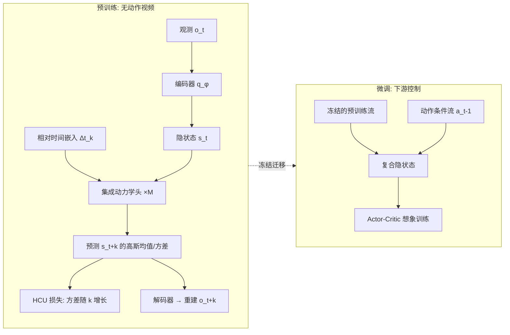

# Learning to Be Uncertain: Pre-training World Models with Horizon-Calibrated Uncertainty

**会议**: ICLR 2026  
**OpenReview**: [https://openreview.net/forum?id=pZuZWRuPyi](https://openreview.net/forum?id=pZuZWRuPyi)  
**代码**: 待确认  
**领域**: reinforcement learning  
**关键词**: 世界模型, 无动作视频预训练, 不确定性校准, 集成模型, 模型基强化学习  

## 一句话总结
针对无动作视频预训练世界模型时"被迫预测单一确定性未来"的痛点，本文提出 HAUWM，用集成动力学头 + 可变时域预测，并通过一个 Horizon-Calibrated Uncertainty (HCU) 损失显式逼迫预测方差随预测时域单调增长，从而学到"对时间有信心衰减意识"的隐空间，下游控制任务上显著超过 SOTA。

## 研究背景与动机
**领域现状**：在大规模、无动作（action-free）的视频数据上预训练世界模型，被视为通往通用智能体的有前景路径——智能体可以从被动观察中习得物理与动力学先验，再在下游控制任务上快速微调（APV、ContextWM、iVideoGPT 等）。这些方法多基于 RSSM / Dreamer 风格的隐动力学模型。

**现有痛点**：主流预训练方法都优化"确定性单步预测准确率"这个单一目标——给定第 $t$ 帧去预测第 $t+1$ 帧的唯一"正确"未来。但无动作视频天生缺少动作标签，同一个过去可以合理地通向多个未来。强行让模型预测一个确定未来，会**惩罚它对环境随机性的任何表征**，于是模型学会的是抑制歧义、制造"虚假确定性"，丧失多样化预测能力。

**核心矛盾**：论文用图 1(b) 量化了这个"不确定性坍缩"——即便给 APV / ContextWM 装上集成头，它们的预测不确定性也是人为压低且几乎随时域不增长的平线；而真实动力学的不确定性应当随预测越远而越大。这种确定性偏置在微调阶段会变成负债：智能体此时要靠动作主动从多个可能未来里"挑一个"，但预训练模型从没被装备过处理这种动作条件化的随机动力学。

**本文目标**：把无动作预训练的目标从"只追预测精度"重构为"学习结构化的时间不确定性表征"，让世界模型显式学到"预测置信度随时域衰减"这一被现有方法主动压制的原则。

**核心idea**：**用集成预测分歧度作为不确定性代理，并用一个随时域线性加权的损失项，强行把"方差随预测时域增长"这条归纳偏置刻进隐空间**，再配合可变时域预测让模型在一次前向里直接跨任意时间间隔预测。

## 方法详解

### 整体框架
HAUWM 是两阶段框架：**预训练**阶段，在无动作视频上训练一个由 $M$ 个独立动力学头组成的集成，每个头在相对时间嵌入 $\Delta t^e_k$ 条件下预测随机采样时域 $k$ 后的隐状态，由 HCU 损失塑造"方差随时域增长"的结构；**微调**阶段，冻结预训练得到的不确定性感知模型，再叠加一个轻量、从零训练的动作条件动力学流，把动作效应注入而不破坏预训练先验，最终用双流复合隐状态驱动 actor-critic 策略在想象轨迹中学习。

### 关键设计

**1. 集成动力学头建模"可能未来的离散分布"：用分歧度量化随机性。** HAUWM 不再用单个确定性转移，而是用 $M$ 个独立的动力学头 $p^{(i)}_\theta$，每个头在当前隐状态 $s_t$ 与时域嵌入 $\Delta t^e_k$ 条件下输出未来隐状态的高斯参数 $p^{(i)}_\theta(s_{t+k}\mid s_t,\Delta t^e_k)=\mathcal{N}(\mu_{\theta_i}, \sigma^2_{\theta_i}I)$。这组预测均值 $\{\mu_{\theta_i}\}$ 天然构成一个"多个可能未来"的离散分布，头与头之间的分歧（disagreement）就成了环境随机性的可计算代理。重建图像时取集成均值 $\bar\mu_{t+k}=\frac1M\sum_i \mu_{\theta_i}$ 解码，既保留多样性又维持预测保真度。

**2. HCU 损失：把"不确定性随时域增长"显式刻进隐空间。** 这是全文核心。预测损失 $\mathcal{L}_{pred}=\beta D_{KL}(q_\phi\|p_\theta)-\ln p_\phi(\hat o_{t+k}\mid s_{t+k})$ 负责表征学习与预测精度，但它本身只逼近确定性。为对抗坍缩，HCU 损失把集成分歧度按时域长度 $k$ 加权：

$$\mathcal{L}_{HCU}=-k\cdot\frac{1}{M-1}\sum_{i=1}^{M}\big(\mu_{\theta_i}(s_t,\Delta t^e_k)-\bar\mu_{t+k}\big)^2$$

由于前面有负号，**最小化 $\mathcal{L}_{HCU}$ 等价于最大化被 $k$ 放大的集成分歧度**——预测越往远处看（$k$ 越大），损失对分歧度的奖励越强，于是方差被迫随时域单调增长。总目标 $\mathcal{L}_{total}=\mathcal{L}_{pred}+\lambda\mathcal{L}_{HCU}$ 中，$\lambda$ 是自调节配重：它维持"保真度（$\mathcal{L}_{pred}$）↔ 不确定性多样性（$\mathcal{L}_{HCU}$）"之间的张力，避免退化到"极端不确定"或"人为确定"两端。

**3. 可变时域预测 + 相对时间嵌入：让结构化不确定性可控涌现。** 训练时为每个样本采样随机时域 $k\sim\mathrm{Uniform}\{1,\dots,K_{max}\}$，构造观测对 $(o_t, o_{t+k})$。时间条件不用绝对位置，而是对整段视频生成正弦位置嵌入 $E\in\mathbb{R}^{T\times d_e}$，再取 $\Delta t^e_k=E[k]$ 作为相对时间嵌入。这编码的是相对比例 $k/T$ 而非绝对步数，从而跨不同长度视频自动归一化时间关系。关键在于：与 Transformer 那种只为"排序"服务的位置编码不同，$\Delta t^e_k$ 直接编码物理时间间隔，**强迫每个动力学头在一次前向里学会 $s_t\to s_{t+k}$ 的跳跃式转移**，而非递归单步 rollout；同时这个嵌入正是 HCU 损失赖以稳定执行"方差随时域单调增长"的条件信号——两者紧耦合，使结构化、时域相关的不确定性能自然且可控地涌现。

**4. 双流微调：冻结不确定性先验 + 注入动作效应。** 微调时冻结视觉编码器与集成动力学头，保留视觉/时间表征。架构跑两条并行隐流：预训练流不改动，只吃 $\Delta t^e_{k=1}$ 时间嵌入并注入 $\sigma=0.01$ 的高斯噪声增强对时间离散化的鲁棒性，输出动作无关的 $\hat s_t$；新的动作条件流 $p_\psi(\tilde s_t\mid s_{t-1},a_{t-1},\hat s_t)$ 从零学习真实动作效应。复合隐状态 $[\hat s_t;\tilde s_t]$ 加奖励预测器 $R_\theta$ 驱动 actor-critic 在校准隐空间内做想象式规划——策略因此能在利用动作知识的同时，对环境随机性有意识。

## 实验关键数据

### 主实验（下游控制，RQ1）
在 DeepMind Control Suite（DMC）、MetaWorld、RoboDesk 三个像素级连续控制基准上，统一用无动作的 Something-Something-v2 视频做预训练（HAUWM 与所有 baseline 同源数据），观测均为 64×64×3。对比 APV、ContextWM、PreLAR、iVideoGPT 四个强 baseline（4 个随机种子，95% 置信区间）。

**结论**：HAUWM 在多数任务上取得 SOTA 的样本效率与最终回报，在动力学复杂的运动控制任务（如 Walker Run、Hopper Hop）优势尤其明显——学得更快、收敛回报更高。例外是 Push Green 被 ContextWM 反超，论文归因于该任务动力学更确定、目标更窄，复杂不确定性建模收益变小。

### 消融实验（RQ2，归一化回报，按 random/expert 归一并跨任务平均）

| 方法 | DMC | MetaWorld | RoboDesk |
|------|-----|-----------|----------|
| $\lambda=10.0$ | 0.67±0.13 | 0.77±0.05 | 0.61±0.09 |
| $\lambda=10^{-1}$ | 0.69±0.06 | 0.80±0.10 | 0.60±0.05 |
| $\lambda=10^{-2}$ | 0.70±0.04 | 0.76±0.07 | 0.65±0.07 |
| w/o HCU | 0.64±0.11 | 0.73±0.14 | 0.55±0.08 |
| **HAUWM ($\lambda=1.0$)** | **0.74±0.03** | **0.85±0.05** | **0.71±0.05** |

### 关键发现
- **HCU 是核心**：去掉 HCU（w/o HCU）三个基准全面退化，DMC 上尤甚（0.74→0.64），证明显式建模结构化时间不确定性对学到鲁棒动力学表征至关重要。
- **$\lambda$ 需适中**：过大（10.0）牺牲预测保真度、过小（$10^{-2}$）训练信号不足，$\lambda=1.0$ 在保真度与不确定性之间取得最佳平衡。
- **$K_{max}$ 消融**（图 4）：更大的最大预测时域允许模型学到更丰富的多尺度时间关系，配合 HCU 才能让不确定性随时域增长这一性质充分体现。
- **不确定性可视化**：图 1(b) 显示 HAUWM 的预测不确定性随预测帧间隔自然增长且校准良好，而 APV/ContextWM 即便加了集成头也呈现人为压低的近平线。

## 亮点与洞察
- **重新定义预训练目标**：把"无动作视频预训练应追求预测精度"这一默认前提，颠覆为"应学习结构化的时间不确定性"，并用图 1(b) 把"不确定性坍缩"这个隐性病灶量化出来，问题定义本身就很有说服力。
- **HCU 损失简洁而切中要害**：用 $-k$ 加权集成分歧度这一行公式，把"方差随时域增长"的物理直觉变成可优化的归纳偏置，且复用了成熟的 model disagreement 框架，落地成本低。
- **可变时域 + 相对时间嵌入的耦合设计**：让模型一次前向跨任意时间间隔预测，既避免递归 rollout 的误差累积，又为 HCU 提供了执行"单调方差增长"所必需的条件信号，两个组件互为支撑而非简单堆叠。
- **双流冻结微调**：在不破坏预训练不确定性先验的前提下注入动作效应，呼应并扩展了 APV 的 stacked 架构，工程上干净。

## 局限与展望
- **集成带来的方差**：基于 $M$ 头集成虽提升平均性能，但在 Dial Turn 等任务上跨种子方差更大，作者自承这是架构的固有权衡。
- **确定性任务收益递减**：在动力学高度确定、目标狭窄的任务（Push Green）上，复杂不确定性建模反被直接学动作-结果映射的方法超过，方法并非普适最优。
- **不确定性形式较简单**：HCU 用各向同性高斯 + 集成分歧度近似随机性，对多峰（multi-modal）未来的刻画仍是粗粒度的，未来可探索更显式的多模态分布建模。
- **预训练数据单一**：仅用 Something-Something-v2 验证，跨更大规模、更异质视频域的扩展性与"不确定性校准是否仍成立"有待进一步检验。

## 相关工作与启发
本文站在 RSSM/Dreamer 系隐动力学模型（PlaNet、Dreamer v1-v3）与无动作视频预训练（APV、ContextWM、iVideoGPT、PreLAR）的交叉点上。它最大的启发在于：**当监督信号天然欠定（无动作 → 多未来）时，与其逼模型给出一个确定答案，不如显式教它"该有多不确定"**——这一思路对一切自监督/无标签序列预测（视频生成、轨迹预测、甚至语言模型对长程不确定性的表达）都有借鉴意义。其"用集成分歧度作随机性代理 + 按时域加权"的做法，也为如何把先验直觉编码进损失函数提供了一个干净范例。

## 评分
- **新颖性**: ⭐⭐⭐⭐ 把"无动作预训练应学结构化不确定性"作为问题重构，并用 HCU 损失 + 可变时域预测落地，问题定义与解法都有原创性，虽然集成分歧度与相对时间嵌入均借用成熟组件。
- **实验充分度**: ⭐⭐⭐⭐ 覆盖 DMC/MetaWorld/RoboDesk 三类基准、四个强 baseline、$\lambda$ 与 $K_{max}$ 消融及不确定性可视化，论证链完整；但仅单一预训练数据源、规模上限有限。
- **写作质量**: ⭐⭐⭐⭐ 动机叙事清晰，图 1(b) 的"不确定性坍缩"可视化极具说服力，方法与公式表述紧凑。
- **价值**: ⭐⭐⭐⭐ 为世界模型预训练提供了一个可迁移的不确定性校准范式，对模型基 RL 与通用智能体的样本效率有实际推动。

<!-- RELATED:START -->

## 相关论文

- [\[ICLR 2026\] From Observations to Events: Event-Aware World Models for Reinforcement Learning](from_observations_to_events_event-aware_world_models_for_reinforcement_learning.md)
- [\[ICLR 2026\] WIMLE: Uncertainty-Aware World Models with IMLE for Sample-Efficient Continuous Control](wimle_uncertainty-aware_world_models_with_imle_for_sample-efficient_continuous_c.md)
- [\[ICLR 2026\] Learning Massively Multitask World Models for Continuous Control](learning_massively_multitask_world_models_for_continuous_control.md)
- [\[ICLR 2026\] Context and Diversity Matter: The Emergence of In-Context Learning in World Models](context_and_diversity_matter_the_emergence_of_in-context_learning_in_world_model.md)
- [\[ICLR 2026\] Unsupervised Learning of Efficient Exploration: Pre-training Adaptive Policies via Self-Imposed Goals](unsupervised_learning_of_efficient_exploration_pre-training_adaptive_policies_vi.md)

<!-- RELATED:END -->
