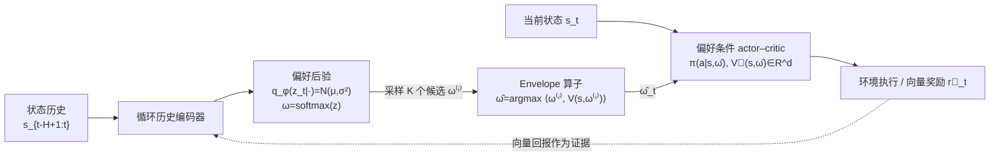

# Learning What Matters Now: Dynamic Preference Inference under Contextual Shifts

**会议**: ICLR 2026  
**OpenReview**: [https://openreview.net/forum?id=qRbCkTk9ZR](https://openreview.net/forum?id=qRbCkTk9ZR)  
**代码**: [https://github.com/XianweiC/DPI](https://github.com/XianweiC/DPI)  
**领域**: 多目标强化学习 / 偏好推断 / 认知启发决策  
**关键词**: 多目标 RL、动态偏好、变分推断、偏好条件策略、非平稳环境、Envelope 算子  

## 一句话总结
把多目标 RL 中常被当作"已知常量"的偏好权重，建模成**会随情境漂移的隐变量**，用变分推断在线维护一个"现在什么最重要"的后验信念，并与偏好条件 actor–critic 联合训练，让智能体在事件驱动的分布漂移后快速重排目标优先级。

## 研究背景与动机
**领域现状**：多目标强化学习（MORL）面对的是向量值奖励（如效率 vs. 安全、能量 vs. 道德）。主流做法分两类：标量化（scalarization）用一个固定偏好向量把向量奖励压成标量；Pareto 类方法（如 Envelope Q-learning、PD-MORL）逼近 Pareto 前沿、事后再挑偏好。这些方法的共同前提是——**偏好向量是外部给定的**。

**现有痛点**：现实里偏好几乎从不被直接观测。人在排队时一开始看重公平、耐心，但随着饥饿加剧、时间耗尽，会逐渐把权重转向"能量/生存"，最终给自己找理由插队。也就是说，目标的相对重要性会随资源、时间、风险等情境因素**动态漂移**，某些目标会变得不可达、暂时无关或异常重要。固定权重的智能体要么追逐不可达目标，要么忽视突然冒头的优先级，在自动驾驶、医疗等安全攸关场景里可能酿成灾难。

**核心矛盾**：认知科学有丰富的"人如何随情境重排偏好"的描述性理论（自我调节、多目标追求、建构式偏好），但它们不是能部署到高维、部分可观测、非平稳控制问题里的算法；而 RL 算法擅长策略优化，却把"什么值得优化"这件事外包给了固定奖励函数。两边缺一座桥。

**本文目标**：只给向量奖励和部分观测、且环境非平稳的条件下，让智能体**在线推断并适配自己当前的目标权衡**，同时做到有效且可解释。

**核心 idea**：**【偏好即隐状态】**把编码多目标相对重要性的偏好向量 $\omega_t$ 当成必须在线推断的隐变量，而非先验固定的输入。智能体维护一个后验 $q_\phi(\omega_t \mid s_{t-H+1:t})$，从中采样以捕获认知不确定性、并在行动前探索几种价值配置；再用一个偏好条件 actor–critic 把策略 condition 在推断出的 $\omega_t$ 上。整套框架被刻意拆成认知科学里的双过程——**价值评估（value appraisal）**负责"现在什么最重要"，**动作选择（action selection）**负责"据此怎么做"。

## 方法详解

### 整体框架
DPI（Dynamic Preference Inference）是一个两模块的认知启发智能体。**价值评估模块**把最近 $H$ 步的状态历史 $s_{t-H+1:t}$（含观测与能量、剩余时间等自身状态）喂给一个循环编码器，输出隐偏好向量在单纯形 $\Delta^{d-1}$ 上的一个分布，采样得到 $\hat\omega_t$。**动作选择模块**是一个同时 condition 在状态与偏好上的 actor–critic，决策时用一个 on-policy 的 envelope 算子在 $K$ 个偏好候选里挑出标量化价值最高的那个。整个流程由变分 ELBO、方向对齐和自一致性三项正则稳定训练。注意：环境真实转移 $p_{env}(s_{t+1}\mid s_t,a_t)$ 与 $\omega_t$ 无关、仍是标准 MDP；偏好的生成式分解只是智能体内部用来推断偏好的感知模型。

### 关键设计

**1. 价值评估 = 对动态偏好做变分推断：让模糊情境自动放大不确定性。** 偏好不被当成固定输入，而是建模为带不确定性的分布式隐状态。具体引入无约束隐向量 $z_t\in\mathbb{R}^d$，后验 $q_\phi(z_t\mid e_t)=\mathcal{N}(\mu_t,\mathrm{diag}(\sigma_t^2))$，再用 $\omega_t=\mathrm{softmax}(z_t)$ 映射到单纯形。这样设计有两个直接好处：情境越模糊后验越宽，显式表达了"我也拿不准现在该看重什么"；并且智能体是从后验里采样 $z_t$ 而非死守单一权衡，相当于在行动前先在偏好空间里做轻度探索。证据如何支持不同偏好配置，靠一个 Boltzmann-理性似然来定义——把某偏好下的标量化回报当成证据的对数似然 $p(e_t\mid z_t)\propto\exp(\beta\,U_t(\omega_t;e_t))$，其中 $U_t(\omega_t;e_t)=\langle\omega_t,\vec{G}_t(e_t)\rangle$，$\vec{G}_t$ 是 actor–critic 从历史估出的向量回报。配上各向同性高斯先验 $p_0(z)=\mathcal{N}(0,I)$，贝叶斯给出目标后验 $p^*(z_t\mid e_t)\propto p_0(z_t)\exp(\beta U_t)$，用 $q_\phi$ 去逼近它、最小化 KL 等价于最大化 ELBO：
$$\mathcal{L}_{\text{ELBO}}=\beta\,\mathbb{E}_{z_t\sim q_\phi}\big[U_t(\omega_t;e_t)\big]-\mathrm{KL}\big(q_\phi(z_t\mid e_t)\,\|\,\mathcal{N}(0,I)\big).$$
前一项让信念贴合当前证据，后一项靠先验把偏好"锚住"——除非最近的回报提供了足够强的证据，否则不轻易改变"什么最重要"。

**2. 动作选择用 on-policy Envelope 算子：在几个候选权衡里现场挑最有希望的那个。** 人很少锁死一种目标权重，而是同时盘算几种合理配置、再按当下最有戏的那个行动。对应地，策略与价值都 condition 在偏好上：$\pi_\theta(a_t\mid s_t,\omega_t)$、$\vec{V}_\theta(s_t,\omega_t)\in\mathbb{R}^d$，标量化价值 $V^{\text{scalar}}(s_t,\omega_t)=\langle\omega_t,\vec{V}_\theta\rangle$。每一步从评估后验采 $K$ 个候选，取标量化价值最高者作为 $\hat\omega_t=\arg\max_i\langle\omega_t^{(i)},\vec{V}_\theta(s_t,\omega_t^{(i)})\rangle$。这正是 Yang 等人的 envelope 算子，但区别在于它被搬到了**决策时在线、单一偏好条件 actor–critic 上 on-policy 执行**，而非离线在 Q 网络上做。后续优化全程复用这个 $\hat\omega_t$：向量奖励逐维算 TD $\delta_t=\vec{r}_t+\gamma\vec{V}_\theta(s_{t+1},\hat\omega_t)-\vec{V}_\theta(s_t,\hat\omega_t)$、按标准 GAE 递推得到向量优势 $\vec{A}_t$，再投影成标量 $A_t=\langle\hat\omega_t,\vec{A}_t\rangle$ 喂给 PPO 的 clipped surrogate，保证动作空间与偏好空间的 on-policy 一致性。critic 用向量级与标量级双重监督 $\mathcal{L}_{\text{critic}}=\xi\|\vec{V}_\theta-\vec{G}\|_2^2+(1-\xi)(V^{\text{scalar}}_\theta-\langle\hat\omega,\vec{G}\rangle)^2$ 稳定学习。

**3. 方向对齐 + 自一致性：防止偏好乱抖和"钻空子"。** 单纯最大化 $U_t=\langle\omega_t,\vec{G}_t\rangle$ 会诱发退化解——偏好剧烈震荡，或投机性地利用奖励的瞬时波动"刷分"。人之所以不会这样，是因为偏好调整平滑且只朝可行的机会方向走。为此 DPI 加两个认知启发正则。方向对齐损失把预测偏好和向量回报的方向拉齐：
$$\mathcal{L}_{\text{dir}}=\mathbb{E}\Big[1-\tfrac{\langle\omega_t^{\text{pred}},\vec{G}_t\rangle}{\|\omega_t^{\text{pred}}\|_2\,\|\vec{G}_t\|_2}\Big],$$
仅在 $\|\vec{G}_t\|>0$ 时生效，作用是劝阻智能体去在意当下根本拿不到的目标。自一致性损失 $\mathcal{L}_{\text{stab}}=\|\omega_t^{\text{pred}}-\hat\omega_t\|_2^2$ 则把编码器预测锚到 envelope 选中的偏好上——如果 envelope 一直挑某个模式，编码器就该直接预测它，减少"策略想做的"和"偏好推断出的"之间的错位。整体目标合成为
$$\mathcal{L}=\mathcal{L}_{\text{PPO}}+\mathcal{L}_{\text{critic}}-\mathcal{L}_{\text{ELBO}}+\lambda\mathcal{L}_{\text{dir}}+\gamma\mathcal{L}_{\text{stab}}.$$

## 实验关键数据

### 主实验表格
在 Queue（排队取食，能量 vs. 道德）与 Maze（像素空间 2D 导航，含到达目标/赶截止/避险/省能多目标，带随机灾害风暴）两个非平稳环境上，对比 6 类基线（MER=平均回合回报，SR=成功率）：

| 方法 | Queue MER | Queue SR(%) | Maze MER | Maze SR(%) |
|------|-----------|-------------|----------|-------------|
| RANDOM | −24.24 | 17.25 | −223.55 | 0.00 |
| FIXED（固定偏好） | −4.19 | 10.05 | 16.15 | 1.12 |
| RS（随机切换） | −4.29 | 11.43 | −23.66 | 0.01 |
| HEURISTIC（规则调度） | −1.60 | 10.05 | −3.65 | 0.00 |
| ENVELOPE（外部给偏好） | −3.54 | 25.10 | 10.36 | 0.01 |
| **DPI (w/ Q-learning)** | 3.74 | 29.09 | 27.35 | 42.94 |
| **DPI (w/ PPO)** | **10.34** | **39.95** | **30.16** | **59.04** |

Queue 上 DPI 比最强基线 ENVELOPE 的 SR 高 14.85 个百分点；Maze 上 MER 比 ENVELOPE 高 **+191.1%**，SR 达 59.0%（FIXED/HEURISTIC/ENVELOPE 均近乎 0% 成功率——即便 FIXED 拿到不错的 MER 也无法可靠完成任务）。

### 消融实验表格
用 Post-Shift Performance（PS@K，事件后前 K 步平均回报）评估短期恢复力，逐组件消融：

| 变体 | 说明 | 效果 |
|------|------|------|
| 完整 DPI | 三正则全开 + PPO | 恢复最快、PS@K 最高 |
| w/o KL | 去掉 ELBO 的 KL 先验项 | 明显下降 |
| w/o dir | 去掉方向对齐 | 明显下降 |
| w/o sta | 去掉自一致性锚定 | 明显下降 |
| w/ Q-learning | 偏好条件 actor–critic 换成纯 Q-learning | 恢复能力显著退化 |

History 窗口 $H$ 的消融：$H=1$ 时性能显著恶化（缺时间上下文无法推断偏好），$H\geq9$ 后趋于平台，最终取 $H=3$ 作为性能与算力的折中。

### 关键发现
- **PS@K 曲线**：HEURISTIC 和 ENVELOPE 事件后持续低迷；FIXED 靠贪心刷标量奖励能拿到中等 PS@K，但 SR 极低，证明没有单一固定偏好能应付所有事件配置；DPI 在每个变点后快速回升并显著领先。
- **偏好—奖励对齐**：用 $\mathrm{Align}(t)=\frac{\langle\hat\omega_t,\vec{r}_t\rangle}{\|\hat\omega_t\|\|\vec{r}_t\|}$ 度量，DPI 始终保持正余弦相似度且在事件触发后陡升，其余基线徘徊在 0 附近或为负——说明只有 DPI 学到了能追踪任务语义的价值表示。
- **可解释的 event→preference→behavior 链**：截止时间骤紧时走捷径、灾害激增时加强规避、能量枯竭时倾向等待与低成本路线，三类事件下偏好与行为都做出情境一致的切换，表明 DPI 是在重估"现在什么最重要"而非回放固定计划。

## 亮点与洞察
- **把"奖励/偏好已知"这个 RL 的隐含假设拆开来打**：DPI 的真正贡献不在某个网络结构，而在重新框定问题——偏好是隐状态，价值评估本身就是一个需要被学习的子问题。这把认知科学里"建构式偏好/自我调节"的描述性理论翻译成了可部署的变分推断算法。
- **Envelope 算子的 on-policy 重用很巧**：原本 envelope 是离线在 Q 网络上算 Pareto 前沿的，这里把它搬到决策时、在同一个偏好条件 actor–critic 上做候选采样选择，再把选中的 $\hat\omega_t$ 一路贯穿 GAE/PPO/critic，保证了动作与偏好两个空间的 on-policy 自洽。
- **两个正则项直击 MORL 的退化模式**：方向对齐压住"在意拿不到的目标"，自一致性压住"策略与推断偏好打架"，二者都是从"人不会乱抖偏好/不会钻瞬时波动空子"的直觉里抽象出来的，且消融证明缺一不可。
- **不确定性建模顺带做了探索**：用高斯后验 + softmax 既表达了偏好的认知不确定性，又天然提供了偏好空间里的探索机制，一举两得。

## 局限与展望
- **环境仍是受控仿真**：Queue/Maze/改造版 MuJoCo 都是封闭、可控的玩具或半玩具环境，离开放世界、真实场景还有距离，作者自己点明这是核心局限。
- **偏好动态相对简单**：当前事件驱动的漂移较为离散、单智能体，未涉及长时程、社会耦合（多智能体相互影响）下的偏好演化。作者展望要扩展到 3D 具身和多智能体设定，并设计更具表达力的推断机制。
- **Boltzmann-理性似然的强假设**：把标量化回报直接当对数似然、且环境转移与偏好独立，这些建模假设在更复杂的部分可观测任务里是否成立有待检验。
- **超参与 $\beta$ 的敏感性**：虽然附录称对主超参鲁棒，但 ELBO 里的温度 $\beta$、正则系数 $\lambda,\gamma$ 在更难任务上的调参代价未充分展示。

## 相关工作与启发
- **MORL 的两条主线**：标量化方法（Vamplew、Roijers、Agarwal）和 Pareto/Envelope 方法（Van Moffaert & Nowé、Yang 的 Envelope Q-learning、Basaklar 的 PD-MORL）都假设偏好外部给定。DPI 的差异点正是把偏好变成在线推断的隐变量，填上"few methods explicitly treat preference weights as latent states"这个空白。
- **认知科学桥接**：bounded rationality（Simon）、Decision Field Theory、Prospect Theory、appraisal theory、dual-process 框架共同支撑了"价值评估 vs. 动作选择"的双过程拆分；Bayesian brain / free-energy（Friston）则为变分后验更新提供了理论依据。这条"认知理论→可部署算法"的转译路径，对想做认知启发决策的研究者有方法论示范意义。
- **与从人类反馈学偏好（RLHF）的区别**：Christiano、Ibarz 等是从外部人类反馈推奖励；DPI 是智能体仅凭向量回报这一内生证据在线推断**自己当前**的权衡，不依赖外部标注，更接近"自主重排优先级"。
- **启发**：把"目标权重随上下文漂移"显式建模的思路，可迁移到 LLM agent 的多目标对齐（如有用性 vs. 安全性的动态平衡）、推荐系统的情境化偏好、以及任何需要在非平稳约束下做权衡的序列决策场景。

## 评分
- **新颖性**: ⭐⭐⭐⭐ — 把偏好从"已知常量"重新框定为"需在线推断的漂移隐状态"，并用变分推断 + on-policy envelope 给出干净的实例化，问题设定本身的转变是真正的亮点；扣分在单个技术组件（ELBO、envelope、PPO）多为已有工具的组合。
- **实验充分度**: ⭐⭐⭐ — 三类环境 + 6 类基线 + 逐组件消融 + 窗口/对齐分析较系统，10 seed×200 episode 统计也规范；但环境偏玩具、缺真实/大规模/多智能体验证，主表里 MuJoCo 结果被压到附录。
- **写作质量**: ⭐⭐⭐⭐ — 认知动机—问题设定—方法—可解释性分析的叙事线清晰，排队插队的贯穿例子直观，公式与符号交代完整。
- **价值**: ⭐⭐⭐⭐ — 为非平稳多目标决策提供了一个可解释、可在线适配的偏好推断范式，对 MORL、认知启发 RL、以及多目标对齐都有借鉴价值，开源代码进一步增强可用性。

<!-- RELATED:START -->

## 相关论文

- [\[ICLR 2026\] What Matters for Batch Online Reinforcement Learning in Robotics?](what_matters_for_batch_online_reinforcement_learning_in_robotics.md)
- [\[ICML 2026\] Safe Reinforcement Learning with Preference-Based Constraint Inference](../../ICML2026/reinforcement_learning/safe_reinforcement_learning_with_preference-based_constraint_inference.md)
- [\[ICLR 2026\] Who Matters Matters: Agent-Specific Conservative Offline MARL](who_matters_matters_agent-specific_conservative_offline_marl.md)
- [\[AAAI 2026\] Where and What Matters: Sensitivity-Aware Task Vectors for Many-Shot Multimodal In-Context Learning](../../AAAI2026/reinforcement_learning/where_and_what_matters_sensitivity-aware_task_vectors_for_many-shot_multimodal_i.md)
- [\[ICLR 2026\] Dual-Robust Cross-Domain Offline Reinforcement Learning Against Dynamics Shifts](dual-robust_cross-domain_offline_reinforcement_learning_against_dynamics_shifts.md)

<!-- RELATED:END -->
