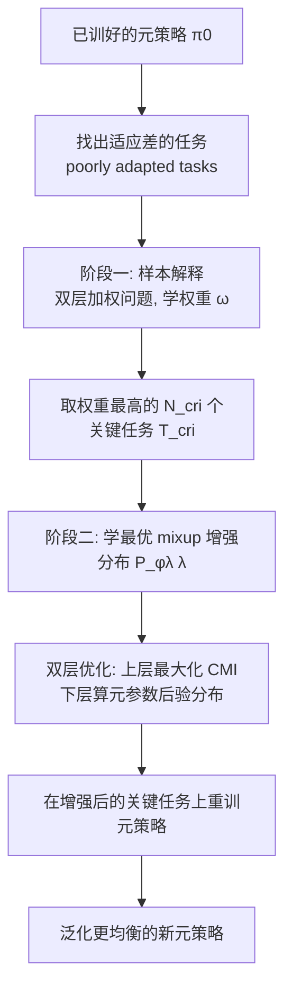

# Leveraging Explanation to Improve Generalization of Meta Reinforcement Learning

**会议**: ICLR 2026  
**OpenReview**: [https://openreview.net/forum?id=Rg8PBd9Ow2](https://openreview.net/forum?id=Rg8PBd9Ow2)  
**代码**: 待确认  
**领域**: reinforcement learning / meta-RL  
**关键词**: 元强化学习, 泛化, 可解释性, 样本解释, 条件互信息, mixup 数据增强, 双层优化  

## 一句话总结
模仿"人犯错后回去复习最相关的旧题"的策略：先用样本解释找出与适应得差的任务最相关的"关键训练任务"，再用条件互信息引导元策略对这些关键任务"多加注意"——通过学一个最优的 mixup 增强分布把更多关键任务信息写进元参数，从而 post-hoc 地修好元强化学习的不均衡泛化。

## 研究背景与动机
- **领域现状**：元强化学习（MRL）从一批训练任务里学一个元先验（通常是元策略 $\pi_0$），希望它能快速适应任务分布里的新任务。MAML 等主流方法都是"上层学元策略、下层做任务特定适应"的双层结构。
- **现有痛点**：学到的元策略 $\pi_0$ 存在**不均衡泛化**——对某些任务适应得很好，对另一些却很差。这一点既有前人工作（Yu et al. 2020）也有本文实验（Appendix M.9）反复证实，但少有方法专门去"补救"那些适应差的任务。
- **核心矛盾**：直接给适应差的任务（poorly adapted tasks）加权或重训，要么需要额外指定一个目标任务集（task weighting 类方法的硬伤），要么只是对整体分布优化、并不真正"盯着"差任务背后该补的训练任务；而预定义规则的数据增强（固定 mixup 分布）虽能增信息，却**不保证最大化**写进元策略的关键任务信息。
- **本文目标**：在 MRL 算法已经产出 $\pi_0$ 之后，以 **post-hoc** 方式提升其泛化，且不损害其他任务的性能。
- **核心 idea**：**两阶段"找题 + 复习"框架**。第一阶段用样本解释（example-based explanation）定位"关键任务"，第二阶段用信息论把"多加注意"形式化为"在元参数里存更多关键任务信息"，并通过**学习最优数据增强**来最大化这个信息增量。

## 方法详解

### 整体框架
方法命名为 **XMRL**（Explainable Meta-RL），分两个互相衔接的阶段：先**解释**（找出对差任务最关键的训练任务），再**增强**（学一个 mixup 分布，让元策略把更多关键任务信息存进参数）。两个阶段各自是一个双层优化问题，第二阶段的最优增强分布通过条件互信息（CMI）的超梯度迭代求解，并配有收敛与泛化的理论保证。

### 关键设计

**1. 样本解释：用双层加权把"哪些训练任务最该复习"显式解出来。** 受 RL 可解释性近期工作启发（把对差表现最关键的状态-动作对/偏好数据当作解释），本文把"解释"迁移到 MRL：学一个重要性向量 $\omega \in \mathbb{R}^{N^{tr}}$，每一维 $\omega_i$ 衡量训练任务 $T_i^{tr}$ 对"在差任务上拿高回报"的贡献。形式上是双层优化 $\max_\omega L(\theta^*(\omega), \{T_i^{poor}\})$，约束 $\theta^*(\omega)=\arg\max_\theta \sum_i \omega_i J_i^{tr}(\pi_i^{tr}(\theta))$——上层调权重让加权元策略在差任务上回报最大，下层算出该权重对应的加权元策略。权重最高的前 $N^{cri}$ 个任务就是**关键任务**。实验里可视化很直观：被找出的关键任务，恰好就是目标点离差任务目标点最近的那些训练任务，符合"找相似旧题"的直觉。

**2. 把"多加注意"翻译成"存更多信息"，用条件互信息度量增量。** 与现有任务加权方法不同，本文不假设有目标任务集，目标也不是泛化到某个特定集合，而是从信息论角度定义注意力：元参数 $\theta$ 里存的关键任务信息越多，就说明元策略越"注意"它们。增强会带来额外信息与数据多样性，于是用**条件互信息**量化增强带来的信息增量：$I(\theta; \{\bar T_i^{cri}(\Lambda_i\sim P(\lambda))\} \mid \{T_i^{cri}\})$，即在已知原始关键任务的前提下，额外知道增强后的关键任务能让 $\theta$ 多获得多少信息。该量 $>0$ 就意味着增强确实把更多关键任务信息写进了元参数。

**3. 用 mixup 增强 + 学最优增强分布，而不是用预定义规则。** 增强方式采用 mixup：给关键任务采两个状态 $s,s'\sim\rho^\pi$，生成 $\bar s=\lambda_i s+(1-\lambda_i)s'$，混合系数 $\lambda_i\sim P(\lambda)$，再在 $\bar s$ 上选动作、与环境交互收集增强元组，从而改变状态-动作分布、引出新的优化目标 $\bar J_i^{cri}$（注意这与"多采点同分布数据"本质不同）。关键在于：**不固定 $P(\lambda)$，而是学它**。把 $\lambda$ 的分布参数化为 $P_{\phi_\lambda}(\lambda)$，目标是优化 $\phi_\lambda$ 去最大化上面的 CMI，从而得到一个**双层优化** $\max_{\phi_\lambda} I(\cdot)$：上层选让增强信息量最大的混合系数分布，下层计算"在增强/原始关键任务下元参数 $\theta$ 的后验分布"（把 $\theta$ 当随机变量、随机性来自训练随机性，用高斯参数化 + 重参数化技巧求解）。原始关键任务的后验则通过对所有可能的 $\{\lambda_i\}$ 做边缘化（采 $N^{\bar\zeta}$ 组系数平均）来估计。

**4. 单循环算法 + 三重理论保证。** 算法 XMRL（Algorithm 1）整体单循环：先生成解释拿到关键任务，再迭代 $K$ 步，每步下层采系数、算后验，上层按 Lemma 1 的超梯度 $\phi_{\lambda,k+1}=\phi_{\lambda,k}+\beta g_{\phi_\lambda,k}$ 更新增强分布。理论上证明了：(i) 算法以 $O(1/\sqrt{K})$ 收敛（Theorem 1）；(ii) 学到的增强确实让关键任务信息增量 $>0$、且不改变非关键任务存的信息（Theorem 2 + Appendix J）；(iii) 在 softmax 策略 + MAML 适应下，增强等价于对元目标加了一个二次正则 $-\theta^\top(\tfrac{1}{N^{cri}}\sum \bar H_i^{cri})\theta$（Lemma 2），收缩解空间，进而把泛化间隙压到 $O(\sqrt{\bar\gamma/N^{tr}}+\sqrt{\log(1/\delta)/N^{tr}})$（Theorem 3），从理论上解释了为何泛化会变好。

## 实验关键数据
用两个真实世界实验（无人机导航、股票交易）、两个 MuJoCo（HalfCheetah、Ant）和一个 Meta-World 实验验证。基准统一以 **MAML** 为底座，对比三种 MRL 改进方法：任务加权 TW、元增强 MA（固定 mixup 分布）、元正则 MR；为公平起见所有方法用相同样本量。

### 主实验表格

| 方法 | Drone（成功率） | Stock Market（累计回报） | HalfCheetah | Ant |
|------|------|------|------|------|
| MAML | 0.87 ± 0.01 | 359.13 ± 18.63 | −68.89 ± 4.36 | 100.64 ± 3.63 |
| **MAML+XMRL（本文）** | **0.97 ± 0.01** | **421.13 ± 12.11** | **−44.67 ± 4.35** | **119.15 ± 4.02** |
| MAML+TW | 0.87 ± 0.02 | 362.07 ± 14.21 | −65.14 ± 4.26 | 99.92 ± 4.56 |
| MAML+MA | 0.91 ± 0.02 | 389.17 ± 12.66 | −63.49 ± 4.07 | 106.44 ± 4.55 |
| MAML+MR | 0.91 ± 0.02 | 362.53 ± 14.27 | −61.15 ± 3.82 | 104.15 ± 4.74 |

XMRL 在四个任务上全面领先。以 HalfCheetah 为例，本文把 MAML 提升约 **35%**，而三个基准的提升都不到 15%。

### 消融实验表格

关键任务数量 $N^{cri}$ 的消融（以"非差任务"的副作用为视角，Table 2 节选）：

| 指标 | MAML | MAML+XMRL |
|------|------|------|
| Drone：差任务性能 | 0.55 | 0.93 |
| Drone：非差任务性能 | 0.95 | 0.98 |
| Drone：退化任务比例 | N/A | 0% |
| Stock：差任务性能 | 71.05 | 381.33 |
| Stock：非差任务性能 | 431.15 | 431.08 |
| Stock：退化任务比例 / 平均跌幅 | N/A | 5% / 3.8% |
| HalfCheetah：差任务性能 | −162.09 | −55.00 |
| HalfCheetah：退化任务比例 | N/A | 2.5% |

### 关键发现
- **关键任务比例存在最优值**：Drone/HalfCheetah/Ant 约 10%、Stock 约 30%；选太多会把"对差任务无帮助"的任务也当成关键任务而拖累泛化，但即便如此仍优于完全不增强的 MAML。
- **几乎不伤其他任务**：被牺牲的非差任务比例 ≤5%，且即使退化，跌幅 <4%；同时差任务性能大幅提升、非差任务平均性能基本不变——印证了"只盯关键任务、整体平均仍升"的设计目标。
- **解释可视化合理**：找出的关键任务恰好是目标点最接近差任务的训练任务，符合"复习相似旧题"的直觉。

## 亮点与洞察
- **把可解释性"用起来"而非只"看一看"**：样本解释不只是事后诊断，而是直接驱动了第二阶段的增强目标，形成"解释 → 干预 → 提升"的闭环，这种用法在 MRL 里少见。
- **"注意力"的信息论定义干净有力**：用条件互信息把模糊的"多关注关键任务"变成可优化、可证明的量，并由此推出"增强 = 二次正则 = 收缩解空间 = 更好泛化"的完整因果链。
- **学增强分布而非固定增强**：相比 MA 的预定义 mixup，最大化 CMI 让增强"按需定制"，实验上明显拉开差距。
- **post-hoc 即插即用**：不重设计 MRL 算法，作为现有元策略的"补丁"，工程上易接。

## 局限与展望
- **依赖能找准"差任务"和"关键任务"**：差任务的定义/挑选（Appendix M.3）和关键任务比例都是敏感超参，选错会拖累效果。
- **增强可行性假设**：mixup 生成的状态 $\bar s$ 被假设始终可行，这在连续控制里成立，但在结构化/离散或物理约束强的环境未必成立。
- **额外交互成本**：增强需要在增强状态上与环境真实交互采样，样本开销不可忽略（论文以"等样本量"对齐基准，但绝对成本仍在）。
- **理论假设较强**：泛化界基于 softmax 参数化 + MAML 适应，迁移到更复杂策略类/适应算法时保证是否保持有待验证。
- **展望**：把"学增强分布"推广到更通用的增强算子、与在线 MRL 结合实时识别差任务，是自然的延伸方向。

## 相关工作与启发
- **元强化学习与不均衡泛化**：延续 MAML/Beck et al. 等双层 MRL 范式，正面回应 Yu et al. (2020) 指出的"部分任务适应差"问题。
- **样本解释（example-based explanation）**：承接 Liu & Zhu (2025)、Liu et al. (2025b) 把"最关键的状态-动作/偏好数据"当解释的思路，迁移到"最关键训练任务"。
- **数据增强与 mixup**：相比 Yao et al. (2021, 元增强)、Wang et al. (2020) 用固定规则增强，本文用 CMI 学最优增强；信息论动机源自 Yin et al. (2019) 的"最大化任务数据与元参数互信息"。
- **启发**：当模型在子群体上表现不均时，"先解释找责任样本、再用信息论目标定向补强"是一条可推广到监督学习、对齐、推荐等场景的通用补救范式。

## 评分
- 新颖性: ⭐⭐⭐⭐ 把样本解释和条件互信息驱动的学增强分布拼成"找题+复习"闭环，视角新颖且动机自洽。
- 实验充分度: ⭐⭐⭐⭐ 覆盖真实/仿真五类环境、对比三种改进基准并配退化率消融，但每类任务规模偏小、缺更大基准对照。
- 写作质量: ⭐⭐⭐⭐ 用人类学习类比贯穿，信息论形式化清晰、理论与直觉衔接好。
- 价值: ⭐⭐⭐⭐ post-hoc 即插即用 + 理论保证，对修复 MRL 不均衡泛化有实用价值。

<!-- RELATED:START -->

## 相关论文

- [\[ICLR 2026\] Erase to Improve: Erasable Reinforcement Learning for Search-Augmented LLMs](erase_to_improve_erasable_reinforcement_learning_for_search-augmented_llms.md)
- [\[ICLR 2026\] TROLL: Trust Regions improve Reinforcement Learning for Large Language Models](troll_trust_regions_improve_reinforcement_learning_for_large_language_models.md)
- [\[ICLR 2026\] On the Generalization of SFT: A Reinforcement Learning Perspective with Reward Rectification](on_the_generalization_of_sft_a_reinforcement_learning_perspective_with_reward_re.md)
- [\[ICLR 2026\] Principled Fast and Meta Knowledge Learners for Continual Reinforcement Learning](principled_fast_and_meta_knowledge_learners_for_continual_reinforcement_learning.md)
- [\[ICLR 2026\] Self-Improving Skill Learning for Robust Skill-based Meta-Reinforcement Learning](self-improving_skill_learning_for_robust_skill-based_meta-reinforcement_learning.md)

<!-- RELATED:END -->
