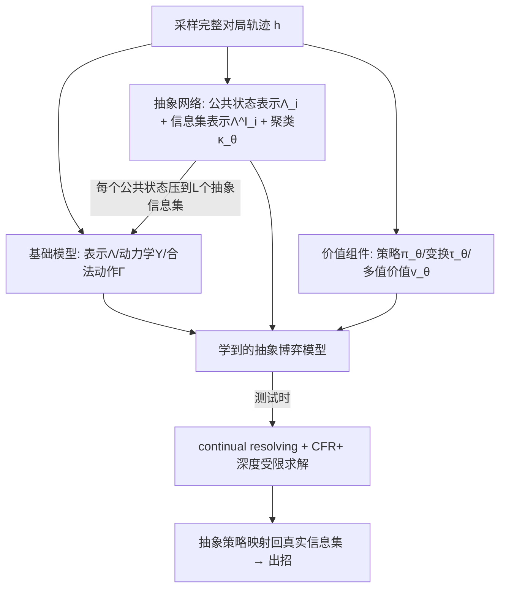

# Look-ahead Reasoning with a Learned Model in Imperfect Information Games

**会议**: ICLR 2026  
**OpenReview**: [https://openreview.net/forum?id=NnBbr4hI8a](https://openreview.net/forum?id=NnBbr4hI8a)  
**代码**: 待确认  
**领域**: reinforcement learning / 博弈论  
**关键词**: 不完美信息博弈, 测试时推理, 学习环境模型, MuZero, 抽象, continual resolving, CFR, Nash 均衡  

## 一句话总结
本文提出 LAMIR，在没有显式游戏规则的前提下，从交互轨迹中学一个**带抽象的不完美信息博弈模型**，让 MuZero 式的"学模型再做前瞻推理"范式首次能在大规模不完美信息博弈中以理论可靠的方式运行。

## 研究背景与动机
- **领域现状**：测试时（test-time）的前瞻搜索能大幅提升预训练智能体的水平。完美信息博弈里，MuZero 证明智能体可以**隐式学一个环境动力学模型**，再用学到的模型跑 MCTS，从而摆脱对显式游戏规则的依赖。
- **现有痛点**：把这套"学模型 + 搜索"的范式迁到不完美信息博弈（IIG，如扑克、Stratego、Dark Chess）极其困难。一方面，IIG 里玩家只能观测到自己的信息集 $s_i$，理论可靠的前瞻推理必须对**所有与公共状态 $s_0$ 一致的隐藏历史**做联合推理（否则等于偷偷把己方手牌泄露给对手），这和 MuZero 用的 MCTS 根本不同；另一方面，单个决策点相关的历史数量可能随博弈长度指数爆炸，大到 $10^{18}$ 量级，搜索完全不可行。
- **核心矛盾**：现有 IIG 推理方法（DeepStack、ReBeL、Student of Games、SePoT 等 continual resolving）要么需要**手写显式规则**来构造博弈树和管理信念状态，要么依赖**领域专家设计的抽象**——这两点都限制了它们在"规则不可得 / 状态空间过大"场景的适用性。
- **本文目标**：在**双人零和、无随机事件**的不完美信息博弈中，仅凭采样到的完整对局轨迹，自动学出一个**足够小的、领域无关的抽象模型**，并用它在测试时做理论可靠的前瞻推理。
- **核心 idea**：**「MuZero 式学模型 + 在线聚类式自动抽象 + 多值状态价值函数 + continual resolving」四件套**——用学到的抽象把每个公共状态里的信息集数量压到常数 $L$，使深度受限的 CFR 推理在原本不可解的博弈里变得 tractable。

## 方法详解

### 整体框架
LAMIR（Learned Abstract Model for Imperfect-information Reasoning）训练阶段假设能访问一个模拟器生成完整轨迹，但测试阶段只拿得到自己的信息集 $s_i$，完全靠学到的模型规划。它在 MuZero 三件套（表示 / 动力学 / 合法动作）基础上，额外加了**抽象网络**（把指数级信息集聚成 $L$ 个代表）和**价值函数组件**（支持深度受限推理），最后在测试时用 continual resolving + CFR+ 在抽象博弈里求策略。

### 关键设计

**1. IIG 版 MuZero 模型：把"联合演化"显式建出来。** 完美信息里搜索从单个已知状态出发，IIG 里一个信息集对应多个可能世界状态，因此模型必须同时建模双方。LAMIR 学三个函数：表示函数 $\Lambda^I_\theta: S_i \to \bar S_i$ 把高维信息集映成定长隐表示；动力学函数 $\Upsilon_\theta:(\bar s_1, \bar s_2, a_1, a_2) \to (\bar s_1', \bar s_2', r, l)$ 给定双方隐状态和联合动作，预测**双方**的下一隐状态、即时奖励和终止标志——这一步把"博弈在所有隐藏状态上的联合演化"显式建出来，是区别于 MuZero 单边 MCTS 的关键；合法动作函数 $\Gamma_\theta$ 预测动作掩码，把搜索约束在可行分支上。模型沿真实轨迹递归展开 $k$ 步训练，损失为合法动作 / 终止 / 奖励 / 隐状态四项之和（前两者 BCE、后两者 MSE），隐状态的目标是真实后继信息集的表示，使 $\Upsilon_\theta$ 学成一个可用于前瞻的"学到的模拟器"。

**2. 在线聚类式的领域无关抽象：把指数级信息集压到 $L$ 个。** 公共状态里信息集数量随历史长度指数增长（德州扑克一个玩家就有 1326 种手牌），这是 sound 前瞻推理不可解的根源。LAMIR 不靠专家规则，而是边训练边学抽象：把表示函数拆成两段——公共状态表示 $\Lambda_{i,\theta}: S_0 \to \bar S_i^L$ 为每个公共状态产出 $L$ 个抽象信息集；信息集表示 $\Lambda^I_{i,\theta}: S_i \to \Delta \bar S_i$ 把真实信息集映成这 $L$ 个抽象上的概率分布，并**强制取 argmax 做多对一的硬映射**（这样动力学构造出的搜索树才和 CFR 这类算法兼容）。聚类在一个 $K$ 维空间里做：用户/环境提供的属性函数 $\kappa$（可直接取当前 RNaD 策略，或合法动作 + 策略 + 动作历史）刻画"行为相似"的信息集应归为一类。两个新损失协同训练：$L^A_\theta$ 用类似 fuzzy c-means 的软聚类目标对齐真实与抽象属性、更新 $\Lambda_{i,\theta}$ 和 $\kappa_\theta$；$L^S_\theta$ 用交叉熵把 $\Lambda^I_{i,\theta}$ 推向最近邻抽象（带 stop-gradient）：
$$L^A_\theta = \sum_t \sum_i \sum_{\bar s_i \in \Lambda_{i,\theta}(s^t_0)} \|\kappa_\theta(\bar s_i) - \kappa(s^t_i)\|^2 \cdot \frac{e^{-\gamma\|\kappa_\theta(\bar s_i)-\kappa(s^t_i)\|^2}}{\sum_{\bar s_i'} e^{-\gamma\|\kappa_\theta(\bar s_i')-\kappa(s^t_i)\|^2}}$$
关键的解耦设计是：$L^M_\theta$ 基于选中的抽象信息集计算，但其梯度**不回传**到 $\Lambda_{i,\theta}, \Lambda^I_{i,\theta}, \kappa_\theta$，从而把"学抽象结构"和"学模型动力学"分开，避免两者互相干扰。

**3. 多值状态价值函数 + 变换：让深度受限推理可学。** 大博弈里不可能搜到底，必须配一个价值函数估计推理视界外的收益，而 IIG 的最优价值理论上依赖信念状态、难以直接训练。LAMIR 沿用 multi-valued states 思路，额外学三个组件：策略函数 $\pi_\theta$（由 RNaD 这类 policy-gradient 算法训练）、变换函数 $\tau_\theta$（表示策略空间里 $T$ 个特征方向，单个变换 $\chi$ 把策略局部改成 $\pi^\chi_i(s_i,a_i)=\pi_i(s_i,a_i)+\chi(s_i,a_i)$ 再裁剪归一化）、以及价值函数 $v_\theta$（估计双方各种变换策略组合的期望值，用 V-trace 算 off-policy 目标）。变换由训练中策略变化向量 $\delta^t_i = \pi^{t,\text{NEW}}_i - \pi^{t,\text{OLD}}_i$ 经同款软聚类得到。注意 RNaD 自带的价值函数**不能**直接当前瞻推理的价值函数，因为它只对特定信念有效，而前瞻推理需要对任意信念都成立的值。整个训练是**两步更新**：第一步用 policy-gradient 损失 $L^{PG}_\theta$（RNaD 下即 NeuRD）训 $\pi_\theta$，第二步算 $L^{MA}_\theta + L^V_\theta + L^T_\theta$（含所有抽象相关损失）——之所以分两步，是因为变换损失 $L^T_\theta$ 依赖 policy-gradient 那一步引起的策略变化。

**4. 测试时 continual resolving：在 $L^2$ 规模的 gadget game 上反复求解。** 测试时从初始历史出发，用 $\Lambda_{i,\theta}, \Lambda^I_{i,\theta}$ 生成根公共状态的抽象子博弈，再用学到的 $\Upsilon_\theta, \Gamma_\theta$ 构造深度受限博弈树；在深度极限处加一层"决策层"——双方各从 $T$ 个人工动作（对应剩余博弈的策略选择）里挑，每种组合的收益由 $v_\theta$ 给出。然后在这个抽象博弈上跑 CFR+ 得到各决策点策略，把当前真实信息集经 $\Lambda^I_{i,\theta}$ 映到抽象信息集、采样动作推进真实对局。关键的可扩展性来源是：上一轮博弈树中所有与 $s_0$ 一致的历史被收集成新 gadget game，由于每个历史关联一个联合抽象信息集，最多只有 $L^2$ 种组合，**共享同一联合抽象的历史被合并**，于是新子博弈根节点最多 $L^2$ 个节点，反事实值和到达概率从上一子树复用——这把原本指数级的公共状态硬压成常数规模，使 continual resolving 在大博弈里可行。

## 实验关键数据

### 主实验：大博弈中对阵 RNaD 的胜率
3 个随机种子各训 300 万 episode，与 RNaD（6 种子）逐一对阵超过 10 万局：

| 算法 | II Goofspiel 10 | II Goofspiel 13 | II Goofspiel 15 |
|------|-----------------|-----------------|-----------------|
| LAMIR (κ = 合法动作) | 54.47 ± 0.25 % | 60.68 ± 0.34 % | **80.49 ± 0.26 %** |
| LAMIR (κ = RNaD 策略) | **61.60 ± 0.29 %** | 58.33 ± 0.27 % | 61.80 ± 0.36 % |

LAMIR 在所有测试博弈里都稳定胜过 RNaD，最高达 80% 胜率。II Goofspiel 公共状态极大，无抽象的 continual resolving 根本跑不起来。

### 消融：小博弈中的可利用性（exploitability）
在能精确计算 exploitability 的小博弈里，10 种子各训 10 万 episode，深度极限设 1：

| 设置 | 现象 |
|------|------|
| 不同 $\kappa$（合法动作 / +RNaD策略 / +动作历史）和不同 $L$ | 给足容量后，每种 $\kappa$ 都能在相同 episode 下打败同步训练的 RNaD |
| II Goofspiel 5，$\kappa$=动作历史，$L=30$ | 抽象与真实信息集一对一，动力学网络精确还原了底层博弈 |
| RNaD baseline | exploitability 到某点后不再下降（与原论文在 Leduc 上的现象一致），主因是网络逼近误差 |

### 关键发现
- **容量足够时学到精确博弈结构**：当 $\kappa$ 含动作历史且 $L$ 够大，每个信息集在公共状态内唯一，动力学网络能学出底层博弈的精确结构；残余 exploitability 主要来自动力学函数的奖励预测误差。
- **容量受限时仍学到有用抽象**：即使容量不足，学到的抽象也能在大博弈中显著提升预训练智能体的对弈表现。
- **代价**：单步训练比 RNaD 慢 2–2.5 倍（取决于 $L$），但 RNaD 即便加大训练量 exploitability 也不再改善。

## 亮点与洞察
- **把 MuZero 的"学模型免规则"范式真正搬进了 IIG**：以往 IIG 的 continual resolving（DeepStack/ReBeL/SoG）全都离不开显式规则来建树和管信念，LAMIR 是第一个完全从轨迹学模型、测试时不碰规则也不碰模拟器的方案。
- **"自动抽象"是可扩展性的真正引擎**：核心洞察是把每个公共状态的信息集数硬压到 $L$、联合抽象压到 $L^2$，这让原本因状态指数爆炸（$10^{18}$）而不可解的博弈变得 tractable，且抽象是领域无关、边训边学的。
- **学抽象与学动力学解耦**的工程设计（$L^M_\theta$ 梯度不回传抽象网络）很关键，避免了两个目标互相拉扯。
- 应用想象空间大：可为无源码的商业游戏、海量在线对局库、频繁改动的游戏设计场景造 AI 对手，无需为每个游戏手写表示。

## 局限与展望
- **CFR 复杂度仍在**：前瞻推理用 CFR 时复杂度对博弈中信息集数量线性，LAMIR 只压缩了每个公共状态的规模，深度 $D$ 子博弈节点数仍可能很大。
- **仅限无随机事件的双人零和博弈**：作者刻意排除 chance events（如发牌），以便单独研究抽象问题，但这把扑克这类核心 benchmark 排除在外，扩展到含随机性的博弈是明显的下一步。
- **抽象引入偏差**：多个真实历史以不同到达概率映到同一抽象状态会给价值带来偏差，重要性采样理论上能纠正但实验中作者发现影响不显著（推测因变换本身只是启发式近似）。
- **抽象可能含 imperfect recall**，其理论含义需进一步分析。
- 训练慢 2–2.5 倍，且仍需模拟器生成完整轨迹（训练期），离"纯交互即可"还有距离。

## 相关工作与启发
- **直接策略优化**（RNaD/NeuRD、Deep CFR/DREAM、PSRO）：把策略隐式存进网络权重，但只靠训练好的 actor 对弈、无法用测试时计算细化决策，因而往往很可利用——LAMIR 正是给这类预训练策略**补上测试时推理**。
- **IIG 前瞻推理**（CFR、Libratus、DeepStack、ReBeL、SoG、SePoT）：都需显式规则建树管信念；knowledge-limited subgame solving 能减负但仍不够。LAMIR 用学到的抽象绕开了规则依赖。
- **模型学习**（Dreamer、TD-MPC、MuZero）：单玩家和完美信息博弈里学模型已能匹敌 model-free；LAMIR 把它延伸到无随机的 IIG，模型结构近似 TD-MPC 但额外训了抽象和 IIG 搜索所需组件。
- **启发**：测试时推理（test-time compute）正成为各领域提升性能的通用杠杆，而"自动学一个足够小的抽象世界模型"或许是把搜索/规划带进高维、规则不可得环境的通用路径，不止限于博弈。

## 评分
- **新颖性**: ⭐⭐⭐⭐⭐ 首次把"学模型免规则 + 自动抽象"完整带进不完美信息博弈的 continual resolving，弥补了 MuZero 在 IIG 上的空白，组合扎实且有理论动机。
- **实验充分度**: ⭐⭐⭐⭐ 小博弈用精确 exploitability 验证逼近 Nash、大博弈用海量对局验证可扩展性，覆盖多种 $\kappa$/$L$ 消融；但仅限 Goofspiel/Oshi-Zumo 等无随机博弈，缺扑克这类经典 benchmark。
- **写作质量**: ⭐⭐⭐⭐ 动机清晰、把 IIG 推理为何更难讲得透彻，公式与组件定义严谨；但符号密集、对不熟悉 CFR/multi-valued states 的读者门槛较高。
- **价值**: ⭐⭐⭐⭐ 为"规则不可得 / 状态爆炸"的大型 IIG 提供了可落地的测试时推理框架，对游戏 AI 与不完美信息决策有实际意义，扩展到含随机性博弈后潜力更大。

<!-- RELATED:START -->

## 相关论文

- [\[ICLR 2026\] Reevaluating Policy Gradient Methods for Imperfect-Information Games](reevaluating_policy_gradient_methods_for_imperfect-information_games.md)
- [\[ICLR 2026\] Nearly-Optimal Bandit Learning in Stackelberg Games with Side Information](nearly-optimal_bandit_learning_in_stackelberg_games_with_side_information.md)
- [\[ICLR 2026\] Solving Football by Exploiting Equilibrium Structure of 2p0s Differential Games with One-Sided Information](solving_football_by_exploiting_equilibrium_structure_of_2p0s_differential_games_.md)
- [\[ICLR 2026\] Structured In-context Environment Scaling for Large Language Model Reasoning](structured_in-context_environment_scaling_for_large_language_model_reasoning.md)
- [\[ICLR 2026\] Information-based Value Iteration Networks for Decision Making Under Uncertainty](information-based_value_iteration_networks_for_decision_making_under_uncertainty.md)

<!-- RELATED:END -->
