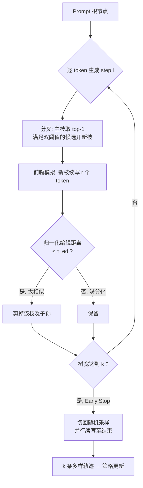

# Lookahead Tree-Based Rollouts for Enhanced Trajectory-Level Exploration in Reinforcement Learning with Verifiable Rewards

**会议**: ICLR 2026  
**OpenReview**: [https://openreview.net/forum?id=4nLvUk8edu](https://openreview.net/forum?id=4nLvUk8edu)  
**代码**: [https://github.com/starreeze/latr](https://github.com/starreeze/latr)  
**领域**: 强化学习 / LLM 推理 (RLVR)  
**关键词**: RLVR, GRPO, DAPO, 轨迹多样性, 树搜索, lookahead 模拟, rollout 探索  

## 一句话总结
LATR 用"分叉—前瞻模拟—剪枝"的树状 rollout 替换 RLVR 中独立的 token 级随机采样，在固定生成预算下显式制造轨迹级多样性，让 GRPO/DAPO 学习提速 131%、最终 pass@1 提升 4.2%。

## 研究背景与动机
- **领域现状**：以 GRPO 为代表的 RLVR（可验证奖励强化学习）已成为提升大模型推理能力的主流范式——同一 prompt 采样一组轨迹，按组内相对奖励估计 advantage 来更新策略，无需价值网络即可稳定训练。
- **现有痛点**：rollout 阶段采到的一组轨迹**多样性太低**。组内轨迹高度同质时，组内相对 advantage 趋近于零、学习信号坍缩，策略更新变得没有信息量，scaling 受阻。
- **核心矛盾**：现有缓解手段都治标不治本——提高采样温度只制造 token 级抖动、不保证轨迹级分化；DAPO 那样事后过滤掉同奖励组虽有效，但靠过量 over-generation 换有限多样性，成本高。根因在于 **token 级随机采样的"近视"**：每条序列独立采样、缺乏前瞻，把"compute→calculate"这类局部变动很容易又收敛回几乎相同的推理路径，造成冗余探索、回报递减。
- **本文目标**：在**固定生成预算**下显式提升组内轨迹级多样性，且能无侵入地插进任意策略更新算法。
- **核心 idea**：**树状 rollout 替代独立采样**——在模型高不确定的 token 位置主动分叉到语义不同的候选，再用前瞻模拟验证"这条岔路是否真的走向不同推理路径"，模拟后仍与父枝高度相似的分枝直接剪掉，保证最终留下的 k 条轨迹彼此真正不同。

## 方法详解

### 整体框架
LATR（Lookahead Tree-Based Rollout）受 MCTS 启发，把一组 rollout 维护成一棵动态搜索树。从 prompt 根节点开始，逐 token 生成时迭代执行三阶段：(1) **分叉** Branching——在模型不确定的位置创建新分枝；(2) **前瞻模拟** Lookahead Simulation——每条新枝再续写固定 $r$ 个 token；(3) **剪枝** Pruning——把模拟后仍与父枝过于相似的分枝连同子孙一起删掉。三步反复直到树宽达到目标 rollout 数 $k$，之后所有幸存枝切回标准随机采样并行续写。整个过程无回溯，一组 rollout 的前向次数被 $O(nk)$ 限住（$k$=树宽，$n$=最大长度）。

### 关键设计

**1. 双阈值分叉：只在"真岔路口"开枝。** LATR 不在每个 token 盲目分叉，否则分枝指数爆炸瞬间耗尽预算。每步每条活跃枝先用最高概率 token $c^\star_s=\arg\max_c P_s[c]$ 续写主枝保证沿最可能路径推进；同时只有当某候选 $c$ **同时**满足绝对概率阈值 $P_s[c] > \tau_{abs}$ 和相对差阈值 $P_s[c^\star_s] - P_s[c] < \tau_{rel}$ 时才开新子枝（式 5）。前者过滤掉低概率噪声 token，后者保证新枝不会偏离策略分布太远——两者合起来精准锁定"模型在语义不同的续写之间真正犹豫"的推理十字路口。若预算 $k$ 已满，候选按概率 $P_s[c]$ 降序优先，让更可信的替代路径优先被探索。

**2. 前瞻模拟 + 编辑距离剪枝：用"未来"判断分叉值不值。** 仅靠分叉无法解决"token 级岔路很快又收敛回同一条推理路径"的坍缩问题。LATR 对每条在 step $l-r$ 诞生的新枝，先让它续写固定窗口 $r$ 个 token（lookahead 模拟），再对最近 $r$ 个 token 与父枝对应片段计算**归一化编辑距离**（token-ID 序列的 Levenshtein 距离除以长度）。若 $\text{EditDist}(s[-r:], s.\text{parent}[-r:]) < \tau_{ed}$（式 7），说明这条岔路并没走向真正不同的路径，就把它连同所有子孙剪掉（式 8）。这样保留下来的都是"未来一段确实会分化"的枝，把宝贵预算只花在有意义的多样性上。作者在附录验证换用其它相似度度量效果接近，说明机制对度量选择不敏感。

**3. 早停 + 混合退火：弥合 train-test 分布偏差。** 两个工程优化让 LATR 真正能用于训练。**早停**：一旦树宽达到 $k$，已经有 $k$ 条大概率走向不同路径的序列，此后全部切回标准随机采样，既保住多样性收益又不再增加分叉开销。**混合 rollout**：LATR 显式追求分化，但测试时模型只生成单条轨迹、优先正确与连贯，纯 LATR 训练会把策略带向"过度探索"而不泛化。于是每步只把比例 $\eta$ 的 rollout 分给 LATR、其余 $k-\eta k$ 走随机采样（式 9），并随训练步指数退火 $\eta = \eta_0 \cdot \gamma^i$（$\gamma<1$，式 10）——早期靠 LATR 多样性探索，后期逐渐贴近测试时行为，压低训练-推理不一致。

## 实验关键数据

### 主实验
模型 Qwen2.5-3B，500 步训练，每题采 8 条评估，报告 Pass@1/Pass@8 与平均长度（越短越好）。

**Countdown（逻辑推理）：**

| 方法 | Pass@1 ↑ | Pass@8 ↑ | 平均长度 ↓ |
|---|---|---|---|
| GRPO w/ Stochastic | 65.9 | 73.9 | 473 |
| DAPO w/ Stochastic | 70.7 | 78.0 | 483 |
| GRPO w/ LATR | 70.9 (+5.0) | 77.4 | 378 (-20%) |
| DAPO w/ LATR | **74.7** (+4.0) | **81.5** | 367 (-24%) |

**数学（DAPO-Math / AMC-2023 节选 Pass@1）：**

| 方法 | DAPO-Math | AMC-2023 |
|---|---|---|
| DAPO w/ Stochastic | 26.8 | 37.8 |
| GRPO w/ LATR | 28.4 (+4.3) | 35.6 (+2.8) |
| DAPO w/ LATR | **32.5** (+5.7) | **45.3** (+7.5) |

MATH-500、Olympiad-Bench 上 LATR 同样普遍正向，且平均长度多数下降 5%–25%。

### 多样性消融

| 方法 | Pass@1 | Pass@8 | 不同答案数 ↑ |
|---|---|---|---|
| Qwen2.5-3B + Stoch. | 5.8 | 28.9 | 6.3 |
| Qwen2.5-3B + LATR | 6.1 | 30.7 | 6.9 |
| Qwen2.5-3B-Instruct + Stoch. | 9.4 | 35.2 | 6.4 |
| Qwen2.5-3B-Instruct + LATR | 10.9 | 40.6 | 6.9 |

同一模型下 LATR 把"组内语义不同答案数"稳定抬高（按数值结果判定 distinct，衡量语义而非字面多样性）。

### 关键发现
- **GRPO+LATR ≈ 甚至 ≥ DAPO+Stochastic**：在不需要 DAPO 昂贵组过滤/过采样的情况下，仅靠 rollout 多样性就追平更重的算法，佐证"轨迹多样性是性能增益的主因"。
- **训练提速显著**：Countdown 上 DAPO+Stochastic 需 450 步达峰，LATR 仅 150 步（3×）；数学任务 500 步 vs 240 步（2×）。LATR 带来的加速甚至超过 GRPO→DAPO 的升级收益。
- **又快又短**：在提升正确率的同时缩短推理长度——多样化探索让策略内化更高效的推理策略，避免随机采样那种冗长、重复、过度展开的链路。

## 亮点与洞察
- **把"探索"从 token 级提到轨迹级**：精准指出 RLVR 多样性瓶颈的根因是 token 级采样的近视，并用"分叉位置选择 + 前瞻验证"两件事直接对症，逻辑闭环漂亮。
- **前瞻模拟是点睛之笔**：单纯分叉解决不了"岔路又收敛"，用 $r$ 步 lookahead + 编辑距离做"这条岔路值不值"的事后判定，是比单纯调温度/事后过滤更本质的解法。
- **无侵入、预算可控**：backtracking-free、前向次数 $O(nk)$、可无修改插进任意策略更新算法，工程落地友好。
- **混合退火诚实面对 train-test gap**：没有回避"显式求多样会偏离测试行为"，用退火把它当一等问题处理。

## 局限与展望
- **超参偏多**：$\tau_{abs}, \tau_{rel}, \tau_{ed}, r, \eta_0, \gamma$ 共 6 个阈值/调度参数，跨任务迁移的鲁棒性与调参成本需进一步验证。
- **规模有限**：实验集中在 Qwen2.5-3B 与数学/逻辑两类可验证奖励任务，是否适用于更大模型、代码生成、开放式 long-CoT 仍待考。
- **多样性度量较朴素**：剪枝用 token 级编辑距离衡量分化，可能漏判"措辞不同但思路同"或"措辞像但思路不同"，语义级度量或带来进一步增益。
- **额外推理开销**：树状 rollout 与前瞻模拟相对纯随机采样有额外前向，虽被 $O(nk)$ 限住，但与 vLLM 等批量推理引擎的兼容/吞吐影响值得量化。

## 相关工作与启发
- **RLVR / GRPO / DAPO**：本文站在 GRPO（组相对优势、去价值网络）与 DAPO（过采样过滤 + token 级 loss + 解耦 clip）之上，把它们都当作可插拔的"策略更新后端"，只改 rollout 这一环。
- **MCTS 思想迁移到 rollout**：把蒙特卡洛树搜索的"分叉—模拟—剪枝"思路引入 RL 采样阶段，但做成 backtracking-free、预算受控的轻量版本，避免了 MCTS 的高开销。
- **启发**：RLVR 的性能瓶颈未必在策略更新公式，而可能在"喂给它的一组样本够不够有信息量"。把探索预算花在"制造真正不同的轨迹"上，可能比升级算法本身更划算——这一视角对设计 rollout 策略、数据构造乃至 inference-time scaling 都有借鉴价值。

## 评分
- **新颖性**: ⭐⭐⭐⭐ — 把轨迹级多样性显式做进 rollout、用前瞻模拟验证分叉的思路新颖且切中 RLVR 真实痛点。
- **实验充分度**: ⭐⭐⭐⭐ — 覆盖 5 数据集 × GRPO/DAPO 两算法，含多样性、训练动态、阈值等多组消融；但模型规模与任务类型偏窄。
- **写作质量**: ⭐⭐⭐⭐ — 动机推导清晰，算法、公式、图示完整，三阶段叙述易懂。
- **价值**: ⭐⭐⭐⭐ — 即插即用、提速 131%/提点 4.2% 且缩短输出，对 RLVR 训练实践有直接落地价值。

<!-- RELATED:START -->

## 相关论文

- [\[ICLR 2026\] Rubrics as Rewards: Reinforcement Learning Beyond Verifiable Domains](rubrics_as_rewards_reinforcement_learning_beyond_verifiable_domains.md)
- [\[ICLR 2026\] LongRLVR: Long-Context Reinforcement Learning Requires Verifiable Context Rewards](longrlvr_long-context_reinforcement_learning_requires_verifiable_context_rewards.md)
- [\[ICLR 2026\] Reinforcement Learning with Verifiable Rewards Implicitly Incentivizes Correct Reasoning in Base LLMs](reinforcement_learning_with_verifiable_rewards_implicitly_incentivizes_correct_r.md)
- [\[ICLR 2026\] From Verifiable Dot to Reward Chain: Harnessing Verifiable Reference-based Rewards for RL of Open-ended Generation](from_verifiable_dot_to_reward_chain_harnessing_verifiable_reference-based_reward.md)
- [\[ICLR 2026\] RLVMR: Reinforcement Learning with Verifiable Meta-Reasoning Rewards for Robust Long-Horizon Agents](rlvmr_reinforcement_learning_with_verifiable_meta-reasoning_rewards_for_robust_l.md)

<!-- RELATED:END -->
