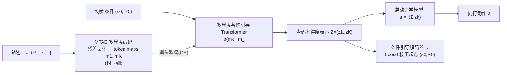

# MAGE: Multi-scale Autoregressive Generation for Offline Reinforcement Learning

**会议**: ICLR 2026  
**OpenReview**: [https://openreview.net/forum?id=32BLpC50V0](https://openreview.net/forum?id=32BLpC50V0)  
**代码**: [https://github.com/xmu-rl-3dv/MAGE](https://github.com/xmu-rl-3dv/MAGE)  
**领域**: 强化学习 / 离线 RL / 生成式决策  
**关键词**: 离线强化学习, 多尺度自回归, 轨迹生成, VAR, 长程稀疏奖励  

## 一句话总结
把图像领域的「多尺度自回归（VAR）」搬到离线 RL 的轨迹建模上：先生成一条粗粒度的全局轨迹草图，再逐层自回归地细化到细粒度，从而在长程稀疏奖励任务上同时兼顾全局连贯性与局部可控性。

## 研究背景与动机
- **领域现状**：生成式离线 RL（Decision Transformer、Diffuser、Decision Diffuser 等）凭借强大的分布建模能力，能够刻画复杂多模态的轨迹分布，成为离线 RL 的主流路线之一。
- **现有痛点**：这些方法在「长程 + 稀疏奖励」任务上集体掉链子。Transformer 类是单向逐步自回归，缺乏对全局上下文的双向理解；扩散类虽然整体更强，但存在「局部生成偏置」，产出的轨迹局部合理却全局不连贯，且迭代去噪推理慢。
- **核心矛盾**：已有的层次生成方法（HGM，如 HDMI、HD）想用「高层定子目标 + 低层填动作」的两层固定层级来缓解长程问题，但**固定两层结构无法刻画轨迹本身蕴含的多尺度时序结构**，而且需要联合优化两个互相依赖的策略，训练效率和稳定性都受损。
- **本文目标**：用一个统一模型在多个时间分辨率上建模轨迹，既抓住长期依赖（粗尺度）又保留短期细节（细尺度），并对生成轨迹的起点状态做精确条件控制。
- **核心 idea（多尺度自回归生成）**：把 VAR 在图像上「从低分辨率到高分辨率逐尺度生成 token map」的范式迁移到轨迹上——**自顶向下、由粗到细**地自回归生成一条轨迹的多尺度表示，再用逆动力学模型从隐表示里解出要执行的动作。

## 方法详解

### 整体框架
MAGE 把轨迹表示成「回报-to-go 与状态」的序列 $\tau = \{(R_0, s_0), \dots, (R_T, s_T)\}$，整条管线由两大模块构成：**多尺度轨迹自编码器 MTAE**（把轨迹压成由粗到细的多尺度离散 token map）和**多尺度条件引导自回归生成器**（在初始条件 $(s_0, R_0)$ 引导下，由粗到细逐尺度生成这些 token map）。生成完成后再由逆动力学模型从聚合隐表示中解出动作。

### 关键设计

**1. 多尺度轨迹自编码器（MTAE）：用残差量化把轨迹拆成「由粗到细」的 token 金字塔。** MTAE 沿用 VQ-VAE 的编码-量化-解码三件套，但关键改造是引入一套**自顶向下的多尺度量化**：给定预设的时间尺度调度 $[l_k]_{k=1}^K$，编码器先得到连续特征 $f$，然后在第 $k$ 个尺度上把 $f$ 下采样并量化得到 token map $m_k \in [V]^{l_k}$，再把该尺度的量化结果上采样回去、从 $f$ 中减掉（$f \leftarrow f - z_k$），让下一个更细的尺度只去拟合「残差」。这样 $m_1$ 编码最粗的全局结构、$m_K$ 编码最细的短期细节，整条轨迹被表示为多尺度 token map $M=(m_1,\dots,m_K)$。所有尺度**共享同一个码本 $C$**，保证不同尺度的 token 同维同词表，便于后续统一自回归。作者实证发现建模 $(R, s)$ 比建模动作或 $(R,s,a)$ 都更好。

**2. 多尺度条件引导自回归生成：把 VAR 的「逐尺度生成」做成回报条件的决策器。** 生成端用一个因果 Transformer 自回归地预测整条 token map 序列，联合概率被分解为逐尺度条件式：
$$p(m_1,\dots,m_K \mid s_0, R_0) = \prod_{k=1}^{K} p(m_k \mid m_{<k}, s_0, R_0).$$
每一尺度的输入都是初始状态 $s_0$、回报 $R_0$ 以及所有更粗尺度已生成的 $m_{<k}$，用交叉熵对齐真值 token map 来训练：$\mathcal{L}_{CE} = -\sum_k \sum_i m_{k,i}^\top \log \hat{m}_{k,i}$。这种「由粗到细 + 全程 RTG 条件」的生成让模型先定下宏观走向、再逐层补细节，既有全局连贯性又能被回报精确导向高收益轨迹——这正是它在长程稀疏奖励任务上胜出的核心。

**3. 隐空间逆动力学定动作：不用整条生成轨迹，只取聚合隐表示解动作。** 生成得到隐表示 $Z=(z_1,\dots,z_K)$ 后，MAGE 不直接读取解码出来的轨迹去取动作，而是用一个潜在逆动力学模型 $I$ 从聚合表示中解出当前要执行的动作：
$$a = I\Big(\sum_{k=1}^{K} z_k\Big), \qquad \mathcal{L}_{inv} = \|a - a_0\|_2^2,$$
其中 $a_0$ 是 $\tau$ 在时刻 0 的真实动作。这个目标逼着 $Z$ 在最细时间尺度上为最近一步保留「动力学一致」的信息；消融显示用聚合隐表示比用完整生成轨迹去取动作效果更好。

**4. 条件引导精修：用一个轻量 adapter 解码器把生成轨迹的起点钉死在真实初始条件上。** 仅靠交叉熵无法保证生成轨迹的首状态严格等于 $s_0$，加上隐变量量化带来的信息损失，生成的轨迹起点容易漂移。MAGE 在解码器里加一个参数高效的精修模块 $D'$，用 MSE 把解码出的初始状态-回报对拉回真值：
$$\mathcal{L}_{cond} = \|D'(Z, R_0)_0 - (s_0, R_0)\|_2^2.$$
这一项保证了「条件连贯」——去掉它会让轨迹一开头就偏离设定的起点条件。

## 实验关键数据

### 主实验表格（部分基准平均分，越高越好）
在 5 个离线 RL 基准、对比 15 个基线上全面评测，MAGE 在长程稀疏奖励任务上显著领先。

| 基准 | 任务/设置 | 最强基线 | MAGE | 说明 |
|------|-----------|----------|------|------|
| Adroit | Mean(w/o Expert) | IQL 21.4 | **38.3** | 稀疏奖励高维灵巧操作 |
| Adroit | Mean(all settings) | DT 49.2 | **66.9** | — |
| Franka Kitchen | Average | HD 72.5 | **88.8** | 组合式顺序子目标 |
| AntMaze | Average | ADT 78.1 | **89.7** | 长程导航，6 数据集赢 5 |
| Maze2D | Single-task Avg | HD 139.9 | **153.3** | — |
| Multi2D | Multi-task Avg | HD 149.9 | **155.0** | — |

在 Adroit 的 Hammer-Human/Cloned、Door-Human/Cloned 等极难设置上，MAGE 相对次优方法常有数倍提升（如 Hammer-Cloned 13.2 vs 次优 2.1）。在稠密奖励的 MuJoCo locomotion 上也在 9 个任务里 7 个夺冠，证明其通用性。

### 消融实验表格
在 Adroit 的 Pen-Expert / Door-Cloned 上消融（Ours 为完整 MAGE）：

| 消融维度 | 关键对照 | Pen-Expert | Door-Cloned |
|----------|----------|-----------|-------------|
| 时间尺度数 K | K=1 → K=8(Ours) | 123.5 → **147.8** | 5.2 → **20.5** |
| 生成方案 | A+CQL / (R,S,A) / (R,S)=Ours | 127.6 / 124.9 / **147.8** | 4.9 / 17.2 / **20.5** |
| RTG 条件 | 去 D / 去 mk>1 / 去 Lcond / Ours | 140.3 / 139.5 / 139.9 / **147.8** | 12.3 / 16.3 / 17.1 / **20.5** |

**推理速度（Adroit，每步 ms，越低越好）**：

| 方法 | MAGE | DT | TT | ADT | DD | HD |
|------|------|----|----|----|----|----|
| 时间(ms) | 27.3 | 6.5 | 12863 | 7.8 | 2339 | 1480 |

### 关键发现
- **多尺度确实有用**：K 增到 8 前性能持续提升，验证多尺度时序建模的价值；但 K≥8 后（如 Door-Cloned）反而下降，说明过度细分会引入噪声，最优 K 与任务相关。
- **建模 (R, S) 最优**：只建模状态、只建模动作、动作+CQL、(R,S,A) 都不如只建模回报与状态——加入动作反而带来不必要的复杂度，(R,S) 在「高层意图」与「环境动态」间取得最佳平衡。
- **RTG 条件不可或缺**：在自编码器、细尺度 Transformer、条件损失三处任意移除 RTG 都掉分。
- **快且实用**：比 HD 快约 50×、比 DD 快约 80×，27 ms/步满足 20 Hz 实时机器人控制需求。

## 亮点与洞察
- **跨模态范式迁移做得干净**：把图像生成里的 VAR「next-scale prediction」原汁原味迁到轨迹上——「粗到细」在时间维度上天然对应「全局规划→局部细化」，这个类比比硬套扩散更贴决策任务的层次本质。
- **单一统一策略而非两层异构策略**：相比 HDMI/HD/ADT 那种「两个互相依赖策略联合优化」的固定层级，MAGE 用一个模型跨所有潜在时间层级，绕开了双策略优化的训练不稳定。
- **隐空间逆动力学 + 起点条件精修是两个工程上的关键补丁**：前者避免直接信任量化重建的整条轨迹，后者用轻量 adapter 把起点钉死，二者共同保证「条件连贯」，消融都验证了必要性。

## 局限与展望
- **粗尺度的全局承诺会限制细尺度灵活性**：一旦在粗尺度上定下全局计划，细尺度的精修空间就被约束了，这是层次设计的固有 trade-off。
- **极端稀疏长程仍是开放问题**：在 OGBench 这类极端任务上 MAGE 只是「有竞争力」而非碾压，作者坦承此类极端场景仍待解决。
- **分布漂移 / OOD 处理不足**：离线 RL 的老问题——面对分布外场景的稳健性仍需进一步研究。
- **尺度调度需手调**：最优 K 与时间尺度调度是任务相关超参，缺乏自适应机制。
- 作者展望把多尺度机制扩展到多智能体协作建模。

## 相关工作与启发
- **生成式离线 RL**：Decision Transformer / Trajectory Transformer（自回归）、Diffuser / Decision Diffuser / RGG（扩散规划）、Diffusion-QL（扩散动作）。MAGE 指出扩散类的「局部生成偏置」和慢推理是其在长程任务失利的根因。
- **层次化离线 RL**：HDT、ADT（自回归两层）、HDMI、HD（扩散两层）都是固定两层、双策略；CARP 是由粗到细自回归但只建模动作序列且无显式回报条件。MAGE 的差异化在于**单一统一策略 + 多尺度 + 回报条件的状态/RTG 自回归**。
- **方法基石**：VAR（多尺度自回归图像生成）、VQ-VAE（离散隐表示），以及 Decision Transformer 的 RTG 条件思想——MAGE 本质是把这三者在轨迹建模上做了一次有机整合。

## 评分
- **新颖性**: ⭐⭐⭐⭐ — VAR 的「next-scale」范式迁移到离线 RL 轨迹建模是清晰且有说服力的跨模态创新，配套的隐空间逆动力学与起点精修也不是简单照搬。
- **实验充分度**: ⭐⭐⭐⭐ — 5 基准 × 15 基线覆盖广，长程稀疏 + 稠密奖励都测了，消融（尺度数/生成方案/RTG/推理速度）系统完整；扣分在极端稀疏（OGBench）只是竞争力级别。
- **写作质量**: ⭐⭐⭐⭐ — 动机—方法—实验逻辑顺畅，Figure 1/3 的范式对比与迷宫可视化直观，算法伪代码清晰。
- **价值**: ⭐⭐⭐⭐ — 在长程稀疏奖励这一硬骨头上拿到 SOTA 且推理快 1-2 个数量级，对机器人/规划类实际应用有现实意义，代码开源。

<!-- RELATED:START -->

## 相关论文

- [\[ICLR 2026\] Trajectory Generation with Conservative Value Guidance for Offline Reinforcement Learning](trajectory_generation_with_conservative_value_guidance_for_offline_reinforcement.md)
- [\[ICLR 2026\] In-Context Compositional Q-Learning for Offline Reinforcement Learning](in-context_compositional_q-learning_for_offline_reinforcement_learning.md)
- [\[ICLR 2026\] MOBODY: Model-Based Off-Dynamics Offline Reinforcement Learning](mobody_model-based_off-dynamics_offline_reinforcement_learning.md)
- [\[ICLR 2026\] Peng's Q($\lambda$) for Conservative Value Estimation in Offline Reinforcement Learning](pengs_qlambda_for_conservative_value_estimation_in_offline_reinforcement_learnin.md)
- [\[ICML 2026\] Vulnerable Agent Identification in Large-Scale Multi-Agent Reinforcement Learning](../../ICML2026/reinforcement_learning/vulnerable_agent_identification_in_large-scale_multi-agent_reinforcement_learnin.md)

<!-- RELATED:END -->
