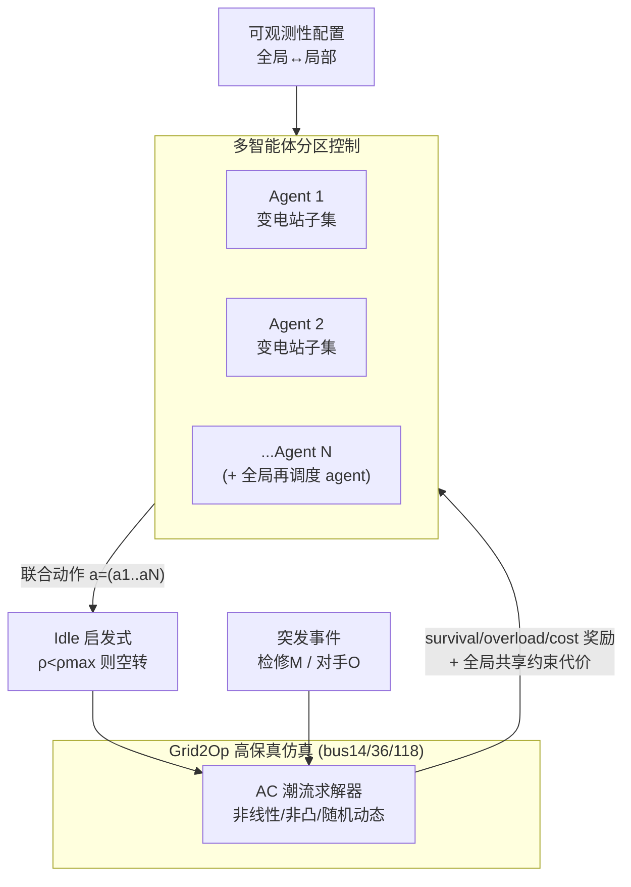

# MARL2Grid-TR: A Multi-Agent RL Benchmark in Power Grid Operations

**会议**: ICLR 2026  
**OpenReview**: [https://openreview.net/forum?id=mpAMH1OyMO](https://openreview.net/forum?id=mpAMH1OyMO)  
**代码**: 已开源（随论文发布于 OpenReview）  
**领域**: 强化学习 / 多智能体强化学习 / 电网运营 Benchmark  
**关键词**: 多智能体强化学习, 电网拓扑优化, 再调度与削减, Dec-POMDP, 约束 MARL, Grid2Op  

## 一句话总结
本文提出 MARL2Grid-TR——首个面向真实输电网"拓扑优化 + 再调度/削减"控制的多智能体 RL 基准，基于法国 TSO 的高保真仿真平台 Grid2Op，把电网控制建模成多智能体协作任务，并用实验证明当前主流 MARL 方法在真实约束下尤其在高维拓扑任务上几乎全军覆没。

## 研究背景与动机
**领域现状**：随着风电、光伏等可变可再生能源（VRE）大规模并网，电网运营需要前所未有的灵活性。系统运营商主要靠两类手段维持稳定：(i) 拓扑优化（重构电网连接以缓解线路过载），(ii) 再调度与削减（调整发电机/储能出力实时平衡供需）。强化学习通过 L2RPN 竞赛系列和近期的 RL2Grid 基准展现了潜力。

**现有痛点**：以往工作几乎全部把电网控制建模成**单智能体任务**。但真实电网天然是分散的——它被划分给多个运营商，即便单个运营商辖区内系统也是去中心化运行的。现有基准（L2RPN、RL2Grid）既不支持多样的可观测性设定，也不支持多智能体之间的协调，与实际部署的需求脱节。

**核心矛盾**：拓扑动作具有**组合爆炸**的离散空间（单个变电站可能超过 65000 个有效动作），叠加部分可观测、长时程目标、硬物理约束（线路热容量、发电机爬坡、变电站开关限制），违反约束就意味着停电或经济损失——这是一个必须实时求解的高维、非凸、非线性决策问题，传统优化器和人类操作员都难以胜任。

**本文目标**：填补"去中心化、多智能体"这个空白，提供一个标准化、可扩展、与 TSO 合作开发的多智能体 RL 基准。

**核心 idea**：**把电网控制重新形式化为多智能体协作问题**——每个 agent 控制一部分变电站，在可配置的可观测性下协同维持供需平衡与电网稳定；配套提供离散拓扑/连续再调度两类任务、专家启发式 idle 转移、以及全局共享的安全约束形式化。

## 方法详解

### 整体框架
MARL2Grid-TR 把电网建模为多智能体马尔可夫决策过程（MMDP），并在部分可观测时退化为 Dec-POMDP。基准构建在三个真实规模的 Grid2Op 电网（bus14/bus36/bus118）之上，每个电网按"内部强连通、外部弱耦合"的分区法把变电站分配给若干 agent，复刻 TSO 真实控制分区。每个 agent 在 5 分钟一步、跨越一周到一月的长 episode 中，对自己辖区做拓扑（离散）或再调度/削减（连续）动作，可在"全局可观测—严格局部可观测"之间任意切换；之上叠加专家 idle 启发式压缩决策时程，以及全局共享的安全约束。

### 关键设计

**1. 双任务双动作空间：离散拓扑 vs 连续再调度，刻画组合爆炸的本质难度。** 离散拓扑任务里，每个 agent 可切换线路通断、并把元件重新分配到变电站内两条母线之一（"母线劈分"）。一个含 $N_{lines}$ 条线、$N_g$ 台机、$N_l$ 个负荷的双母线变电站，其离散动作数为 $N = 2^{N_{lines}+N_g+N_l-1}-1$——例如 7 元件的变电站有 63 种配置，而 bus36 的单个变电站可超过 65000 个有效动作，组合爆炸让传统优化彻底失效。连续再调度任务则采用**混合 agent 结构**：去中心化 agent 管辖区内可再生发电削减与储能充放电，外加一个**全局再调度 agent** 调节其余发电机出力，动作空间随发电机与储能数线性增长（bus118 为 $N = N_{redisp}+N_{curt}+N_{stor}=69$），因此天然比拓扑任务简单。

**2. 多智能体 idle 启发式：把专家经验注入转移动态、压缩有效时程。** 给定任务的复杂度与维度，基准引入专家 idle 启发式 $I$ 来聚焦"安全关键时刻"。拓扑任务下，当所有线路负载 $\rho$ 都低于安全阈值 $\rho_{max}$ 时发出 idle 动作，agent 控制被挂起、环境自行推进；一旦某线越限，控制权交回 agent 去恢复正常。连续任务下则先尝试重连可用线路，无可重连时再做与离散相同的 idle 检查。关键在于该启发式**不替代而是补充** agent 学习——每个 agent 动作可触发一连串启发式引导的转移，期间奖励持续累积，从而减少冗余探索、提升样本效率、稳定训练。但实验也揭示它在去中心化离散控制下会"反噬"（见关键发现）。

**3. 任务自适应奖励设计：拓扑用三项加权、连续用裕度直驱。** 拓扑优化沿用与 TSO 共同设计的三分量奖励 $R = \alpha R_{survive} + \beta R_{overload} + \eta R_{cost}$，分别鼓励存活、惩罚过载、计入经济成本。连续再调度则直接用线路裕度构造奖励 $R = 1 - \frac{\sum_{l\in L_c}\rho_l}{|L_c|}$，其中 $L_c$ 是连通线集合、$\rho_l$ 是线路负载——电网越逼近热极限越不安全，这种直接对裕度建模的形式在连续设定下学习效果更好。

**4. 全局共享的多智能体安全约束：局部动作的全局后果迫使系统级协作。** 由于电网高度耦合、非线性、非凸，一个 agent 的局部决策可能波及全网，因此约束代价**不分配给单个 agent，而是全局累加并由所有 agent 共享**，镜像联合奖励结构，迫使 agent 超越局部视野共同维护系统级安全。两类约束：负荷削减与孤岛（L），用指示函数 $L(s,a)=\mathbb{1}(P_G(s,a)<P_D(s,a))$ 与孤岛指示 $I(s,a)=\mathbb{1}(N_I(s,a)>0)$ 组成逐步代价 $C_L=L+I$，要求累积代价为 0 才算安全；线路过载（O），用过载指示 $O_\ell=\mathbb{1}(P_{F,\ell}>P^{max}_{F,\ell})$ 与断线指示 $D_\ell$ 组成逐步代价 $C_O = \sum_{\ell\in L}(O_\ell+D_\ell)$，要求累积代价 $\sum_t C_O \le \tau$。约束多采用拉格朗日松弛求解，因此基准选 LagrMAPPO 作主约束 baseline。

## 实验关键数据

基准评估了一批常作高级算法基石的主流 MARL 方法：QPLEX、MAPPO（含/不含 idle 启发式）、LagrMAPPO（约束版）；并对照全可观测单智能体 PPO/LagrPPO 以判断挑战来自 MARL 分解还是任务本身。全部实验约耗 12 万 CPU 小时，结果为 5 次独立运行、100-episode 窗口平均，95% bootstrap 置信区间。

### 主实验表格

bus14 离散拓扑任务，两年测试数据平均存活率（Survival）：

| Agent 类型 | 平均存活率 |
|---|---|
| DoNothing（仅 idle） | 0.18 |
| QPLEX | 0.04 |
| **MAPPO** | **0.79** |
| PPO（全可观测单智能体） | 0.38 |
| LagrMAPPO (L \| O) | 0.19 \| 0.04 |
| LagrPPO (L \| O) | 0.04 \| 0.01 |

bus118 连续再调度/削减任务，两年测试数据平均存活率：

| Agent 类型 | 平均存活率 |
|---|---|
| DoNothing | 0.29 |
| RecoPowerline（直接套 idle 启发式） | 0.34 |
| MASAC | 0.25 |
| MAPPO | 0.58 |
| **PPO（训练到收敛 ~10M 步）** | **0.67** |

### 消融实验表格

idle 启发式与约束维度在 bus14 离散任务上的影响：

| 配置 | 平均存活率 | 现象 |
|---|---|---|
| MAPPO（训练曲线峰值） | ~0.84 | 学到最有效策略 |
| MAPPO + idle 启发式 | ~0.20 | idle 在离散去中心化下**反而严重掉点** |
| 最优 LagrMAPPO (L) | ~0.21 | 约束满足好但性能差 |
| MAPPO 在 bus118 拓扑 | 失败 | 最优 baseline 也无法控制大网拓扑 |

### 关键发现
- **MAPPO 优于全可观测单智能体 PPO**（bus14 离散 0.79 vs 0.38），证明去中心化分解本身带来收益，挑战并非单纯来自 MARL 分解。
- **idle 启发式在离散拓扑上会反噬**：它压缩了 agent 本就有限的"可试验多步协调重构"的窗口，在指数级动作空间里成功拓扑干预本就稀缺且需时序协调，进一步丧失动作机会会严重阻碍探索——与单智能体设定下 idle 加速学习的结论相反。
- **大网拓扑全面失败的四点根因**：(i) 组合动作空间探索难；(ii) 电气耦合分区间协调难（本地增裕度却让远端过载）；(iii) 部分可观测 + 延迟全局过载惩罚导致严重信用分配问题；(iv) 拓扑切换有长时程不可逆后果（冷却计时、孤岛、过载转断线），早期随机动作易陷入不可恢复状态。
- **连续任务相对简单**：MAPPO ~0.58、PPO 收敛后 0.67（但需约 10M 步、样本效率更低），且都"存活时间约为 DoNothing 两倍"。

## 亮点与洞察
- **首个面向真实输电网的多智能体拓扑+再调度基准**，与 TSO 合作、建在产业级 Grid2Op 上，相比 PYTHON-MICROGRID/GYM-ANM/L2RPN/RL2Grid 是唯一同时支持"大规模 + 多智能体 + 拓扑 + 再调度/削减 + 约束"的环境（Table 1）。
- **PettingZoo 标准接口 + 可选启发式转移 + 约束形式化 + 多个 baseline 参考实现**，可复现且高度可配置（用户可改配置文件重定义分区、切换可观测性、甚至退化为"每个变电站一个 agent"的完全去中心化研究极限协调与可扩展性）。
- **诚实的负面结果**：作者不回避主流 MARL 在大网拓扑上全面失败，反而把失败拆成四点根因并系统列出未来方向（超越模仿、部分可观测下协调、可扩展性、更真实评估、部署路径），把 benchmark 当成"暴露问题的诊断工具"而非"刷分擂台"。
- **混合 agent 结构与全局共享约束**的设计直接来自与 TSO 的讨论，把"局部动作的全局后果"这一真实运营痛点编码进了形式化中。

## 局限与展望
- **算法层面尚无解**：论文证明了问题难，但没有提出能攻克大网拓扑的新算法——这是留给社区的开放挑战。
- **仿真保真度仍有边界**：Grid2Op 的 AC 求解器抓住了关键运营约束，但省略了快暂态、详细逆变器/保护动态、部分动作约束；也缺 N−1 安全等更强现实性。
- **评估指标偏窄**：主要用平均存活率，作者自承应进一步评估经济影响、罕见但关键的极端工况鲁棒性（可用形式化工具）、以及大规模异构网络中的协作。
- **可扩展性天花板**：bus118（118 母线）已是"足够暴露核心挑战又仍可大规模实验"的甜点，但扩到上千母线在算力与算法上都还远未就绪。
- **部署路径**：电力行业保守，需经离线仿真、影子模式部署、安全过滤器层层验证才能真正落地。

## 相关工作与启发
- **延续 L2RPN / RL2Grid 谱系**：RL2Grid（Marchesini et al., 2025b）确立了单智能体 Grid2Op 基准并支撑 L2RPN 竞赛，本文把它扩展到多智能体并形式化了多智能体 idle 转移与约束。
- **MARL 算法栈**：CTDE 范式下的值分解（QMIX/QPLEX）与策略梯度（MAPPO/MASAC），约束侧的拉格朗日 MAPPO（LagrMAPPO）——本文选择这些"被广泛采用、常作高级方法基石"的代表作 baseline，使结论更具普适诊断意义。
- **启发**：对"benchmark 论文"而言，本文示范了一条高价值路径——不是堆任务刷指标，而是用真实约束**精确暴露现有方法的失效模式并归因**，从而把研究社区的注意力导向真正的瓶颈（组合动作空间、部分可观测协调、长时程不可逆、缺专家示范）。其"全局共享约束 + 混合 agent + 可配置可观测性"的设计模式，也可迁移到其他"局部决策有全局后果"的协作控制领域（交通、供水、通信网）。

## 评分
- **新颖性**: ⭐⭐⭐⭐ 首个真实输电网多智能体拓扑+再调度基准，填补单智能体到多智能体的明确空白，多智能体 idle 转移与全局共享约束的形式化是实在的新贡献。
- **实验充分度**: ⭐⭐⭐⭐ 三个规模电网、离散/连续双任务、约束/非约束、单/多智能体对照齐全，约 12 万 CPU 小时、5 次独立运行、两年测试数据，诊断式分析到位；但每类任务的算法覆盖偏代表性而非穷尽。
- **写作质量**: ⭐⭐⭐⭐ 问题动机、形式化、失效归因层层递进，Table 1 对位清晰，负面结果诚实且把"为什么失败"讲透。
- **价值**: ⭐⭐⭐⭐ 为电网 MARL 提供标准化、可扩展、产业级的开放平台，并明确指出当前方法的失效模式与未来方向，对能源 AI 与约束 MARL 社区都有较强牵引价值。

<!-- RELATED:START -->

## 相关论文

- [\[ICLR 2026\] Multi-Agent Guided Policy Optimization](multi-agent_guided_policy_optimization.md)
- [\[ICLR 2026\] Retaining Suboptimal Actions to Follow Shifting Optima in Multi-Agent RL](retaining_suboptimal_actions_to_follow_shifting_optima_in_multi-agent_reinforcem.md)
- [\[ICLR 2026\] When Is Diversity Rewarded in Cooperative Multi-Agent Learning?](when_is_diversity_rewarded_in_cooperative_multi-agent_learning.md)
- [\[ICLR 2026\] MATH-Beyond: A Benchmark for RL to Expand Beyond the Base Model](math-beyond_a_benchmark_for_rl_to_expand_beyond_the_base_model.md)
- [\[CVPR 2026\] MangoBench: A Benchmark for Multi-Agent Goal-Conditioned Offline Reinforcement Learning](../../CVPR2026/reinforcement_learning/mangobench_a_benchmark_for_multi-agent_goal-conditioned_offline_reinforcement_le.md)

<!-- RELATED:END -->
