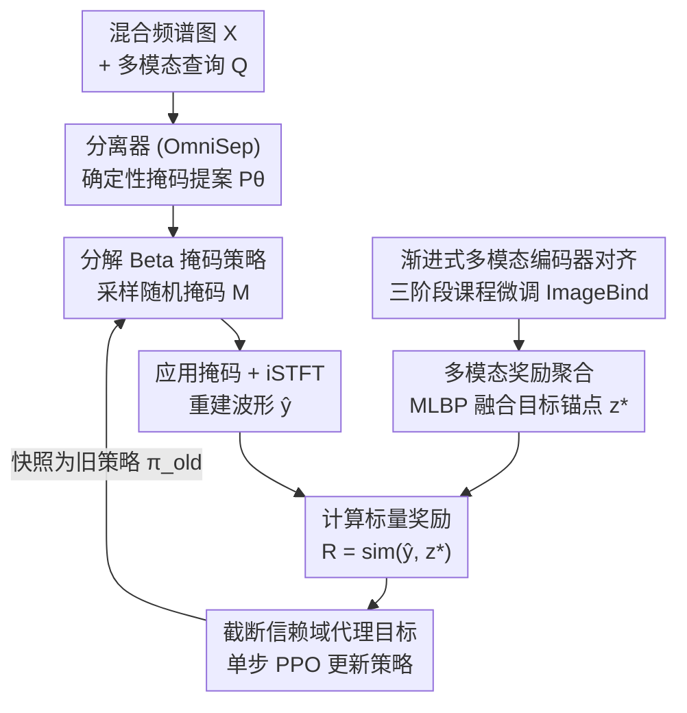

# MARS-Sep: Multimodal-Aligned Reinforced Sound Separation

**会议**: ICLR 2026  
**arXiv**: [2510.10509](https://arxiv.org/abs/2510.10509)  
**代码**: [https://github.com/mars-sep/MARS-Sep](https://github.com/mars-sep/MARS-Sep)  
**领域**: 音频处理 / 强化学习  
**关键词**: Sound Separation, Reinforcement Learning, Multimodal Alignment, Beta Policy, Preference Reward

## 一句话总结

MARS-Sep 将查询条件声音分离重新建模为强化学习问题，通过分解 Beta 掩码策略在时频域上进行随机决策，并利用渐进式对齐的多模态编码器提供语义奖励信号，在信号保真度和语义一致性上同时取得提升。

## 研究背景与动机

**领域现状**：通用声音分离（Universal Sound Separation）旨在从任意音频混合中分离出单独的声源。查询条件声音分离进一步允许用户通过音频、文本或图像查询来指定目标声源。当前主流方法（如 AudioSep、OmniSep）主要优化信号级别的损失函数（如 SDR、SI-SDR），通过预测时频掩码来重建目标波形。

**现有痛点**：现有方法面临一个根本性的"指标困境"——针对波形重建优化的模型可能在信号指标上得分很高，但输出中仍然残留感知上显著的干扰成分，违反了与查询的语义对应关系。例如，优化 SDR 的模型可能无法区分声学特征相似但语义完全不同的声源（如小提琴和中提琴），因为信号级损失不encoding 语义信息。

**核心矛盾**：信号级别的优化目标（低级别特征匹配）与语义级别的分离需求（高级别语义对齐）之间存在根本性的不对齐。传统的回归式掩码预测直接对齐 ground-truth 掩码，无法将查询的语义意图融入优化过程。

**本文目标** (1) 如何让分离模型的优化目标同时考虑信号保真度和语义一致性？(2) 如何将掩码预测从确定性回归转变为可探索的随机决策？(3) 如何获得稳定且语义丰富的奖励信号？

**切入角度**：受 RLHF 启发，作者将查询条件声音分离类比为偏好对齐问题——用户查询就是偏好，目标是产生最大化与查询语义对齐的输出。分离模型视为 base policy，通过强化学习优化。

**核心 idea**：用分解 Beta 分布策略（factorized Beta policy）在时频 bin 上进行随机掩码采样，通过渐进式对齐的多模态编码器提供语义奖励，以信赖域代理目标稳定训练。

## 方法详解

### 整体框架

MARS-Sep 要解决的是查询条件声音分离的"指标困境"：只优化信号级损失的模型分数高、却保不住语义。它的破局思路是把分离从一次性回归改写成一个**单步强化学习**循环——分离器不再直接输出最终掩码，而是给出一个"提案"，再围绕这个提案做随机探索、用语义奖励打分、用信赖域更新收敛。

整体怎么转：输入是混合频谱图 $X$ 与多模态查询 $Q$（音频/文本/图像），建立在 OmniSep 之上的分离器先预测确定性掩码提案 $P_\theta(X,Q) \in [0,1]^{H \times W \times K}$；提案被参数化成一族 Beta 分布构成的掩码策略 $\pi_\theta(M|X,Q)$，从中采样随机掩码 $M$；掩码应用到频谱后经 iSTFT 重建波形 $\hat{y}$。奖励侧另有一条线：经过三阶段课程微调的多模态编码器（基于 ImageBind）先把目标侧的三种模态嵌入用 MLBP 融成单一锚点 $z^*$，再算 $\hat{y}$ 与 $z^*$ 的相似度得到标量奖励 $R$。最后用截断信赖域代理目标更新策略，并把当前策略快照为下一步的旧策略，闭环迭代。

### 关键设计

**1. 分解 Beta 掩码策略：把确定性掩码变成可探索的随机决策**

回归式掩码预测只会给每个时频 bin 吐出一个固定的值，模型没有"试错"的空间，也就无从根据下游语义反馈调整。MARS-Sep 把分离器的输出 $P_\theta$ 重新解释为一族 Beta 分布的参数，掩码策略写成所有 bin 上独立 Beta 分布的乘积：

$$\pi_\theta(M|X,Q) = \prod_{h,w,k} \text{Beta}(M_{h,w,k}; \alpha_{h,w,k}, \beta_{h,w,k}), \quad \alpha = 1 + \kappa P_\theta,\ \beta = 1 + \kappa(1-P_\theta)$$

浓度尺度 $\kappa > 0$ 控制探索与利用的平衡：$\kappa$ 越小分布越平、采样越发散，训练早期保持探索，随后退火收紧（实验中 $\kappa=9$ 在语义奖励与信号保真间取得最佳平衡）。选 Beta 而非高斯或离散化，是因为它的 $[0,1]$ 支撑天然对应掩码值域，既不需要截断、又不会在训练初期就塌成近二值的退化掩码；而分解到每个 bin 的结构让 log-概率可以逐 bin 因式分解，采样和概率计算都很轻量。

**2. 渐进式多模态编码器对齐：把奖励模型养出真正的声源判别力**

奖励信号若直接用预训练 ImageBind 来打，策略很快会学会"骗奖励"而非真正改善分离质量（reward hacking）。MARS-Sep 在 RL 之前分三阶段把 ImageBind 逐步微调成可靠的奖励模型，且全程冻结编码器主干、只逐步解冻任务头与温度参数。Stage 1 做音频-文本对齐，用对称 InfoNCE 损失 $\mathcal{L}_{S1}$ 建立语义锚点；Stage 2 转向音频-音频判别，加入 triplet loss 与一致性损失 $\mathcal{L}_{S2}$ 增强类内区分能力（这是区分小提琴/中提琴这类声学相近声源的关键），并混入部分 Stage 1 数据防遗忘；Stage 3 做音频-视频接地，联合 InfoNCE 与 triplet loss $\mathcal{L}_{S3}$，同时保留前两阶段能力。每阶段都用上一阶段的最佳 checkpoint 初始化，这种课程式递进让编码器一步步获得声源判别力，给出比一步对齐更稳定、更有信息量的奖励。

**3. 多模态奖励聚合：把三种查询模态融成一个语义锚点**

目标声源可以由音频、文本、图像中任意模态指定，若逐模态分别算相似度再相加，奖励容易偏向某个模态。MARS-Sep 用多模态低秩双线性池化（Multi-Modal Low-Rank Bilinear Pooling，MLBP）把目标侧的三种嵌入融成单一锚点 $z^* = \text{MLBP}(\phi_a(y^*), \phi_t(t^*), \phi_v(v^*))$，标量奖励就是分离音频与该锚点的相似度 $R = \text{sim}(\phi_a(\hat{y}), z^*)$——分离音频保留自己的原生表示，只在目标侧做融合。双线性池化显式建模了跨模态的乘性交互（如文本里点名的乐器在画面里也该出现），从而逼着分离结果同时对齐所有给定模态，而不是讨好其中一个；消融显示当语义线索复杂、跨多模态时，MLBP 比 Max/Average Pooling、可学习加权和更稳。

**4. 截断信赖域代理目标：用单步 PPO 稳住策略更新**

随机采样掩码后直接做 plain policy gradient 方差极高、容易崩。MARS-Sep 借用 PPO 的截断信赖域思路约束每步更新幅度：先定义新旧策略的重要性比 $r_\theta(M) = \pi_\theta(M|X,Q) / \pi_{\theta_{\text{old}}}(M|X,Q)$，再用 GRPO 式的组相对优势 $\tilde{A} = (A - \mu(A))/(\sigma(A) + \varepsilon)$ 把奖励尺度归一化掉，最后优化截断代理目标：

$$\mathcal{J}_{\text{clip}}(\theta) = \mathbb{E}\big[\min(r_\theta \tilde{A},\ \text{clip}(r_\theta, 1-\epsilon, 1+\epsilon)\tilde{A}) + \lambda_H \mathcal{H}(\pi_\theta) - \lambda_{\text{KL}} \text{KL}(\pi_\theta \| \pi_{\theta_{\text{old}}})\big]$$

熵正则项 $\mathcal{H}(\pi_\theta)$ 防止策略过早确定化，KL 惩罚把当前策略拉回旧策略附近，每步结束后把当前策略快照为下一步的旧策略 $\pi_{\theta_{\text{old}}}$，构成单 epoch 的 PPO 更新。这套设计的好处是整个训练循环保持极简——不需要额外的 value network，也不需要复杂的优势估计器，GRPO 式归一化又让奖励尺度的波动不再影响梯度（实验也显示对 clip 范围 $\epsilon$ 几乎不敏感，说明信赖域本身已足够稳）。

### 损失函数 / 训练策略

总训练损失为 $\mathcal{L}_{\text{RL}}(\theta) = -\mathcal{J}_{\text{clip}}(\theta)$，包含截断代理目标、熵正则化和 KL 惩罚三部分。每步训练从冻结的旧策略 $\pi_{\theta_{\text{old}}}$ 采样掩码，计算奖励后更新当前策略，然后将当前策略快照为下一步的旧策略。

## 实验关键数据

### VGGSOUND-clean+ 主实验

| 方法 | 查询 | SDR↑ | SIR↑ | SAR↑ | SI-SDRi↑ | CLAP↑ |
|------|------|------|------|------|----------|-------|
| AudioSep | Text | 6.26 | 8.69 | 12.85 | 4.01 | 8.21 |
| OmniSep | Text | 6.70 | 9.04 | 13.61 | 4.38 | 8.98 |
| **MARS-Sep** | **Text** | **6.91** | **9.14** | **13.73** | **4.55** | **9.03** |
| OmniSep | Image | 6.66 | 10.00 | 13.73 | 4.43 | 8.79 |
| **MARS-Sep** | **Image** | **6.93** | **10.18** | **13.41** | **4.57** | **9.19** |
| OmniSep | Omni | 7.79 | 10.76 | 14.53 | 5.16 | 8.85 |
| **MARS-Sep** | **Omni** | **7.93** | **10.65** | **14.49** | **5.20** | **9.22** |

### MUSIC-clean+ 跨域验证

| 方法 | 查询 | SDR↑ | SIR↑ | SAR↑ | SI-SDRi↑ | CLAP↑ |
|------|------|------|------|------|----------|-------|
| CLIPSEP-NIT | Text | 11.03 | 16.40 | 17.37 | 7.53 | 5.29 |
| OmniSep | Text | 12.37 | 17.51 | 17.96 | 9.18 | 5.41 |
| **MARS-Sep** | **Text** | **12.91** | **17.61** | **18.28** | **9.85** | **6.18** |
| OmniSep | Image | 13.03 | 18.97 | 17.88 | 10.21 | 6.53 |
| **MARS-Sep** | **Image** | **13.64** | **19.24** | **18.05** | **10.70** | **6.94** |

### 关键发现

- **信号指标与语义指标同步提升**：MARS-Sep 不仅在 CLAP score 上稳定领先（证明语义对齐改善），SDR/SIR/SI-SDRi 也全面提升，说明 RL 奖励没有牺牲信号质量
- **跨域泛化能力强**：从包含 300+ 声音类别的 VGGSound 到专注乐器演奏的 MUSIC，MARS-Sep 的增益保持甚至扩大，MUSIC 上 CLAP 提升 +0.77（14.2%相对提升）
- **生成式方法对比**：FlowSep、ZeroSep 等生成式方法的 CLAP score 方差极大（如 ZeroSep 在 MUSIC 上 $20.02 \pm 15.14$），而 MARS-Sep 仅 $6.18 \pm 0.93$，稳定性远优
- **渐进式对齐的必要性**：不经过三阶段微调直接使用预训练 ImageBind 作为奖励模型会导致 reward hacking，分离质量反而下降

## 亮点与洞察

- **声音分离 × RLHF 的类比精炼**：将"用户查询 = 偏好"的类比落地为完整的 RL 框架，Beta 分布策略与掩码值域的天然匹配是一个优雅的工程选择
- **渐进式对齐策略的鲁棒性**：三阶段递进（语义锚定 → 类内判别 → 跨模态接地）的课程设计避免了一步对齐的不稳定性，每阶段混合前阶段数据防遗忘
- **Actor-only 设计的简洁性**：放弃了 value network 和复杂的优势估计，用单步 PPO + 滑动平均基线就实现了稳定训练，说明在掩码预测这个"单步 MDP"中不需要复杂的 RL 基础设施

## 局限与展望

- **单步 MDP 的局限**：当前将掩码预测视为单步决策，忽略了时序结构——分离长音频时，序列化决策可能更有效
- **奖励模型的通用性**：渐进对齐依赖 ImageBind 作为骨干网络，对 ImageBind 不覆盖的声音类别可能效果有限
- **计算开销**：RL 训练需要多次采样掩码和计算奖励，训练速度相比直接监督学习慢多少未报告
- **缺乏人类评估**：仅使用客观指标，未进行主观听感评估来验证语义对齐的感知效果

## 相关工作与启发

- **vs OmniSep (Cheng et al., 2025)**：OmniSep 提供了统一多模态查询的基座分离器，但训练目标仍是加权 BCE 损失。MARS-Sep 保留 OmniSep 的架构，在其上叠加 RL 训练来注入语义监督
- **vs AudioSep (Liu et al., 2024)**：AudioSep 使用 CLAP 编码器和 14k 小时语料实现零样本分离，但训练仍是回归式。MARS-Sep 表明即使训练数据更少，RL + 语义奖励可以超越纯监督方法
- **vs RLHF in LLMs**：本文是 RLHF 范式在音频生成/处理领域的创新应用，reward model 的渐进训练策略可迁移到其他跨模态生成任务

## 评分

- 新颖性: ⭐⭐⭐⭐ 将 RL 偏好对齐引入声音分离是新颖的跨领域迁移，Beta 策略设计精巧
- 实验充分度: ⭐⭐⭐⭐ 两个数据集、四种查询模态、多个 baseline 对比全面，但缺乏人类评估和计算开销分析
- 写作质量: ⭐⭐⭐⭐ 框架清晰，RLHF 类比有效，但符号较多
- 价值: ⭐⭐⭐⭐ 为音频处理引入了 RL 对齐范式，有望推动该领域方法论的发展

<!-- RELATED:START -->

## 相关论文

- [\[ICLR 2026\] Self-Aligned Reward: Towards Effective and Efficient Reasoners](self-aligned_reward_towards_effective_and_efficient_reasoners.md)
- [\[ICLR 2026\] RuleReasoner: Reinforced Rule-based Reasoning via Domain-aware Dynamic Sampling](rulereasoner_reinforced_rule-based_reasoning_via_domain-aware_dynamic_sampling.md)
- [\[ICLR 2026\] Multimodal LLM-assisted Evolutionary Search for Programmatic Control Policies](multimodal_llm-assisted_evolutionary_search_for_programmatic_control_policies.md)
- [\[ICLR 2026\] UME-R1: Exploring Reasoning-Driven Generative Multimodal Embeddings](ume-r1_exploring_reasoning-driven_generative_multimodal_embeddings.md)
- [\[ICLR 2026\] Spotlight on Token Perception for Multimodal Reinforcement Learning](spotlight_on_token_perception_for_multimodal_reinforcement_learning.md)

<!-- RELATED:END -->
