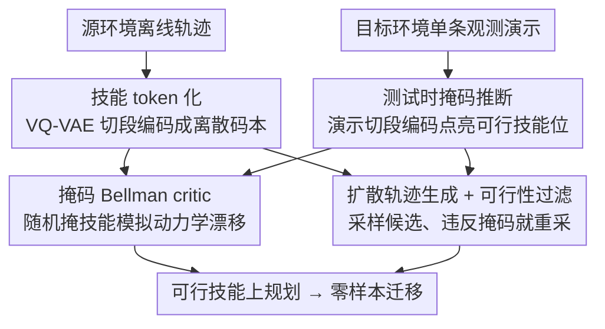

# Masked Skill Token Training for Hierarchical Off-Dynamics Transfer

**会议**: ICLR 2026  
**OpenReview**: [https://openreview.net/forum?id=K4ngUOra9m](https://openreview.net/forum?id=K4ngUOra9m)  
**代码**: 待确认  
**领域**: 强化学习 / 离线分层 RL / 跨动力学迁移  
**关键词**: off-dynamics 迁移, 离线分层 RL, 技能 token, 掩码 Bellman, 扩散策略

## 一句话总结
MSTT 把"环境结构变化导致某些技能不可执行"抽象成一张二值技能掩码，用 VQ-VAE 把轨迹切成离散技能 token、用随机掩码模拟动力学漂移训出一个"可行性感知"的 critic，再配合扩散轨迹生成器做可行性过滤，从而仅凭目标环境里**一条只有观测、没有动作标签**的演示，就能零样本迁移到结构被改变的新环境。

## 研究背景与动机
**领域现状**：强化学习训出来的策略往往在部署环境和训练环境不一致时崩掉，这就是 off-dynamics（动力学失配）问题。已有方法如 DARC、VGDF 走的是"学一个判别器/集成模型来纠正奖励或筛选可迁移转移"的路子；DARA 在纯离线设定下用分类器估计源域与目标域转移的对齐程度来改写源奖励。

**现有痛点**：这些方法几乎都要求目标环境里能拿到**带动作标签的轨迹**或者能**和目标环境交互**。但在导航、操作这类真实场景里，部署环境的变化往往是"结构性"的——某条走廊被堵了、多了个障碍物——它不要求 agent 学新技能，只是让一部分原本能用的行为失效了。为这种轻微的失效去重训或采集带动作标签的数据，代价过高。

**核心矛盾**：动力学漂移的本质（哪条路通、哪条堵）和 agent 能拿到的监督信号（只有一段视频/一串坐标的演示，没有动作）之间存在鸿沟。直接在原始状态-动作空间上建模这种漂移既昂贵又难泛化。

**本文目标**：在纯离线训练（只用源环境数据）+ 零样本部署的设定下，仅凭目标环境里一条 observation-only 演示，让 agent 适应结构性动力学变化。

**切入角度**：作者的关键观察是——结构性动力学漂移可以被抽象成"在一组时序扩展技能（temporally extended skills）上的约束"。某条路被堵 ≈ 某个高层技能变得不可执行。于是不必显式建模底层转移的变化，只需在**技能层**标记哪些技能还可行。

**核心 idea**：用一张二值"技能掩码"$m(z)\in\{0,1\}$ 编码目标环境的可行性约束，训练时**随机掩掉**部分技能来模拟各种动力学漂移，学出一个只在可行技能上传播价值的 critic；部署时从单条观测演示反推出这张掩码即可。

## 方法详解

### 整体框架
MSTT（Masked Skill Token Training）是一个全离线的分层 RL 框架，输入是源环境的离线轨迹数据集，输出是一个能在结构改变后的目标环境里零样本执行的分层策略。整条管线分两个阶段：**训练阶段**全部在源域离线完成——先把连续轨迹切段、用 VQ-VAE 编码成离散技能 token 形成一个紧凑的"技能码本"，再用随机采样的技能掩码模拟动力学漂移、通过掩码 Bellman 算子训出一个"可行性感知"的 critic，同时单独训一个扩散轨迹生成器；**部署阶段**只看目标环境里一条 observation-only 演示，把演示切段编码成技能 token、点亮对应掩码位（其余置 0），然后让扩散生成器采样候选子轨迹、用掩码做可行性过滤（不可行就重采），由 critic 在可行技能上规划，串成完整行为。

整个方法理论上的支撑点是：当技能是时序扩展、转移低熵（$p_{\min}\approx 1$）时，用掩码 Bellman 算子学到的价值函数能逼近真实阻塞动力学下的最优价值（定理 1），这保证了"在源域里靠掩码模拟漂移"是有效的。

### 关键设计

**1. 技能 token 化：把连续轨迹压成可复用的离散技能词表**

连续状态-动作空间没法像 Four-room 那样直接抽象成有限 MDP，于是 MSTT 借 VQ-VAE 从离线数据里**无监督**地学出离散的行为基元。给定一段长度为 $H$ 的子轨迹 $\tau_{1:H}=(s_1,\dots,s_H)$，编码器 $\phi_\theta$ 把它映成一个离散 token $z=\phi_\theta(\tau_{1:H})$，$z\in\mathcal{Z}=\{1,\dots,L\}$（$L$ 是码本大小）。每个 token 索引一簇相似的子轨迹，于是码本 $\mathcal{Z}$ 就成了对连续行为空间的离散抽象。训练目标是标准 VQ-VAE 损失：

$$L_{\text{skill-enc}}=\underbrace{\|\tau_{1:H}-\xi_\vartheta(z)\|^2}_{\text{重建}}+\underbrace{\|\text{sg}[\phi_\theta(\tau_{1:H})]-z\|^2}_{\text{码本}}+\beta\underbrace{\|\phi_\theta(\tau_{1:H})-\text{sg}[z]\|^2}_{\text{承诺}}$$

其中 $\xi_\vartheta$ 是解码器、$\text{sg}[\cdot]$ 是停梯度算子。值得注意的是：即便只用**纯观测**（无动作）的子轨迹来训，学到的码本依然能捕捉环境里有意义的空间和行为结构——这正是后续"只凭观测演示就能推断技能"的前提。作者还发现技能之间的转移是**稀疏且呈带状**的（图 6b 的转移矩阵），意味着许多掩码组合实际不会出现，这让后面的随机掩码训练能以很少的样本覆盖到有用的技能空间。

**2. 掩码 Bellman 算子：用随机掩技能在源域里"造"出动力学漂移**

这是全文的理论与机制核心，直击"目标环境拿不到、又要适应它"的痛点。作者先在离散的 Four-room 上把直觉讲清：结构变化（如 2 号房到 3 号房的门被锁）等价于在技能级 MDP 里把某些转移导向一个吸收的"汇状态" $s_\perp$，并用阻塞矩阵 $B$ 和可用性掩码 $m(s,a)\in\{0,1\}$ 描述哪些技能还能用。于是把标准 Bellman 备份改成**掩码 Bellman 算子**，只让价值沿可行转移传播：

$$(T^m Q)(s,a):=r(s)+\gamma\big\langle m(s,a)\,p(s,a),\,V^m_Q\big\rangle,\qquad V^m_Q(s):=\max_{a:\,m(s,a)=1}Q(s,a)$$

若某状态下没有任何可行技能，价值就退化为终止奖励 $r(s)$。定理 1 进一步证明：对任意带阻塞的目标 MDP，存在一张掩码使迭代 $Q_{k+1}=T^m Q_k$ 收敛到的策略价值满足 $\|V^{\pi_m}_{\mathcal{M}_B}-V^*_{\mathcal{M}_B}\|_\infty\le \alpha\gamma^K+\beta(1-p_{\min})$，即在低熵（$p_{\min}\approx 1$）的技能级转移下逼近误差极小（图 3 的实验也验证了这点）。这条性质的实践含义是关键：**既然在源域里给技能加掩码就等价于模拟了目标域的阻塞动力学，那 critic 完全可以离线训练**——训练时只需对每条轨迹**随机采一张技能掩码** $m\sim\{0,1\}^L$，用掩码版 Bellman 误差去更新（配合 target network、clipped double Q-learning、目标平滑等稳定技巧），就能学出一个泛化到各种掩码（即各种结构漂移）的可行性感知 critic。

**3. 扩散轨迹生成 + 可行性过滤：在掩码约束下零样本合成可执行行为**

光有 critic 还不够，得真正生成能在目标环境里跑的时序扩展行为。MSTT 训一个轨迹级扩散策略 $D_\psi$（在源数据上学），它能**以起始状态 $s$ 为条件**采样出合理的观测-动作子轨迹。这里的巧妙之处在于：**不把掩码灌进扩散模型本身**，而是用一个极简的"拒绝-重采"过滤（算法 2）——采一条 $\tau_{1:H}\sim D_\psi(\cdot\mid s)$，编码成 token $z=\phi_\theta(\tau_{1:H})$，若 $m(z)=0$（被掩掉/不可行）就丢弃重采，直到拿到一个可行技能。这样做的好处是扩散模型**无需为每个部署场景重训、也无需以掩码为条件**，掩码只在采样后做一道筛子，就实现了在新动力学下对高层行为的零样本组合。

**4. 测试时掩码推断：从单条观测演示反推可行技能集**

把前三块串成可用系统的最后一环。部署时 agent 只拿到目标环境里**一条只有观测的演示**（来自人类、视频、甚至 VLM 生成的坐标序列，且允许是非专家演示，只要它覆盖一条通往目标的路径即可）。推断过程很直接：先令所有技能 $m(z)=0$，再把演示切成所有子轨迹 $\tau_{1:H}$、用同一个编码器 $\phi_\theta$ 映成 token，**对每个出现过的 token 置 $m(z)=1$**，标记为可行。这张推断出的掩码喂给训好的 critic 做规划、喂给算法 2 做采样过滤。整套测试时流程不需要任何额外训练或微调，也不需要动作标签或与目标环境交互。

### 一个完整示例
以 Maze2D 的某个目标变体（图 4）为例：源迷宫里有三条从绿球到红球的长程路径，每条要数百步底层控制；测试时其中两条被堵，只剩一条可行。部署时 agent 收到一条沿着可行路径走的"只有坐标"的演示。MSTT 先把这条演示切段、用 VQ-VAE 编码，比如点亮了对应"沿可行走廊移动"的若干技能 token，其余技能保持 $m(z)=0$。规划时，扩散模型在当前状态采候选子轨迹，凡是编码后落在被堵走廊上的（$m(z)=0$）一律拒绝重采，最终只串起可行技能、成功导航到目标——Maze2D 三个变体平均成功率 94.33%，远高于所有 baseline。

### 损失函数 / 训练策略
技能编码器用上面的 $L_{\text{skill-enc}}$（重建 + 码本 + 承诺）训 VQ-VAE。critic 用掩码版 Bellman 误差（算法 1）训练：每步随机采轨迹段和技能掩码、按掩码 Bellman 算子（式 5，技能级版本 $Q^*(s,o,m)=R(o)+\gamma^H\max_{o':m(\phi_\theta(o'))=1}Q^*(s',o',m)$）算目标、用 clipped double Q-learning 求 Bellman loss，并周期性软更新 target 网络。扩散轨迹生成器单独在源数据上训练，部署时只做条件采样 + 拒绝过滤。

## 实验关键数据

### 主实验
在 Gymnasium-Robotics 的 Maze2D、FetchReach 和 Habitat ReplicaCAD 三个仿真环境上评测，测试时人为改变动力学（堵路 / 设禁区 / 像素导航）。MSTT 只用 state-only 演示，而 DARA、BCta 用了更强的动作标签信息，仍被 MSTT 全面超过。

| 环境 | 指标 | BC | Diffuser | DARA | MSTT (本文) |
|------|------|----|----------|------|-------------|
| Maze2D 平均 | Return ↑ | 2.87 | 33.12 | 54.87 | **140.35** |
| Maze2D 平均 | Goal ↑ | 11% | 29% | 78.66% | **94.33%** |
| FetchReach | Goal ↑ | 0% | 99% | 23% | 88% |
| FetchReach | Failure ↓ | 0% | 61% | 93% | **0%** |
| Habitat ReplicaCAD | Goal ↑ | — | 10% | — | **75%** |
| Habitat ReplicaCAD | Cost ↓ | — | 2.4 | — | **0.7** |

注：FetchReach 上 MSTT 的 Goal（88%）虽略低于在目标观测演示上微调过的 Diffuser†（50% goal 但 failure 66%），但 MSTT 的 failure 为 0%——它在"到达目标"与"避开禁区"之间做到了 baseline 没法兼顾的安全性。

### 消融 / 分析实验

| 配置 / 分析 | 关键发现 | 说明 |
|------|---------|------|
| 训练 mask vs 验证 mask 损失（图 6a） | 验证损失贴近训练损失 | critic 对**没在训练中采样过**的掩码也能泛化 |
| 技能转移矩阵（图 6b） | 呈稀疏带状结构 | 技能转移集中在少数模式，随机掩码即可充分覆盖 |
| VLM 推断演示（表 4） | Maze T1 Goal 94%、FetchReach Goal 93% | 用 VLM 生成坐标序列当演示，性能与人工演示相当 |

### 关键发现
- **随机掩码够用，靠的是技能空间本身稀疏**：码本虽大，但技能间转移是带状/稀疏的，许多掩码组合根本不会出现，所以训练时随机采掩码就能覆盖到真正有用的部分，critic 因此能泛化到验证集掩码。
- **掩码 Bellman 在低熵技能级转移下逼近最优**：图 3 显示 $p_{\min}\to 1$ 时估计价值与真实阻塞最优价值的 $\ell_\infty$ 差距趋近 0，从经验上印证定理 1——这正是"把技能设计成时序扩展（低熵转移）"的价值所在。
- **离线 RL baseline 无法适应**：Diffuser、BC 在动力学变化后基本失效；DARA 时好时坏，受限于缺乏分层抽象和受数据不平衡影响的域分类器。
- **可与 VLM 即插即用**：用 VLM 从视觉观测直接生成坐标演示，几乎不掉点，说明 MSTT 的"只需 observation-only 演示"接口能很自然地对接基础模型，进一步降低人工监督。

## 亮点与洞察
- **把"动力学漂移"重写成"技能可行性掩码"**：最让人"啊哈"的一步——结构性环境变化不在底层转移上建模，而是抽象成高层技能上的一张二值掩码。这把一个难处理的分布漂移问题变成了一个干净的"哪些技能还能用"的可行性问题。
- **掩码既是训练增强、又是部署接口**：训练时随机掩码 = 数据增强式地模拟无数种动力学漂移；部署时从演示推断掩码 = 零样本告诉 agent 新环境长什么样。同一个抽象贯穿训练与测试，设计上非常统一。
- **"采样后过滤"而非"条件生成"**：扩散模型不以掩码为条件、只在采样后做拒绝重采，使得生成器训一次就能应付任意部署掩码，不用为每个新环境重训——这个解耦 trick 可迁移到其他"生成器 + 硬约束"的场景（如带符号约束的轨迹生成）。
- **observation-only + 全离线的迁移设定本身有价值**：只要一条无动作标签的演示（甚至 VLM 生成）就能迁移，贴合"交互昂贵、动作难标注"的真实机器人/具身场景。

## 局限与展望
- **只处理结构性（离散）动力学变化**：作者明确说当前只管堵路/加障碍这类结构变化，不处理质量、摩擦、阻尼等连续参数漂移——后者需要在随机采样参数的轨迹上训练，留作未来工作。
- **失效语义偏保守**：执行不可行技能直接进吸收汇状态 $s_\perp$（视为终止/不可逆错误），这是个保守模型；"执行无效技能就停在原地"等更温和的语义没有探索。
- **掩码采样效率**：技能-掩码组合随码本指数增长，虽然稀疏转移让随机掩码够用，但作者也承认改进掩码采样策略以提效是后续方向。
- **单目标、固定 horizon**：技能是固定 $H$ 步的简化 option，且当前主要做单目标迁移；多目标条件（goal-conditioned critic）是展望方向。
- **理论保证依赖低熵假设**：定理 1 的逼近误差里有 $\beta(1-p_{\min})$ 项，转移熵高（$p_{\min}$ 小）时保证会变松。

## 相关工作与启发
- **vs DARC / DARA / VGDF（off-dynamics RL）**：它们靠判别器/分类器纠正奖励或筛选可迁移转移，且 DARA/DARC 需要动作标签或目标交互；MSTT 完全离线、只用 observation-only 演示，并把漂移建模在技能层而非底层转移上。
- **vs 标准分层 RL（OPAL / QueST / 深度技能链）**：这些方法学离散技能码本但**默认技能在部署时仍然可用**；MSTT 的核心区别就是显式建模并适应"技能可行性会变"，掩码机制让策略能在"部分技能不可用"下推理。
- **vs 扩散规划（Diffuser / Decision Diffuser / Diffusion Policy）**：它们在静态动力学下做轨迹去噪规划，不处理环境结构变化引入的可行性约束；MSTT 用掩码过滤扩散采样，使生成在动力学约束下进行。与作者自己的 LTLDoG / DOPPLER（满足符号时序逻辑约束）一脉相承，但这里的约束来自"动力学可行性掩码"而非预设逻辑公式。

## 评分
- 新颖性: ⭐⭐⭐⭐⭐ 首个用"掩码技能"模拟并泛化 off-dynamics 漂移、且只需 observation-only 演示 + 全离线训练的框架，抽象角度很新
- 实验充分度: ⭐⭐⭐⭐ 覆盖离散/连续/像素三类环境与多个 baseline，并有定理验证和 VLM 案例，但环境规模偏仿真、连续参数漂移未测
- 写作质量: ⭐⭐⭐⭐ 从离散直觉到连续实现层层推进、理论与实现衔接清晰
- 价值: ⭐⭐⭐⭐ 对"交互/标注昂贵的真实迁移"很有吸引力，掩码-技能抽象和"生成+过滤"解耦可复用

<!-- RELATED:START -->

## 相关论文

- [\[ICLR 2026\] MOBODY: Model-Based Off-Dynamics Offline Reinforcement Learning](mobody_model-based_off-dynamics_offline_reinforcement_learning.md)
- [\[ICLR 2026\] Breaking Barriers: Do Reinforcement Post Training Gains Transfer To Unseen Domains?](breaking_barriers_do_reinforcement_post_training_gains_transfer_to_unseen_domain.md)
- [\[ICLR 2026\] Self-Improving Skill Learning for Robust Skill-based Meta-Reinforcement Learning](self-improving_skill_learning_for_robust_skill-based_meta-reinforcement_learning.md)
- [\[ICLR 2026\] Spotlight on Token Perception for Multimodal Reinforcement Learning](spotlight_on_token_perception_for_multimodal_reinforcement_learning.md)
- [\[ICLR 2026\] Reference Grounded Skill Discovery](reference_grounded_skill_discovery.md)

<!-- RELATED:END -->
