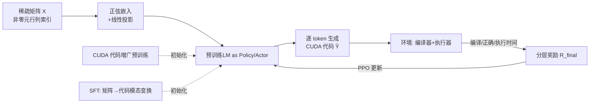

# Mastering Sparse CUDA Generation through Pretrained Models and Deep Reinforcement Learning

**会议**: ICLR 2026  
**OpenReview**: [https://openreview.net/forum?id=VdLEaGPYWT](https://openreview.net/forum?id=VdLEaGPYWT)  
**代码**: [https://github.com/QiWu-NCIC/SparseRL](https://github.com/QiWu-NCIC/SparseRL)  
**领域**: 强化学习 / 高性能代码生成  
**关键词**: 稀疏 CUDA 代码生成, SpMV, 深度强化学习, PPO, 分层奖励, 稀疏矩阵嵌入  

## 一句话总结
SparseRL 把预训练代码大模型当作随机策略、把编译器+执行器当作环境，用 PPO + 分层奖励（编译/正确/执行效率）端到端学习为每个动态输入稀疏矩阵生成高性能 SpMV/SpMM CUDA 代码，编译率提升约 20%、生成代码平均快 30%。

## 研究背景与动机
**领域现状**：代码生成已能做补全、翻译、程序合成，但绝大多数工作只追求"功能正确"，几乎不关心"跑得快不快"。在剪枝 LLM 推理、GNN 计算这类低延迟场景里，SpMV（稀疏矩阵×稠密向量）是核心算子，而它的最优实现与输入矩阵的非零分布强相关——没有一种通杀的写法。

**现有痛点**：作者点出三条具体短板。① 训练目标错位：传统监督式 next-token 预测最大化 ground-truth 似然，但同一个 SpMV 有多份功能正确的代码，只有少数能跑到最优性能，token 级匹配无法区分快慢。② 忽略执行效率奖励：现有方法在优化和生成时完全不看代码实际跑了多久，与"生成高性能代码"的终极目标脱节。③ 模态鸿沟：性能由输入稀疏数据决定，需要为每个矩阵定制程序，但 LLM 难以把"稀疏矩阵结构"这种非文本模态喂进去并转化为有用的生成信号。

**核心矛盾**：高性能 HPC 代码既要语法/功能正确（能编译、结果对），又要针对具体硬件和具体稀疏结构做定制优化，而这两点都是不可微的运行时指标，监督学习根本碰不到。

**本文目标**：让模型对每个动态输入稀疏矩阵 $X$ 生成代码 $\hat{Y}$，同时满足 $\text{Compile}(\hat{Y})=\text{True}$、$\text{Correct}(\hat{Y},X)=\text{True}$、且执行时间 $E(\hat{Y}|X)\le E(Y_i|X)$ 优于所有已知正确实现。

**核心 idea**：**把代码生成建模为序列决策的 MDP，用 DRL 从编译器/执行器的非可微反馈中学习**——预训练 LLM 是策略（actor），编译器+执行器是环境，生成每个 token 是一个 action，正确性与执行时间共同构成奖励。

## 方法详解

### 整体框架
SparseRL 是一条"预训练 → SFT → RL"三阶段流水线。预训练阶段用大量 CUDA 代码增广，让模型掌握并行计算/显存管理的领域范式；SFT 阶段做关键的**模态变换**——输入从自然语言 prompt 换成稀疏矩阵的非零元行列索引（经正弦嵌入），输出 SpMV CUDA 代码；RL 阶段把 SFT 模型同时初始化为 actor 和 critic，用 PPO 在编译器+执行器环境里以分层奖励优化，让模型学会区分"正确但慢"和"正确且快"的代码。

### 关键设计

**1. 把预训练 LLM 当随机策略的 MDP 建模：让模型直接对齐编译器/执行器。** 代码生成被形式化为有限步 MDP：状态 $s_t=(\hat{y}_{1:t-1}, X)$ 由稀疏矩阵和已生成的部分代码构成，动作 $a_t=\hat{y}_t$ 是词表 $V$ 上的下一个 token，策略 $\pi_\theta(a_t|s_t)$ 用 SFT 模型初始化并以 top-k 采样得到整段代码。算法选 PPO，actor/critic 都从同一个微调模型出发。这一步的意义在于：执行时间、编译是否通过这些**不可微指标**第一次被纳入优化目标，模型不再只学"像不像 ground-truth"，而是学"在真实 GPU 上跑得对不对、快不快"。

**2. 稀疏矩阵正弦嵌入：把矩阵结构当成新模态喂进语言模型。** SFT/RL 阶段彻底去掉语言 prompt，只把非零元的行列索引 $X=\{(r_i,c_i)\}_{i=1}^N$ 作为输入。每个索引用 Transformer 式正弦编码归一化：$PE_{(ind,2j)}=\sin(ind/10000^{2j/d_{model}})$、$PE_{(ind,2j+1)}=\cos(ind/10000^{2j/d_{model}})$，对行索引得 $e_{r_i}$、列索引得 $e_{c_i}$，拼成 $e_i=[e_{r_i}|e_{c_i}]$，再过一层线性层映射到语言模态维度。这样模型能从非零元分布里直接读出稀疏结构，为不同矩阵生成定制代码。消融显示正弦嵌入（pass@1000 48.75 / CR 56.50）显著优于 Raw（40.75 / 49.50）和 Max-Min 归一化（43.25 / 51.75）——直接喂原始数值最差，正弦编码把离散索引平滑成模型友好的连续信号是关键。

**3. 分层奖励：把"能编译→功能对→跑得快"拆成有层级、有门控的信号。** 总奖励 $R_{final}(\hat{Y},X)=R_{correctness}+R_{efficiency}-r_{penalty}\cdot I_{memory}$。正确性奖励本身分层：编译成功 +0.5、失败 −0.5；只有编译通过才计算测试奖励（通过 +0.5、否则 −0.5），即 $R_{correctness}=R_{compile}+I_{compile}\cdot R_{test}$。效率奖励只在代码既能编译又功能正确时激活，按相对 cuSPARSE 基线的加速比给分：$R_{efficiency}=r_{eff}\times\big(\frac{t_{base}(X)}{t(\hat{Y},X)}-1\big)\cdot I_{test}$，其中执行时间取 1000 次迭代均值以抑制波动；显存超限再扣 $r_{penalty}$。这套"门控+分层"结构保证模型先学会写出能跑的代码，再在正确的前提下卷性能，避免为追速度生成根本编不过的垃圾。

**4. 解码期动态语法早停：边生成边查、错了就停。** 在自回归解码过程中集成动态语法正确性校验，并用类似 QwenLM 仓库的代码抽取工具，对明显出错的代码提前终止生成，省掉无谓的 rollout 与编译开销。

## 实验关键数据

### 主实验表格（pass@k 与编译率 CR，k=1000，400 测试矩阵）

| 模型 | 规模 | SpMV pass@1 | SpMV pass@1000 | SpMV CR |
|------|------|------|------|------|
| Qwen3 | 8B | 8.00 | – | – |
| DeepSeek-R1 | 671B | 15.00 | – | – |
| CodeT5 | 770M | 4.75 | 30.25 | 38.00 |
| CodeRL+CodeT5 | 770M | 5.25 | 36.50 | 39.50 |
| PPOCoder+CodeT5 | 770M | 5.75 | 35.50 | 40.75 |
| GPT-5 | - | 27.00 | - | - |
| Claude-sonnet-4 | - | 28.25 | - | - |
| **SparseRL+CodeT5** | 770M | 9.25 | 48.75 | 56.50 |
| **SparseRL+Qwen2.5** | 14B | 10.25 | **49.25** | **57.50** |

- 用 770M 的 CodeT5 即把 pass@1000 从 CodeRL 的 36.50 拉到 48.75、CR 从 39.50 拉到 56.50，超过 671B 的 DeepSeek-R1（仅看 pass@1/5）。
- 性能（GFLOPS）上，SparseRL（Qwen2.5-14B）平均比 CodeRL/PPOCoder 快 3.27×/3.42×（V100），更关键的是比 NVIDIA 官方库 cuSPARSE 快 1.42×、比 TVM-S 快 1.82×。
- SpMM 扩展：A100 上比 cuSPARSE 在 8/32 列分别快 6.39×/4.38×，验证方法可迁移。

### 消融实验表格（三阶段，SpMV，pass@1000 / CR / GFLOPS）

| 配置 | pass@1000 | CR | 平均执行速度 GFLOPS |
|------|------|------|------|
| 有预训练 · 仅 SFT | 32.75 | 41.25 | 89.25 |
| 有预训练 · 仅 PPO | 15.25 | 22.50 | 50.36 |
| **有预训练 · SFT+PPO** | **49.25** | **57.50** | **116.20** |
| 无预训练 · 仅 SFT | 12.00 | 13.25 | 30.83 |
| 无预训练 · SFT+PPO | 40.75 | 53.50 | 95.22 |

### 关键发现
- **三阶段缺一不可**：CUDA 增广预训练给模型并行/显存知识，去掉后 SFT+PPO 从 49.25 跌到 40.75；只做 PPO 不做 SFT（缺模态变换）几乎学不到正确代码（pass@1000 仅 15.25）。
- **RL 阶段真正贡献性能**：在 SFT 基础上加 PPO，pass@1000 32.75→49.25、GFLOPS 89.25→116.20，说明效率奖励确实把模型推向"更快"而非只是"更对"。
- **嵌入方式决定模态接入质量**：正弦嵌入 > Max-Min > Raw，离散索引必须平滑成连续信号模型才用得起来。
- 闭源大模型（GPT-5/Claude-sonnet-4）在 pass@1 上更准，但 SparseRL 在编译率和实际执行性能（vs cuSPARSE）这两个真正决定可用性的指标上占优。

## 亮点与洞察
- **问题选得刁钻而真实**：把"代码生成"从"功能正确"推进到"硬件高性能 + 输入自适应"，直接对标 cuSPARSE 这种工业级手写库并实测更快，远比刷 HumanEval 有说服力。
- **稀疏矩阵作为输入模态**是巧思：去掉语言 prompt、只喂非零元索引正弦嵌入，类比 AlphaFold 用非视觉非文本模态，干净地解决了"性能由输入数据决定"的定制化需求。
- **分层 + 门控奖励**设计务实：用 $I_{compile}$、$I_{test}$ 把奖励严格分层，避免模型钻"写很快但编不过"的空子，是把不可微 HPC 指标接进 RL 的工程关键。
- 小模型（770M CodeT5）经此训练即超大模型，说明领域对齐 + RL 反馈比单纯堆参数更高效。

## 局限与展望
- **任务范围窄**：核心只验证 SpMV，SpMM 作为扩展，是否能推广到卷积、attention 等更复杂的 HPC kernel 仍待证。
- **训练成本高**：2 机 × 8 张 V100/A100 跑 5 天，编译+执行 1000 次迭代测时的奖励计算开销大，难以快速迭代。
- **绝对正确率仍低**：最佳 pass@1 仅约 10（开源 LLM 配置下），pass@1000 也不足 50%，离"直接拿来用"还有距离，依赖大量采样。
- **硬件/库依赖强**：奖励以特定 GPU + cuSPARSE 基线为锚，换架构或换基线后泛化性、稳定性需重新评估。

## 相关工作与启发
- **代码预训练模型**：CodeBERT、AlphaCode、CodeT5、StarCoder 奠定 NL→code 能力，但只管正确不管性能，SparseRL 在其上叠 RL。
- **RL for 序列生成**：从 REINFORCE 优化 BLEU/ROUGE，到 InstructGPT 的 RLHF，再到 CodeRL/PPOCoder 用 RL 提升代码质量——SparseRL 把奖励信号从"人类偏好/功能测试"换成"编译+执行时间"，把 RL 推向高性能计算。
- **SpMV 手工优化史**：CSR→CSR5→DASP、CSR-Adaptive/ACSR/Merge-based 等几十年人工经验，SparseRL 试图用学习方法自动产出针对每个矩阵的定制实现，是"自动 kernel 优化"方向的新尝试。
- **启发**：把"编译器/执行器/profiler"当作可查询的环境、把不可微的系统指标做成分层奖励，这套范式可迁移到任意"生成代码并追求运行时性能"的场景（kernel 调优、编译 pass 选择、算子融合）。

## 评分
- **新颖性**: ⭐⭐⭐⭐ 把稀疏矩阵当模态喂入 + 执行效率分层奖励驱动 RL 生成高性能 CUDA，问题设定和方法组合都新颖，实测超 cuSPARSE 含金量足。
- **实验充分度**: ⭐⭐⭐⭐ 覆盖 SpMV/SpMM、多 backbone、对比闭源大模型与工业库、三组消融（阶段/嵌入/奖励），SuiteSparse+DLMC 双数据集，较扎实；绝对正确率偏低略减分。
- **写作质量**: ⭐⭐⭐⭐ 动机三条痛点—方法三模块—实验一一对应，公式与图清晰；大量细节挪进附录，主文略依赖附录支撑。
- **价值**: ⭐⭐⭐⭐ 自动生成跑赢官方库的稀疏 kernel 对 LLM 推理/GNN 等低延迟场景有直接工程意义，范式也可外推到更广的性能导向代码生成。

<!-- RELATED:START -->

## 相关论文

- [\[ICLR 2026\] CUDA-L1: Improving CUDA Optimization via Contrastive Reinforcement Learning](cuda-l1_improving_cuda_optimization_via_contrastive_reinforcement_learning.md)
- [\[ICLR 2026\] LongWriter-Zero: Mastering Ultra-Long Text Generation via Reinforcement Learning](longwriter-zero_mastering_ultra-long_text_generation_via_reinforcement_learning.md)
- [\[ICLR 2026\] Deep SPI: Safe Policy Improvement via World Models](deep_spi_safe_policy_improvement_via_world_models.md)
- [\[ICLR 2026\] Understanding and Improving Hyperbolic Deep Reinforcement Learning](understanding_and_improving_hyperbolic_deep_reinforcement_learning.md)
- [\[ICLR 2026\] Critique-RL: Training Language Models for Critiquing Through Two-Stage Reinforcement Learning](critique-rl_training_language_models_for_critiquing_through_two-stage_reinforcem.md)

<!-- RELATED:END -->
