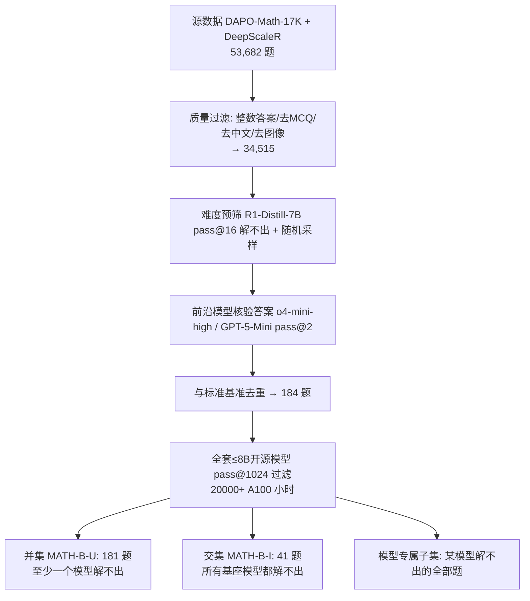

# MATH-Beyond: A Benchmark for RL to Expand Beyond the Base Model

**会议**: ICLR 2026  
**OpenReview**: [https://openreview.net/forum?id=RNkErKpCAp](https://openreview.net/forum?id=RNkErKpCAp)  
**代码 / 数据**: [https://huggingface.co/datasets/brendel-group/MATH-Beyond](https://huggingface.co/datasets/brendel-group/MATH-Beyond)  
**领域**: 强化学习 / LLM 数学推理 / 评测基准  
**关键词**: RL for Reasoning, Exploration, pass@k, Expansion Rate, Benchmark, Math Reasoning  

## 一句话总结
作者指出现在流行的数学推理 RL 基准（MATH-500、AIME24）在 pass@1024 下早被开源基座模型几乎全解，导致 RL 微调只是在"磨锐"已有解法而非"发现"新能力；为此他们构造了 MATH-Beyond——一套刻意让 ≤8B 开源模型在 1024 次采样下仍解不出的高中竞赛题集，把评测目标从"提高 pass@k"转向"扩张基座模型的推理边界"。

## 研究背景与动机
- **领域现状**：DeepSeek-R1 之后涌现一大批宣称"解锁数学推理"的 RL 方法，社区普遍用 MATH-500、AIME24 等基准的 pass@1 / pass@k 来衡量进步。
- **现有痛点**：Yue et al. (2025) 等工作发现，许多开源基座模型在 pass@1024 budget 下已经能解出这些热门基准上几乎**全部**题目。这意味着 RL 模型成功的题目，其基座模型在合理采样预算下本来就能解出——**基准已饱和**，无法度量"基座解不了、RL 后能解"的真实进步。
- **核心矛盾**：2010 年代深度 RL（Atari、AlphaGo/AlphaZero）的魅力在于从随机策略**探索出全新技能**；而当下 LLM 推理 RL 却退化成对已有解法模式的"锐化"（sharpening），与 RL "探索 + 习得新技能"的承诺背道而驰。pass@k 把"巩固已有解法"（Consolidation）和"发现全新解法"（Expansion）混为一谈。
- **本文目标**：提供一个"诊断工具"，让评测只对**真正扩张推理边界**的方法亮绿灯。
- **核心 idea**：**构造"零基线"基准（zero-baseline）**——刻意筛选出基座模型 pass@1024 ≈ 0 的题目。在这种集合上，基座可解集为空，于是 post-trained 模型每解出一题**按定义就是一次 Expansion**，pass@1024 直接等于 Expansion Rate，给出无歧义的"边界扩张"读数。

## 方法详解

### 整体框架
工作分两部分：(1) 一个**度量框架**，把 post-trained 策略 π 相对基座 q 的能力变化分解为 Expansion / Shrinkage / Preservation / Consolidation 四个量，并论证在零基线基准上该分解坍缩为单一的 Expansion Rate；(2) 一条**多阶段过滤流水线**，从 53,682 道候选题里筛出既正确无歧义、又新颖、又被一整套开源模型在 pass@1024 下集体解不出的题，最终形成 181 题并集与 41 题交集两个核心子集。

### 关键设计

**1. 边界扩张的度量框架：把 pass@k 拆成"巩固"与"扩张"。** 作者借用 Wu et al. (2025) 的术语并简化为经验版。对策略 $p$ 在题 $x$ 上抽 $k$ 个样本，只要有一个落入正确完成集 $C(x)$ 就记 pass@k $=1$，对全集取均值得 $\text{pass@k}(p)=\frac{1}{|D|}\sum_x \text{pass@k}(p;x)$。定义可达集 $R_k(p,D)=\{x: \text{pass@k}(p;x)=1\}$ 后，把 π 相对 q 的差异拆为：**Expansion**（π 解出而 q 解不出，$E_k=R_k(\pi)\setminus R_k(q)$，是唯一上报的主指标）、**Shrinkage**（q 能解 π 反而失手，即遗忘）、**Preservation**（π 保住 q 的能力）、**Consolidation**（保住的解是否变得 pass@1 就稳）。π 的总 pass 率分解为 $(|E_k|+|P_k|)/|D|$——这把"看似涨了 pass@k 其实只是重新分配"和"真扩张了边界"区分开。

**2. 零基线设计让度量坍缩成单一干净读数。** MATH-B 刻意构造成基座可达集为空 $R_k(q,D)=\varnothing$。代入框架后 Shrinkage、Preservation 全部归零，$E_k=R_k(\pi,D)$，于是 $\text{Expansion Rate}=\frac{|R_k(\pi,D)|}{|D|}=\text{pass@k}(\pi)$。换句话说，在这套题上 π 解出的任何一题都**保证**是基座做不到的全新能力，pass@1024 直接就是 Expansion Rate——避免了在饱和基准上"涨分到底是巩固还是扩张"的纠缠，给 RL 探索研究一个无歧义的成功信号。

**3. 多阶段筛题流水线：可验证、新颖、对模型真难。** 源头选 DAPO-Math-17K（R1 之后发布、难度高、无开源验证）和 DeepScaleR（源自 AIME/AMC 竞赛、规模大），而非 DeepMath103K / Big-Math（被设计成可解）或 NuminaMath（污染风险）。质量过滤只留整数答案题、剔除选择题/含中文/引用外部图像的题；再用 R1-Distill-7B 在 pass@16 做难度预筛、随机采样压缩规模；关键一步是用前沿模型 o4-mini-high 与 GPT-5-Mini 做 **pass@2 答案核验**，确保题目"难"是因为本质困难而非 ground truth 标错；最后与 MATH-500 / AIME24/25 等做精确串匹配去重保证新颖性。

**4. 直面 RLVR 验证陷阱：难是真难，不是判错。** 作者在 R1-Distill 的推理轨迹上归纳出 7 种规则验证失败模式：F1 多个有效答案只读首/末个 boxed、F2 抓到中间值当最终值、F3 后面错答覆盖前面对答、F4 自我纠正后旧值仍被采纳、F5 无序元组顺序敏感、F6 缺 "Answer:" 锚点、F7 选择题只接受 "C)1000" 全文而拒绝 "C"。流水线中通过"只留整数答案、去选择题"等确定性过滤前置规避这些坑，并用更稳健的验证逻辑在 pass@1024 阶段判分，确保"模型解不出"反映的是真实推理失败而非格式/解析错误。

## 实验关键数据

### 主实验：post-trained 模型在 MATH-B 上的 Expansion Rate（pass@1024）

| 基座 | Post-trained | 方法 | 基座未解题数 | Expansion Rate (%) | AIME24 (pass@1) |
|------|------|------|------|------|------|
| r1-1.5b | Nemotron-Reasoning-Qwen v1 | RL | 115 | 7.83 | 48.13 |
| r1-1.5b | Nemotron-Reasoning-Qwen v2 | RL | 115 | 9.57 | 49.58 |
| r1-1.5b | DeepScaleR-1.5B | RL | 115 | 5.22 | 40.21 |
| r1-7b | Skywork-OR1-7B | RL | 99 | **21.2** | 70.2 |
| Qwen3-4B-base | Qwen3-4B | Long CoT 蒸馏 | 112 | **58.93** | 73.3 |
| Qwen3-8B-base | Qwen3-8B | Long CoT 蒸馏 | 116 | **66.38** | 76.0 |

### 关键发现
- **RL 方法扩张能力有限**：基于 r1-1.5b 的三个 RL 模型 Expansion Rate 均 < 10%；即便加大 RL 算力（Nemotron v1→v2）也只换来 1.5% 的微弱提升，说明现有探索机制低效。
- **鼓励探索的 RL 更有前景**：Skywork-OR1-7B 达到 21.2%，作者归因于其训练用了自适应熵控制 + 更高温度，给探索留了更大空间——暗示"显式鼓励探索"的 RL 可能是出路。
- **蒸馏 vs RL 的强对比**：Qwen3-4B/8B 通过长 CoT 蒸馏拿到 58.93% / 66.38% 的高扩张率。这说明**基座并非学不会**，瓶颈在于 RL 的探索过程自己找不到这些有效推理路径；蒸馏靠教师模型直接喂对了推理步骤的分布。
- **人难度 ≠ 模型难度**：MATH-B-U 题目中位人类难度仅 4/10，交集集最高也只有 6.5/10——人类不觉得特别难的题，当前模型却会稳定解不出，揭示模型失败模式与人类直觉的脱节。
- **k=1024 的取舍**：pass@k 随预算 log-linear 增长但边际收益递减，RL 模型的 Expansion Rate 在接近 1024 时基本 plateau，故 1024 是"够难 + 稳定 + 可计算"的折中点。

## 亮点与洞察
- **重新定义"进步"**：把社区的注意力从"在饱和基准上刷 pass@k"扭转到"可证明地扩张推理边界"，这是一个概念层面的纠偏，价值超过单纯出一个新数据集。
- **零基线 + Expansion Rate 的优雅**：一个简单的构造（让基座 pass 率为 0）就让复杂的四元分解坍缩成单一干净指标，方法论上很讨巧。
- **拓扑等价的难**：题目全是标准高中数学（topically indistinguishable），难度不来自冷僻领域而来自模型推理的脆弱性，反衬出当前 RL 的真实短板。
- **诚实的对比**：用蒸馏作为"上界证据"诚实指出 RL 的瓶颈是探索而非容量，而非简单宣称 RL 无用。
- **副产品有用**：对 7 种 RLVR 验证失败模式的系统梳理，对整个社区的训练/评测 pipeline 都有警示价值。

## 局限与展望
- **规模小**：交集集仅 41 题、并集 181 题，统计噪声较大；作者把"小"辩护为"高效评测"，但单题权重过高仍是风险。
- **只覆盖 ≤8B 开源模型**：更大开源模型上哪些题仍是零基线未做评测（受 20000+ A100 小时算力所限），可迁移性靠"题目按基座定制而非追逐模型怪癖"来论证，尚需验证。
- **是诊断工具而非解法**：本文只给出"度量边界扩张"的基准，并未提出能在其上取胜的探索式 RL 方法——真正的难题留给后人。
- **依赖前沿模型核验答案**：用 o4-mini-high / GPT-5-Mini 核验 ground truth，若这些模型本身判错会引入噪声。
- **展望**：催化"无教师"的探索式 RL（如自适应熵、内在奖励、count-based / Go-Explore 思路在 LLM 上的复活），让 RL 不靠蒸馏也能发现新推理路径。

## 相关工作与启发
- **建立在 Wu et al. (2025)**：本文把后者的 Expansion 概念从特定 setting 实例化成一个可复用的零基线基准，并扩展到大量开源模型，是"概念→可操作工具"的落地。
- **承接 Yue et al. (2025)**：后者揭示现有基准在大 k 下饱和，本文据此构造"反饱和"基准。
- **致敬经典 RL 探索**：Atari（Mnih 2013）、count-based exploration（Bellemare 2016）、Go-Explore（Ecoffet 2021）、AlphaGo/Zero（Silver 2016/2017）作为"真正发现新技能"的标杆，反衬 LLM RL 的退化。
- **方法论借鉴 Omni-MATH (Gao 2024)**：用 GPT-5 + 对比式提示给题目标注领域与难度。
- **启发**：(1) 评测基准要为"想度量的能力"专门构造，而非沿用现成集合；(2) 衡量 RL 时务必把"巩固"与"扩张"分开，pass@k 单一数字会骗人；(3) 蒸馏能上界提示"探索"才是 RL 的真瓶颈，后续可借鉴熵/温度/内在奖励等显式探索机制。

## 评分
- **新颖性**: ⭐⭐⭐⭐ 把"基准饱和"问题转化为"零基线 + Expansion Rate"的评测范式，概念纠偏清晰、构造巧妙；扣分在于度量框架主要借自 Wu et al. (2025)。
- **实验充分度**: ⭐⭐⭐⭐ 20000+ A100 小时、覆盖 base/supplementary 两组共 20+ 模型、RL 与蒸馏对比有说服力；但最终题集偏小、未覆盖更大模型。
- **写作质量**: ⭐⭐⭐⭐ 动机—框架—构造—实验逻辑顺畅，验证陷阱表格与公式分解都讲得清楚。
- **价值**: ⭐⭐⭐⭐⭐ 直击社区"RL 只是锐化不是探索"的盲区，提供了一个无歧义的诊断信号，可能实质性地引导探索式 RL 研究方向。

<!-- RELATED:START -->

## 相关论文

- [\[ICLR 2026\] Rubrics as Rewards: Reinforcement Learning Beyond Verifiable Domains](rubrics_as_rewards_reinforcement_learning_beyond_verifiable_domains.md)
- [\[ICLR 2026\] Beyond Pass@1: Self-Play with Variational Problem Synthesis Sustains RLVR](beyond_pass_1_self-play_with_variational_problem_synthesis_sustains_rlvr.md)
- [\[ICLR 2026\] Beyond Distributions: Geometric Action Control for Continuous Reinforcement Learning](beyond_distributions_geometric_action_control_for_continuous_reinforcement_learn.md)
- [\[ICLR 2026\] Virne: A Comprehensive Benchmark for RL-based Network Resource Allocation in NFV](virne_a_comprehensive_benchmark_for_rl-based_network_resource_allocation_in_nfv.md)
- [\[ICLR 2026\] Beyond Softmax and Entropy: Convergence Rates of Policy Gradients with $f$-SoftArgmax Parameterization & Coupled Regularization](beyond_softmax_and_entropy_convergence_rates_of_policy_gradients_with_boldsymbol.md)

<!-- RELATED:END -->
