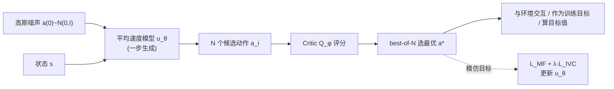

# Mean Flow Policy with Instantaneous Velocity Constraint for One-step Action Generation

**会议**: ICLR 2026  
**OpenReview**: [https://openreview.net/forum?id=mIeKe74W43](https://openreview.net/forum?id=mIeKe74W43)  
**代码**: 待确认  
**领域**: reinforcement learning  
**关键词**: 生成式策略, Flow Matching, Mean Flow, 一步动作生成, Offline-to-Online RL, 机器人操作  

## 一句话总结
把"平均速度场"引入 RL 策略，用一步采样就能从高斯噪声直接生成多模态最优动作，再用一个瞬时速度约束（IVC）补上缺失的边界条件保证学习精度，从而在保留 flow 策略表达力的同时把训练/推理速度拉满。

## 研究背景与动机
**领域现状**：在强化学习里，面对多模态动作分布的复杂控制任务，扩散模型和 flow matching 这类生成式策略已经成为高斯/混合策略的强力替代，能把简单基分布变换成灵活的动作分布。

**现有痛点**：现有生成式策略都依赖"从噪声到动作"的多步迭代细化。这个迭代过程在 online RL 里每一步都要采样动作，训练开销巨大；推理时的高延迟也成了实时闭环控制的主要瓶颈。表达力和计算开销之间存在一个由"flow 步数"控制的硬权衡——步数多则表达力强但慢，步数少则快但解不准。

**核心矛盾**：能不能把生成式策略的表达力和一步动作生成的高效率统一起来？直接把 flow 砍成一步会让动作质量崩盘（论文实验里 FQL/BFN/QC 的一步变体在难任务上成功率几乎归零）。

**本文目标**：设计一个真正"一步生成"且表达力不打折的生成式 RL 策略。

**核心 idea**：**[建模平均速度而非瞬时速度]** 不再学瞬时速度场 $v$（需要沿轨迹积分、多步求解），而是直接学任意时间区间 $[t,r]$ 上的**平均速度场** $u$，使得 $a(1)=a(0)+u^*(a(0),0,1,s)$ 一步到位；**[用瞬时速度约束补边界条件]** 平均速度的训练由一个一阶 ODE 支配，但该 ODE 缺边界条件、解不唯一，论文引入 IVC 显式钉死边界，从理论上保证唯一正确解。

## 方法详解

### 整体框架
方法叫 **Mean Velocity Policy (MVP)**，挂在 offline-to-online RL 框架下：策略侧用平均速度模型 $u_\theta$ 把高斯噪声一步映射成候选动作，再用 Q 函数做 best-of-N 选择得到最终动作；这个"生成+选择"被当作统一策略 $\pi_\theta$。训练上策略损失是平均流损失 $\mathcal{L}_{MF}$ 加瞬时速度约束 $\mathcal{L}_{IVC}$，critic 用标准 TD 误差训练，先离线预训练再在线微调。

### 关键设计

**1. 平均速度策略 (MVP)：把积分塌缩成一步映射。** 标准 flow 策略要算 $a(1)=a(0)+\int_0^1 v(a(\tau),\tau,s)\,d\tau$，这条积分在实践中路径会弯曲，只能靠 Euler 法多步离散逼近。MVP 改为直接建模区间平均速度 $u(a(t),t,r,s)\triangleq \frac{1}{r-t}\int_t^r v\,d\tau$，一旦学好，推理就退化成单步加法 $a(1)=a(0)+u^*(a(0),0,1,s)$，彻底干掉迭代采样。训练时把定义式两边乘 $(r-t)$ 对 $t$ 求导得到 **mean flow 恒等式** $-u+(r-t)\frac{d}{dt}u=-v$，据此构造模仿损失 $\mathcal{L}_{MF}=\mathbb{E}\,\|u_\theta-\mathrm{sg}[v-(t-r)\frac{d}{dt}u_\theta]\|_2^2$，其中全导数项 $\frac{d}{dt}u_\theta$ 用自动微分的 JVP 高效算出，stop-gradient 稳定训练。

**2. 生成-选择机制：在没有最优动作标签时自举出模仿目标。** RL 里没有现成的最优动作数据集可模仿，论文用 Q 函数渐进地"造"出越来越好的模仿目标：每个状态先一步生成 $N$ 个多样候选 $a_i=\epsilon_i+u_\theta(\epsilon_i,0,1,s)$，再用 critic 选出 Q 值最高的 $a^\star=\arg\max_{a_i}Q_\phi(s,a_i)$。这个 $a^\star$ 一身三职：与环境交互、当策略训练的模仿目标、算 critic 的目标值。论文用 **Theorem 1** 证明这种基于模仿的更新能保证策略提升——性能差被下界分解成"best-of-N 优势增益 $\Delta_1$"（严格非负，来自采样 $N$ 个多样候选的收益）减去"拟合误差项 $\Delta_2$"（来自 critic 误差 $\epsilon_Q$ 和平均流匹配误差 $\epsilon_A$），这恰好点明了压低 $\epsilon_A$ 的重要性。

**3. 瞬时速度约束 (IVC)：把不适定的 ODE 钉成唯一解。** mean flow 恒等式只是一阶 ODE 的"动力学"部分，缺边界条件。靠"采到 $r$ 极接近 $t$ 的样本对"来隐式提供边界太稀有、不可靠。论文证明（**Theorem 2**）：只满足 $\mathcal{L}_{MF}$ 的解存在一族未知常数 $C(a,r)$ 造成的累积误差 $\Delta u=\frac{C(a,r)}{r-t}$，$\mathcal{L}_{MF}$ 对边界"瞎"、无法把 $C$ 推到零，导致学到的 $u_\theta$ 可能带持久偏置。IVC 直接在 $t$ 处显式钉边界：区间 $[t,t]$ 上的平均速度恰好就是已知瞬时速度 $v=a^*-a(0)$，于是 $\mathcal{L}_{IVC}=\mathbb{E}\,\|u_\theta(a(t),t,t)-v\|_2^2$。**Theorem 3** 证明最小化 IVC 会逼着 $C(a,r)\to 0$（否则 $r\to t^+$ 时 $\frac{C}{r-t}$ 发散、损失无界），从而消除累积误差、把解空间收缩到唯一正确的 $u^*$，让学习问题变良定。

**4. Mean Flow RL 训练流程：解耦模仿训练与 Q 梯度。** 总策略损失 $\mathcal{L}_{policy}=\mathcal{L}_{MF}+\lambda\mathcal{L}_{IVC}$（默认 IVC 系数 $\lambda=1.0$），critic 用 TD 误差 $\mathcal{L}_Q=\mathbb{E}[(Q_\phi(s_k,a_k)-(r_k+\gamma Q_\phi(s_{k+1},a^\star_{k+1})))^2]$ 训练，目标动作 $a^\star_{k+1}$ 也走"生成-选择"以保证无偏评估。这个设计的关键在于：策略的生成式模仿训练**不直接吃 Q 值梯度**，策略提升完全由 best-of-N + Q 选择来保证，从而既榨干生成策略的全部表达力，又保持训练稳定。算法分两阶段：离线预训练 → 在线交互微调。

## 实验关键数据

### 主实验表格
9 个稀疏奖励机器人操作任务（Robomimic 的 Lift/Can/Square + OGBench 的 cube-double/triple-task 2/3/4），5 seeds 成功率均值±标准差，与 FQL / BFN / QC 三个强 offline-to-online baseline 对比：

| Task | FQL | BFN | QC | MVP (ours) |
|---|---|---|---|---|
| Robomimic-square | 0.12 | 0.34 | 0.92 | **0.93** |
| Cube-double-task4 | 0.08 | 0.35 | 0.93 | **0.95** |
| Cube-triple-task2 | 0.01 | 0.08 | 0.82 | **0.88** |
| Cube-triple-task3 | 0.12 | 0.26 | 0.69 | **0.71** |
| Cube-triple-task4 | 0.00 | 0.02 | 0.46 | **0.52** |
| **Average (9 tasks)** | 0.44 | 0.52 | 0.86 | **0.88** |

MVP 在 9 个任务的 8 个上达到或超过 SOTA，剩下 1 个（Can: 0.92 vs 0.94）排第二仅差 0.02；越难的长程任务优势越明显。

### 消融实验表格
**IVC 系数 $\lambda$ 消融**（Cube-triple-task4 成功率）：

| 配置 | 成功率 |
|---|---|
| $\lambda=0.0$（无 IVC） | 0.30 ± 0.21 |
| $\lambda=0.5$（部分 IVC） | 0.45 ± 0.15 |
| $\lambda=1.0$（完整 IVC） | 0.52 ± 0.11 |

IVC 权重与性能正相关，且对 $\lambda$ 不过分敏感，实证支撑了"IVC 作为边界条件提升平均速度场精度"的理论。

**速度对比**：

| 指标 | FQL | BFN | QC | MVP |
|---|---|---|---|---|
| 在线训练速度 (iter/s) | 108.5 | 68.0 | 92.6 | **153.6** |
| 推理时间 (ms, CPU) | 10.76 | 117.3 | 113.22 | **10.93** |

### 关键发现
- **一步变体全崩**：FQL/BFN/QC 的 naive 一步版本在 Cube-triple-task3/4 上成功率近零，而 MVP 分别拿到 0.71 和 0.52，说明简单砍成一步行不通，MVP 的表达力与稳定学习是关键。
- **训练速度碾压**：MVP 训练速度 153.6 iter/s 远超所有 baseline，直接源于一步生成省掉了迭代采样。
- **推理与 FQL 同档但更全面**：MVP 推理时间（10.93ms）与 FQL（10.76ms）几乎一样、远快于多步的 BFN/QC（>110ms）；但 FQL 因要同时训多步+一步策略导致训练极慢且平均成功率只有 MVP 的一半。

## 亮点与洞察
- **把 MeanFlow 的"一步生成"思想干净地迁移到 RL**，并精准识别出迁移后的真问题——一阶 ODE 缺边界条件导致解不唯一，这是比"如何建模区间速度"更深的难点。
- **IVC 设计优雅且几乎零成本**：一个辅助损失就把不适定问题钉成良定，而且有 Theorem 2/3 的完整理论支撑（累积误差 $\frac{C}{r-t}$、边界发散逼 $C=0$），不是拍脑袋加正则。
- **策略提升与生成训练解耦**：不让 Q 梯度直接进生成网络，而靠 best-of-N + Q 选择保证提升（Theorem 1 的 $\Delta_1-\Delta_2$ 分解），既要表达力又要稳定性，思路干净。
- **面向真实部署的评测**：特意在 CPU、关掉 JIT 的"无加速"环境测推理，贴近机器人真实算力受限场景。

## 局限与展望
- 实验只覆盖 Robomimic + OGBench 的仿真机器人操作，缺真实机器人硬件部署验证，"面向真实部署"的卖点还停留在 CPU 仿真层面。
- best-of-N 机制引入超参 $N$，候选数与表达力/计算的权衡论文中讨论不充分；$N$ 太小可能削弱策略提升的下界保证。
- 理论保证（Theorem 1-3）建立在 Q 函数有界误差、Lipschitz 连续等假设下，实际 critic 误差 $\epsilon_Q$ 对最终性能的影响仍是个开放变量。
- 方法目前只验证了 offline-to-online 设定，纯 online from scratch 或更长程/高维任务上的表现待考。

## 相关工作与启发
- **生成式策略**：扩散策略（Diffusion Policy）、flow matching 策略（FQL、QC、BFN）都靠多步迭代换表达力，MVP 把"步数=表达力换速度"的硬权衡直接打破，值得后续生成式策略借鉴"建模区间量+补边界"的范式。
- **MeanFlow（Geng et al., 2025）**：本文平均速度场的直接思想来源，MVP 是它在 RL/决策领域的落地，并补上了 RL 场景特有的"无最优动作标签"和"边界条件"两块拼图。
- **Best-of-N / Q-chunking**：MVP 复用了 best-of-N 选择和 action chunking trick，启发是这些"选择/分块"机制可与任意快速生成器正交组合。
- **启发**：当一个生成式量被定义为"某区间上的积分/平均"时，其训练 ODE 往往天然缺边界条件——显式构造边界损失（用区间退化到点时的已知量）可能是一类通用的"良定化"技巧。

## 评分
- **新颖性**: ⭐⭐⭐⭐ 把 MeanFlow 一步生成迁入 RL，并用 IVC 这一边界条件的理论洞察解决迁移核心难题，思路新且有深度。
- **实验充分度**: ⭐⭐⭐⭐ 9 任务 5 seeds、主实验+IVC 消融+一步变体对比+训练/推理速度全覆盖，但缺真机与更大规模验证。
- **写作质量**: ⭐⭐⭐⭐ 动机—方法—理论—实验链条清晰，三条定理把 IVC 的必要性论证得很扎实。
- **价值**: ⭐⭐⭐⭐ 一步生成 + 表达力 + 训练加速的组合对实时机器人控制和 online RL 很实用，IVC 的良定化思路有迁移价值。

<!-- RELATED:START -->

## 相关论文

- [\[ICLR 2026\] One-Step Flow Q-Learning: Addressing the Diffusion Policy Bottleneck in Offline RL](one-step_flow_q-learning_addressing_the_diffusion_policy_bottleneck_in_offline_r.md)
- [\[ICLR 2026\] Local Reinforcement Learning with Action-Conditioned Root Mean Squared Q-Functions](local_reinforcement_learning_with_action-conditioned_root_mean_squared_q-functio.md)
- [\[AAAI 2026\] One-Step Generative Policies with Q-Learning: A Reformulation of MeanFlow](../../AAAI2026/reinforcement_learning/one-step_generative_policies_with_q-learning_a_reformulation_of_meanflow.md)
- [\[ICLR 2026\] PolicyFlow: Policy Optimization with Continuous Normalizing Flow in Reinforcement Learning](policyflow_policy_optimization_with_continuous_normalizing_flow_in_reinforcement.md)
- [\[NeurIPS 2025\] CORE: Constraint-Aware One-Step Reinforcement Learning for Simulation-Guided Neural Network Accelerator Design](../../NeurIPS2025/reinforcement_learning/core_constraint-aware_one-step_reinforcement_learning_for_simulation-guided_neur.md)

<!-- RELATED:END -->
