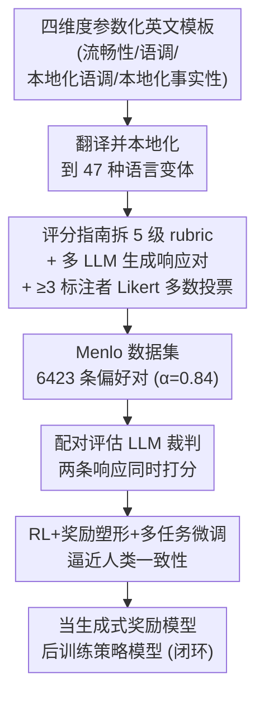

# Menlo: From Preferences to Proficiency – Evaluating and Modeling Native-like Quality Across 47 Languages

**会议**: ICLR 2026  
**arXiv**: [2509.26601](https://arxiv.org/abs/2509.26601)  
**代码**: [https://huggingface.co/datasets/facebook/menlo](https://huggingface.co/datasets/facebook/menlo)  
**领域**: 强化学习  
**关键词**: 多语言评估, 母语质量, LLM-as-Judge, 偏好学习, 受众设计

## 一句话总结
提出 Menlo 框架，基于受众设计理论将母语级响应质量分解为四个维度，构建了覆盖 47 种语言变体的 6423 条标注偏好对数据集，并发现配对评估+RL 训练的 LLM 裁判可达到接近人类标注员的水平。

## 研究背景与动机

**领域现状**：LLM 需要在全球多种语言中提供高质量响应，但评估"母语级质量"缺乏系统方法。传统评估如标准化测试难以规模化且不贴近真实对话。

**现有痛点**：现有多语言偏好数据集语言覆盖少、缺乏本地化提示、标注者间一致性低、不区分质量的具体维度。零样本 LLM 裁判在多语言场景下与人类标注仍有显著差距。

**核心矛盾**：母语级质量不是单一固定标准，而是取决于说话者和听众的关系（社会语言学的风格公理）——同一语言在不同文化、地域、场景中有不同的"母语"标准。

**本文目标** 1) 操作化母语级质量评估（分解为可衡量的维度）；2) 构建大规模高质量多语言偏好数据集；3) 训练可靠的 LLM 评审员替代昂贵的人类评估。

**切入角度**：基于受众设计（Audience Design）理论，通过定义目标受众来引导模型生成上下文适当的"母语"风格，并设计降低标注主观性的评分指南。

**核心 idea**：将母语级质量分解为流畅性、语调、本地化语调和本地化事实四个维度，通过配对 RL 训练使 LLM 裁判在 47 种语言上达到人类水平。

## 方法详解

### 整体框架
Menlo 把"母语级质量"做成一条从数据到裁判、再回到训练的闭环流水线。起点是一份带占位符的英文参数化模板，按四个质量维度撰写；母语者把模板翻译并本地化为 47 种语言变体，再按一份拆细到 5 级 rubric 的评分指南，给多个 LLM 生成的响应对打 1–5 分并多数投票，最终汇成 6423 条偏好对（Menlo 数据集）。这份数据先用来微调出一个**配对评估**的 LLM 裁判（SFT/RL+塑形+多任务），让它逼近人类标注水平；训练好的裁判再反过来当生成式奖励模型，去后训练策略模型、改进它的多语言母语水平——从"评估"闭环回"训练"。

### 关键设计

**1. 四维度质量分解与参数化模板：把抽象的"母语感"拆成能独立打分的维度**

直接问"这条回答够不够母语级"会让标注者各凭主观，一致性极低。Menlo 借受众设计（Audience Design）理论把质量拆成四个维度——流畅性（fluency，语言质量与连贯性）、语调（tone，整体写作风格与有用性）、本地化语调（localized tone，与特定语言变体文化/语言特性的一致性）、本地化事实性（localized factuality，事实正确性与本地知识锚定）。为了让"母语"有明确指向，提示不是泛泛的英文翻译，而是用带占位符（如 `[locale_country]`、`[locale_holiday]`）的参数化英文模板生成——通过显式定义收件人和参照群体这些目标受众，把语言风格往某个具体地域、文化的"母语"上收敛，而不是某种平均化的通用表达。配上拆到 5 级 rubric 的评分指南后，标注者间一致性 Krippendorff's $\alpha=0.84$，明显高于以往多语言偏好数据集。

**2. 配对评估替代逐点评估：用对比锚定让裁判更准**

让 LLM 单独给一条响应打分（逐点）时，它缺少参照系，分数飘忽。Menlo 改成同时把两条响应摆在一起判优劣（配对评估），相当于给模型一个锚——通过直接对比两个候选的质量差异，判断变得稳定得多。在零样本设置下，这一改动在 Macro-F1 上最高提升 +12.4%、偏好准确率最高提升 +17.9%，甚至超过了给逐点评估塞示例的少样本做法（差距约 5.5%）。这个结论的意义在于：即便最终想要的是逐点分数，先做配对再换算往往也比直接逐点更可靠。

**3. RL 训练的多任务配对裁判：把零样本裁判和人类的差距补上**

零样本裁判即使用了配对和评分指南，离人类一致性仍有距离，所以 Menlo 在训练集上微调 Qwen3-4B 和 Llama4-Scout 作裁判。对比两种训练方式：SFT 用标准交叉熵；RL 用 PPO，奖励函数同时考核评分预测的准确性和评分解释的质量，并加入奖励塑形（reward shaping），在中间质量等级上给更细粒度的反馈，专门补强"几分和几分之间"这类最难区分的样本。结果 RL 一致优于 SFT，其中联合训练四个维度、带塑形奖励的多任务 Llama4-Scout 在 47 种语言上达到最强，接近人类标注者的一致性水平。训练好的裁判还能直接当生成式奖励模型去改进策略模型的多语言表现，让整条流水线从"评估"闭环回"训练"。

## 实验关键数据

### 主实验

| 模型 | 模式 | Macro-F1 | 偏好准确率 |
|------|------|----------|-----------|
| Qwen3-4B | 零样本逐点 | 23.06 | 40.54 |
| Qwen3-4B | 零样本配对 | 35.46 (+12.4) | 57.13 (+16.6) |
| GPT-4.1 | 零样本逐点 | 32.23 | 41.73 |
| GPT-4.1 | 零样本配对 | 38.53 (+6.3) | 59.23 (+17.5) |
| Llama4-Scout | 零样本配对 | 36.11 | 56.25 |
| o3 | 零样本配对 | 35.35 | 58.72 |

### 消融实验

| 配置 | Macro-F1 | 偏好准确率 | 说明 |
|------|----------|-----------|------|
| 无评分指南 (逐点) | 16.00 | 33.52 | Qwen3-4B |
| 有评分指南 (逐点) | 23.06 (+7.06) | 40.54 (+7.02) | 指南大幅提升 |
| 有评分指南 (配对) | 35.46 | 57.13 | 配对进一步提升 |
| SFT 微调 | ~38 | ~60 | 有提升但有限 |
| RL 多任务+塑形 | ~43 | ~65 | 接近人类一致性 |

### 关键发现
- 配对评估一致性地在所有模型上超越逐点评估，增益甚至超过少样本上下文示例
- 详细评分指南对小模型帮助最大（Qwen3-4B +7.06 F1），对大模型效果有限
- RL 训练一致优于 SFT，奖励塑形进一步提升中等质量区分能力
- 训练好的 RL 裁判可作为生成式 RM 改进策略模型，但 LLM 评估器倾向于高估改进幅度（比人类判断高 +0.6）
- Menlo 数据集 IAA (Krippendorff's α=0.84) 显著高于现有多语言偏好数据集

## 亮点与洞察
- **配对评估的意外优势**：即使最终目标是逐点评分，配对评估也能提供更可靠的信号——这对所有 LLM-as-Judge 应用都有启示意义
- **受众设计理论的计算化运用**：将社会语言学理论转化为可操作的 NLP 评估框架，跨学科方法论值得借鉴

## 局限与展望
- 47 种语言变体仍未覆盖许多低资源语言
- 参数化模板可能无法完全捕捉所有文化细微差异
- RL 训练的裁判仍然高估改进效果（与人类评估有 +0.6 差距）
- 生成式 RM 的改进是否在真实用户体验中有效尚未验证

## 相关工作与启发
- **vs Chatbot Arena / MT-Bench**: 这些关注通用响应质量的排名，Menlo 专注于"母语级"维度，尤其是文化和本地化层面
- **vs RECON**: RECON 也做多语言评估但语言覆盖较少(9种 vs 47种)，且缺乏本地化提示和配对设计

## 评分
- 新颖性: ⭐⭐⭐⭐ 将受众设计理论引入 NLP 评估，四维度分解有理论依据
- 实验充分度: ⭐⭐⭐⭐⭐ 47 种语言的大规模标注和系统消融
- 写作质量: ⭐⭐⭐⭐ 框架清晰，从理论到实践衔接自然
- 价值: ⭐⭐⭐⭐⭐ 高质量多语言评估数据集和方法论对社区有重要价值

<!-- RELATED:START -->

## 相关论文

- [\[ICLR 2026\] Toward Conservative Planning from Human-AI Preferences in Reinforcement Learning](toward_conservative_planning_from_human-ai_preferences_in_reinforcement_learning.md)
- [\[ICLR 2026\] RM-R1: Reward Modeling as Reasoning](rm-r1_reward_modeling_as_reasoning.md)
- [\[ICLR 2026\] AutoQD: Automatic Discovery of Diverse Behaviors with Quality-Diversity Optimization](autoqd_automatic_discovery_of_diverse_behaviors_with_quality-diversity_optimizat.md)
- [\[ICLR 2026\] Post-training Large Language Models for Diverse High-Quality Responses](post-training_large_language_models_for_diverse_high-quality_responses.md)
- [\[ICLR 2026\] Chessformer: A Unified Architecture for Chess Modeling](chessformer_a_unified_architecture_for_chess_modeling.md)

<!-- RELATED:END -->
