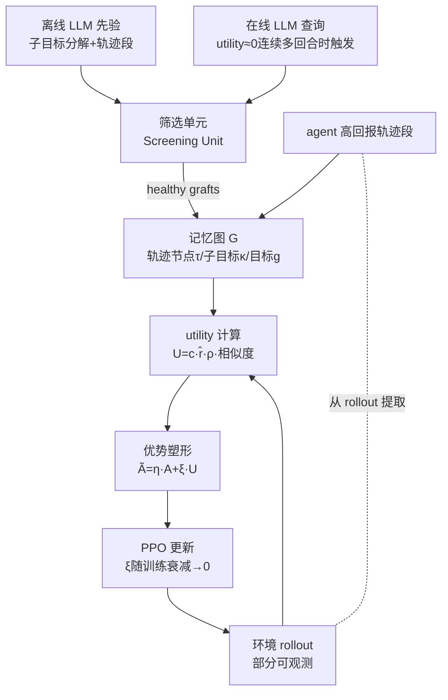

# MIRA: Memory-Integrated Reinforcement Learning Agent with Limited LLM Guidance

**会议**: ICLR 2026  
**OpenReview**: [https://openreview.net/forum?id=oWagByDNPc](https://openreview.net/forum?id=oWagByDNPc)  
**代码**: [项目主页](https://narjesno.github.io/MIRA/)  
**领域**: 强化学习 / LLM 引导 RL  
**关键词**: 稀疏奖励、优势塑形、记忆图、LLM 先验、样本效率、PPO  

## 一句话总结
MIRA 把 LLM 的子目标分解与轨迹先验**摊销（amortize）**进一张持续演化的记忆图，再从图中导出 utility 信号去**软性塑形优势估计**，从而在稀疏奖励早期加速学习，且随训练衰减塑形项以保留 PPO 的收敛性——只用几十次离线/在线查询就逼近"每步都查 LLM"的方法的性能。

## 研究背景与动机
**领域现状**：RL 在机器人、调度、规划上很强，但这些成功大多依赖稠密、易得的奖励。一旦奖励稀疏或延迟（只在到达目标或动作发生数步后才出现），加上部分可观测，credit assignment 就变得困难，梯度信号被稀释，agent 变得极度 data-hungry，早期探索几乎只能随机游走。

**LLM 能补什么**：LLM 擅长抽象目标推理、高层意图解释、提供子目标结构与可信轨迹，是天然的 RL 先验来源。现有工作把 LLM 当奖励模型、当计划生成器、或做子目标分解。

**核心矛盾**：这些方法几乎都需要**频繁（常常每步）的 LLM 监督**。这带来三重困难——(1) 持续的 LLM 信号会干扰 RL 自身的学习信号，削弱自主决策与泛化，LLM 一旦不可用 agent 就崩；(2) LLM 无法直接与环境交互获取实时反馈，全盘依赖其指令是次优的，还稀释了环境驱动的反馈；(3) 幻觉、prompt 敏感、缺乏物理 grounding 让输出不可靠，而高频查询又带来算力与延迟的可扩展性问题。

**本文目标**：在**不改变奖励函数、不改变 PPO 优化动力学**的前提下融入 LLM 引导，既吃到先验的红利，又保住 RL 的自主性与收敛性。

**核心 idea**：**「把实时监督换成持久记忆 + 可衰减的优势塑形」**——不再每步问 LLM，而是把离线先验和少量在线查询沉淀进一张记忆图，从图中算出衡量"当前 rollout 与高价值记忆轨迹有多对齐"的 utility，用它在早期补偿 critic 还没校准好的弱优势信号；随着策略变强，utility 项自动退场，最终策略仍按真实奖励 $R$ 收敛。

## 方法详解

### 整体框架
MIRA 在标准 policy-gradient（PPO）之上挂三个模块：**记忆图**（存离线先验 + agent 高回报轨迹段 + 通过筛选的在线 LLM 建议）、**筛选单元**（Screening Unit，过滤幻觉/低置信在线输出）、**utility 模块**（把当前 rollout 与记忆图比对算出 utility 信号）。utility 被注入优势估计 $\tilde{A}_t = \eta_t A_t + \xi_t U_t$，塑形后的优势驱动 PPO 更新；塑形权重 $\xi_t$ 随训练退火至 0，把控制权交还 critic。

### 关键设计

**1. 共构演化的记忆图：把 LLM 查询摊销成持久知识** 记忆图 $G$ 把决策相关信息组织成三类节点：轨迹节点存"部分观测 $o_{\tau_j}$ + 动作 $a_{\tau_j}$ + 关联目标 $\zeta_j$（最终目标 $g_j$ 或抽象子目标 $\kappa_\ell^{g_j}$）+ 估计子目标奖励 $\hat r_j$ + 置信度 $c_j$"，子目标节点 $\{\kappa_\ell\}$ 来自 LLM 对环境描述的分解，目标节点 $\{g_\triangleright\}$ 是 agent 的最终目标；边编码"目标→子目标"的层次分解。图由离线先验初始化，随训练演化——当 agent 产出对某 (子)目标的新轨迹段、或回报高于现有条目时就**新增/更新节点**，当自身经验印证了原本低置信的 LLM 节点时也会强化它。关键之处在于查询是**事件触发**而非定时：只有当 rollout 的 utility 连续几回合都接近零（说明图给不出有用引导）时才发起一次在线查询。节点还带访问计数，固定窗口内计数不变的会被剪枝，使图保持紧凑、自然淘汰误导性先验——低质量段要么被高回报的 agent 轨迹替换，要么因不被使用而消亡。

**2. 离线/在线双形态引导 + 软 logit 注入** 离线输出在训练前以**完整任务描述**生成，提供轨迹段与子目标分解去初始化图，是一条持久的基线引导；在线建议则受限于和 agent 相同的部分可观测，触发时可返回对应短轨迹的计划，或返回在一段 horizon 内偏置动作偏好的控制信号。所有在线输出过 **Screening Unit**：当能拿到 token 级似然时，用补全的 per-token 概率几何均值作置信度；拿不到时则采样多个独立补全、做多数一致性检验，低于阈值就丢弃。通过筛选的"healthy grafts"——计划被嫁接为新轨迹节点，控制信号则通过 **soft logit injection**（对被劝阻动作的 logit 加一个有界惩罚）软性偏置策略。这个惩罚在 softmax 前只造成软偏好、不会让动作分布塌缩，再叠加 PPO 的 clipped objective 限制更新幅度，保证注入的偏置只是"轻量引导"，critic 强烈反对时可以推翻它。

**3. 双重对齐的 utility 信号：行为相似 × 语义对齐才计分** utility 定义在 state-action 对级别，用与优势估计同一批 rollout 计算。对轨迹 $\tau=\{(o_t,a_t)\}$ 中每个对 $t$，匹配记忆轨迹 $\tau_m$ 中对应的 $(o_{t'},a_{t'})$（记忆节点 $m$ 按当前训练迭代的环境实例如 seed 布局选取），utility 为：

$$U_t \doteq c_m \cdot \hat r_m \cdot \rho(g_\triangleright, \zeta_m) \cdot \smallint\big((o_t,a_t),(o_{t'},a_{t'})_{\tau_m}\big)$$

不匹配任何存储段的步得零 utility。相似函数 $\smallint(\cdot,\cdot)$ 同时考虑动作一致性与空间一致性（网格位置重叠、方向对齐）；语义因子 $\rho$ 用规则解析出每个子目标的"实体-动作短语" token 集，取 agent 目标子目标与记忆条目两个 token 集的 **Jaccard 相似度**，放大共享实体/动作的条目、压低无关匹配。一个 transition 只有在**行为相似且语义对齐都高**时才贡献 utility，再被节点的置信 $c_m$ 与估计奖励 $\hat r_m$ 调制——这天然限制了通过筛选的错误 LLM 引导：不准的段通常 $\hat r_m$ 低或相似度小，自然贡献甚微。

**4. 自适应优势塑形 + 收敛兼容性** 把 utility 注入 PPO 的优势：$\tilde A_t = \eta_t A_t + \xi_t U_t$，约束 $0<\eta_t\le 1,\ \xi_t\le\delta\eta_t,\ \delta\in[0,1),\ \lim_{t\to\infty}\eta_t=1,\ \lim_{t\to\infty}\xi_t=0$。动机是早期 critic 校准差、value 估计近乎均匀，$A_t$ 在稀疏/延迟奖励下几乎为零或高噪声；此时 utility 项提供与任务目标对齐的**方向性引导**，补偿平坦梯度。随策略变好、critic 估计变可靠，$\xi_t$ 退火、$\eta_t$ 升向 1，塑形比 $\delta_t=\xi_t/\eta_t$ 衰减——既在稀疏奖励阶段吃到先验红利，又因 $\xi_t\to 0$ 让 LLM 的不准之处在渐近期被学掉，最终按真实奖励 $R$ 优化。理论上 **Theorem 1（稀疏奖励下的非消失更新）** 给出：当 $\mathbb{E}[|A_t|]\le\varepsilon_A\approx 0$ 时，塑形后更新范数满足 $\|\nabla L_k^{\text{shaped}}\|\ge\xi_k\|\nabla L_k^U\|-O(\varepsilon_A)$——即当 PPO 优势消失时，更新仍由 utility 项托底，保住非零学习信号；同时塑形保留 PPO 的策略改进性质与长程收敛。

## 实验关键数据

### 主实验设置与结果
六个环境覆盖离散 vs 像素输入、短/长 horizon、可逆/不可逆动态、有无干扰物：FrozenLake（表格基准，验证保收敛）、RedBall、LavaCrossing、DoorKey、RedBlueDoor、Distracted DoorKey（MiniGrid/BabyAI，像素 RGB 观测）。Baseline：纯 PPO、HRL（用预训练 LLM option 策略）、LLM-RS（实时查询做势能奖励塑形）、LLM4Teach（LLM 当 policy teacher 做策略蒸馏，SOTA 级）。

| 环境 | PPO | HRL | MIRA |
|------|-----|-----|------|
| RedBall | 早期有提升但远低于最优、plateau | 最终追上 | **不到一半迭代达最优** |
| LavaCrossing | 几乎零成功率（探索失效） | 稳步提升但慢 | 收敛更快 |
| DoorKey / RedBlueDoor | 低 | — | **成功率约为 HRL 的 2 倍**，且更快收敛 |

整套结果只用**不到 10 个离线 prompt** 建图 + 少量在线查询。

### 查询效率对比（Distracted DoorKey）

| 方法 | 查询量 | 最终性能 |
|------|--------|----------|
| LLM4Teach | 每个 (s,a,r) 三元组查一次，>500 次才稳定 | 与 MIRA 相当（但代价极高，早期靠前置查询占优） |
| LLM-RS | 每个 layout 查一次，>50 次 | 早期靠奖励塑形领先，后期 plateau 低于 MIRA |
| **MIRA** | **约 30 次/run（7 离线 + 20±3 在线）** | 匹配 LLM4Teach 最终回报，**每查询回报最高** |

### 消融实验

| 问题 | 设置 | 关键发现 |
|------|------|----------|
| Q4 在线查询频率 | 同一离线图，0/10/20 在线预算 | 查询越多学得越快；即便只 10 次也大幅超 offline-only；offline-only 仍明显优于 PPO，是无在线访问时的实用选择 |
| Q5 不可靠 LLM | 后期换 LLM（o4-mini→Gemini Pro）并关筛选 | 记忆成熟后能容忍低置信/错误建议，性能稳定，仅收敛略慢、终值略降 |
| Q6 LLM 推理风格 | 全程换不同 LLM 建图 | 推理风格强烈影响下游 RL：Gemma3 每次拾取后查门→低效；Claude 谨慎探索→慢但终能恢复；Gemini Pro / o4-mini 学得快，o4-mini 的"绕路"记忆后期反而最有用，达最高渐近回报 |

### 关键发现
- FrozenLake 上两个 MIRA 变体（offline-only / online-only）都加速早期学习，PPO 最终追平、三者渐近回报相当——**验证了塑形保收敛**；$\delta_t$ 随训练衰减至 0。
- 在线查询是事件触发的：RedBlueDoor 早期频繁触发以解读部分观测、建议如"转向对齐门"的短序列，一旦红门被发现并切换，离线记忆就够用了。
- "把有限 LLM 引导摊销进持久记忆"在性能与可扩展性之间取得了最优平衡。

## 亮点与洞察
- **摊销视角很漂亮**：把"每步实时监督"重构成"少量查询 → 持久记忆 → 反复复用"，一句话点破了 LLM-guided RL 的核心低效，从 500+ 查询降到 ~30 次而性能不掉。
- **塑形而非改奖励**：utility 注入优势而非奖励函数，配合 $\xi_t\to 0$ 的退火，既享受 shaping 的早期红利，又不污染渐近最优，理论（Theorem 1）与 PPO 收敛性自洽。
- **双重对齐的 utility 设计**自带容错：行为相似 × 语义对齐 × 置信 × 估计奖励四重调制，让通过筛选的错误先验也"自然失效"，不需要额外检测机制。
- **诊断式消融**：Q5/Q6 直接拿不同 LLM 的真实推理 trace 解释性能差异（Gemma3 反复查门、Claude 谨慎探索），把"LLM 推理风格 → RL 策略质量"的因果链讲得很具体。

## 局限与展望
- **仅在网格世界验证**：环境都是离散/表格或像素网格（MiniGrid/BabyAI/Gymnasium ToyText），相似函数依赖网格位置重叠与方向对齐，未在连续控制或真实视觉域上验证。作者提出可用 R3M-style 嵌入或编码器特征在 latent 空间做相似比较来扩展。
- **utility 计算依赖规则解析**：$\rho$ 用规则抽"实体-动作短语" token + Jaccard，对自然语言子目标描述的依赖较强，复杂语义任务下的鲁棒性存疑。
- **记忆可扩展性**：当前靠访问计数剪枝保持紧凑，但论文也承认大状态空间下需要聚类/层次化组织，尚未实现。
- **多目标域未充分探索**：作者把扩展到 Crafter 这类可复用子目标结构突出的多目标域列为 future work。

## 相关工作与启发
- **vs. LLM-as-reward（LLM-RS、Eureka 系）**：那类把 LLM 当奖励模型/生成奖励代码，需 layout 级持续访问；MIRA 不碰奖励函数，改塑形优势。
- **vs. LLM-as-teacher（LLM4Teach）**：teacher 做策略蒸馏需每步监督（>500 查询）；MIRA 用事件触发的稀疏查询 + 记忆复用达到相当终值。
- **vs. 子目标分解/课程（Wang/Ma/Reflexion 等）**：MIRA 不止做一次性分解，而是让 agent 持续验证、修订、扩展 LLM 给的结构。
- **启发**：「把昂贵外部监督摊销进可演化记忆 + 让引导项随能力增长自动退场」是一个可迁移到其他 LLM-as-X 场景（如 LLM 引导的探索、奖励设计）的通用范式；soft logit injection + PPO clip 的组合也提供了"让先验可被推翻"的安全注入方式。

## 评分
- **新颖性**: ⭐⭐⭐⭐ — "记忆图摊销 LLM 查询 + 可衰减 utility 优势塑形"组合新颖，把已知部件（记忆/优势塑形/PPO）拼成一个查询高效且保收敛的新框架，视角清晰。
- **实验充分度**: ⭐⭐⭐⭐ — 六环境 + 4 baseline + 6 个 research question 消融（含查询频率、不可靠 LLM、跨 LLM 推理风格、查询效率），诊断扎实；扣分在全是网格世界、缺连续控制/真实视觉验证。
- **写作质量**: ⭐⭐⭐⭐ — 动机-矛盾-贡献链条清晰，Q1–Q6 结构化，公式与算法（Shaped PPO）交代清楚；记忆图/utility 细节较密集，初读需对照附录。
- **价值**: ⭐⭐⭐⭐ — 在"LLM-guided RL 太贵"这个真实痛点上给出查询降一个数量级仍保性能的实用方案，且 offline-only 变体对无实时 LLM 访问场景直接可用，落地友好。

<!-- RELATED:START -->

## 相关论文

- [\[ICLR 2026\] Trajectory Generation with Conservative Value Guidance for Offline Reinforcement Learning](trajectory_generation_with_conservative_value_guidance_for_offline_reinforcement.md)
- [\[ICLR 2026\] Selective Expert Guidance for Effective and Diverse Exploration in Reinforcement Learning of LLMs](selective_expert_guidance_for_effective_and_diverse_exploration_in_reinforcement.md)
- [\[ICML 2026\] LLM-Guided Communication for Cooperative Multi-Agent Reinforcement Learning](../../ICML2026/reinforcement_learning/llm-guided_communication_for_cooperative_multi-agent_reinforcement_learning.md)
- [\[ICML 2026\] Learning Query-Aware Budget-Tier Routing for Runtime Agent Memory](../../ICML2026/reinforcement_learning/learning_query-aware_budget-tier_routing_for_runtime_agent_memory.md)
- [\[ICLR 2026\] J1: Incentivizing Thinking in LLM-as-a-Judge via Reinforcement Learning](j1_incentivizing_thinking_in_llm-as-a-judge_via_reinforcement_learning.md)

<!-- RELATED:END -->
