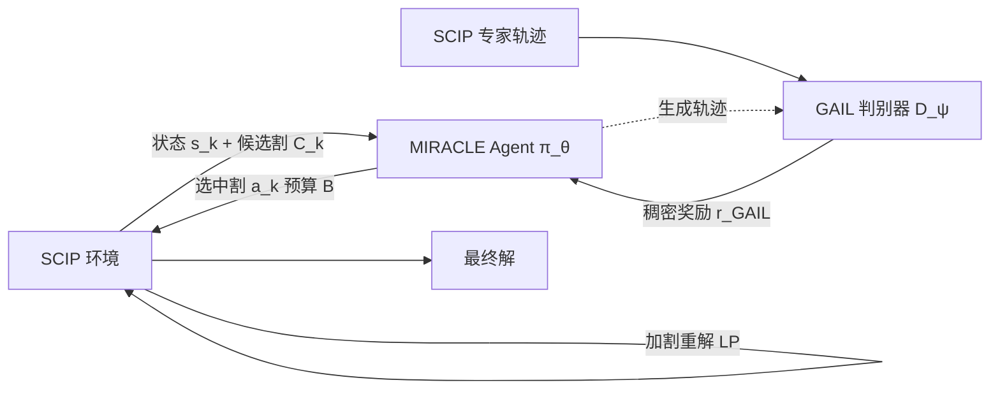

# MIRACLE: Model-free Imitation and Reinforcement Learning for Adaptive Cut-Selection

**会议**: ICLR 2026  
**OpenReview**: [https://openreview.net/forum?id=zZyxHmId3w](https://openreview.net/forum?id=zZyxHmId3w)  
**代码**: 待确认  
**领域**: 强化学习 / 组合优化 (MIP 割平面选择)  
**关键词**: 割平面选择, 混合整数规划, PPO, GAIL, 课程学习, 内存高效求解  

## 一句话总结
把混合整数规划求解器 SCIP 当作环境、其默认割平面策略当作专家，用 GAIL 学一个稠密奖励再用 PPO 训一个轻量割平面选择策略，在每轮只挑出预算内的少数高价值割，把峰值内存从 GB 级压到几十 MB（最高省 98.5%），同时在 MIPLIB 上拿到 100% 求解成功率和平均 3.78× 加速。

## 研究背景与动机
**领域现状**：现代 MIP 求解器（如 SCIP）靠 branch-and-cut 反复给 LP 松弛加割平面来收紧界。一个工业规模问题可能生成超过 10 万个候选割，但只有 1-2% 真正改善目标界。机器学习介入求解器组件已有不少工作：早期做变量分支的模仿学习（Gasse et al. 2019），近年转向割平面选择——Tang et al. (2020) 用 RL 但只盯即时奖励，Paulus et al. (2022) 模仿 strong-branching，Wang et al. (2024) 用层次序列模型选割。

**现有痛点**：这些方法几乎都把求解器当黑盒、直接优化求解时间，存在三重缺陷——(1) **黑盒谬误**：学不到「加一个割之后 LP 状态如何变化」的内在动力学；(2) **短视规划**：缺环境模型只能做近视决策，无法推理割之间的长期交互；(3) **资源效率被当事后补丁**：几乎没人把内存开销当成一等公民指标，而内存恰恰是边缘设备、云成本、多租户吞吐这些场景的真正瓶颈。

**核心矛盾**：直接对复杂的 LP 转移函数建模代价过高，但完全不建模又会陷入短视；而单纯优化求解时间又会让方法在内存受限环境彻底失效（求解器因内存膨胀直接崩盘）。

**本文目标**：在显著降低内存占用（目标在受限预算 $B$ 内）的同时维持竞争力的求解质量，即满足 $|\text{obj}_{\text{SCIP}} - \text{obj}_{\text{MIRACLE}}| \le \epsilon$。

**核心 idea**：**[行为建模而非动力学建模]** 不去硬建 LP 转移函数，而是把割平面选择重述为一个 MDP，用 GAIL 从 SCIP 专家轨迹里学一套稠密奖励，再用 PPO 训一个带内存预算约束的轻量策略去模仿并超越 SCIP 的隐式选割策略，把「内存优先」直接写进优化目标。

## 方法详解

### 整体框架
MIRACLE 把 SCIP 求解器整体视作环境：每轮 $k$，SCIP 生成候选割池 $C_k$ 和刻画当前优化状态的特征向量 $s_k$；agent（actor-critic 策略 $\pi_\theta$）输出一个二值选择向量 $a_k \in \{0,1\}^{|C_k|}$，在预算约束 $\sum_i a_k^{(i)} \le B$ 下挑出一小撮割加回 LP 重解，直到收敛。训练分三段离线进行：先跑默认 SCIP 收集专家轨迹，再用 GAIL 判别器学奖励做主预训练，最后固定判别器用 PPO 在课程上精修；部署时再叠一个自适应推理层动态分配预算。

### 关键设计

**1. 对抗式奖励学习：把数十年求解器工程的隐知识蒸成稠密信号** —— 割平面的真实奖励只有问题完全解完才可见，手工奖励要么短视（盯即时界改善会误导），要么编码不了内存目标。MIRACLE 因此训练一个判别器 $D_\psi: S\times A \to [0,1]$（MLP + sigmoid）去区分 SCIP 专家与 agent 的状态-动作分布，目标是标准对抗交叉熵 $\min_\psi \mathbb{E}_{\pi_E}[-\log D_\psi] + \mathbb{E}_{\pi_\theta}[-\log(1-D_\psi)]$。其中专家策略被显式写成 SCIP 八步选割流程的算子复合 $\pi_E = T_8 \circ \cdots \circ T_1(s_k)$（LP 求解、分数变量识别、舍入割生成、割选择、约束添加、LP 重优化、改善度量、迭代精修）。由 GAN 理论最优判别器收敛到 $D^*(s,a)=\frac{\pi_E}{\pi_E+\pi_\theta}$，于是学到的奖励 $r_{\text{GAIL}}(s,a)=-\log(1-D_\psi(s,a))$ 就给出了一个稠密、可让 agent 在每一步都拿到「我这步像不像专家」反馈的信号，骗过判别器（$D_\psi\to 1$）得高奖、明显是 agent（$D_\psi\to 0$）得低奖，从而既能逼近专家又允许超越专家。

**2. PPO actor-critic 在高方差选割空间里稳定学习** —— 选割是高方差决策空间，需要一个能在「策略改进」与「避免破坏性大更新」间稳定权衡的优化器，PPO 正合适。Actor 对每个候选割 $c_i$ 用 MLP 算 logit 再过 sigmoid 给出选中概率 $P(a_k^{(i)}=1|s_k)=\sigma(f_\theta^{(L)}\circ\cdots\circ f_\theta^{(1)}(x_{c_i},s_k))$，critic $V_\phi(s_k)$ 共享 actor 的特征提取层以提效。训练用 GAIL 奖励 $r_k=r_{\text{GAIL}}(s_k,a_k)$ 配 GAE 算优势 $\hat{A}_k^{\text{GAE}}=\sum_l (\gamma\lambda)^l \delta_{k+l}$，再最大化 PPO 截断目标 $L^{\text{CLIP}}(\theta)=\hat{\mathbb{E}}_k[\min(\rho_k\hat{A}_k,\ \text{clip}(\rho_k,1-\epsilon,1+\epsilon)\hat{A}_k)]$，其中 $\rho_k=\pi_\theta/\pi_{\theta_{\text{old}}}$。这样对抗学到的奖励驱动优势、优势驱动策略更新，形成闭环。

**3. 四阶段课程学习换取稳定收敛** —— 直接在多样且困难的 MIP 实例上从零训 RL 会不稳定、易发散。MIRACLE 设计了循序渐进的课程：Foundation 阶段在简单实例（200-500 约束）的低噪环境里学会识别基础高价值割模式；Scaling 与 Mastery 阶段逐步加难（到 2000 约束），逼迫 agent 发展出考虑长期后果的非短视策略；最后 Integration 阶段在混合难度分布上微调，确保跨整个问题谱的泛化。

**4. 自适应推理：按难度动态分配计算预算** —— 部署时一个轻量预训练分类器先看新实例的静态特征判难度（EASY/MEDIUM/HARD），据此自动调整割预算 $B$ 与早停耐心等超参（如 EASY 用 1-2 轮迭代、$B=10\text{-}20$、早停阈值 $10^{-4}$；HARD 用 5-8 轮、$B=30\text{-}50$、阈值 $10^{-6}$）。早停定义为边际 LP 界改善连续若干轮低于难度相关阈值即终止选割。由此简单问题用精瘦预算、难问题给更慷慨预算，免去人工逐实例调参。理论上还给出内存比上界 $\frac{M_{\text{MIRACLE}}}{M_{\text{SCIP}}} \le \frac{M'_{\text{base}}+B\cdot T}{M'_{\text{base}}+|C_{\text{total}}|}$，大规模下趋于 $\frac{B\cdot T}{|C_{\text{total}}|}$，解析地解释了 95-99% 的内存削减。

## 实验关键数据

设置：在 1000 个 SetCover 实例上训练，在 150 个 SetCover + 150 个 MIPLIB 多样实例上评测（各难度 50 个）。基线为 SCIP 8.0 默认与 SCIP Aggressive（maxrounds=5, maxcuts=5000），统一单线程、600 秒、12GB 内存上限，PySCIPOpt 接口。

### 主实验：内存与可靠性

| Benchmark | SCIP 内存 | MIRACLE 内存 | 削减 | 实例数 |
|---|---|---|---|---|
| SetCover-Easy | 1,970.3 MB | 45.4 MB | 97.7% | 50 |
| SetCover-Medium | 2,437.7 MB | 46.1 MB | 98.1% | 50 |
| SetCover-Hard | 3,033.9 MB | 46.2 MB | 98.5% | 50 |
| MIPLIB-Small | 1,343.9 MB | 415.8 MB | 69.1% | 50 |
| MIPLIB-Medium | 1,347.3 MB | 418.2 MB | 69.0% | 50 |
| MIPLIB-Large | 2,312.3 MB | 737.4 MB | 68.1% | 50 |
| **平均** | **2,073.9 MB** | **284.7 MB** | **86.3%** | 300 |

| Solver | 类别 | 成功率 | 中位时间 | 加速比 |
|---|---|---|---|---|
| SCIP-Baseline | Large | 53.3% | 577.5s | 1.00× |
| SCIP-Aggressive | Large | 46.7% | 600.0s | 0.96× |
| **MIRACLE** | Large | **100.0%** | **125.7s** | **4.59×** |

### 消融实验（SetCover，逐配置 30 实例）

| 配置 | 平均加速 | 标准差 | 割削减 | 平均迭代 |
|---|---|---|---|---|
| Cut Budget 10 | 1.170 | 0.452 | 99.1% | 1.1 |
| Cut Budget 30 | 1.164 | 0.442 | 99.1% | 1.1 |
| Cut Budget 50 | 1.157 | 0.427 | 99.1% | 1.1 |
| Max Iterations 1 | 1.163 | 0.443 | 99.1% | 1.0 |
| Max Iterations 10 | 1.166 | 0.447 | 99.1% | 1.1 |
| Aggressive Early Stop | 1.166 | 0.445 | 99.1% | 1.0 |

### 关键发现
- **内存当一等公民直接换来可靠性**：MIRACLE 在 SetCover 上峰值内存恒定在 45-46 MB（SCIP 随难度从 1.97GB 涨到 3.03GB），300 实例平均省 86.3%、最难省 98.5%，所有对比 $p<0.001$。
- **可靠性翻盘**：MIPLIB 上 SCIP 因内存/时间膨胀在 40-53% 实例上失败，MIRACLE 拿到 100% 成功率（目标 gap 0.1%）。
- **速度随之提升**：MIPLIB 中位加速 2.50×-4.79×，全 300 实例平均 3.78×，均统计显著且效应量大。
- **超参鲁棒**：割预算 10-50、迭代 1-10、各种早停下，加速紧聚在 1.15×-1.17×、割削减稳定 >99%，说明收益来自算法设计而非脆弱调参。

## 亮点与洞察
- **视角切换很聪明**：与其建模「加割如何改变 LP」这一非可微、极复杂的转移函数，不如直接把 SCIP 的选割模块当专家做行为克隆——SCIP 封装了数十年求解器工程，是最强的公开启发式基线，模仿它本身就是个强起点，再用 RL 留出超越空间。
- **把内存写进目标函数**：领域里几乎所有前作都在优化求解时间，本文证明「内存优先」反而能解出别人解不了的题（100% vs 53%），因为崩盘的根因恰是内存膨胀。还配了内存比的解析上界与渐近推论，理论-实验闭环。
- **GAIL 解决稀疏奖励**：割平面的真实奖励要到解完才有，用对抗判别器把它变成每步稠密信号，是这类「最终奖励极稀疏」序列决策任务的通用思路。

## 局限与展望
- **加速幅度看口径**：主表 Large 类报 4.59×、汇总报 3.78×，但消融表里 SetCover 上的平均加速只有 1.15-1.17×，且 95% CI 下界普遍 <1（如 [0.997, 1.343]），说明在简单/中等实例上加速优势其实不稳，主要红利来自难实例避免崩盘——论文叙述偏向乐观口径。
- **MIPLIB 内存削减明显弱于 SetCover**：MIPLIB 仅 68-69%（SetCover 97-98%），泛化到真实多样结构时优势缩水。
- **专家天花板**：策略本质在模仿 SCIP，「超越专家」更多体现在内存而非求解策略本身的新颖性；摘要里 contributions 段落有明显文字拼接错乱（OCR/写作问题），完整性存疑。
- **训练分布单一**：只在 SetCover 上训练，跨问题族泛化虽有展示但训练多样性有限。

## 相关工作与启发
- **割平面 RL 谱系**：Tang et al. (2020) 首提 RL 选割但只盯即时奖励；Paulus et al. (2022) 模仿 strong-branching；Wang et al. (2024) 层次序列模型——本文最大差异是显式建模内存-性能权衡且用轻量预算策略而非重架构/look-ahead rollout。
- **模仿学习根基**：GAIL (Ho & Ermon 2016)、DAgger 式样本复杂度界 (Ross et al. 2011) 是其理论支撑（Prop 4.1 给出 $N=O(H^2\log(|A|/\delta)/\epsilon^2)$ 的专家演示需求界）。
- **启发**：对任何「环境转移昂贵/不可微 + 存在强启发式专家 + 最终奖励稀疏」的系统优化任务（编译器调优、查询优化、调度），「GAIL 蒸专家奖励 + PPO 轻量策略 + 把资源约束写进目标」是一条可复用的范式。

## 评分
- **新颖性**: ⭐⭐⭐ — 组件（PPO、GAIL、课程学习）都是成熟件，但「把内存当一等优化目标 + 用 GAIL 蒸 SCIP 选割隐知识 + 轻量预算策略」的组合与问题切入角度是新的。
- **实验充分度**: ⭐⭐⭐ — 300 实例跨两个 benchmark、含统计显著性/CI/效应量与丰富消融，较扎实；但缺与 Wang et al. (2024) 等学习型基线的同台主表对比（仅放附录），且加速口径前后不一致。
- **写作质量**: ⭐⭐ — 方法与实验组织清晰、公式完整，但 contributions 段落出现明显文字拼接错乱、图表引用零散，打磨不足。
- **价值**: ⭐⭐⭐⭐ — 把内存瓶颈这一被忽视的实际痛点做成可部署系统，在边缘/云/多租户等资源受限场景把不可解变可解（100% 成功率），工程落地价值高。

<!-- RELATED:START -->

## 相关论文

- [\[ICLR 2026\] Model Predictive Adversarial Imitation Learning for Planning from Observation](model_predictive_adversarial_imitation_learning_for_planning_from_observation.md)
- [\[ICLR 2026\] Near-Optimal Second-Order Guarantees for Model-Based Adversarial Imitation Learning](near-optimal_second-order_guarantees_for_model-based_adversarial_imitation_learn.md)
- [\[ICLR 2026\] Instance-wise Adaptive Scheduling via Derivative-Free Meta-Learning](instance-wise_adaptive_scheduling_via_derivative-free_meta-learning.md)
- [\[ICLR 2026\] ROMI: Model-based Offline RL via Robust Value-Aware Model Learning with Implicitly Differentiable Adaptive Weighting](model-based_offline_rl_via_robust_value-aware_model_learning_with_implicitly_dif.md)
- [\[ICLR 2026\] On Discovering Algorithms for Adversarial Imitation Learning](on_discovering_algorithms_for_adversarial_imitation_learning.md)

<!-- RELATED:END -->
