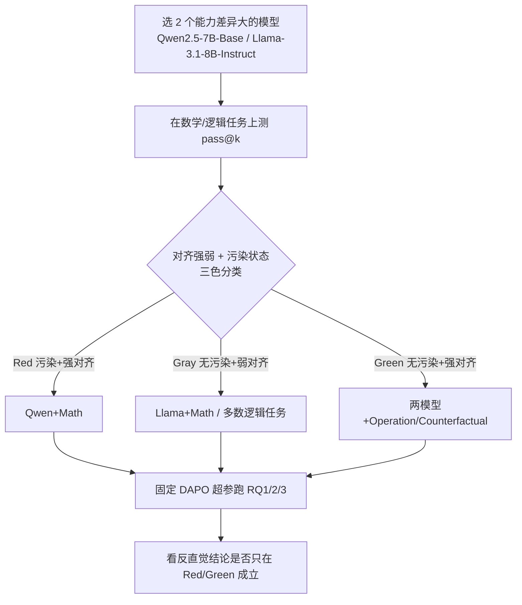

# Mirage or Method? How Model–Task Alignment Induces Divergent RL Conclusions

**会议**: ICLR 2026  
**OpenReview**: [https://openreview.net/forum?id=5wmetrh9cn](https://openreview.net/forum?id=5wmetrh9cn)  
**代码**: [https://github.com/hkust-nlp/model-task-align-rl](https://github.com/hkust-nlp/model-task-align-rl)  
**领域**: 强化学习 / LLM 推理 / RLVR  
**关键词**: RLVR, 模型-任务对齐, pass@k, 虚假奖励, one-shot RL, 负样本训练, 测试时强化学习  

## 一句话总结
本文指出近期一系列"反直觉"的 LLM 强化学习结论（虚假奖励有效、单样本顶满数据集、纯负样本训练够用）其实并非 RL 的普适规律，而只在**模型本身已经擅长该任务（强 model-task alignment，用 pass@k 度量）**时成立；一旦任务超出模型能力范围，这些技巧统统失效，只有标准带正确奖励的 RL 仍然稳健。

## 研究背景与动机
**领域现状**：RLVR（可验证奖励的强化学习）显著提升了 LLM 的数学/逻辑推理能力，催生了 o1、DeepSeek-R1 等模型。与此同时，学界报告了一批令人兴奋却反直觉的现象：(a) 奖励信号可以很不准甚至随机也能涨点（spurious reward）、无奖励的熵最小化也能比肩；(b) 单条精选样本训练就能匹敌全数据集训练（one-shot RL）；(c) 只用负样本（NSR）就能逼近标准 RL。

**现有痛点**：这些惊人结论几乎全部建立在一个狭窄的实验设定上——**Qwen 模型 + 数学任务**。它们到底在什么条件下成立、什么条件下失效，始终没人系统厘清。如果这些结论被当成普适规律去指导实践（比如砍掉精确奖励建模、只做数据精选），风险极大。

**核心矛盾**：有并发工作（Wu et al. 2025）把 spurious reward 的有效性归因于 Qwen 在测试集上的**数据污染**。但"Qwen+数学是特例"这种解释太表面——它没说清到底是什么深层因素让这个组合特殊。

**本文目标**：找到一个能统一解释这些分歧的、可量化的判别因子，并通过跨模型、跨任务的受控实验验证它。

**核心 idea**：作者提出 **「模型-任务对齐依赖性」(Model-Task Alignment Dependency) 假说**——这些反直觉技巧能否生效，本质取决于**预训练模型自身能力与任务需求的匹配程度**，而非污染。该对齐度用 **pass@k** 直接度量：模型在该任务上 pass@k 高就是强对齐，低就是弱对齐。强对齐时这些技巧只是"激活"已有能力；弱对齐时它们无能为力，唯有标准 RL 还能真正学到东西。

## 方法详解

### 整体框架
本文不是提新算法，而是设计了一套**受控诊断框架**来检验上述假说：先用 pass@k 把若干「模型×任务」组合标定成强/弱对齐（并叠加污染状态做三色分类），再固定一套统一超参数（DAPO 算法），在三个研究问题（RQ1 奖励信号、RQ2 单样本、RQ3 负样本）下逐一复现那些反直觉结论，观察它们的成败是否完全沿着"对齐强弱"这条线分裂。

### 关键设计

**1. 以 pass@k 量化"模型-任务对齐"：把模糊的'模型擅不擅长'变成可测的判别轴。** 作者用 pass@k 作为对齐度的核心度量——它表示模型对某题独立采样 $k$ 次中至少出现一次正确解的概率，直接反映模型既有知识与任务需求的契合度。对数据集 $D$ 中的题目 $x_i$，采样 $n\ge k$ 次、正确数为 $c_i$，无偏估计为 $\text{pass@}k := \mathbb{E}_{x_i\sim D}\big[1-\binom{n-c_i}{k}/\binom{n}{k}\big]$。实测中 Qwen 在 AIME 上 pass@k 随 $k$ 快速饱和到接近 1（强对齐），Llama 在数学上、以及两个模型在 KOR-Bench 的 Puzzle/Logic 子集上 pass@k 长期很低（弱对齐），从而把所有组合干净地分成两类。

**2. 把"污染"和"对齐"解耦，构造三色实验分区：证明污染不是必要条件。** 针对并发工作的污染假说，作者沿用其方法（截断 prompt 让模型续写，算 EM 与 ROUGE-L）做污染检测，再叠加 pass@k 把设定划成三组：**Red**（潜在污染 + 强对齐，如 Qwen+数学）、**Gray**（无污染 + 弱对齐，如 Llama+数学、多数逻辑任务）、**Green**（无污染 + 强对齐，如两模型在 Operation/Counterfactual 子集）。关键就在 Green：这些子集 EM/ROUGE 检测显示**毫无污染**，但 pass@k 很高且所有反直觉技巧照样生效——这就把"对齐"从"污染"中干净地切了出来，直接反驳了"全靠数据泄漏"的解释。

**3. 固定超参 + 统一 DAPO 基座，让差异只反映对齐而非调参。** 为保证跨设定可比，所有实验默认用 DAPO（group size 16，$\epsilon_{\text{low}}=0.2$、$\epsilon_{\text{high}}=0.28$，max gen length 8192），并对逻辑任务启用 dynamic sampling 解决"一批里几乎没有非零奖励方差样本"的问题（两批都没有就用第二批、样本不够就复制）。学习率、batch size 等关键超参在所有实验中**全程冻结**，作者强调这是为了让观测到的成败差异主要归因于 model-task alignment，而不是某个设定被调得更好。一个由此暴露的机制细节是：GRPO/DAPO 用组内归一化算 advantage，因此**初始 rollout 准确率为 0 的样本提供不了任何梯度信号**——这解释了为什么 one-shot RL 在弱对齐（模型连一次都做不对）时根本学不动。

## 实验关键数据

### 主实验：奖励信号质量（RQ1，节选）
分数为训练后准确率，下标为相对 base 的增减；Red=Qwen+数学（污染+强对齐），Green=Operation/Counterfactual（无污染+强对齐），Gray=逻辑任务等（无污染+弱对齐）。

| 设定 | AIME24 | MATH500 | SynLogic(Gray) | OP(Green) | Cipher(Gray) |
|---|---|---|---|---|---|
| Qwen base | 3.3 | 40.8 | 1.5 | 27.2 | 4.8 |
| + 正确奖励 | **14.2** | **71.0** | **42.6** | **82.4** | **20.4** |
| + 随机奖励 | 10.0 | 57.5 | 10.2 | 53.6 | 3.6 (−1.2) |
| + 错误奖励 | 6.7 | 57.0 | 0.0 (−1.5) | 60.8 | 3.2 (−1.6) |
| Llama base | 3.3 | 32.5 | 0.8 | 60.4 | 8.4 |
| Llama+随机奖励 | 3.3 (0.0) | 26.8 (−5.7) | 0.0 (−0.8) | 69.2 | 4.4 (−4.0) |

**读法**：Qwen 数学（Red）和 Operation（Green）下，随机/错误奖励仍能大幅涨点；但 Llama 数学、所有 Gray 逻辑任务下，虚假奖励直接归零甚至倒退——而正确奖励在所有设定都最强。

### 其它三个反直觉结论的复现

| 技巧 | 强对齐(Red/Green) | 弱对齐(Gray) |
|---|---|---|
| TTRL 测试时 RL | Qwen+OP: 27.2→55.6；Qwen+MATH: 40.8→62.1 | Qwen/Llama+SynLogic: 几乎不动 (1.5→1.8) |
| One-shot RL | Qwen+MATH500 单样本 65.2 ≈ 全量 71.0；Llama+OP: 60.4→69.2 | 逻辑任务全线无提升；精选样本 ≈ 随机样本 |
| NSR 纯负样本 | Qwen+MATH500: NSR 68.7 ≈ DAPO 71.0（约 95%） | SynLogic: NSR 1.5（无提升）vs PSR 24.8 |

### 关键发现
- **标准 RL（正确奖励）在所有设定都稳健**，是唯一的"通用解"。
- 所有反直觉技巧（虚假奖励、TTRL、one-shot、NSR）**只在强对齐时生效**，弱对齐时失效。
- **污染不是必要条件**：Green 区无污染但技巧照样有效，证伪了"全靠数据泄漏"。
- **两个跨设定恒成立的元规律**：① one-shot RL 对"训练样本所属子任务"有 in-distribution 泛化，但**不跨子任务类型泛化**（只是激活既有能力，不学新技能）；② NSR 能减缓熵坍缩、维持探索，但"更大探索空间"在逻辑任务上反而对应更差的最终准确率。
- 弱对齐时 **PSR（纯正样本）> NSR**，在 SynLogic 上 PSR 还能涨而 NSR 基本不动。
- 结论在 code-generation 任务上同样成立（附录 G）。

## 亮点与洞察
- **用一个可测的单变量（pass@k）统一解释了一整批看似无关的反直觉现象**，把"Qwen+数学是特例"这种描述性说法升级成了有预测力的机制假说。
- **Green 分区的设计极其漂亮**：构造出"无污染但强对齐"的反例，一刀切开了"对齐 vs 污染"这两个长期被混淆的因素，是全文最有说服力的实验杠杆。
- 实践启示直接：这些"省奖励/省数据"的技巧本质是**激活器而非教师**——它们只能唤醒模型已有的能力，不能教会新能力。因此正确的资源分配是先在 mid-training 把领域能力做强（此时 RL 可以又省又糙），或把算力集中到精确奖励的标准 RL 上去啃难任务。
- 揭示了一个被忽视的算法机制：GRPO/DAPO 的组内归一化让"全错样本"零梯度，这从根上解释了 one-shot/spurious 在弱对齐下的失败。

## 局限与展望
- 主要在 Qwen2.5-7B 与 Llama-3.1-8B 两个 ~7-8B 模型上验证，**更大规模模型上对齐阈值如何移动**未深入。
- pass@k 作为对齐度量虽好用，但它是一个**聚合标量**，对"模型为什么强对齐"（预训练数据构成、格式熟悉度等）缺乏更细的因果拆解。
- "强对齐"与"弱对齐"目前是经验性的离散分箱，缺少一个连续的、可预测技巧成败的定量阈值。
- 提出的"联合优化 mid-training + RL"只是方向性建议，没有给出具体配方或实验。

## 相关工作与启发
- **直接对话对象**：Shao et al.（spurious reward）、Wang et al.（one-shot RL）、Zhu et al.（NSR 负样本）、Zuo et al.（TTRL）、Agarwal et al.（熵最小化）——本文把它们全部纳入同一框架重新检验。
- **与污染假说（Wu et al. 2025）的正面交锋**是本文的核心论辩点，Green 分区是决定性证据。
- 对后续研究的启发：任何报告 LLM-RL "反直觉"结论的工作，都应先报告其设定的 pass@k / model-task alignment，否则结论可能只是"在模型已会的任务上把会的激活了一下"的假象。这为 RLVR 实验的**可复现性与可比性**立了一个该被广泛采纳的标准。

## 评分
- **新颖性**: ⭐⭐⭐⭐ — 不提新算法，但提出并严格验证了一个有预测力的统一假说，把一地碎片化的反直觉结论收束到单一可测因子上，视角新且重要。
- **实验充分度**: ⭐⭐⭐⭐⭐ — 跨两个模型族、数学/逻辑/代码三类任务、四个反直觉技巧、三色受控分区，统一超参全程冻结，污染检测 + pass@k 双重佐证，扎实且自洽。
- **写作质量**: ⭐⭐⭐⭐ — 假说—分区—逐 RQ 验证的结构清晰，三色配色贯穿全文易读；表格密集、信息量大但需要对照颜色才能读懂。
- **价值**: ⭐⭐⭐⭐⭐ — 直接纠偏了一批可能误导实践的"省奖励/省数据"结论，给 RLVR 研究立了"先报 pass@k"的方法论标准，对资源分配决策有现实指导意义。

<!-- RELATED:START -->

## 相关论文

- [\[ICLR 2026\] Spectral Bellman Method: Unifying Representation and Exploration in RL](spectral_bellman_method_unifying_representation_and_exploration_in_rl.md)
- [\[ICLR 2026\] RL Grokking Recipe: How Does RL Unlock and Transfer New Algorithms in LLMs?](rl_grokking_recipe_how_does_rl_unlock_and_transfer_new_algorithms_in_llms.md)
- [\[ICLR 2026\] Prosperity before Collapse: How Far Can Off-Policy RL Reach with Stale Data on LLMs?](prosperity_before_collapse_how_far_can_off-policy_rl_reach_with_stale_data_on_ll.md)
- [\[ICLR 2026\] MATH-Beyond: A Benchmark for RL to Expand Beyond the Base Model](math-beyond_a_benchmark_for_rl_to_expand_beyond_the_base_model.md)
- [\[ICLR 2026\] Enough is as good as a feast: A Comprehensive Analysis of How Reinforcement Learning Mitigates Task Conflicts in LLMs](enough_is_as_good_as_a_feast_a_comprehensive_analysis_of_how_reinforcement_learn.md)

<!-- RELATED:END -->
