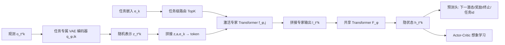

# Mixture-of-World Models: Scaling Multi-Task Reinforcement Learning with Modular Latent Dynamics

**会议**: ICLR 2026  
**OpenReview**: [https://openreview.net/forum?id=qUQARlAx5y](https://openreview.net/forum?id=qUQARlAx5y)  
**代码**: 待确认  
**领域**: 强化学习 / 世界模型 / 多任务学习  
**关键词**: 多任务强化学习, 世界模型, Mixture-of-Experts, 模块化潜动力学, 样本效率  

## 一句话总结
用一组任务专属 VAE + 混合 Transformer 专家 + 共享骨干构成「世界模型混合体」(MoW)，配合梯度聚类与和谐损失，把单个 agent 训成能同时玩 26 个 Atari 游戏、做 50 个 Meta-World 任务的多任务世界模型，性能逼近 26 个单任务模型集成而参数减半。

## 研究背景与动机
- **领域现状**：基于世界模型的 MBRL（Dreamer、STORM、IRIS 等）在单任务视觉控制上靠「潜空间想象」拿到了极高的样本效率，但这些成果几乎全部局限于单任务设定。
- **现有痛点**：把世界模型推到多任务视觉域时，任务间在**观测外观**和**动力学**两个维度上都高度异质。单一的「monolithic」世界模型必须同时编码差异巨大的视觉特征、又要准确预测各任务专属的动力学，二者在实践中常常冲突，撑爆单体架构的容量；而视觉 MBRL 还要求高保真重建才能在潜空间训练策略，这点在 MTRL 里几乎无人解决。
- **核心矛盾**：仅靠「共享模型 + 任务 id 条件」在缺乏大量专家数据时往往不够；而为每个任务各训一个世界模型（如 STORM 集成 26 个）虽然有效，参数却随任务数线性膨胀，无法 scale。
- **本文目标**：构建一个**参数高效且样本高效**的多任务视觉世界模型，单个 agent 一次训练覆盖整套任务，性能逼近单任务集成但参数大幅压缩。
- **核心 idea**：**模块化 + 稀疏专家**——感知端用任务自适应的模块化 VAE 保证重建保真度，动力学端用「任务条件专家 Transformer + 共享骨干」的混合结构捕捉异质动力学，再用基于梯度相似度的聚类把相近任务的模块合并以省参数。

## 方法详解

### 整体框架
MoW 把世界模型拆成两个层级的模块：**感知模块**用一组类别型 VAE 把高维图像压成紧凑潜表示，每个任务（或任务簇）配一对专属编解码器；**时序模块**在潜空间建模动力学，由「混合专家 Transformer + 一个共享 Transformer」组成，专家负责任务专属动力学、共享骨干负责跨任务共性。专家由**任务级路由**（基于可学习任务嵌入 $e_k$）选取，整个世界模型端到端自监督训练，agent 完全在想象轨迹里学策略。

### 关键设计

**1. 模块化 VAE 感知端：用任务专属编解码器换重建保真度。** MTRL 视觉域里单个 VAE 难以同时压缩外观差异巨大的多任务图像，导致重建糊、潜空间想象失真。MoW 给每个任务簇分配一对专属编解码器 $(q_{\phi,i_k}, p_{\phi,i_k})$，后验 $z_t^k \sim q_{\phi,i_k}(z_t^k \mid o_t^k, e_k)$ 采样 32 类别 ×32 类的类别分布（直通梯度），重建 $\hat o_t^k \sim p_{\phi,i_k}(\hat o_t^k \mid z_t^k, e_k)$。可学习任务嵌入 $e_k$（$\|e_k\|_2=1$）条件化编解码。这样每个 VAE 只需精通自己那一簇任务的视觉，从而保住高保真重建——而重建质量正是潜空间策略学习的命门。

**2. 任务级路由的混合 Transformer 动力学：把 MoE 从 FFN 里解耦出来。** 作者刻意选择**任务级路由而非 token 级路由**：router 只吃任务嵌入 $e_k$，$S_k=\mathrm{Softmax}(\mathrm{MLP}(e_k))$，再 $W_k, J_k = \mathrm{TopK}(S_k, n_k)$ 选出激活专家。理由有二——其一，常规 Transformer 的 MoE 装在 FFN 上只建模特征的稀疏变换、抓不到时序依赖，于是 MoW 干脆把 MoE 整个从 Transformer 里拆出来挂在外面，让混合骨干直接学不同任务的动力学；其二，若按 token 路由，同一任务轨迹的不同 token 会激活不同专家，每个专家只看到片段、学到的是「碎片化动力学」，而任务级路由保证同一任务内专家激活一致，专家能学到完整连贯的时序结构。激活专家的输出拼成 $l_t^k$ 喂给共享 Transformer $F_\phi$ 产出隐状态 $h_t^k$；并对 softmax 温度做退火逼近 1，早期保持随机以均衡利用、后期渐趋确定以稳定优化。

**3. 任务预测头 + 平衡损失：让隐状态可判别、专家不塌缩。** 隐状态 $h_t^k$ 接四个预测头（下一潜态分布、奖励、终止、任务 id），其中**任务预测损失** $\mathcal L^{task}_{t,k}=\mathrm{CrossEnt}(\hat k, k)$ 显式逼隐状态包含足够的任务判别信息，提升想象的准确性。为防专家塌缩，加**平衡损失** $\mathcal L_{bal}=\|\sum_k W_k - \frac{KN_k}{N_e}\mathbf 1_{N_e}\|_2^2$——因为 MoW 是拼接专家特征而非加权求和，该损失主要鼓励所有专家都被激活，而非强求各任务激活分布一致。世界模型损失合并重建/奖励/终止/任务/动力学/表示六项（$\beta_1=0.5,\beta_2=0.1$）。

**4. 和谐损失抗梯度冲突 + 梯度聚类省参数。** MTRL 两大难题是跨任务梯度冲突和任务损失权重难调。MoW 用**和谐权重** $\mathcal L_H=\sum_k \frac{1}{\sigma_k}\mathcal L_k + \ln(1+\sigma_k)$ 自动调权抗冲突，无需额外梯度投影。参数效率来自**梯度聚类的 warmup 阶段**：先固定 replay buffer、只训单套 VAE 及其预测器若干步初始化动力学表示，再把参数复制到其余模块；warmup 后抽取每个任务的梯度向量（逐层平均降本），按梯度相似度聚类，决定哪些任务共享第 $i$ 套 VAE/预测器/critic（类似 HarmoDT）。这样相近任务共用模块，把模块数 $N_m$ 压到远小于任务数，实现参数随任务亚线性增长。

## 实验关键数据

### 主实验

| Benchmark | 方法 | 输入 | 指标 | 步数 | 参数 |
|---|---|---|---|---|---|
| Atari 100K (26 games) | STORM（26 个单任务模型集成） | Image | 114.2% 人类归一化 | 100K/game | 1977.5 MB |
| Atari 100K (26 games) | **MoW（单一统一模型）** | Image | **110.4%** | 100K/game | **972.5 MB（↓50%）** |
| Meta-World MT50 | MOORE | State | 72.9 ± 3.3 | 100M | — |
| Meta-World MT50 | **MoW（ours）** | **Image** | **74.5 ± 1.1** | **15M（300K/task）** | — |

MoW 单模型在 Atari 100K 上几乎追平 26 个单任务 STORM 集成，参数砍半；在 Meta-World MT50 上仅用视觉输入、15M 步就超过用状态输入训 100M 步的 MOORE，刷新 SOTA。

### 消融实验

| 配置 | 结果 |
|---|---|
| Vanilla STORM + 任务嵌入（多任务化） | **训练失败**，无法适配多任务 |
| Vanilla STORM + 多 VAE | 仍达不到 MoW 性能，动力学损失显著偏高，想象受损 |
| 专家数 3→12（聚类数固定） | 性能随专家数显著提升，12 专家即可覆盖 26 任务 |
| VAE 簇数 3→12（专家数固定） | 有提升但幅度较小 |

### 关键发现
- 简单地给共享 Transformer 加任务 id 在多任务视觉域直接训不动，证明模块化混合架构是必需而非锦上添花。
- 增加**专家 Transformer** 比增加 VAE 更能涨分，因为专家直接负责任务专属动力学建模；VAE 主要改善重建精度，专家数固定时其增益有限。
- 想象重建可视化显示 MoW 比多任务 vanilla STORM 的 16 步想象更清晰、跨任务不混淆。

## 亮点与洞察
- **把「重建保真」和「动力学异质」解耦到两个模块**：感知端用模块化 VAE 保重建、时序端用混合专家保动力学，直击 MTRL 视觉世界模型的核心矛盾。
- **任务级路由是个关键且反直觉的选择**：用任务嵌入而非 token 路由，换来同一任务内专家激活一致、学到完整时序结构，避免碎片化动力学。
- **梯度聚类把参数从「随任务线性」变「亚线性」**：用 warmup 阶段的任务梯度相似度决定模块共享，是参数减半的主因，而非单纯堆专家。

## 局限与展望
- 任务簇数 $N_m$ 与专家数 $N_e$ 仍是需要预设的关键超参，聚类在 warmup 一次性确定后固定，缺乏训练中动态重组任务簇的机制。
- 评测仍限于 Atari（26 game）与 Meta-World（50 task）两个相对封闭的任务集，未验证开放世界 / 真实机器人 / 任务数量级更大时的扩展性。
- 实验用单机多卡（4090）DDP，单游戏 100K 步约 3.5 小时，多任务联合训练的总开销与对硬件的依赖未充分讨论。
- 路由仅条件于任务嵌入，意味着同一任务始终走固定专家组合，对任务内阶段切换（如机器人操作的抓取→放置）是否需要更细粒度路由仍是开放问题。

## 相关工作与启发
- **世界模型**：Dreamer 系列（RSSM 长程想象）、STORM（定制 Transformer，Atari SOTA，本文主基线）、IRIS/Δ-IRIS（VQ-VAE 离散 token）、DIAMOND（像素空间扩散世界模型）——本文把这条线从单任务推向多任务视觉域。
- **MTRL 与 MoE**：MOORE、D2R 把 MoE 塞进 SAC 改善知识共享，但只在低维状态空间评测且受制于 model-free 的样本低效；TD-MPC2 虽做多任务 MBRL 但用状态输入并依赖专家数据。MoW 的差异是首个面向**高维视觉 + 在线交互**的多任务世界模型。
- **启发**：把 MoE「从 Transformer 内部 FFN 解耦到外部骨干级」的做法，以及「梯度相似度聚类决定模块共享」的思路，对其他需要在异质任务间平衡共享与专化的多任务架构（不限于 RL）都有参考价值。

## 评分
- **新颖性**: ⭐⭐⭐⭐ — 首个面向高维视觉的多任务世界模型，任务级路由 + 模块化 VAE + 梯度聚类的组合有清晰动机且各有针对性，不是简单拼装。
- **实验充分度**: ⭐⭐⭐⭐ — Atari 100K + Meta-World 双 benchmark，含参数 scalability、专家/VAE 数量消融、与单任务集成的对比，较扎实；但任务集规模仍有限、缺更大规模压力测试。
- **写作质量**: ⭐⭐⭐⭐ — 方法叙述清晰，路由设计的两条理由、损失各项动机交代到位，图示（架构图 + 想象重建对比）直观。
- **价值**: ⭐⭐⭐⭐ — 给「通用世界模型」提供了一个参数高效、样本高效的可扩展模板，对走向 generalist agent 有实际意义。

<!-- RELATED:START -->

## 相关论文

- [\[ICLR 2026\] From Observations to Events: Event-Aware World Models for Reinforcement Learning](from_observations_to_events_event-aware_world_models_for_reinforcement_learning.md)
- [\[ICLR 2026\] Learning Massively Multitask World Models for Continuous Control](learning_massively_multitask_world_models_for_continuous_control.md)
- [\[ICML 2025\] Mastering Massive Multi-Task Reinforcement Learning via Mixture-of-Expert Decision Transformer](../../ICML2025/reinforcement_learning/mastering_massive_multi-task_reinforcement_learning_via_mixture-of-expert_decisi.md)
- [\[ICLR 2026\] One Model for All Tasks: Leveraging Efficient World Models in Multi-Task Planning](one_model_for_all_tasks_leveraging_efficient_world_models_in_multi-task_planning.md)
- [\[ICLR 2026\] On Predictability of Reinforcement Learning Dynamics for Large Language Models](on_predictability_of_reinforcement_learning_dynamics_for_large_language_models.md)

<!-- RELATED:END -->
