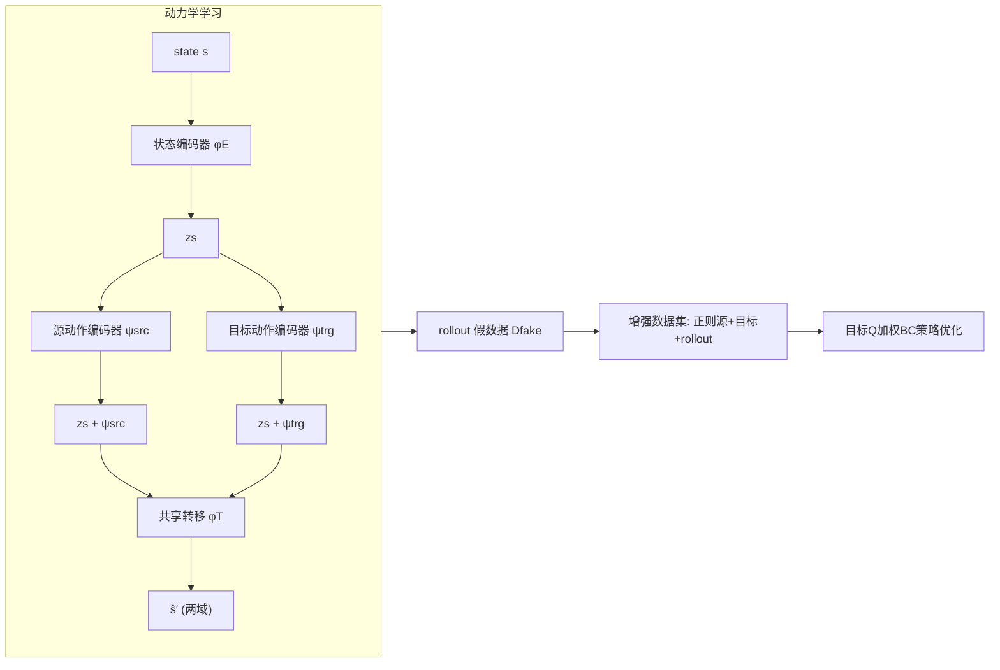

# MOBODY: Model-Based Off-Dynamics Offline Reinforcement Learning

**会议**: ICLR 2026  
**OpenReview**: [https://openreview.net/forum?id=7c0YS3cuno](https://openreview.net/forum?id=7c0YS3cuno)  
**代码**: 待确认  
**领域**: 强化学习 / 离线 RL / 域适应  
**关键词**: 离线强化学习, 动力学失配, 模型化 RL, 表示学习, 行为克隆  

## 一句话总结
MOBODY 把"动力学失配下的离线 RL"从"过滤/惩罚高偏移源数据"转向"直接学一个准确的目标域动力学模型并 rollout 探索"，用双动作编码器 + 共享状态/转移函数学到目标动力学，再配合目标 Q 加权的行为克隆做策略优化，在 MuJoCo/Adroit 上平均提升 25%–44%。

## 研究背景与动机
- **领域现状**：off-dynamics offline RL 假设有大量源域（模拟器）离线数据和极少量目标域（真实/部署）数据，两者奖励函数相同但转移动力学 $p_{src}(s'|s,a)\neq p_{trg}(s'|s,a)$，目标是仅用离线数据学出在目标域表现好的策略。典型比例 $|D_{src}|/|D_{trg}|$ 高达 200。
- **现有痛点**：主流方法分两类——**奖励正则化**（如 DARA 用域分类器估计动力学 gap 去惩罚源域奖励）和**数据过滤**（丢掉高偏移源转移）。两者本质都只用"低偏移区域"的数据训策略。
- **核心矛盾**：当动力学偏移很大、或目标域的高回报轨迹恰好落在高偏移区域时，低偏移数据里根本没有这些状态，策略无法被引导去探索它们，于是这类方法直接失效。
- **本文目标**：能不能**直接用目标域转移**优化策略，而不是局限于低偏移区，从而探索高回报、大偏移的区域？
- **核心 idea**：**[模型化范式]** 不去过滤数据，而是**学一个准确的目标域动力学模型**来 rollout 生成目标域转移供探索。难点在于目标数据太少：直接用合并数据学到的动力学会被源域主导（更像源域），pretrain-finetune 又抓不住两域差异。MOBODY 的关键观察是——**到达同一个 next state，两个域需要不同的动作**，于是用**分离的动作编码器**吸收域差异，同时**共享状态表示与转移函数**借源数据补结构知识。

## 方法详解

### 整体框架
MOBODY 分两阶段：先用表示学习同时学源/目标两域的动力学（核心是"分离动作编码器 + 共享状态编码器 + 共享转移函数"），再做模型化离线 RL——用学到的目标动力学 rollout 出"假数据"，结合正则化后的源数据与目标数据组成增强数据集，用目标 Q 加权的行为克隆训策略。

### 关键设计

**1. 动力学分解：分离动作编码器 + 共享状态/转移，借源数据补结构知识。** 这是整篇文章的核心观察落地。两个域虽然转移不同，但共享大量结构知识（如机器人的高层运动、位置）；而它们的差异体现在"达到同一 next state 所需的动作不同"。于是 MOBODY 把动力学拆成三件套：共享状态编码器 $z_s=\phi_E(s)$、**两套分离的动作编码器** $\psi_{src}/\psi_{trg}$、共享转移函数 $\phi_T$。两域分别建模为
$$\hat{s}'_{src}=\phi_T\big(z_s+\psi_{src}(z_s,a)\big),\quad \hat{s}'_{trg}=\phi_T\big(z_s+\psi_{trg}(z_s,a)\big),$$
其中"加性"形式 $z_s+\psi(z_s,a)$ 对应模型化 RL 常用的 $s'=s+f(s,a)$。这样源域 1M 数据可以帮忙训共享的 $\phi_E,\phi_T$，而域差异被压缩进各自的动作编码器，目标域只需极少数据就能学准。

**2. 三种损失协同训练动力学：转移损失 + 编码器损失 + 循环转移损失。** 单靠 MSE 转移损失 $\mathcal{L}_{dyn}=\frac1N\sum\|s'-\phi_T(z_s+\psi(z_s,a))\|^2$ 难以让动作编码器吸收域差异。MOBODY 补两个表示学习损失：**编码器损失**让 state-action 表示逼近 next-state 表示 $\mathcal{L}_{rep}=\frac1N\sum\||z_{s'}|_{\times}-(z_s+\psi(z_s,a))\|^2$（$|\cdot|_\times$ 为 stop-gradient），强迫 $\psi$ 编码进转移信息；**循环转移损失**用 VAE 思路：把 $\psi$ 置 0 时应有 $\hat s=\phi_T(\phi_E(s))$ 还原回原状态，于是把 $\phi_E$ 当编码器、$\phi_T$ 当解码器训
$$\mathcal{L}_{cycle}=\tfrac{1}{2N}\sum\sum_j(\mu^2+\sigma^2-\log\sigma^2-1)+\tfrac1N\sum\|s-\hat s\|^2.$$
循环损失既提升状态表示质量，又**缓解只用编码器损失时的 mode collapse**。三者合成的动力学目标见式 (6)，表示项权重 $\lambda_{rep}=1$（对其取值不敏感）。

**3. 奖励学习 + 不确定性惩罚。** 由于奖励是 $(s,a,s')$ 的函数且跨域一致，用源+目标合并数据同时拿**真 next state 和预测 next state** 训奖励模型 $\hat r(s,a,s')$（推理时只有预测的 $\hat s'$，所以训练就要见过它）。再按 MOPO 风格做不确定性量化：$\tilde r=\hat r-\beta\,u(s,a)$，$u$ 为 next-state 预测的不确定度，得到保守奖励避免在模型误差大的地方过度乐观。

**4. 目标 Q 加权行为克隆做策略优化。** 离线 RL 的核心难题是 OOD 动作的探索误差，off-dynamics 下更严重。普通行为克隆（TD3-BC）会把策略拉向源数据动作，但这些动作在目标域可能很差。受 AWR/IQL 启发，MOBODY 用**目标 Q 值**给 BC 加权——目标 Q 由增强数据 $D_{enhanced}=D_{src\_aug}\cup D_{trg}\cup D_{fake}$（正则源 + 目标 + rollout）训出，近似目标域 Q：
$$\pi=\arg\min_\pi -\mathbb{E}\big[\lambda Q(s,\pi(s))\big]+\mathbb{E}_{D_{src\_aug}\cup D_{trg}}\Big[\exp\!\big(\tfrac{Q(s,\pi(s))}{\frac1N\sum|Q|}\big)(\pi(s)-a)^2\Big].$$
这样**高目标 Q 的动作被上权重**，把策略推向"在目标动力学下表现好"的动作，而非高源 Q 或一视同仁地模仿所有离线动作。

## 实验关键数据

### 主实验（MuJoCo gravity/friction 偏移，medium 数据，3 seeds 归一化分数）
四个环境 × {gravity, friction} × {0.1, 0.5, 2.0, 5.0} 共 32 项设置；下表摘录有代表性的"大偏移"项：

| 环境/偏移 | 等级 | DARA | REAG | MOPO | TD3-BC | MOBODY |
|---|---|---|---|---|---|---|
| HalfCheetah Friction | 0.1 | 23.69 | 9.74 | 28.32 | 8.95 | **57.53** |
| Ant Gravity | 5.0 | 31.01 | 49.36 | 28.97 | 6.37 | **65.45** |
| Ant Friction | 5.0 | 7.80 | 9.53 | 13.89 | 10.06 | **31.17** |
| Walker2d Gravity | 0.1 | 20.12 | 26.56 | 41.98 | 36.48 | **65.85** |
| Walker2d Gravity | 5.0 | 5.44 | 4.61 | 5.65 | 5.12 | **46.05** |

- 总分上 MOBODY 相比第二好的 baseline REAG **提升 44%**，在 32 项里 28 项做到最优或次优。

### 关键发现
- **大偏移场景优势最显著**：在 gravity×5.0 / friction×5.0 等极端偏移下，所有 baseline 几乎崩到随机水平（~5 分），MOBODY 仍能拿到 27–65 分——印证"低偏移区域数据不够，必须模型化探索"。
- **kinematic/morphology 偏移**也有约 **25% 平均提升**，覆盖到 Adroit 的 Pen/Door 操作任务。
- **MOPO 直接用合并数据学动力学失败**（Figure 1），因为源转移主导导致学到的更像源动力学，验证了"分离动作编码器学准目标动力学"的必要性。

### 消融

| 移除组件 | 预期影响 |
|---|---|
| 分离动作编码器 → 单一编码器 | 退化为合并动力学，目标动力学不准 |
| 去掉循环转移损失 | 表示 mode collapse，动力学质量下降 |
| 目标 Q 加权 BC → 普通 BC | 克隆源域动作，目标域表现下降 |
| 目标 Q 加权 → AWR 风格 | 论文验证目标 Q 加权更优 |

## 亮点与洞察
- **范式转变**：把 off-dynamics offline RL 从"挑数据/惩罚奖励"重新框定为"学准目标动力学再探索"，第一个为该设定提出可行的模型化方案。
- **"同 next state 需不同动作"这个观察非常干净**：直接导出"共享状态/转移 + 分离动作编码器"的结构，把跨域共享与域特异性优雅解耦。
- **目标 Q 加权 BC 是一个轻量且通用的正则**，把 AWR 的"用优势加权"迁移到 off-dynamics 的"用目标 Q 加权"，思路简单且经验证。

## 局限与展望
- 极少量目标数据（5000 transitions）下学动力学仍依赖源域结构相似性假设，若两域共享结构很弱（奖励/状态语义都变），方法收益可能下降。
- 假设跨域奖励函数完全一致且为 $(s,a,s')$ 的函数，现实中奖励本身也可能偏移。
- 引入 VAE 表示 + 双编码器 + UQ，组件较多，超参（$\beta,\alpha,\lambda_{rep}$）和工程实现较重；虽称对 $\lambda_{rep}$ 不敏感，整体调参成本仍高于纯 model-free baseline。
- 仅在仿真（MuJoCo/Adroit）验证，真实 sim-to-real 部署的效果待考。

## 相关工作与启发
- **off-dynamics offline RL**：DARA、BOSA、SRPO、REAG 等奖励正则化/数据过滤方法，是本文要超越的主线 baseline。
- **模型化离线 RL**：MOPO 提供了"rollout + 不确定性惩罚"的范式，MOBODY 在其上替换了动力学学习的核心。
- **表示学习 for dynamics**：TD-MPC 系列的"state-action 表示逼近 next-state 表示"被借来当编码器损失；VAE（Kingma）思路被改造成循环转移损失。
- **行为克隆/AWR**：TD3-BC 的 BC 正则与 IQL/AWR 的优势加权，被融合成目标 Q 加权 BC。
- **启发**：在"大量分布外/源域数据 + 极少目标数据"的迁移问题里，与其过滤不可信数据，不如把分布差异显式建进一个轻量模块（这里是动作编码器），让模型主动生成目标域可探索的数据——这个思路可推广到更广的离线域适应场景。

## 评分
- **新颖性**: ⭐⭐⭐⭐ 首次为 off-dynamics offline RL 提出可行的模型化范式，"同 next state 需不同动作 → 分离动作编码器"的切入点干净且有洞察。
- **实验充分度**: ⭐⭐⭐⭐ 覆盖 MuJoCo 4 环境 × gravity/friction 4 等级 + kinematic/morphology + Adroit，与 7 个 baseline 对比，大偏移优势明确；3 seeds 略少。
- **写作质量**: ⭐⭐⭐⭐ 动机—观察—方法逻辑清晰，损失函数与架构图配合到位。
- **价值**: ⭐⭐⭐⭐ 在 sim-to-real / 域适应 RL 这一现实问题上给出实质提升，方法组件（目标 Q 加权 BC、分离动作编码器）可被后续工作复用。

<!-- RELATED:START -->

## 相关论文

- [\[ICLR 2026\] Dual-Robust Cross-Domain Offline Reinforcement Learning Against Dynamics Shifts](dual-robust_cross-domain_offline_reinforcement_learning_against_dynamics_shifts.md)
- [\[ICLR 2026\] Masked Skill Token Training for Hierarchical Off-Dynamics Transfer](masked_skill_token_training_for_hierarchical_off-dynamics_transfer.md)
- [\[ICLR 2026\] ROMI: Model-based Offline RL via Robust Value-Aware Model Learning with Implicitly Differentiable Adaptive Weighting](model-based_offline_rl_via_robust_value-aware_model_learning_with_implicitly_dif.md)
- [\[ICLR 2026\] Squeeze the Soaked Sponge: Efficient Off-Policy RFT for Large Language Model](squeeze_the_soaked_sponge_efficient_off-policy_rft_for_large_language_model.md)
- [\[ICLR 2026\] In-Context Compositional Q-Learning for Offline Reinforcement Learning](in-context_compositional_q-learning_for_offline_reinforcement_learning.md)

<!-- RELATED:END -->
