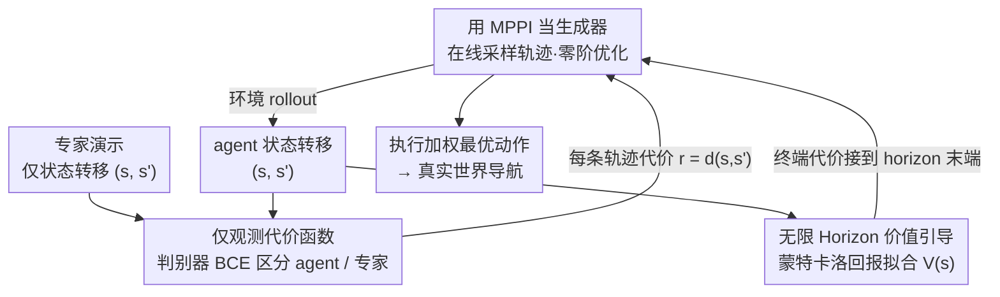

# Model Predictive Adversarial Imitation Learning for Planning from Observation

**会议**: ICLR 2026  
**arXiv**: [2507.21533](https://arxiv.org/abs/2507.21533)  
**代码**: 无  
**领域**: 模仿学习 / 机器人规划  
**关键词**: 对抗模仿学习, 模型预测控制, 逆强化学习, 仅观测学习, MPPI

## 一句话总结
提出 MPAIL（Model Predictive Adversarial Imitation Learning），将 MPPI 规划器嵌入对抗模仿学习循环，首次实现端到端的仅观测规划框架（Planning-from-Observation），在泛化性、鲁棒性、可解释性和样本效率上全面优于基于策略的 AIL 方法，并在真实世界机器人导航中从单条观测演示成功部署。

## 研究背景与动机

- **领域现状**: 逆强化学习（IRL）通过从专家行为推断奖励函数来实现模仿学习，已广泛应用于自动驾驶、社交导航和路径规划等领域。在高维连续控制中，学到的 IRL 奖励通常通过模型预测控制（MPC）进行实时部署——先离线用 RL 解 IRL、再用 MPC 在线规划，形成"IRL-then-MPC"的主流范式。同时，对抗模仿学习（AIL，如 GAIL）在算法复杂度和样本效率上取得了显著进步。

- **现有痛点**: (1) IRL-then-MPC 是两步分离过程：训练时用 RL 解的内循环策略与部署时用的 MPC 规划器是完全独立的，导致训练中学到的奖励未针对 MPC 部署进行优化，需要额外手动调参；(2) 策略式 AIL（如 GAIL、AIRL）依赖黑盒 RL 策略网络，难以施加安全约束，缺乏可解释性，在部分可观测的真实场景中表现脆弱；(3) 学到的奖励和价值函数在策略式 AIL 中被严重低估——部署时只用策略网络，完全丢弃了奖励函数。

- **核心矛盾**: AIL 的理论优势（统一奖励学习和策略优化）与实际机器人部署需求（需要 MPC 的安全性、可解释性和在线优化能力）之间存在根本性脱节。

- **本文目标**: 如何将规划（MPC）原生嵌入 AIL 循环，实现端到端的"学习规划器"——同时学习奖励和改进基于规划的 agent，且仅需观测状态（无需专家动作）。

- **切入角度**: 观察到 MPPI（Model Predictive Path Integral）控制器的目标函数天然是 KL 约束的代价最小化问题，与 AIL 内循环的最大熵 RL 目标在数学上等价——这意味着可以直接用 MPPI 替代 RL 策略作为 AIL 的"生成器"。

- **核心idea**: 用 MPPI 规划器替换 AIL 中的 RL 策略，规划器在每个时间步在线求解新策略（"deconstructed policy"），同时学习判别器作为代价函数和价值函数做超出规划 horizon 的推理。不需要持久化的策略网络，而是要求奖励函数具备泛化能力。

## 方法详解

### 整体框架
MPAIL 把 GAIL 的对抗循环原封不动地保留下来，唯一动的地方是"生成器"：原来生成器是一张要靠 RL 慢慢训出来的策略网络，现在换成一个每步在线求解的 MPPI 规划器。一轮训练里，MPPI 在环境中 rollout 一批动作序列、用判别器给每条轨迹打代价、加权求出当前最优动作并执行；判别器则用 BCE 损失去区分 agent 走出的状态转移和专家的状态转移；价值网络拿蒙特卡洛回报拟合一个终端代价，接到 MPPI rollout 的末端，让短视规划器看到 horizon 之外。与 GAIL 最不一样的一点是：判别器和价值更新完就结束了，没有"策略更新步"——因为策略不是一张要存下来的网，而是 MPPI 在每个状态现场算出来的。

### 关键设计

**1. 用 MPPI 当 AIL 的生成器：让规划器本身成为被对抗的对象**

这是全文的理论支点。AIL 内循环本质上是一个 KL 约束的最大熵 RL 问题 $\min_\pi \mathbb{E}_\pi[c(s,s')] + \beta \text{KL}(\pi \| \bar{\pi})$，它的闭式解是对参考策略做指数加权 $\pi^*(a|s) \propto \bar{\pi}(a|s)\, e^{-\frac{1}{\beta}\bar{c}(s,a)}$。作者注意到 MPPI 在轨迹层面求解的恰好是同一个问题 $\min_\pi \mathbb{E}_{\tau \sim \pi}[C(\tau) + \beta \text{KL}(\pi(\tau)\|\bar{\pi}(\tau))]$，在均匀遍历 MDP 条件下二者严格等价——这意味着可以直接把 RL 策略抽掉、塞进一个 MPPI 规划器而不破坏 AIL 的数学结构。这么换之所以管用，是因为 MPPI 是零阶优化：它不把梯度反传进任何策略网络，而是每个时间步采样大量轨迹再加权平均出动作。于是泛化的担子从"策略网络要泛化到没见过的状态"挪到了"奖励函数要泛化"，而奖励通常比策略更简单、更有结构先验，OOD 表现自然更稳。

**2. 仅观测的状态转移代价函数：从看不到动作的演示里学**

代价函数定义在状态转移 $(s,s')$ 上而非状态-动作 $(s,a)$ 上，这一步直接决定了框架能不能"仅观测"。判别器写成 $D(s,s') = \sigma \circ d_\theta(s,s')$，奖励取它的 logit：$r(s,s') = \log D(s,s') - \log(1-D(s,s')) = d_\theta(s,s')$，是 AIRL 风格的定义，和价值函数耦合时更稳。之所以这样设计，是因为真实机器人场景里专家动作往往拿不到（比如只有一段视频），只观测状态转移是最通用的设定；而且在部分可观测下，$(s,s')$ 能编码运动方向这类单个 $s$ 表达不出来的信息。

**3. 无限 Horizon 的价值引导：让短视规划器看到 horizon 之外**

纯 MPPI 的 rollout 长度有限（实验里只有 3 米），但导航目标可能在 40 米外，短视规划必然走不到。解法是拿学到的价值函数 $V_\phi(s)$ 当 MPPI rollout 的终端代价：价值估计的是 $G_t = \mathbb{E}_\pi[R_{t+1} + \gamma R_{t+2} + \dots \mid S_t = s_t]$，用 TD 目标 $\nabla_\phi \mathbb{E}[(G_t - V_\phi(s))^2]$ 更新，再把 $V_\phi$ 加到规划 horizon 末端那个状态的代价上。这样规划器虽然只往前看 3 米，但末端那一脚的代价已经把"再往后走会怎样"的全局信息折进去了，短视的局部规划因此获得了全局意识，任务 horizon 可以做到规划 horizon 的十几倍。

### 损失函数 / 训练策略
判别器用标准 BCE $\nabla_\theta [\mathbb{E}_{d^\pi}[\log D_\theta(s,s')] + \mathbb{E}_{d^{\pi_E}}[\log(1 - D_\theta(s,s'))]]$，并加谱归一化（Spectral Normalization）稳住对抗训练；价值函数最小化蒙特卡洛回报的 MSE $\nabla_\phi \mathbb{E}[(G_t - V_\phi(s))^2]$，所有方法统一用 GAE-$\lambda$ 估计回报。与 GAIL/AIRL 不同，更新完这两个网络就直接交给 MPPI 在线求解，没有额外的策略梯度步。训练中 MPPI 的温度 $\lambda$ 会逐步衰减，防止早期分布坍缩；全部超参数跨所有实验保持一致。

## 实验关键数据

### 主实验

**真实世界导航实验（Real-Sim-Real，从单条观测轨迹学习）**:

| 方法 | 最大 CTE (m) | 平均 CTE (m) | 平均速度 (m/s) |
|------|-------------|-------------|---------------|
| Expert | - | - | 1.0 |
| GAIL | 1.29 | 0.56 | 0.37 |
| IRL-MPC | 1.28 | 0.37 | 0.30 |
| **MPAIL** | **0.76** | **0.17** | **0.70** |

MPAIL 的平均交叉轨迹误差仅 0.17m，比 GAIL 低 70%；速度保持在 0.70 m/s，是 GAIL 的近 2 倍、最接近专家的 1.0 m/s。GAIL 在真实部署中持续跑偏或陷入原地转圈，多种初始构型均失败。

### 消融实验

**OOD 泛化实验（导航任务，初始位置从 1×1 扩展到 40×40 m）**:

| 方法 | ID 性能 | 近 OOD | 远 OOD | 极端 OOD |
|------|--------|--------|--------|---------|
| GAIL (策略式) | 好 | 差 | 很差 | 随机 |
| BC (需要动作) | 一般 | 差 | 很差 | 随机 |
| MPAIL (先验模型) | 好 | 好 | 好 | 仍可导航 |
| MPAIL (在线模型) | 好 | 好 | 中 | 路径较长但可达 |

MPAIL 的规划 horizon 仅 3 米，但任务 horizon 可达规划 horizon 的 15 倍。说明学到的代价函数和价值函数也成功泛化到了 OOD 状态。策略网络即使在初始面向目标但稍偏离数据分布时就会失败——表现出极其脆弱的表征。

**效率对比（导航任务 + CartPole）**:

| 方法 | 导航-4 demo | 导航-收敛速度 | CartPole |
|------|-----------|-------------|----------|
| GAIL | 收敛 | 慢（2x 交互数） | 最快 |
| AIRL | 不收敛 | - | 与 MPAIL 相当 |
| MPAIL | 收敛 | 快（<50% 交互数）| 可比 |

### 关键发现
- **奖励部署至关重要**: 策略式 AIL 学到了奖励却在部署时完全丢弃——这是一个根本性限制。MPAIL 在线重新引入奖励，将泛化负担从策略转移到奖励函数
- **端到端训练优于分离部署**: IRL-MPC 使用与 GAIL 完全相同的奖励和价值，仅在部署时改用 MPPI——性能已显著优于 GAIL，但仍不及 MPAIL。原因是 MPAIL 端到端训练使判别器被"逼"到更高水平
- **真实世界中策略式 AIL 极脆弱**: GAIL 在真实世界中的表现与仿真中的差距远超预期。部分可观测性导致奖励信号极弱（代价值范围 $(-0.022, -0.018)$ vs 仿真中 $(-3, 3)$），策略网络无法处理这种微弱且模糊的信号
- **MPPI 零阶优化的效率**: 虽然 MPPI 没有梯度反传到策略，但在导航任务上收敛速度反而是 GAIL 的 2 倍以上——验证了 MPAIL 作为模型基方法的样本效率优势
- **Wall Clock Time**: MPPI 2 次迭代比 GAIL(PPO) 快约 10%，5 次迭代慢约 10%——实际计算开销可控

## 亮点与洞察
- **IRL 和 MPC 的数学统一**: MPPI 的 KL 约束轨迹优化目标与 AIL 内循环的最大熵 RL 目标在均匀遍历 MDP 下严格等价。这不仅是工程上的集成，而是揭示了控制论和对抗学习之间深层的数学联系。这个统一使得原本分离的训练和部署流程可以融为一体。
- **"解构策略"的哲学**: MPAIL 将策略解构为更基础的组件（代价 + 价值 + 模型 + 在线优化器），每个组件可以独立检查和修改。这种透明性对安全关键系统至关重要——你可以直接看到机器人想走的路径为什么代价低、为什么做出这个决策。
- **泛化范式转移**: 传统 AIL 要求策略网络泛化到未见状态，而 MPAIL 转为要求奖励函数泛化。由于奖励函数编码的是"意图"而非"如何执行"，通常具有更好的结构性和更低的复杂度，天然更易泛化。

## 局限与展望
- **未使用潜在空间规划**: 当前 MPAIL 直接在状态空间做 MPPI rollout，未采用潜在动力学模型。在高维空间（如图像输入）中，MPPI 的采样效率会急剧下降，需要像 TD-MPC2 那样的潜在状态规划扩展
- **温度衰减缺乏理论支撑**: 论文承认温度衰减策略目前是启发式的，虽然有效但缺乏理论分析
- **CartPole 上效率不占优**: 使用在线学习动力学模型的 MPAIL(OM) 在 CartPole 上不如 GAIL 高效，可能因为稀疏奖励信号 + 模型偏差 + 额外探索需求的叠加效应
- **仅在简单导航任务验证**: 真实实验仅在 RC 小车导航上验证，缺乏更复杂操控任务（如抓取、双臂协作）的评估
- **无策略先验**: 当前 MPAIL 没有使用 policy-like 的采样先验，MPPI 在高维动作空间中扩展受限

## 相关工作与启发
- **vs GAIL**: GAIL 用 PPO 策略作为 AIL 的生成器，部署时丢弃奖励只用策略。MPAIL 证明这种做法有根本缺陷——学到的奖励被严重浪费，策略网络难以泛化到 OOD 状态。在真实世界实验中 GAIL 完全失败而 MPAIL 成功
- **vs IRL-MPC**: IRL-MPC 是当前主流范式——先用 GAIL/IRL 训练奖励，再手动调到 MPC 上部署。MPAIL 证明端到端训练远优于分离部署：IRL-MPC 的奖励和价值直接来自 GAIL，因此继承了 GAIL 训练不充分的问题（因为奖励从未被 MPPI 挑战过）
- **vs TD-MPC2**: TD-MPC2 是 model-based RL 的 SOTA，使用潜在状态规划。MPAIL 目前在状态空间操作，但其框架天然兼容潜在动力学扩展，论文在 future work 中明确指出了这一方向

## 评分
- 新颖性: ⭐⭐⭐⭐⭐ MPPI 与 AIL 的数学等价性揭示、端到端 PfO 框架是全新贡献
- 实验充分度: ⭐⭐⭐⭐ 仿真导航 + 真实 RC 小车 + OOD 评估 + 效率对比 + Wall Clock Time，但缺乏更复杂任务
- 写作质量: ⭐⭐⭐⭐ 理论推导清晰严谨，实验动机和结论之间的逻辑链完整
- 价值: ⭐⭐⭐⭐⭐ 对安全关键系统的模仿学习有直接且实际的价值，开源实现降低了复现门槛

<!-- RELATED:START -->

## 相关论文

- [\[ICLR 2026\] Near-Optimal Second-Order Guarantees for Model-Based Adversarial Imitation Learning](near-optimal_second-order_guarantees_for_model-based_adversarial_imitation_learn.md)
- [\[ICLR 2026\] Latent Wasserstein Adversarial Imitation Learning](latent_wasserstein_adversarial_imitation_learning.md)
- [\[ICLR 2026\] On Discovering Algorithms for Adversarial Imitation Learning](on_discovering_algorithms_for_adversarial_imitation_learning.md)
- [\[ICLR 2026\] Predictive CVaR Q-Learning](predictive_cvar_q-learning.md)
- [\[ICLR 2026\] MIRACLE: Model-free Imitation and Reinforcement Learning for Adaptive Cut-Selection](miracle_model-free_imitation_and_reinforcement_learning_for_adaptive_cut-selecti.md)

<!-- RELATED:END -->
