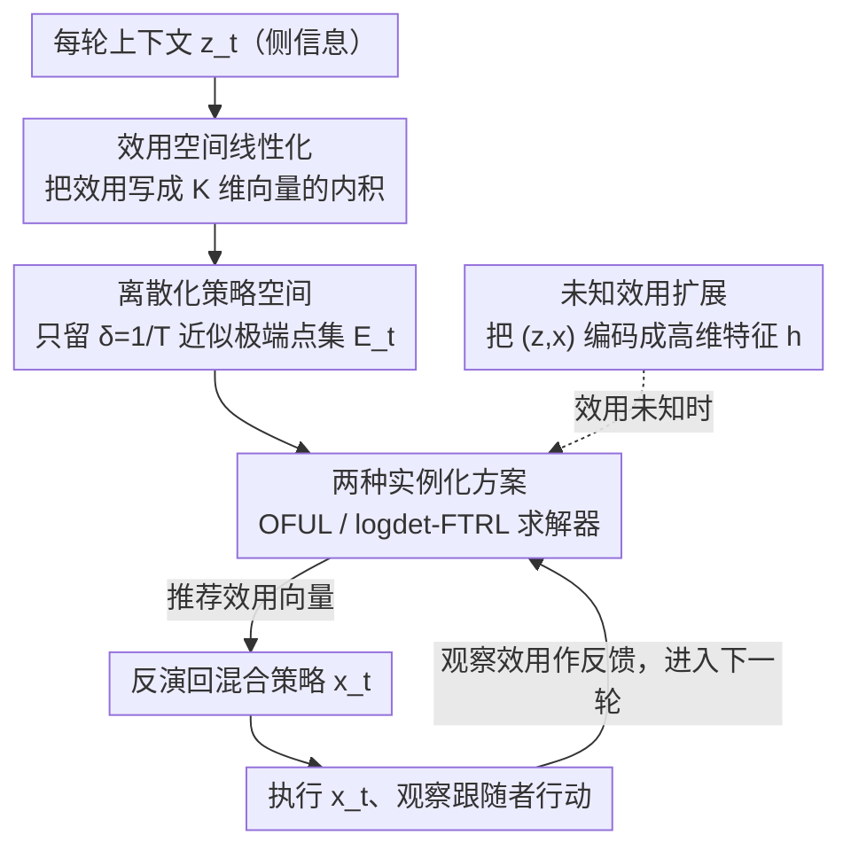

# Nearly-Optimal Bandit Learning in Stackelberg Games with Side Information

**会议**: ICLR 2026  
**arXiv**: [2502.00204](https://arxiv.org/abs/2502.00204)  
**代码**: 无  
**领域**: 强化学习  
**关键词**: Stackelberg博弈, 在线学习, 上下文赌臂, 侧信息, 遗憾界

## 一句话总结

本文通过将Stackelberg博弈中的领导者效用空间线性化，提出了一种约简到线性上下文赌臂问题的算法，在带侧信息的赌臂反馈设置下将遗憾界从 $\tilde{O}(T^{2/3})$ 改进到近似最优的 $\tilde{O}(T^{1/2})$。

## 研究背景与动机

Stackelberg博弈是一类广泛存在的顺序决策博弈（如机场安保、野生动物保护），领导者先承诺混合策略，跟随者再最优响应。在实际场景中，博弈的收益往往依赖于随时间变化的**侧信息**（如天气、机场拥挤程度），这使得问题更具挑战性。

Harris et al. (2024)首次形式化了带侧信息的上下文Stackelberg博弈在线学习问题。在完全反馈下已达到 $\tilde{O}(T^{1/2})$ 遗憾界，但在更现实的**赌臂反馈**（仅观察跟随者行动）下，最佳已知遗憾界为 $\tilde{O}(T^{2/3})$，与下界之间存在明显差距。

核心矛盾在于：领导者的效用是其混合策略的**非线性函数**（因为跟随者会最优响应），这使得直接应用标准赌臂算法十分困难。本文的切入角度是：虽然效用在策略空间中非线性，但在**效用空间**中却具有线性结构，可以利用这一结构实现近似最优学习。

## 方法详解

### 整体框架

本文要解决的是赌臂反馈下带侧信息的Stackelberg博弈在线学习——领导者每轮只能观察到跟随者的行动、看不到完整收益，导致已有方法卡在 $\tilde{O}(T^{2/3})$ 的遗憾。核心做法是一个约简框架（Algorithm 1）：把这个非线性的博弈学习问题整体翻译成一个**线性上下文赌臂**（linear contextual bandit）问题去解。每一轮里，框架先把当轮上下文 $\mathbf{z}_t$ 下的博弈结构**线性化**到效用空间，再把连续的混合策略空间**离散化**成有限的候选动作集；底层的线性赌臂求解器在这个集合上推荐一个效用向量，框架把它**反演**回领导者实际要执行的混合策略；策略执行后观察到的跟随者行动被翻译成赌臂的反馈喂回去，进入下一轮。难点全部集中在"如何把博弈结构编码成线性形式"和"如何把连续的策略空间裁成有限动作集"这两件事上。

### 关键设计

**1. 效用空间线性化：把非线性的领导者效用改写成内积**

领导者效用之所以是混合策略的非线性函数，是因为跟随者会随策略变化切换最优响应。本文绕开这一点的办法是换一个表示空间：对给定上下文，定义效用向量
$$\mathbf{u}(\mathbf{z},\mathbf{x}) = [u(\mathbf{z},\mathbf{x},b_1(\mathbf{z},\mathbf{x})),\dots,u(\mathbf{z},\mathbf{x},b_K(\mathbf{z},\mathbf{x}))]^\top,$$
它把"面对 $K$ 种跟随者类型时各自的领导者效用"列成一个 $K$ 维向量。于是某一轮真实发生的效用就能写成一个内积 $u(\mathbf{z}_t,\mathbf{x}_t,b_{f_t}(\mathbf{z}_t,\mathbf{x}_t)) = \langle \mathbf{u}(\mathbf{z}_t,\mathbf{x}_t), \mathbf{1}_{f_t} \rangle$，其中 $\mathbf{1}_{f_t}$ 是当前真实跟随者类型的指示向量。关键是利用了**跟随者类型数 $K$ 有限**这一结构——非线性被吸收进了"选哪个类型"的离散选择里，剩下的部分恰好是线性的，从而可以直接套用成熟的线性上下文赌臂机器，而不必针对博弈重新设计估计器。

**2. 离散化策略空间：把无限的混合策略裁成有限的近似极端点集**

线性赌臂算法要求动作集是有限的，但领导者的混合策略空间是连续的。本文对每个上下文 $\mathbf{z}_t$，只保留所有"上下文最优响应区域"的 $\delta$-近似极端点，构成有限集合 $\mathcal{E}_{\mathbf{z}_t}(1/T)$ 作为候选动作。直觉是：领导者效用在每个最优响应区域内是线性的，最优解一定落在区域的极端点上，因此只需在这些极端点上搜索就够了。取 $\delta = 1/T$ 的近似精度保证了离散化带来的偏差只贡献 $O(1)$ 的额外遗憾，几乎不影响整体的 $\sqrt{T}$ 阶。

**3. 两种实例化方案：用不同的线性赌臂求解器覆盖两类对手**

约简框架本身与底层求解器解耦，因此可以按对手性质换不同的线性赌臂算法。在**对抗上下文 + 随机跟随者**下，套用 OFUL（Abbasi-Yadkori et al., 2011），靠乐观原则在线估计跟随者类型分布 $\mathbf{p}^*$，得到 $\tilde{O}(K\sqrt{T})$ 的遗憾；在**随机上下文 + 对抗跟随者**这一更难的设置下，改用 logdet-FTRL（Liu et al., 2023），靠 log-determinant 正则化去对抗跟随者的非随机性，得到 $\tilde{O}(K^{2.5}\sqrt{T})$ 的遗憾。两套结果都把赌臂反馈下的遗憾从 $\tilde{O}(T^{2/3})$ 拉回到了 $\tilde{O}(T^{1/2})$。

**4. 未知效用函数的扩展：在效用未知时仍保住 $\sqrt{T}$**

前面三点假设领导者效用函数已知。当效用未知、但满足线性假设 $u(\mathbf{z},a_l,a_f) = \langle \mathbf{z}, U(a_l,a_f) \rangle$ 时，本文通过把上下文与动作组合编码成高维特征向量 $\mathbf{h}(\mathbf{z},\mathbf{x}) \in \mathbb{R}^{d \times K \times A_l \times A_f}$，把"未知效用"也吸收进同一个线性赌臂框架里一起估计，仍能保持 $\tilde{O}(\sqrt{T})$ 的遗憾——代价只是遗憾界里多出一个多项式的维度因子。

## 实验关键数据

### 主实验

| 设置 | 指标 | Alg1-OFUL | 随机基线 | 最优策略 |
|------|------|-----------|----------|----------|
| 4类型/4动作/d=2 | 累积效用(T=200) | 接近最优 | 远低于最优 | 最高 |
| 同上 | 累积遗憾(T=200) | 亚线性增长 | 线性增长 | 0 |

### 消融实验

| 配置 | 关键指标 | 说明 |
|------|---------|------|
| Alg1-OFUL vs Harris算法3 | 累积效用 | 本文方法显著优于先前方法 |
| 跟随者效用依赖上下文 | 适用性 | 先前方法不适用，本文方法适用 |

### 关键发现
- 算法在合成实验中经验性地胜过先前方法
- 线性化约简显著简化了算法设计，无需每轮应用Carathéodory定理
- 结果同时适用于二次价格拍卖和贝叶斯信息设计等应用场景

## 亮点与洞察

- **优雅的约简思路**：通过在效用空间而非策略空间操作，将非线性问题完美线性化
- **闭合了理论差距**：将赌臂反馈遗憾从 $\tilde{O}(T^{2/3})$ 改进到与下界匹配的 $\tilde{O}(T^{1/2})$
- **广泛的适用性**：框架可应用于拍卖、信息设计等多种Stackelberg结构的问题

## 局限与展望

- 最坏情况下每轮运行时间为指数级（继承了Stackelberg博弈的NP难度）
- 需要已知跟随者效用函数（虽然已放宽到未知领导者效用）
- 实验规模较小（T=200，4类型），缺乏大规模验证

## 相关工作与启发

- 与Bernasconi et al. (2023)概念上相关，但处理了更复杂的上下文设置
- 离散化技术可启发其他连续动作空间在线学习问题
- 未知效用扩展的线性假设可能进一步放宽

## 评分
- 新颖性: ⭐⭐⭐⭐ 约简思路简洁而有效，但基础工具（OFUL等）为已有
- 实验充分度: ⭐⭐⭐ 主要为理论贡献，实验较简单
- 写作质量: ⭐⭐⭐⭐⭐ 论述清晰，理论严谨
- 价值: ⭐⭐⭐⭐ 完整解决了一个开放的理论问题

<!-- RELATED:START -->

## 相关论文

- [\[ICLR 2026\] Learning to Play Multi-Follower Bayesian Stackelberg Games](learning_to_play_multi-follower_bayesian_stackelberg_games.md)
- [\[ICML 2026\] Learning in Structured Stackelberg Games](../../ICML2026/reinforcement_learning/learning_in_structured_stackelberg_games.md)
- [\[ICLR 2026\] Reevaluating Policy Gradient Methods for Imperfect-Information Games](reevaluating_policy_gradient_methods_for_imperfect-information_games.md)
- [\[ICLR 2026\] Look-ahead Reasoning with a Learned Model in Imperfect Information Games](look-ahead_reasoning_with_a_learned_model_in_imperfect_information_games.md)
- [\[ICLR 2026\] Solving Football by Exploiting Equilibrium Structure of 2p0s Differential Games with One-Sided Information](solving_football_by_exploiting_equilibrium_structure_of_2p0s_differential_games_.md)

<!-- RELATED:END -->
