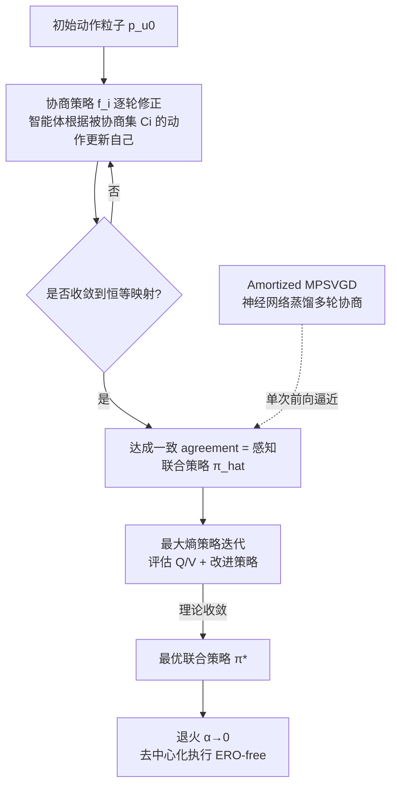

# Negotiated Reasoning: On Provably Addressing Relative Over-Generalization

**会议**: ICLR 2026  
**OpenReview**: [https://openreview.net/forum?id=FmvBrKubtw](https://openreview.net/forum?id=FmvBrKubtw)  
**代码**: 待确认  
**领域**: 多智能体强化学习 / 合作博弈  
**关键词**: relative over-generalization, MARL, negotiated reasoning, Stein variational gradient descent, maximum entropy RL, CTDE  

## 一句话总结
本文首次给 MARL 中的"相对过度泛化（RO）"问题做了形式化定义，并证明只要满足"一致性推理"条件就能 provably 避免 RO，进而提出基于 Stein 变分梯度下降的协商式推理算法 SVNR——这是第一个可证明消除 RO 的 MARL 方法。

## 研究背景与动机

**领域现状**：在完全合作的多智能体强化学习（MARL）里，智能体的目标是最大化团队回报，但常常会陷入次优合作均衡。这种现象被称为相对过度泛化（Relative Over-generalization, RO）：每个智能体把自己的策略过度拟合到"队友在探索期的随机行为"上，于是变得过度保守，类似认知科学里"一朝被蛇咬，十年怕井绳"。典型例子是 Particle Gather——两个粒子需要同时到达地标才有奖励，但单独到达会被惩罚，结果智能体学会了集体远离地标这一安全但次优的策略。

**现有痛点**：业界有两条路线对付 RO——信用分配（lenient learning、value decomposition、reward shaping）和赋予推理能力（recursive reasoning 等以自我为中心建模他人）。这两条路线在实验上都有成效，但**都缺乏坚实的理论基础**：少数工作证明了算法收敛性或矩阵博弈最优性，但**没有任何工作给 RO 下过形式化定义**。

**核心矛盾**：现有 RO 定义建立在"经验收敛后的联合策略"上，这意味着只能事后判断一个方法是否陷入 RO，无法在训练前/训练中分析。这就引出两个关键问题：**(1) RO 能否被可证明地避免？(2) 如果能，怎么设计一个 provably 避免 RO 的方法？**

**本文目标**：回答上述两个问题——既要给出 RO 可避免的充分条件，又要给出满足该条件的可落地算法。

**核心 idea**：**①拆解 RO** —— 把 RO 拆成训练期的"感知型 RO（PRO）"和执行期的"执行型 RO（ERO）"，证明只要二者在收敛时都被消除则 RO 被消除；**②一致性推理条件** —— 证明当每个智能体对他人行为的建模与他人真实最优策略一致（训练期）、与他人实际执行动作一致（执行期）时，RO 可被避免；**③协商式推理框架** —— 借鉴人类谈判与图模型消息传递，让智能体通过"协商策略"反复修正各自动作直到达成一致，并用 Stein 变分梯度下降把它实例化为 SVNR。

## 方法详解

### 整体框架
SVNR 的逻辑链条是"先立理论、再造算法、最后做高效近似"三段贯通。理论层先把 RO 拆成 PRO（训练期感知偏差）和 ERO（执行期分解损失），证明"一致性推理"是消除二者的充分条件；框架层提出协商式推理（NR），让智能体从一组初始动作粒子出发、按协商策略相互修正直到达成一致（agreement），并证明该 agreement 等于最优联合策略时即满足 PRO-free 条件；算法层用 (MP)SVGD 求出协商策略的闭式更新方向，配合严格嵌套的协商集与最大熵策略迭代，证明收敛到最优联合策略；工程层再用神经网络对协商过程做摊销（amortized），把多轮协商蒸馏进网络权重，让推理时一次前向就能逼近协商均衡，实现去中心化、无通信的执行。

### 关键设计

**1. 把 RO 拆成 PRO 与 ERO：让"训练前可分析"成为可能。** 本文的理论起点是把笼统的 RO 概念拆成两个可逐步检验的子概念。执行型 RO（ERO）定义为：若让智能体知道队友动作后能提升执行联合策略的效用，即 $\max_{\pi_i}\{U^{\pi_i(u_i|s,u_{-i})}\prod_{j\neq i}\bar\pi_j^*\} > U^{\prod_j \bar\pi_j^*}$，则存在 ERO——它刻画的是去中心化执行时因不知队友动作而损失的协调。感知型 RO（PRO）定义为：若某智能体在知道最优对手策略后能让自己的感知联合策略更接近最优联合策略，即 $\min_{\pi_i}D_{KL}(\pi_i\rho_i\|\pi_\alpha^*) > \min_{\pi_i}D_{KL}(\pi_i\pi_\alpha^*(u_{-i})\|\pi_\alpha^*)$，则存在 PRO——它刻画的是训练期因对队友建模 $\rho_i$ 有偏而产生的估计误差。直观上，PRO 是"用错误的条件分布去做变分推断导致自洽却非全局最优"，ERO 是"把相关/多模态的联合策略投影到独立边缘乘积 $\bar\pi(u)=\prod_i\pi_i(u_i)$ 时丢掉协调信号"。关键结论是：**只要所有智能体在收敛时都摆脱 ERO，就不会遭受 RO**。

**2. 一致性推理条件：可证明避免 RO 的充分条件。** 在上述拆解基础上，本文定义"一致性推理"——训练期每个智能体对他人的建模与他人最优策略一致（$\rho_i = \pi_\alpha^*(u_{-i})$），执行期对他人的建模与他人实际执行动作一致。当 $\rho_i$ 与真实最优对手策略对齐时，队友的探索随机性不会污染本智能体的策略更新，PRO 被避免；再让 $\alpha\to 0$ 使所有智能体确定性执行，执行期也不再受队友探索扰动，ERO 被避免。论文用一个单阶段两智能体博弈说明现有方法为何做不到：MADDPG 因用历史行为建模队友而陷入 PRO，MASQL 虽避免了 PRO 却在去中心化执行时把动作均匀分散从而陷入 ERO。这一条件把"消除 RO"这一目标转化成了一个可设计的算法约束。

**3. 协商式推理 + (MP)SVGD：满足一致性条件的可落地机制。** 为满足一致性推理，本文让智能体用 $M$ 个动作粒子表示初始感知联合策略，并各自持有协商（扰动）策略 $f_i(u_i\mid u_{C_i},s)$，在知道被协商集 $C_i$ 的动作后更新自己：$u_i^{\ell,k}=f_i^k(u_i\mid s, u_{C_i}^{\ell,k-1})$。当所有 $f_i^k$ 收敛到恒等映射、且最终 agreement 等于最优联合策略时（式 2 的两个条件），PRO-free 得证（定理 3.1）。关键在于如何求协商策略：对 KL 散度做链式分解后，更新单个智能体动作而固定其他智能体等价于最小化 $D_{KL}(p(u_i|s,u_{-i})p(u_{-i})\|\pi^*(u_i|s,u_{-i})p(u_{-i}))$，而这正好能用 (MP)SVGD 求解。其闭式最优方向为 $\phi_i^*(u_{C_i}) = \mathbb{E}_{y\sim p}[k_i(u_{C_i},y_{C_i})\nabla_{y_i}\log\pi^*(y_i|y_{C_i}) + \nabla_{y_i}k_i(u_{C_i},y_{C_i\setminus\{i\}})]$，给出优化 KL 的最速下降方向。这一机制建立在 RKHS 中的概率测度输运（Stein 变分梯度流）上，本质是在策略分布空间做均衡选择，而非通信式 MARL 那种状态估计。

**4. 严格嵌套协商集 + 最大熵策略迭代：把"逼近最优"升级为"可证明收敛到最优"。** 仅有协商方向还不够，必须保证协商收敛到恒等映射且 agreement 恰好是最优联合策略，这取决于协商集 $\{C_i\}$ 的设计。本文证明当 $\{C_i\}$ 严格嵌套（如 $C_i=\{1,\dots,i\}$，即自回归式因子分解）时，协商过程收敛且 agreement 严格等于最优联合策略；放松严格嵌套则带来由信息投影刻画的有界近似误差。在此之上，论文把 SVNR 架在最大熵策略迭代上：定义软 Bellman 算子 $\Gamma^{\hat\pi}Q(s_t,u_t):=r_t+\gamma\mathbb{E}[V(s_{t+1})]$，证明联合策略评估收敛（引理 4.1）、严格嵌套下策略改进单调（引理 4.2 $Q^{\hat\pi'}\geq Q^{\hat\pi}$），最终 SVNR 策略迭代收敛到最优联合策略 $\pi^*$（定理 4.3）；再结合定理 3.2 的退火 $\alpha\to 0$，得到 ERO-free 的执行联合策略。

**5. Amortized MPSVGD：用神经网络蒸馏协商动态，换来去中心化高效执行。** 理论版 SVNR 用粒子表示联合策略、在状态与策略上做嵌套期望，计算与存储都极其昂贵。工程上本文用神经网络把每个智能体的策略参数化为随机映射 $u_i=f_{\psi_i}(\cdot|\xi_i,\xi_{C_i},s)$（把高斯噪声映射为动作分布），目标变成 $\arg\min_\psi KL(p_\psi(\cdot|s,\xi)\|\hat\pi(u))$。不去克隆整条协商轨迹，而是用增量式更新让网络直接逼近协商均衡（不动点）：MPSVGD 给出最贪心的更新方向 $\Delta f_i^\psi$，再反传到映射网络 $\psi_i$。如此训练后网络把多轮协商动态蒸馏进权重，**推理时单次前向（$K=1$）即可逼近均衡分布**，避免昂贵的内循环优化。同时用重要性采样把 Bellman 评估转成随机优化 $\min_\theta \mathbb{E}[\tfrac12(r+V^\theta(s_{t+1})-Q^\theta(s,u))^2]$。这样 SVNR 训练期借 CTDE 用全局信息协调，执行期则完全去中心化、无通信。

## 实验关键数据

环境覆盖两个微分博弈（Two Modalities 测 PRO、Max of Three 测 ERO）、Particle Gather，以及 4 个 MaMuJoCo 连续控制任务。对比 RO 相关推理方法（MADDPG、MASQL、PR2、ROMMEO、MMQ）及通用强基线（MAPPO、QMIX、FACMAC），所有最大熵方法统一网络骨架与熵退火表。

### 主实验表格（MaMuJoCo 测试回报，5 seed）

| 方法 | HalfCheetah-2x3 | HalfCheetah-1p1 | Ant-2x4 | Walker2d-2x3 |
|------|---|---|---|---|
| **SVNR (Ours)** | **8853 ± 212** | **423 ± 89** | **536 ± 31** | **1678 ± 275** |
| PR2 | 8662 ± 45 | 381 ± 11 | 354 ± 58 | 1422 ± 79 |
| ROMMEO | 8305 ± 127 | 296 ± 62 | 424 ± 60 | 1399 ± 32 |
| QMIX | 8263 ± 618 | 3 ± 27 | 212 ± 209 | 495 ± 243 |
| FACMAC | 8210 ± 584 | 131 ± 72 | 398 ± 36 | 536 ± 205 |
| MAPPO | 6087 ± 1177 | 15 ± 138 | 87 ± 135 | 672 ± 59 |
| MADDPG | 112 ± 135 | −561 ± 67 | 108 ± 26 | 529 ± 33 |
| MASQL | 56 ± 65 | −490 ± 86 | 225 ± 34 | 332 ± 18 |
| MMQ | −134 ± 16 | −524 ± 37 | 116 ± 53 | 487 ± 72 |

SVNR 在 4 个任务上全部第一，对 MAPPO/QMIX/FACMAC 通用基线优势尤其明显，对 PR2/ROMMEO 也稳定领先。

### 微分博弈与 Particle Gather（定性/收敛行为）

- **Two Modalities（PRO 测试）**：最优感知联合策略应同时捕获 $(−5,−5,3)$ 与 $(7,7,−3)$ 两个回报为 10 的模态。可视化显示**只有 SVNR 同时捕获两个模态**，MADDPG/MASQL/PR2/ROMMEO/MMQ 全部收敛到单一模态。
- **Max of Three（ERO 测试）**：通过缩小 $s_2$（1.5/2.0/3.0）加重 ERO。MADDPG 在所有设置下都困在局部最优（回报 0）；MASQL/PR2/ROMMEO 仅在最简单的 $s_2=3.0$ 才能偶尔跳出且方差巨大；**SVNR 在全部设置下都稳定收敛到全局最优**。
- **Particle Gather**：除 PR2/MADDPG 困在局部最优外其余基线收敛到最差解，**SVNR 稳定跳出局部最优收敛到全局最优**。

### 消融实验

| 维度 | 设置 | 关键发现 |
|------|------|---------|
| SVGD 粒子数 $M$ | 16→64 | 性能呈宽广平台，甜点区 $M\in\{32,40\}$；训练时间约随 $M$ 线性增长 |
| 智能体数量 | 2→3→4 | 归一化性能近乎不变，墙钟成本仅小幅上升，摊销协商可扩展到中小团队 |
| 协商拓扑 | 严格嵌套 vs 部分嵌套 DAG vs 稀疏采样 | 严格嵌套回报最佳；部分嵌套以更低成本恢复大部分性能；激进稀疏采样（每智能体 1–2 邻居）在算力紧张时仍可用，退化幅度与理论近似间隙一致 |

### 关键发现
1. SVNR 是唯一同时通过 PRO（多模态捕获）与 ERO（跳出局部最优）双重压力测试的方法，验证了"一致性推理消除 RO"的理论。
2. 摊销机制让推理只需单次前向，在 MaMuJoCo 高维连续控制上取得 SOTA，证明理论可落地且高效。
3. 协商拓扑可调，提供了精度—算力的可控权衡，对偏离严格嵌套有鲁棒性。

## 亮点与洞察
- **理论填空**：第一次给 MARL 的 RO 下了可在训练前分析的形式化定义（PRO/ERO），并把"消除 RO"转译成"一致性推理"这一可设计的算法约束，从"事后判断"升级到"事前可证"。
- **机制视角独到**：把"协商"解释为 RKHS 中的 Stein 变分梯度流、在概率测度空间做均衡选择，与通信式 MARL 的状态估计彻底区分开——这是对 reasoning-based MARL 的本质澄清。
- **理论—工程闭环**：从粒子级 SVGD 的可证明收敛，到 amortized 神经网络蒸馏的单次前向推理，完整打通"可证明最优"到"去中心化可实现"。
- **直觉解释清晰**：PRO=变分偏差、ERO=分解损失、一致性推理=闭环，这套语言让抽象定义有了画面感。

## 局限与展望
- **理论假设偏理想**：核心收敛证明假设离散动作空间以套用不动点定理，连续域靠测度论统一与附录论证延展；严格嵌套虽保证精确可表示，但本质是自回归因子分解，最优协商集应覆盖更广的分解形式。
- **实践近似误差**：摊销实现相对精确软 Bellman 算子引入近似误差（附录给出有界性分析），单次前向逼近均衡在更复杂任务上的稳健性有待更大规模验证。
- **规模与基准**：实验团队规模为 2–4，benchmark 以 RO 主导的环境为主；论文自陈主贡献是理论，扩展到大规模智能体系统与更真实任务是后续方向。
- **协商集设计待自动化**：$\{C_i\}$ 的拓扑目前需人工指定（严格嵌套/DAG/稀疏），如何自适应学习最优协商拓扑值得探索。

## 相关工作与启发
- **对 RO 的两条传统路线**：信用分配（lenient learning → value decomposition → reward shaping）和推理赋能（PR2 的递归推理、ROMMEO 等以自我为中心建模他人）都缺理论根基；本文给出第一个 provably RO-free 方法，可视作给 reasoning-based 路线补齐理论。
- **与自回归策略分解的关系**：严格嵌套协商集即自回归因子分解的一种最优形式；相较前人对自回归分解的负面结论（无法利用他人最优动作、对顺序敏感、需中心化执行），本文证明任意严格嵌套协商集的最优性，并靠摊销协商实现去中心化执行。
- **与顺序更新类方法的区分**：HATRPO/序贯更新主要应对非平稳性，传递的是"某智能体更新对环境/后续智能体的影响"；SVNR 在协商中交换的是当前策略，专攻 RO。
- **方法工具血缘**：建立在最大熵 RL（soft Q-learning / SAC）、Stein 变分梯度下降及其摊销版本之上，把这些工具迁移到合作博弈的均衡选择问题。

## 评分
- **新颖性**: ⭐⭐⭐⭐⭐ 首次形式化 RO（PRO/ERO 拆解）+ 一致性推理充分条件 + 第一个可证明 RO-free 的 MARL 方法，理论贡献扎实且原创。
- **实验充分度**: ⭐⭐⭐⭐ 从 PRO/ERO 定向微分博弈到 MaMuJoCo 连续控制层层验证，消融覆盖粒子数/团队规模/协商拓扑；但团队规模偏小、benchmark 偏 RO 专用，更大规模真实任务有待补充。
- **写作质量**: ⭐⭐⭐⭐ 理论链条清晰，PRO/ERO/一致性推理配直觉解释（变分偏差/分解损失/闭环）易懂；公式密度高，部分关键证明依赖附录。
- **价值**: ⭐⭐⭐⭐⭐ 给困扰合作 MARL 多年的 RO 问题提供了首个理论基础与可落地解法，对推理式 MARL 与合作博弈的均衡选择研究有奠基意义。
