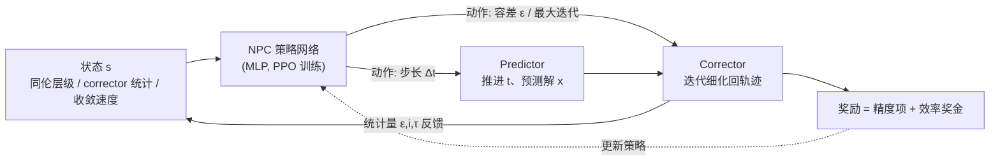

# Neural Predictor-Corrector: Solving Homotopy Problems with Reinforcement Learning

**会议**: ICLR 2026  
**OpenReview**: [https://openreview.net/forum?id=x6iodYWNty](https://openreview.net/forum?id=x6iodYWNty)  
**代码**: 待确认  
**领域**: 强化学习 / 学习型数值求解器  
**关键词**: Homotopy, Predictor-Corrector, Reinforcement Learning, Amortized Training, 鲁棒优化, 多项式求根, 采样  

## 一句话总结
本文把鲁棒优化、全局优化、多项式求根、采样这四类看似无关的难题统一进「同伦（homotopy）」范式，指出它们的求解器都是「预测-校正（predictor-corrector, PC）」结构，并用强化学习取代手工设计的步长与终止启发式，训练出一个能跨实例泛化、即插即用的通用神经求解器 NPC。

## 研究背景与动机
**领域现状**：同伦范式是一类求解难题的通用思想——先构造一条从「简单源问题」到「复杂目标问题」的连续插值路径 $H(x,t)$（$H(x,0)=f(x)$ 已知解、$H(x,1)=g(x)$ 是目标），再沿路径把源解逐步演化为目标解。它在各领域以不同名字出现：鲁棒优化里的 Graduated Non-Convexity (GNC)、全局优化里的 Gaussian Homotopy、多项式求根里的 homotopy continuation、采样里的 annealed Langevin dynamics。这些求解器在实践中几乎都采用 PC 结构：predictor 沿外层插值路径推进并预测解的位置，corrector 反复迭代把预测拉回真实解轨迹。

**现有痛点**：PC 求解器的步长调度（predictor 每步推进多少）和终止规则（corrector 迭代多少次 / 收敛容差多严）全靠**手工启发式**。这些规则与具体任务强绑定、需要逐实例调参，且往往次优——轨迹平滑时小步长浪费算力，轨迹剧变时大步长又会跟丢。

**核心矛盾**：四个领域各自独立发展了几十年，从没有人把它们统一在一个框架下，导致每个问题都要从头设计一套「per-problem」的求解器，无法复用，也无法借助学习手段做通用的策略优化。

**本文目标**：用统一视角揭示这些问题共享的 PC 结构，并设计一个**单一的通用神经求解器**，自动学到自适应的 predictor/corrector 策略，无需逐实例调参即可泛化到未见实例。

**核心 idea**：**[统一抽象]** 把四类问题归约为同一个同伦 + PC 模板；**[序贯决策]** 把「选步长 + 选终止条件」建模成 Markov 决策过程，用 RL 学策略替代手工启发式；**[摊还训练]** 在一类问题的实例分布上离线训练一次，得到可直接部署到新实例、免微调的策略。

## 方法详解

### 整体框架
NPC 把经典 PC 求解循环重写成一个闭环的序贯决策过程：每到一个同伦层级，神经网络（策略）观察当前状态，输出 predictor 的步长和 corrector 的终止条件；predictor 据此推进层级并预测解，corrector 迭代细化到满足条件，随后把本步统计量反馈给网络指导下一步决策。由于 PC 过程不可微、早期决策会影响整条轨迹，监督/自监督学习难以评估单步的长期贡献，因此用 RL（PPO）按累积奖励来训练策略，并用摊还训练实现跨实例泛化。

### 关键设计

**1. 同伦 + PC 的统一抽象：把四类难题归一**
本文最关键的洞见是看穿了表象差异：GNC 用 $H(x,t)=\sum_i \frac{\bar c^2 r(x,y_i)^2}{\bar c^2 + t\, r(x,y_i)^2}$ 从凸二次损失平滑过渡到非凸 Geman-McClure 损失；Gaussian Homotopy 用高斯核卷积 $H(x,t)=g(x)\star \mathcal N(0,t\sigma^2)$ 逐步去平滑；多项式求根用线性同伦 $H(x,t)=(1-t)f(x)+t g(x)$ 从已知根追踪到目标根；采样用 $H(x,t)\propto \exp(-(1-t)f(x)-t g(x))$ 在简单分布与目标分布间插值。四者虽然 predictor/corrector 的具体实现五花八门（GNC 用 Levenberg-Marquardt，HC 用 Gauss-Newton，采样用 Langevin dynamics 当 corrector），但都共享「外层 predictor 推进同伦层级 + 内层 corrector 拉回轨迹」的骨架——正是这个统一骨架让单一神经求解器成为可能。

**2. MDP 状态设计：让策略「看见」轨迹的几何与收敛动态**
状态 $s$ 编码了求解进度和动态三类信息：**同伦层级**（当前在插值路径 $t\in[0,1]$ 上的位置）、**corrector 统计量**（上一步的迭代次数和实际达到的容差，既反映收敛效率也反映偏离预测轨迹的程度）、**收敛速度** $\tau$（相邻层级间最优性指标的相对变化，优化/求根用目标函数值的相对变化，采样用相邻层经验分布与目标分布之间的 Kernelized Stein Discrepancy 变化）。消融实验表明 corrector 统计量是信息量最大的部分——把状态喂全才能让策略判断「现在轨迹平不平、该大胆推进还是谨慎细化」。

**3. 双部分动作 + 精度-效率奖励：在自适应中平衡两个目标**
给定状态，策略输出两部分动作：**步长** $\Delta t$ 控制 predictor 沿路径推进的幅度，**corrector 终止条件**（收敛阈值 $\epsilon$ 或最大更新次数）平衡精度与效率。奖励同时鼓励准确和高效：逐步精度奖励 $r_t^{acc}$ 基于收敛速度/目标问题相对误差变化，奖励忠实跟踪轨迹；终端效率奖金 $r^{eff}=T_{max}-T$（$T$ 为总 corrector 迭代数）奖励更短的校正序列。整段 episode 的累积奖励 $R=\big(\sum_{t=1}^T \lambda_1 r_t^{acc}\big)+\lambda_2 r^{eff}$，用 $\lambda_1,\lambda_2$ 调权。正因为 RL 天然按累积结果评估动作，它不需要假设「轨迹局部几何在不同实例间一致」这种自监督方法必须依赖却几乎不成立的前提，从而避免对训练 landscape 过拟合。

**4. 摊还训练：一次离线训练，免微调部署到新实例**
NPC 在某一类问题的**实例分布**上离线训练一次（例如点云配准只在 Aquarius 序列训练、GH 只在随机化参数的 Ackley 函数上训练），学到的策略可直接部署到同类的未见实例，无需 per-instance 微调或在线优化。这把「逐实例从头解」变成「训练一次、处处推理」，正是 NPC 相对 CPL 等需要为固定系数实例专门训练的学习方法的核心效率优势。

## 实验关键数据
在四个代表性同伦问题上评估，统一用 corrector 迭代数 (Iter) 和运行时间 (Time, ms) 衡量效率，结果为 50 次独立试验平均。策略/价值网络仅为两层 16 单元的 MLP。

### 主实验表格

**问题 1 — GNC 鲁棒优化（点云配准，95% 外点）**：

| Sequence | Method | log(E_R)↓ | log(E_t)↓ | Iter↓ | Time↓ |
|----------|--------|-----------|-----------|-------|-------|
| bunny | Classic GNC | -0.85 | -2.76 | 783 | 161.00 |
| bunny | IRLS GNC | -0.85 | -2.75 | 309 | 61.59 |
| bunny | **Ours+GNC** | -0.85 | -2.71 | **169** | **19.15** |
| cube | Classic GNC | -1.12 | -2.89 | 486 | 89.34 |
| cube | **Ours+GNC** | -1.11 | -2.86 | **86** | **7.86** |

精度与 Classic GNC 相当，迭代减少约 70-80%、运行时间减少 80-90%。多视图三角化任务上 IRLS 因为是为特定任务定制而泛化失败（log(E_p) 高达 +1.74），NPC 仍保持 -4.72 的精度且迭代从 142 降到 21。

**问题 2 — GH 全局优化（2D 非凸基准）**：

| Problem | Method | f(x*)↓ | Iter | Time |
|---------|--------|--------|------|------|
| Ackley | Classic GH | 0.07 | 501 | 16.25 |
| Ackley | CPL | 0.01 | - | 1701.61 |
| Ackley | **Ours+GH** | 0.05 | **359** | **12.31** |
| Himmelblau | **Ours+GH** | **0.00** | 345 | 8.91 |
| Rastrigin | **Ours+GH** | **0.00** | 247 | 11.84 |

SLGHd/PGS 在 Himmelblau 上常收敛失败（f(x*) 达 2.57/1.18），学习型 CPL 必须把训练时间算进去（>1700ms），效率优势被抵消。

**问题 3 — HC 多项式求根** 与 **问题 4 — ALD 采样**：

| Task | Method | 质量指标 | Iter | Time |
|------|--------|---------|------|------|
| katsura10 (HC) | Classic HC | Succ 100% | 39 | 2.22 |
| katsura10 (HC) | **Ours+HC** | Succ 100% | **7** | **0.65** |
| UPnP (HC) | **Ours+HC** | Succ 100% | **29** | **3.86** |
| 40-mode GMM (ALD) | Classic ALD | W2 11.57 | 410 | 1353.16 |
| 40-mode GMM (ALD) | **Ours+ALD** | W2 11.91 | **110** | **772.34** |
| DW-4 (ALD) | **Ours+ALD** | W2 3.47 | **105** | 711.66 |

HC 上迭代降到原来的 1/5 左右且成功率仍 100%；ALD 上迭代从 410 降到约 105-110，W2/KSD 与经典方法相当。

### 消融实验表格
逐一移除 RL 状态分量（GNC 点云配准，6 数据集）：

| 移除的分量 | ΔIter |
|-----------|-------|
| 完整状态 | 0 |
| 同伦层级 | +21 |
| corrector 容差 | +64 |
| corrector 迭代数 | +52 |
| 收敛速度 | +38 |

去掉任一分量都让策略变保守（更小步长/更严容差），corrector 迭代增加；**corrector 统计量（容差+迭代）是最关键的信息**，移除导致最大性能下降。

### 关键发现
- **双重优势**：NPC 不只在效率（迭代/时间）上一致超越经典与专用 baseline，还在数值稳定性上更优——IRLS/SLGHd/PGS 这些定制方法常在某些任务上崩掉，NPC 跨任务都稳。
- **效率-精度权衡曲线**：经典方法需手动调参才能在精度-迭代曲线上移动，NPC 学到的策略直接落在曲线下方的最优工作点（Fig. 4），同精度下迭代大幅更少。
- **泛化即免训练部署**：所有任务的策略都只在一个实例（分布）上训练，却能直接迁移到未见实例，体现摊还训练的价值。

## 亮点与洞察
- **统一视角本身就是贡献**：把四个独立发展的领域归约到同一个同伦+PC 骨架，是那种「一旦说破就觉得理所当然」但此前无人系统化的洞见，为通用求解器铺平道路。
- **用对了学习范式**：作者清楚论证了为什么不能用监督/自监督（局部几何一致性假设不成立、单步长期贡献不可测），RL 的累积奖励评估恰好绕开这个困难。
- **极简模型 + 即插即用**：策略只是两层 16 单元 MLP，却能跨四类问题加速 5-10 倍，且作为 plug-and-play 模块嵌入现有 PC 求解器，工程落地成本低。

## 局限与展望
- **每类问题仍需单独训练一个策略**：NPC 在同一问题类内跨实例泛化，但跨问题类（如从 GNC 训练的策略用到 ALD）是否可行未验证，离「一个策略统一四类」还有距离。
- **奖励权重 $\lambda_1,\lambda_2$ 与 reward scaling 需按任务调**：为应对不同问题的数值尺度，奖励信号要适配缩放，这部分仍带手工调参色彩。
- **predictor/corrector 的底层算子仍是经典的**（LM、Gauss-Newton、Langevin），NPC 只学调度策略；若底层算子本身是瓶颈，加速空间受限。
- **实验规模偏小**：基准多为 2D 函数、低维分布或经典多项式系统，更高维、更大规模的真实问题上的可扩展性有待检验。

## 相关工作与启发
- **经典 PC 算法**（GNC、Gaussian homotopy、homotopy continuation、annealed Langevin）：本文统一的对象，predictor/corrector 全靠手工设计、需逐实例调参。
- **同伦流程的学习改进**（CPL、Simulator HC、iDEM 等）：要么只学单个组件，要么为特定实例专门训练；NPC 用 RL + 摊还训练做了完整的 PC 控制并实现跨实例迁移。
- **RL for optimization/sampling**：前人用 RL 学优化器或调参，但没覆盖跨多类同伦的完整 predictor-corrector 控制问题，也未用摊还训练产出可跨实例迁移的单一策略。
- **启发**：「把一族看似无关的迭代算法抽象成统一的序贯决策模板，再用 RL 学调度策略」是个可推广的范式——任何带「外层推进 + 内层细化」结构、且靠手工启发式调步长/终止的数值方法，都可能套这个思路。

## 评分
- **新颖性**: ⭐⭐⭐⭐⭐ 统一四类难题到同伦+PC 骨架并用 RL 学通用调度策略，视角与框架都是首创。
- **实验充分度**: ⭐⭐⭐⭐ 覆盖四类代表性问题 + 消融 + 权衡分析，论证扎实；但基准规模偏小、缺更高维真实任务。
- **写作质量**: ⭐⭐⭐⭐⭐ 统一抽象讲得清晰，从动机到方法到实验逻辑连贯，图表（Fig.1-4）有效支撑论述。
- **价值**: ⭐⭐⭐⭐ 即插即用、免微调、跨实例泛化，对鲁棒优化/求根/采样等领域有直接实用价值，统一视角也具方法论启发。

<!-- RELATED:START -->

## 相关论文

- [\[ICLR 2026\] Solving Parameter-Robust Avoid Problems with Unknown Feasibility using Reinforcement Learning](solving_parameter-robust_avoid_problems_with_unknown_feasibility_using_reinforce.md)
- [\[ICLR 2026\] Helix: Evolutionary Reinforcement Learning for Open-Ended Scientific Problem Solving](helix_evolutionary_reinforcement_learning_for_open-ended_scientific_problem_solv.md)
- [\[ICLR 2026\] Flowing Through States: Neural ODE Regularization for Reinforcement Learning](flowing_through_states_neural_ode_regularization_for_reinforcement_learning.md)
- [\[ICLR 2026\] Neural+Symbolic Approaches for Interpretable Actor-Critic Reinforcement Learning](neuralsymbolic_approaches_for_interpretable_actor-critic_reinforcement_learning.md)
- [\[ICLR 2026\] From Ticks to Flows: Dynamics of Neural Reinforcement Learning in Continuous Environments](from_ticks_to_flows_dynamics_of_neural_reinforcement_learning_in_continuous_envi.md)

<!-- RELATED:END -->
