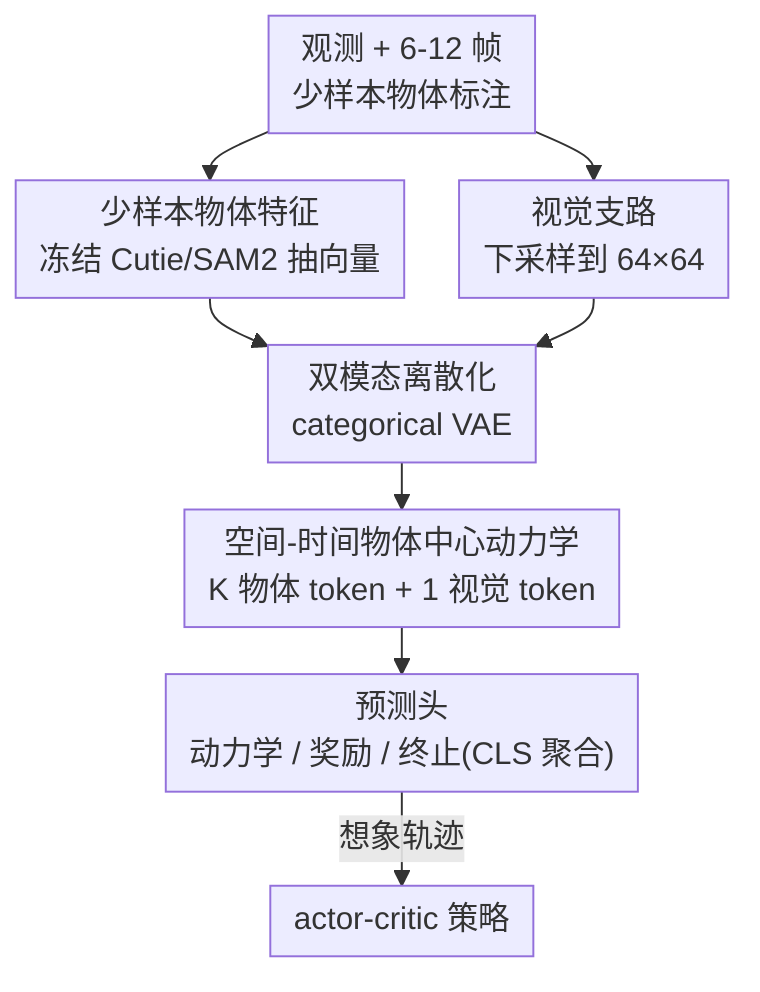

# Object-Centric World Models from Few-Shot Annotations for Sample-Efficient Reinforcement Learning

**会议**: ICLR 2026  
**OpenReview**: [https://openreview.net/forum?id=qmEyJadwHA](https://openreview.net/forum?id=qmEyJadwHA)  
**项目页**: [https://oc-storm.weipuzhang.com](https://oc-storm.weipuzhang.com)  
**代码**: 见项目页  
**领域**: 强化学习 / 世界模型 / 样本高效 RL  
**关键词**: 物体中心表示, 世界模型, 模型驱动 RL, 少样本标注, 视频分割

## 一句话总结
OC-STORM 用冻结的视频分割基础模型（Cutie/SAM2）从极少量（6–12 帧）标注里抽出决策关键物体的紧凑向量特征，喂进世界模型让它把建模容量聚焦到小而关键的物体上，从而在 Atari 100k 和视觉复杂的《空洞骑士》Boss 战上显著超过 STORM 基线、取得 SOTA 级样本效率。

## 研究背景与动机

**领域现状**：从像素学习的深度 RL 已经在棋类、机器人控制上取得里程碑式成功，但样本效率极差——智能体往往要比人类多几个数量级的交互才能掌握一个任务。模型驱动 RL（MBRL）是缓解这一问题的主流路径：先用自监督学一个能预测环境动力学的世界模型，再在世界模型"想象"出的虚拟轨迹里训练策略。Dreamer 系列、STORM、IRIS 等当代方法基本都靠像素级重建损失（$\ell_2$）来自监督地训练这个世界模型。

**现有痛点**：像素重建目标会被画面里**大块、静态的背景**主导，从而**忽略小、稀疏但对决策至关重要的物体**。论文用《空洞骑士》举了一个很直观的例子：训练好的 STORM 能把复杂背景重建得很准，却几乎"看不见"那个决定胜负的 Boss 角色（重建里 Boss 直接糊掉），策略自然学不好。

**核心矛盾**：重建损失衡量的是"像素平均误差"，而 RL 的回报取决于"少数关键物体的状态"——两者目标错位。把容量都花在背景上，等于把世界模型的注意力放错了地方。

**本文目标**：在不依赖游戏内部状态（特权信息）、也不需要海量标注的前提下，让世界模型显式地表示并预测**离散、可交互的物体实体**。

**切入角度**：作者注意到 SAM、SAM2、Cutie、GroundingDINO 这批开放集分割/跟踪基础模型的成熟，让"只标几帧就能在新领域拿到高质量物体分割"成为可能——历史上物体中心 RL（OCRL）需要大量任务专属标注，现在这个门槛被基础模型抹平了。

**核心 idea**：用冻结的预训练视频分割模型，把少样本标注的关键物体抽成紧凑的**向量特征**，与下采样像素一起喂给世界模型，让模型推理物体动力学与物体间交互，把建模容量"导向"语义上重要的实体。

## 方法详解

### 整体框架
OC-STORM 是一个两阶段 MBRL 框架：**阶段一**自监督地学一个物体中心（OC）世界模型来捕捉环境动力学，**阶段二**在世界模型想象出的轨迹上用 actor-critic 训练策略。整条管线的关键转折在于"输入端多了一路物体特征"：先在 6–12 帧上人工标注关键物体，再用一个**冻结**的预训练视频分割模型（Cutie 或 SAM2）抽出每个物体的紧凑向量；这路物体特征和下采样到 $64\times64$ 的视觉像素并行送入世界模型，分别经离散化、空间-时间动力学建模，最后由预测头吐出下一步潜状态、奖励、终止信号，供策略在想象中学习。

### 关键设计

**1. 少样本向量化物体特征：用冻结分割基础模型把关键物体抽成紧凑向量**

这一设计直接针对"重建损失忽略小物体"的痛点。作者不去重新训练一个物体检测器，而是直接复用 Cutie / SAM2 这类视频分割模型内部的 **object-attention 输出**作为物体特征。形式上，每个时刻对观测 $o_t \in \mathbb{R}^{3\times H\times W}$，分割模型给出物体特征 $s^{obj}_t = \text{SegModel}(o_t) \in \mathbb{R}^{K\times \text{obj\_dim}}$（SAM2 的 obj\_dim 为 256，Cutie 为 2048），其中 $K$ 是该环境的物体数，由用户指定（如 Pong 取 $K=3$：两个球拍 + 一个球）。分割模型跨帧维护内部状态以保证跟踪一致性，每个 episode 开始时重置。

之所以选这两个模型，是因为它们恰好满足四个关键性质：视频级**时序一致**且能在单张消费级 GPU 上实时处理高分辨率输入；通过**记忆库检索**有效利用少样本标注（复杂环境里一帧或一句话描述往往不够）；产出**紧凑向量**而非笨重掩码；以及在只见过自然图像、从没见过 Atari/《空洞骑士》的情况下仍能**跨域泛化**。关键是，作者刻意选了**向量**而非掩码表示——后文实验显示掩码表示（FOCUS 路线）在 $64\times64$ 低分辨率下会丢细节、原始掩码又有噪声难以预测，而向量是从高分辨率输入里语义化总结出来的，更一致也更省算力。

**2. 双模态离散化潜变量：物体与视觉分别走 categorical VAE，按信息量分配容量**

自回归序列模型直接在高维输入上预测会累积误差，因此作者用 categorical VAE 把输入编码成离散潜变量：编码器 $z_t \sim q_\phi(z_t|s_t)$、解码器 $\hat{s}_t = p_\phi(z_t)$，并用 straight-through 估计器实现可微采样。关键在于**两路模态用不同结构、不同容量**：物体特征用 MLP 编解码器（$\mathbb{R}^{K\times d_{obj}} \leftrightarrow \mathbb{R}^{K\times 16\times 16}$），离散化为 16 个类别分布、每个 16 类；视觉观测用 CNN 编解码器（$\mathbb{R}^{3\times 64\times 64} \leftrightarrow \mathbb{R}^{32\times 32}$），用 32 个分布、每个 32 类。给物体更低的离散维度，正是因为单个物体的信息量远小于整幅场景——这种"按信息量分配建模预算"的设计，让世界模型不再被背景像素的重建主导。

**3. 空间-时间物体中心动力学：分离物体/视觉 token，交替空间与时间注意力建模交互**

这是框架的核心创新，目的是既建模"物体之间、物体与场景之间"的交互，又建模它们各自随时间的动力学。以 STORM 骨干为例，作者用**交替的空间注意力与时间注意力**：空间注意力在每个时刻 $t$ 跨 $K$ 个物体 token 和 1 个视觉 token $(z^1_t,\dots,z^K_t,z^{vis}_t)$ 上做，捕捉物体间关系与物体-场景交互；时间注意力则对每种 token 独立沿序列 $(z^i_1,\dots,z^i_L)$ 处理，建模动力学；动作通过与潜表示拼接注入。序列模型 $h_{1:L} = f_\phi(z^{obj}_{1:L}, z^{vis}_{1:L}, a_{1:L}) \in \mathbb{R}^{(K+1)\times L\times d_h}$（$d_h=256$，$K+1$ 是 $K$ 个物体 token 加 1 个视觉 token）。

该骨干同时兼容 RNN 路线：对 DreamerV3，作者在每个时刻给 RNN 加上空间注意力来实现类似的物体-场景交互。预测头部分，动力学预测器 $g^{dyn}_\phi$ 是 MLP 预测下一潜状态分布；奖励 $\hat{r}_t$ 与终止 $\hat{\tau}_t$ 则引入一个类似 BERT [CLS] 的**特殊 query token**，让它注意 $h_t$ 里所有物体与视觉 token、再过 MLP 聚合输出——这样奖励/终止预测能综合全部物体与场景信息，而不是只看单个 token。

### 损失函数 / 训练策略
世界模型端到端训练，目标是最大化观测数据（重建输入 + 奖励 + 终止）的似然，由重建损失与预测损失组合而成。策略 $\pi_\theta$ 与价值函数 $V_\psi$ 在世界模型想象出的轨迹上用 DreamerV3 的 actor-critic 算法训练（带价值基线的策略梯度更新）。问题被建模为有限时域 MDP $\mathcal{M}=\langle S,A,p,r,\gamma\rangle$，目标是学策略 $\pi_\theta(a_t|s_t)$ 最大化期望回报 $\mathbb{E}_{\pi_\theta,p}\big[\sum_{t=0}^{T-1}\gamma^t r_t\big]$。详细损失与训练流程在原文附录 B。

## 实验关键数据

### 主实验
在 Atari 100k（限制 10 万环境帧、5 个随机种子各评 20 个 episode）上，作者横向比较了 DreamerV3/STORM 两种骨干、SAM2/Cutie 两种特征提取器、向量/掩码两种物体表示。最终选出表现最好的 **Cutie-OC-STORM** 作为主算法 OC-STORM。

| 配置 | HNS 均值 | HNS 中位数 | 说明 |
|------|---------|-----------|------|
| STORM（基线） | 107.2% | 35.5% | 纯视觉重建世界模型 |
| Mask FOCUS (STORM) | 114.2% | 42.5% | 掩码表示，仅与基线持平 |
| SAM2-OC-STORM | 124.6% | 35.0% | 向量表示，SAM2 特征 |
| **Cutie-OC-STORM** | **134.8%** | **43.8%** | 向量表示，Cutie 特征（最终算法）|
| Cutie-OC-DreamerV3 | 119.4% | 42.6% | 换 DreamerV3 骨干同样有效 |

在视觉复杂的《空洞骑士》Boss 战上（同样限 100k 样本 ≈ 9Hz 下约 3.1 小时游玩，每个 Boss 3 个种子），OC-STORM 比 STORM **收敛显著更快、最终更强**，在 Mage Lord、Pure Vessel 这类更难的 Boss 上优势尤其明显。此外在 Meta-world 连续控制（4 个任务）上，OC-STORM 普遍比 STORM 样本效率更高，部分任务甚至超过专门聚焦小物体的 MWM——说明该管线无需大改即可迁移到连续控制。

### 消融实验
按"决策关键物体能否被 SAM2/Cutie 稳定识别"把 26 个 Atari 游戏分成两组：

| 分组 | STORM 基线 | Cutie-OC-STORM | 说明 |
|------|-----------|----------------|------|
| Obj-detectable（物体可检测） | 142.4% | **186.2%** | OC 表示带来大幅提升 |
| Otherwise（检测不全） | 72.0% | 83.4% | 检测不全时仍不输基线，体现鲁棒性 |

### 关键发现
- **向量 > 掩码**：掩码表示（FOCUS 路线）只与基线持平。原因是低分辨率（$64\times64$）输入会丢掉物体细节，而高分辨率掩码带来二次方的显存/算力开销；且原始掩码噪声大、动力学难预测。向量是从高分辨率语义总结出来的，更一致更省算力。
- **Cutie > SAM2**：尽管 SAM2 在视频分割 benchmark 上更强，OC 智能体却更受益于 Cutie 特征。差异源于特征设计——Cutie 在掩码区域内聚合视觉特征，而 SAM2 产出的是面向分类的原型向量，会丢掉位置和全局上下文，对策略学习指导更弱。
- **物体向量保留了位置信息**：作者在 Boxing 上训了一个 4 层 ConvTranspose2d 解码器，仅用两个物体向量（白/黑选手）就能重建出观测，定性证明 masked pooling 没有抹掉位置信息。
- **对检测失败鲁棒**：通过随机把物体向量置 0 模拟分割失败，发现检测准确率越高性能越好，且即使在不稳定检测下仍能保持可用性能。

## 亮点与洞察
- **把"基础模型当冻结特征器"用对了地方**：不微调、只取 object-attention 输出当向量，绕开了 OCRL 历史上"任务专属重标注"的死穴——这是把 CV 基础模型红利迁进 RL 的一个干净范式。
- **"按信息量分配建模预算"**：给物体潜变量更低的离散维度（16×16 vs 视觉 32×32），本质上是承认"重建损失目标错位"并从架构上纠偏，比单纯加正则更直接。
- **向量 vs 掩码的对照实验很有教益**：它说明在世界模型这种低分辨率自回归场景里，"语义紧凑向量"比"空间稠密掩码"更友好——这个结论对后续 OCRL 设计有直接指导价值。
- **骨干无关**：同一套 OC 思路在 transformer（STORM）和 RNN（DreamerV3）上都生效，说明增益来自物体表示本身而非某种特定架构。

## 局限与展望
- **重复实例**：当前视频分割算法主要为"跟踪单个物体"设计，场景里出现两个及以上相同物体时，SAM2/Cutie 可能无法正确分割每个实例，从而影响性能。
- **几何地图表示**：物体向量不擅长编码墙壁、边界、可通行空间这类几何结构，因此管线必须保留原始视觉输入兜底——这也是当前视觉域 OC 方法的共性挑战。
- **依赖人工指定物体数 $K$ 与少样本标注**：虽然只要 6–12 帧，但 $K$ 仍需用户按环境设定，自动确定物体数、零标注启动是自然的下一步。
- （自己发现）《空洞骑士》上因缺乏统一 benchmark（采样步数、环境封装、奖励函数、Boss 选择各家不同），只能与等价 STORM 基线比，绝对强弱不易横向定论。

## 相关工作与启发
- **vs STORM / DreamerV3（重建式 MBRL）**: 它们用 $\ell_2$ 像素重建自监督，世界模型容量被背景主导；本文在输入端并入冻结分割模型抽的物体向量，把容量导向决策关键实体，在物体可检测的游戏上提升尤为显著。
- **vs FOCUS（最相近工作）**: FOCUS 也是模型驱动 OC 方法，但用 TrackingAnything 产出的**二值掩码**喂 DreamerV2，且只在 6 个干净背景、固定相机的机器人任务上验证；本文用**向量**表示并在 Atari + 视觉复杂的《空洞骑士》上验证，实验证明向量在低分辨率世界模型里明显优于掩码。
- **vs 端到端 slot-based OCRL**: 这类方法用无监督 slot attention 联合学物体感知与策略，但无监督导致在嘈杂真实场景里物体检测质量差，多局限于视觉简单的 OC benchmark；本文借力预训练分割基础模型，绕开无监督检测质量瓶颈，得以适配视觉复杂任务。

## 评分
- 新颖性: ⭐⭐⭐⭐ 首个把少样本预训练分割基础模型成功并入世界模型、且在 Atari 与《空洞骑士》上都跑通的 OCRL 框架。
- 实验充分度: ⭐⭐⭐⭐⭐ 覆盖两骨干、两特征器、两表示，外加连续控制、鲁棒性、特征可解码性等多角度消融。
- 写作质量: ⭐⭐⭐⭐ 动机（背景主导重建损失）讲得清晰直观，向量 vs 掩码的对照分析很有说服力。
- 价值: ⭐⭐⭐⭐ 给"把 CV 基础模型红利迁进样本高效 RL"提供了一条可复用、低标注成本的实用路径。

<!-- RELATED:START -->

## 相关论文

- [\[AAAI 2026\] Object-Centric World Models for Causality-Aware Reinforcement Learning](../../AAAI2026/reinforcement_learning/object-centric_world_models_for_causality-aware_reinforcement_learning.md)
- [\[ICLR 2026\] WIMLE: Uncertainty-Aware World Models with IMLE for Sample-Efficient Continuous Control](wimle_uncertainty-aware_world_models_with_imle_for_sample-efficient_continuous_c.md)
- [\[ICLR 2026\] From Observations to Events: Event-Aware World Models for Reinforcement Learning](from_observations_to_events_event-aware_world_models_for_reinforcement_learning.md)
- [\[ICLR 2026\] Mixture-of-World Models: Scaling Multi-Task Reinforcement Learning with Modular Latent Dynamics](mixture-of-world_models_scaling_multi-task_reinforcement_learning_with_modular_l.md)
- [\[ICLR 2026\] DVLA-RL: Dual-Level Vision-Language Alignment with Reinforcement Learning Gating for Few-Shot Learning](dvla-rl_dual-level_vision-language_alignment_with_reinforcement_learning_gating_.md)

<!-- RELATED:END -->
