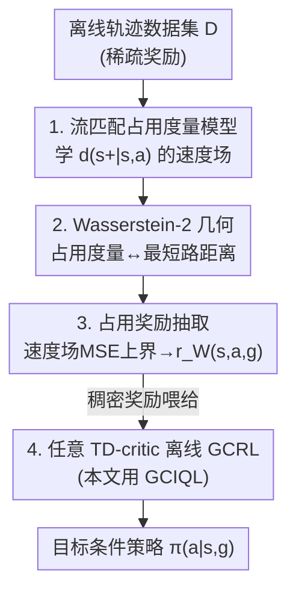

# Occupancy Reward Shaping: Improving Credit Assignment for Offline Goal-Conditioned Reinforcement Learning

**会议**: ICLR 2026  
**OpenReview**: [https://openreview.net/forum?id=EW8DskWQ1K](https://openreview.net/forum?id=EW8DskWQ1K)  
**代码**: https://github.com/aravindvenu7/occupancy_reward_shaping (有)  
**领域**: 强化学习 / 离线目标条件RL  
**关键词**: 离线 GCRL、信用分配、奖励塑形、占用度量、流匹配、最优传输

## 一句话总结
本文提出 Occupancy Reward Shaping (ORS)，先用流匹配学一个"占用度量"（未来状态分布）生成模型，再用最优传输把这个模型里隐含的世界几何（状态到目标的最短路距离）抽取成一个稠密奖励，从而在离线目标条件强化学习的稀疏奖励场景下显著缓解信用分配难题——在 13 个长程任务上平均提升 2.2×，且可证明不改变最优策略。

## 研究背景与动机
**领域现状**：目标条件强化学习（GCRL）是一种简单、领域无关、可扩展的框架，能从大规模离线数据中学习"从任意状态走到任意目标"的行为。但它通常只有稀疏奖励——只有抵达目标那一刻才有 +1，其余全是 0。

**现有痛点**：稀疏奖励下，动作和它的长期后果之间存在巨大的时间滞后，导致信用分配（credit assignment）极难。本文用一个量化分析点破了根本症结：理论上沿最优轨迹的最优价值函数 $V^*(s,g)$ 应该单调非降（越靠近目标价值越高），但实践中由于采样和近似误差，估计出的 $\hat V(s,g)$ 会出现大量"非单调"——作者用 $\delta_V$ 表示沿专家轨迹上 $\hat V(s_{t+1},g)<\hat V(s_t,g)$ 的状态比例。实验证明（antmaze-giant-navigate）即使噪声很小，$\delta_V$ 也很高，且随任务时域增长而恶化，使策略卡在次优区域。

**核心矛盾**：手工为每个目标设计奖励不现实；而已有的奖励塑形方法依赖学一个"局部时间距离估计器"，再拼成半参数/非参数图（如最短路搜索）去间接推断全局时间信息。这种"局部拼全局"的做法随任务复杂度增长会累积误差（compounding errors），扩展性差。

**切入角度**：作者注意到生成式世界模型能很好地刻画"智能体未来会访问哪些状态"的多模态分布，即占用度量（occupancy measure）$d^\pi(s_+|s,a)$。既然它编码了未来，就意味着它隐含地编码了环境的几何结构——那么能不能把这种时间几何信息直接抽取出来当奖励？

**核心 idea**：用最优传输把"学到的占用度量到目标的 Wasserstein-2 距离"取负当作奖励——这个量直接、全局地编码了"还要走多远才到目标"，从而一步到位地给出稠密信用分配信号，而非靠局部拼接。

## 方法详解

### 整体框架
ORS 把"如何造一个好奖励"拆成三步串行的流水线：先学一个能描述未来状态分布的占用度量模型（用流匹配训练），再从这个模型里把"到目标的几何距离"抽取成一个标量奖励函数，最后把这个稠密奖励喂给任意带 TD-critic 的离线 GCRL 算法去训练策略。核心理论支撑是两个命题加一个定理：占用度量到目标的 Wasserstein-2 距离随最短路层级单调增长（几何被编码了，Prop.1）；这个距离可以用流匹配速度场的均方误差上界来估计（可计算，Prop.2）；用这个奖励学出的贪心策略与原稀疏奖励最优策略一致（不破坏最优解，Theorem.1）。

### 关键设计

**1. 用流匹配学占用度量：把"未来状态分布"做成可微生成模型**

信用分配难的根源是缺乏对长期未来的刻画，所以第一步要先把"在数据策略 $\pi_D$ 下，从 $(s,a)$ 出发未来会访问哪些状态"这个分布 $d^{\pi_D}(s_+|s,a)$ 学出来。它满足一个类似 TD 学习的递归形式：$d^{\pi_D}_\theta(s_+|s,a)=(1-\gamma)\,p(s'|s,a)+\gamma\, d^{\pi_D}_{\theta^-}(s_+|s',a')$，即"占用度量 = 下一步转移 + 折扣后的后续占用度量"，靠 bootstrap 自然把数据中相交轨迹的未来状态"缝合"起来。由于未来状态分布是多模态的，作者用流匹配（flow matching）建模，损失拆成两项：$L_{\text{flow}}=(1-\gamma)L_{\text{next}}+\gamma L_{\text{future}}$。$L_{\text{next}}$ 是标准流匹配损失（把噪声变成下一状态 $s'$）；$L_{\text{future}}$ 把当前速度场 $v_\theta(t,s,a,x_t)$ 回归到延迟参数 $\theta^-$ 给出的 bootstrap 速度场目标（带 stop-gradient）。选流匹配而非别的生成模型，是因为它的速度场能让下一步的奖励计算无需多步 ODE 求解，极大省算。

**2. 用 Wasserstein-2 距离把占用度量翻译成"到目标的几何距离"（Prop.1）**

光有占用度量还不是奖励，需要建立"占用度量 ↔ 状态空间几何"的精确联系。作者定义最短路层级 $S_k=\{s:\text{step}^*(s,g)=k\}$（$S_0=\{g\}$），并证明：平均平方 Wasserstein-2 距离 $W_2^2(\delta_g, d^{\pi_D}(s_+|s))$ 随层级 $k$ 单调增——也就是说，状态离目标越远（要走的步数越多），它的未来状态分布到目标 Dirac 分布 $\delta_g$ 的最优传输距离就越大；而且对任一 $(s,g)$，最优动作 $a^*$ 给出的 $W_2^2$ 最小。妙处在于它不只衡量未来状态"质心"离目标多远，还衡量未来状态"散开"程度：两个都离目标 5 步的状态，未来状态更集中靠近目标的那个 $W_2^2$ 更小。因此把奖励定义为 $r_W(s,a,g)=-W_2^2\big(\delta_g, d^{\pi_D}(s_+|s,a)\big)$，就能把全局长程的到目标信息直接编码成一个标量——这正是 graph-based 方法做不到的"直接全局"。

**3. 用速度场 MSE 上界让奖励可计算可学（Prop.2）**

$W_2^2$ 含一个不可解的积分，无法直接算。作者证明它可被流匹配速度场的均方误差上界（差一个正乘性常数 $C$）：$W_2^2(\delta_g, d^{\pi_D}(s_+|s,a))\le C\,\mathbb{E}_{x_1\sim\delta_g,\,x_0\sim N(0,I),\,t}\,\|v(t,s,a,x_t)-(x_1-x_0)\|_2^2$。这一步把"算最优传输距离"转化成"算速度场对目标 $g$ 的回归误差"，且不需要跑多步 ODE 求解器——这也正是第 1 步选流匹配的回报。于是训一个奖励网络 $\psi$ 去拟合这个上界：$L_{\text{rew}}(\psi)=\mathbb{E}_{s,a,g\sim D}\big[\hat r_{W\psi}(s,a,g)-(-\mathbb{E}_{x_1=g,x_0,t}\|v_\theta(t,s,a,x_t)-(x_1-x_0)\|_2^2)\big]^2$，得到稠密、可即时查询的奖励。

**4. 证明 ORS 保持最优策略：稠密奖励但不"带偏"目标（Theorem.1）**

奖励塑形最大的风险是改变了最优策略。本文证明：在目标可达性、动力学、数据覆盖等假设下，由 $r_W(s,a,g)$ 诱导的最优动作价值函数 $Q^*$ 上的贪心策略 $\pi_{\text{greedy}}=\arg\max_a Q^*(s,a,g)$，与原始稀疏奖励下的最优最短路策略 $\pi^*(a|s,g)$ 完全一致。这意味着 ORS 可以放心地把丰富的稠密信号叠加进任何离线 GCRL 算法，既加速学习又不会把策略学歪，且无需在每步策略改进时重新估计新的占用度量。

### 损失函数 / 训练策略
三阶段独立训练（Alg.1）：① 用 $L_{\text{pretrain}}$ 预训练 + $L_{\text{flow}}$（Eq.3）训占用度量模型 $d^{\pi_D}_\theta$；② 用 $L_{\text{rew}}$（Eq.5）训奖励函数 $r_W^\psi$；③ 用学到的稠密奖励，配合任意带 TD-critic 的离线 GCRL 算法训目标条件策略（本文主用 GCIQL + 高斯策略）。所有算法都用 hindsight relabeling。GCIQL 的 expectile 参数 $\kappa$ 与奖励稠密度密切相关，是关键超参。

## 实验关键数据

### 主实验
在 OGBench（涵盖迷宫导航 / 立方体操作 / 拼图 / 场景四类，时域长达 2000 步）共 12 个数据集上，8 个种子取平均（二元成功率 %）：

| 方法 | antmaze-giant-navigate | cube-triple-play | scene-play | 12 任务均值 |
|------|------|------|------|------|
| GCBC | 0 | 0 | 5 | 2.5 |
| GC-IVL | 0 | 1 | 42 | 15.9 |
| QRL | 9 | 0 | 5 | 6.9 |
| CRL | 39 | 6 | 19 | 13.7 |
| GC-IQL（base） | 0 | 7 | 51 | 20.0 |
| Go-Fresh | 30 | 18 | 56 | 35.8 |
| **ORS（本文）** | **56** | **37** | **80** | **44.2** |

ORS 相比其稀疏奖励基座 GCIQL 平均提升 **2.2×**，相比次优的 Go-Fresh（图方法）提升 **24%**，在长时域复杂任务上优势尤其明显。

### 与长程稀疏奖励专门方法对比 / Tokamak 真实任务

| 方法 | OGBench 12 任务均值 | 说明 |
|------|------|------|
| SMORE | 2.8 | 占用匹配 / 对偶 RL，整体失效 |
| n-step GCIQL | 12.7 | n 步 TD 缩短时域 |
| HIQL | 20.0 | 分层 RL |
| GCIQL-OTA | 23.2 | n 步 + option-aware |
| SAW | 25.8 | 子目标优势加权 |
| Go-Fresh | 35.8 | 图 + 局部+全局奖励 |
| **ORS** | **44.2** | 比 HIQL 高 2.2×、比 GCIQL-OTA 高 1.9× |

在 3 个真实核聚变 Tokamak 控制任务（DIII-D 传感/执行器数据，控制 $\beta_N$ / 电子密度 / 离子转速）上，ORS 全部取得最佳累计回报；作者指出 Go-Fresh 在此整体很差，因为图方法在随机动力学下失效。

### 消融实验

| 配置 | 关键指标 | 说明 |
|------|---------|------|
| ORS（full） | 56 / 37 | 完整模型 |
| L2 奖励 | 3 / 3 | 用 L2 到目标距离塑形，甚至不如稀疏 GCIQL |
| ORS-s（仅状态奖励 $r_W(s,g)$） | < ORS | 去掉动作维度变差 |
| ORS-r（直接用 $r_W$ 当 Q） | 最差 | Q 不再是累计和，估计噪声大 |

### 关键发现
- **几何确实被编码且平滑**：对固定目标在 5000 个状态-动作对上画 ORS 奖励，奖励幅度随到目标的时间距离平滑衰减，验证了 Prop.1。
- **ORS 直接改善价值单调性**：相比稀疏奖励，ORS 诱导的 $\hat V(s,g)$ 非单调误差 $\delta_V$ 在低噪声下小一个数量级，长时域下估计也更平滑——这正对应了动机里的核心痛点。
- **必须学累计 Q 而非直接用奖励当 Q**：ORS-r 最差，说明把稠密奖励交给 TD-critic 做累计（缝合轨迹）才是关键。
- **$\kappa$ 与任务相关**：locomotion 任务低 $\kappa$（如 0.6）更好（稠密信号丰富），而 manipulation 随复杂度上升最佳 $\kappa$ 升高。

## 亮点与洞察
- **"世界模型里藏着几何，可以抽出来当奖励"是非常漂亮的观点**：把生成式占用度量与最优传输/最短路几何严格挂钩（Prop.1），让奖励塑形从"局部拼全局"升级为"一步到位的全局信号"，避免了图方法的累积误差。
- **流匹配选型有理有据**：选流匹配不是赶时髦，而是因为它的速度场 MSE 恰好能上界 $W_2^2$（Prop.2），让奖励无需多步 ODE 即可即时计算——方法选型直接服务于可计算性。
- **理论保证可落地**：Theorem.1 证明稠密奖励不破坏最优策略，使 ORS 可作为"即插即用"模块叠加到任何 TD-critic 离线 GCRL 算法上，工程上极友好。
- **可迁移思路**：用"未来状态分布到目标的最优传输距离"作为稠密进度信号，原则上可迁移到任何能学占用度量/世界模型的稀疏奖励长程任务（如探索奖励、子目标评分）。

## 局限与展望
- **作者承认的局限**：奖励塑形本质是基于样本的，在高度组合化、成功路径极少的超长程任务（如大型多步组合锁拼图）中，几乎所有状态到目标的 Wasserstein 距离都很大，ORS 奖励信号会变弱。作者提出可学一个"过滤后的有用未来状态"上的占用度量，并叠加捕捉短程依赖的局部奖励来缓解。
- **自己发现的局限**：方法依赖较强的理论假设（确定性动力学下的最短路层级、目标可达性、数据覆盖）；虽然在随机的 Tokamak 任务上表现好，但 Prop.1 的几何单调性在随机动力学下严格性如何并未充分讨论。
- **三阶段串行训练**（占用模型 → 奖励 → 策略）引入了额外的训练开销和超参（如 $\kappa$ 需按任务调），端到端联合训练的可能性未探索。

## 相关工作与启发
- **vs Go-Fresh（Mezghani et al., 2023）**：Go-Fresh 用局部时间距离分类器 + 图最短路搜索拼出全局奖励；ORS 用单个奖励函数直接编码全局长程信息。区别在于 ORS 避免了"局部拼全局"的累积误差，在复杂/随机任务（cube-triple、Tokamak）上优势显著。
- **vs PBRS（Ng et al., 1999）**：经典基于势函数的奖励塑形保证不改最优策略但势函数需人工/启发式设计；ORS 从占用度量自动抽取奖励，同样证明了最优策略保持（Theorem.1）。
- **vs 分层 RL（HIQL）/ n-step（GCIQL-OTA）**：它们通过高低层子目标或 n 步回报缩短有效时域；ORS 走奖励塑形路线改善信用分配，与这些方法正交互补，且用一个简单非分层策略就超过了它们（44.2 vs 20.0 / 23.2）。
- **vs SMORE（占用匹配 / 对偶 RL）**：同样用占用度量但走对偶 RL 学非归一化密度；ORS 走最优传输 + 流匹配速度场路线，实验上 SMORE 几乎失效（2.8），凸显抽取方式的重要性。

## 评分
- 新颖性: ⭐⭐⭐⭐⭐ 把生成式占用度量、最优传输几何与奖励塑形三者用严格理论串起来，视角新颖且自洽
- 实验充分度: ⭐⭐⭐⭐⭐ 13 个长程任务 + 3 个真实 Tokamak 任务、8 种子 CI、多组消融，覆盖全面
- 写作质量: ⭐⭐⭐⭐ 动机用 $\delta_V$ 量化点破痛点，理论铺陈清晰；但命题/证明细节多在附录，正文略密
- 价值: ⭐⭐⭐⭐⭐ 即插即用、可证不破坏最优策略、真实核聚变控制验证，落地价值高

<!-- RELATED:START -->

## 相关论文

- [\[ICLR 2026\] TIPS: Turn-Level Information-Potential Reward Shaping for Search-Augmented LLMs](tips_turn-level_information-potential_reward_shaping_for_search-augmented_llms.md)
- [\[ICML 2026\] Latent Representation Alignment for Offline Goal-Conditioned Reinforcement Learning](../../ICML2026/reinforcement_learning/latent_representation_alignment_for_offline_goal-conditioned_reinforcement_learn.md)
- [\[ICLR 2026\] Multistep Quasimetric Learning for Scalable Goal-Conditioned Reinforcement Learning](scaling_goal-conditioned_reinforcement_learning_with_multistep_quasimetric_dista.md)
- [\[ICML 2026\] Compositional Transduction with Latent Analogies for Offline Goal-Conditioned Reinforcement Learning](../../ICML2026/reinforcement_learning/compositional_transduction_with_latent_analogies_for_offline_goal-conditioned_re.md)
- [\[CVPR 2026\] MangoBench: A Benchmark for Multi-Agent Goal-Conditioned Offline Reinforcement Learning](../../CVPR2026/reinforcement_learning/mangobench_a_benchmark_for_multi-agent_goal-conditioned_offline_reinforcement_le.md)

<!-- RELATED:END -->
