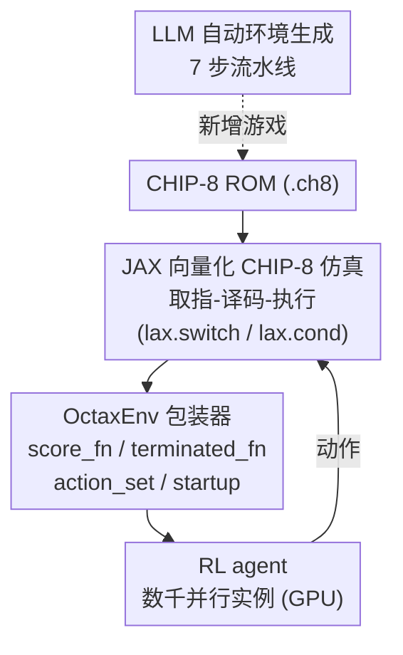

# OCTAX: Accelerated CHIP-8 Arcade Environments for Reinforcement Learning in JAX

**会议**: ICLR 2026  
**OpenReview**: [https://openreview.net/forum?id=BdeUsYlyIf](https://openreview.net/forum?id=BdeUsYlyIf)  
**代码**: https://github.com/riiswa/octax/ (有)  
**领域**: 强化学习 / RL 环境基准 / JAX 加速  
**关键词**: CHIP-8 仿真, GPU 向量化环境, 街机游戏, 端到端 JAX, LLM 环境生成

## 一句话总结
OCTAX 用 JAX 把 1970 年代的 CHIP-8 虚拟机搬到 GPU 上做端到端向量化仿真，提供 21 款带图像观测的经典街机游戏作为 RL 环境，在消费级显卡上跑到 35 万 env-steps/s（140 万帧/s），比 CPU 方案 EnvPool 快 14×，并配套一条用 LLM 自动生成新 CHIP-8 游戏环境的流水线。

## 研究背景与动机
**领域现状**：现代 RL 研究需要大量重复实验来获得统计显著性，而经典街机游戏（如 Atari Learning Environment, ALE）一直是公认的标准 benchmark。深度学习早已全面拥抱端到端 GPU 加速，但 RL 的环境执行环节仍然普遍是 CPU-bound 的。

**现有痛点**：环境仿真成了整条训练链路的瓶颈。论文指出 Rainbow 当年跑出结果花了 34,200 GPU 小时（约 1,425 天），小实验室根本负担不起；正因为算力昂贵，大量 RL 论文只敢报告少于 5 个随机种子的结果，统计可靠性堪忧。现有提速方案各有短板：EnvPool / PufferLib 走 C/C++ 极致优化 CPU 路线，但仍受 CPU 饱和限制、训练时还要付出昂贵的 CPU↔GPU 数据搬运代价；CuLE、Isaac Gym 走 CUDA/GPU 路线，却绑死 NVIDIA 硬件且每个环境的工程移植成本很高。

**核心矛盾**：JAX 生态本来是「可移植 + 端到端 GPU 加速」的理想答案（Brax 做物理、Gymnax 做经典控制、Pgx 做棋类），但唯独缺了**带真实视觉复杂度的经典街机游戏**这一类环境——MinAtar 只是 Atari 的简化版，丢掉了原始的画面与游戏机制。把完整的 Atari 模拟器塞进 JAX 又过于复杂。

**本文目标**：在 JAX 里补上「图像观测的经典街机环境」这块拼图，同时要保证可大规模并行、保真还原原始游戏机制、且不绑死特定硬件。

**切入角度**：作者不去硬啃 Atari 2600，而是选择它的「前辈」——CHIP-8 虚拟机。CHIP-8 诞生于 1970 年代，规格极简（64×32 单色屏、16 个寄存器、4KB 内存、35 条指令），却催生了大量横跨益智 / 动作 / 策略类型的经典游戏，认知挑战与 Atari 相当。这种约束驱动的极简设计恰好让向量化仿真变得高效：4KB 内存意味着可以同时塞下成千上万个游戏实例。

**核心 idea**：用 JAX 把 CHIP-8 的「取指-译码-执行」整个 CPU 周期重写成向量化、可在 GPU 上跑的函数式操作，再包一层标准 RL 接口，从而把经典街机游戏变成可在 GPU 上海量并行的端到端环境。

## 方法详解

### 整体框架
OCTAX 把一个 `.ch8` 的游戏 ROM，经过「CHIP-8 仿真核心 → RL 环境包装 → 标准交互回路」三段转换，变成可被 RL agent 大规模并行采样的环境。整体可以看成三层：底层是用 JAX 重写的 CHIP-8 模拟器（负责忠实执行游戏指令），中层是 `OctaxEnv` 包装器（把模拟器内部状态翻译成 observation / reward / done 这套 RL 语言），上层是 agent 与成千上万个并行环境实例的交互。整个数据通路全程留在 GPU 上、没有 CPU↔GPU 往返，这正是它相比 EnvPool 等方案能拿到数量级加速的根本原因。

### 关键设计

**1. JAX 向量化的 CHIP-8 仿真核心：把 CPU 模拟器改写成 GPU 友好的函数式管线**

经典 CPU 模拟器靠分支跳转和原地修改内存来跑「取指-译码-执行」循环，这种控制流在 GPU 上既不能并行又没法 `jit`。OCTAX 的做法是把整个处理器周期用 JAX 原语重写成无副作用的纯函数：`fetch()` 从内存取 16 位指令并推进程序计数器（PC）；`decode()` 用位运算抽取操作码、寄存器索引、立即数；`execute()` 用 `lax.switch` 做 GPU 兼容的指令分派，把每条指令路由到专门的 handler。所有指令 handler 都遵循函数式模型——把状态当成不可变对象、返回更新后的副本，而不是原地改写：ALU 运算处理算术/位逻辑并维护进位/借位标志，控制流指令（跳转、调用、条件）用 `lax.cond` 实现，绘屏则用向量化操作把 sprite 一次性铺到整个 64×32 framebuffer 上。正因为状态不可变、控制流被编译进 `lax` 原语，同一份仿真代码可以用 `vmap` 直接拍到上千个并行实例上，由 GPU 一把算完；4KB 的内存足迹也让「成千上万实例同时驻留」在显存上变得可行（实测约 2 MB 显存/环境）。

**2. 把游戏变成 RL 环境：用四件套抹平 CHIP-8 的非标准化**

CHIP-8 游戏当年各写各的，分数和结束条件没有统一约定，存在哪个寄存器、用什么编码都不一样，没法直接当 RL 环境用。OCTAX 用一套可配置的「四件套」逐游戏地把它对齐到标准接口。其一是 **score_fn**：不同游戏把分数存在不同寄存器、甚至用不同编码——Brix 把分数放在 V5、每打掉一块砖就 +1，而 Pong 用 BCD 编码存在 V14，要按 `score = (V[14] // 10) - (V[14] % 10)` 才能算出玩家优势。其二是 **terminated_fn**：Brix 在生命数 V14 归零时结束，Tetris 用专门的状态寄存器 V1==2 表示 game over，有的游戏还要复合条件，比如 Space Flight 是 `terminated = (V[9] == 0) | (V[12] >= 0x3E)`。其三是 **action_set**：大多数游戏只用到 16 键中的一小撮，Pong 只需 1、4 两个键控制挡板，Worm 只用方向键 2/4/6/8——把动作空间裁到相关键加一个 no-op，能直接加速学习。其四是 **startup_instructions**：很多游戏开局有菜单界面会干扰训练，包装器在 reset 时自动执行一段启动指令序列跳过菜单直接进入游戏。reward/termination 的逆向是靠静态 ROM 分析 + 运行时动态内存监控结合完成的。此外，观测是 64×32 屏幕做 4 帧堆叠得到的 (4, 64, 32) 布尔数组，每个 RL step 内部执行多条 CHIP-8 指令以保真还原原始 700Hz 的指令时序与帧节奏，对用到 RND 指令的随机性游戏还额外提供 no-op reset 和 sticky action 包装。

**3. LLM 辅助的自动环境生成流水线：让环境库可以「长出」新游戏**

手工逆向每个游戏的 reward/termination 很费力，且固定的游戏集限制了课程学习、open-endedness 这类研究。作者反过来用 LLM 当生成器：一条七步流水线自动产出全新 CHIP-8 游戏。Step 1 先构建 CHIP-8 教程/文档/范例的语料库，让模型掌握指令集、内存布局和常见编码模式；Step 2 把语料嵌进 prompt 引导 LLM 从高层指令产出语法正确的程序；Step 3 给出想要的游戏机制、目标和约束描述；Step 4 LLM 生成初版 CHIP-8 代码；Step 5 在 LLM 与 CHIP-8 编译器之间建一个自动反馈回路，按编译错误迭代修正直到编译通过；Step 6 自动生成 Python 的 `score_fn` / `terminated_fn`，把寄存器翻译成 RL 的奖励与终止信号；Step 7 增广游戏描述以提升难度或引入新挑战，并把新描述和已生成的游戏一起放回上下文供下一轮迭代。作者另用 gpt-4o-mini 做了个可行性研究——让它复现 21 个游戏的人写 score/termination 函数：分数存在单一寄存器时模型可靠（57% 完全匹配），但终止逻辑因为常涉及多寄存器 OR/AND 或编码状态而难得多（仅 19% 正确），说明 LLM 能恢复简单奖励信号但仍需人工监督。

### 一个完整示例
以 Pong 走一遍：ROM 从 `.ch8` 加载到 4KB 内存的 0x200 地址，字体数据放 0x50，初始化 16 个通用寄存器、索引寄存器 I、PC 和 64×32 显示缓冲。仿真核心反复执行「取指-译码-执行」推进游戏；包装器把动作空间裁成 `action_set = [1, 4]`（只控挡板），观测取最近 4 帧屏幕堆成 (4, 64, 32)，奖励用 `score_fn` 从 V14 的 BCD 编码解出玩家优势，终止由 `terminated_fn` 判断。整套流程在 512（乃至 8192）个并行实例上由 `vmap` 一次性在 GPU 上跑完，agent（PPO/PQN）据此采样更新。

## 实验关键数据

### 主实验
作者在 16 款游戏上用 PPO 和 PQN 训练，并把 OCTAX 的吞吐与 CPU 方案 EnvPool 对比。

| 维度 | OCTAX | EnvPool (ALE Pong) | 对比 |
|--------|------|----------|------|
| 峰值吞吐 | 350,000 env-steps/s（1.4M 帧/s，8192 并行） | ~25,000 steps/s（CPU 饱和后平台期） | 高并行下 **14×** 计算效率 |
| 扩展性 | 近线性扩展直到撞上显存上限 | CPU 核数饱和后停滞 | — |
| 显存开销 | 约 2 MB / 环境，随并行数线性增长 | — | — |
| 硬件 | 消费级 RTX 3090 (24GB) | 全部 CPU 核 (i7, 20 核) | — |

训练侧：在单张 A100 上同时跑 24 个训练会话，每个实验平均 65 分钟，跨所有并行会话约 30,800 env-steps/s；每款游戏用 12 个随机种子独立训练 500 万 timesteps。

### 消融/分析实验
没有传统意义的模块消融，核心分析是学习曲线分型与 LLM 生成难度梯度。

| 分析 | 关键现象 | 说明 |
|------|---------|------|
| 学习曲线分型 | 快速平台型 / 渐进提升型 / 受限型 | Airplane、Brix 等奖励信号清晰、快速收敛；Pong、Tank 等持续提升；Tetris 几乎学不动、Worm 常只吃到一个苹果 |
| LLM 复现已有函数 | 分数 57% 完全匹配，终止仅 19% | 单寄存器奖励可靠，多寄存器/编码状态的终止逻辑难 |
| LLM 生成难度梯度 | Level1 回报 10.0 / Level2 9.0 / Level3 8.0 | Target Shooter 三级难度，难度↑则最终性能与样本效率↓，证明梯度有意义 |

### 关键发现
- 16 款游戏呈现明显不同的学习动态（时序复杂度从即时反应到长程规划、空间复杂度从单屏到多屏导航、奖励从稠密到稀疏），说明环境集本身在系统性地考验 RL 算法的不同能力。
- 加速来自架构而非调参：把环境执行整体搬上 GPU、消除 CPU↔GPU 搬运，是 14× 提升的根因；吞吐近线性扩展直到撞显存墙（8192 并行）。
- LLM 生成的 Target Shooter 三级难度训练出单调下降的性能/样本效率梯度，证明「自动造环境」对课程学习、open-endedness 是可行起点。

## 亮点与洞察
- **用「Atari 的前辈」绕开 Atari 的复杂度**：选 CHIP-8 而非硬啃 Atari 2600，是全文最巧的一步——既保留了图像观测和真实游戏机制，又因 4KB/35 指令的极简规格让 GPU 向量化与海量并行变得廉价可行。
- **把模拟器写成纯函数 = 天然可 vmap**：把「取指-译码-执行」和所有指令 handler 改写成不可变状态 + `lax.switch`/`lax.cond`，是让一份模拟器代码无缝扩到上千并行实例的关键工程范式，可迁移到任何想 JAX 化的旧式模拟器。
- **环境库可自我扩张**：用 LLM 直接产出 CHIP-8 汇编 + 自动生成 score/terminated 包装，再用 OCTAX 的可扩展仿真去评测生成结果，闭环地把「造环境」变成可规模化的研究对象。

## 局限与展望
- 作者明确声明 OCTAX **不是 ALE 的 drop-in 替代**：模块化奖励的设计与 ALE 的 human-normalized 评分方案不兼容，因此结果不能直接和 Atari 上的数字横向比。
- LLM 自动逆向 reward/termination 仍不可靠（终止逻辑仅 19% 正确），多寄存器复合条件和编码状态依然需要人工介入，无交互式调试时尤甚。
- LLM 生成环境只做到了 Target Shooter 一个 proof-of-concept、三级难度，离「稳定批量产出多样且可玩的新游戏」还有距离；当前实现 21 款游戏（论文实验用 16 款），覆盖面相对 Atari 仍有限。
- 64×32 单色屏的视觉复杂度终究低于 Atari，是否足以支撑需要更丰富感知的算法研究有待验证。

## 相关工作与启发
- **vs EnvPool / PufferLib（CPU 高性能路线）**: 它们靠 C/C++ 极致优化把 CPU 吞吐顶到百万帧级，但仍受 CPU 饱和与训练时 CPU↔GPU 搬运拖累，且要在 Python 主导的领域里维护大量 C 代码；OCTAX 全程 GPU、纯 JAX，高并行下吞吐反超 14×。
- **vs CuLE / Isaac Gym（CUDA/GPU 路线）**: 二者也把环境搬上 GPU 并拿到 2-3 个数量级加速，但绑死 NVIDIA 硬件、每个环境工程移植成本高；OCTAX 基于 JAX 因而硬件可移植，且靠 CHIP-8 的极简性大幅降低单环境工程成本。
- **vs MinAtar / Gymnax（JAX 简化街机）**: MinAtar 只提供 Atari 的简化版本、丢掉了完整视觉与真实机制；OCTAX 是首个在 JAX 里端到端实现完整经典街机机制的工作，填上了「图像观测街机环境」这块空白，并兼容 Gymnasium 与 Gymnax API。

## 评分
- 新颖性: ⭐⭐⭐⭐ 选 CHIP-8 作为 JAX 街机环境载体的切入点很巧，LLM 造环境是有想象力的延伸
- 实验充分度: ⭐⭐⭐⭐ 16 游戏 × 12 种子的学习曲线 + 严谨的吞吐对比，LLM 部分尚属可行性研究
- 写作质量: ⭐⭐⭐⭐ 结构清晰、动机链条完整，架构图与游戏分类表一目了然
- 价值: ⭐⭐⭐⭐⭐ 为算力受限的 RL 研究者提供了端到端 GPU 的开源街机环境，实用性强

<!-- RELATED:START -->

## 相关论文

- [\[ICLR 2026\] Accelerated Learning with Linear Temporal Logic using Differentiable Simulation](accelerated_learning_with_linear_temporal_logic_using_differentiable_simulation.md)
- [\[ICLR 2026\] From Ticks to Flows: Dynamics of Neural Reinforcement Learning in Continuous Environments](from_ticks_to_flows_dynamics_of_neural_reinforcement_learning_in_continuous_envi.md)
- [\[ICLR 2026\] GRL-SNAM: Geometric Reinforcement Learning with Differential Hamiltonians for Navigation and Mapping in Unknown Environments](grl-snam_geometric_reinforcement_learning_with_differential_hamiltonians_for_nav.md)
- [\[ICLR 2026\] Distributional value gradients for stochastic environments](distributional_value_gradients_for_stochastic_environments.md)
- [\[CVPR 2026\] PanoEnv: Exploring 3D Spatial Intelligence in Panoramic Environments with Reinforcement Learning](../../CVPR2026/reinforcement_learning/panoenv_exploring_3d_spatial_intelligence_in_panoramic_environments_with_reinfor.md)

<!-- RELATED:END -->
