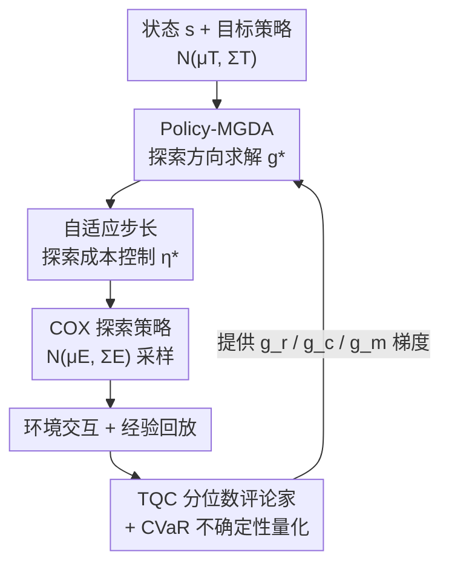

# Off-Policy Safe Reinforcement Learning with Constrained Optimistic Exploration

**会议**: ICLR 2026  
**OpenReview**: [https://openreview.net/forum?id=EHs3tSukHC](https://openreview.net/forum?id=EHs3tSukHC)  
**代码**: https://github.com/RomainLITUD/COXQ  
**领域**: 强化学习 / 安全强化学习  
**关键词**: 安全RL, off-policy, 乐观探索, 梯度冲突, 分位数评论家

## 一句话总结
本文提出 COX-Q，一种 off-policy 安全强化学习算法：在线探索阶段用 Policy-MGDA 在动作空间化解奖励与成本的梯度冲突、并用自适应步长把数据采集成本压在阈值内，离线学习阶段用截断分位数评论家（TQC）稳定成本价值估计并量化认知不确定性，从而在保持高样本效率的同时让训练与测试阶段的成本都满足约束。

## 研究背景与动机
**领域现状**：安全 RL 通常把问题建模为约束马尔可夫决策过程（CMDP），目标是在累积成本 $Q_c^\pi(s,a)\le d$ 的约束下最大化回报 $Q_r^\pi(s,a)$。主流做法是 primal-dual（拉格朗日）框架，迭代更新策略 $\pi$ 与乘子 $\lambda$。

**现有痛点**：绝大多数现有安全 RL 方法是 on-policy 的，因为行为策略与目标策略一致，每次更新都能直接通过梯度调整或信赖域技术强制约束满足。但 on-policy 方法样本效率低；而 off-policy 方法虽然靠经验回放和主动探索拥有高样本效率，却在安全 RL 上水土不服：一是累积成本存在**低估偏差**，导致学到不安全策略；二是探索过程**没有成本约束**，乐观探索会把智能体诱导进危险区域，造成数据采集成本失控。

**核心矛盾**：off-policy 的高效率来自"激进的离线探索 + 经验回放"，但安全 RL 要求成本约束在**数据采集阶段也要满足**（这点 on-policy 天然成立，off-policy 不成立）。已有 off-policy 尝试（如 ORAC）能在测试时安全，却明确不约束采集阶段的成本——"如何实现成本合规的探索"仍是开放难题。

**本文目标**：让 off-policy 安全 RL 同时做到（1）高数据效率，（2）训练采集与部署测试两个阶段都鲁棒地满足成本约束，途径是成本约束的探索 + 可靠的价值学习。

**切入角度**：安全 RL 本质有两个目标（回报、成本）和一条边界 $d$。作者观察到，在不安全区域里奖励梯度 $g_r$ 与成本梯度 $g_c$ 会**冲突**——若 $g_r$ 主导探索，智能体会被推向更深的危险侧。把这个冲突在**动作空间**里显式化解，再配上对单步与全局训练进度都敏感的步长控制，就能让探索"既充分又不越界"。

**核心 idea**：用 Policy-MGDA 在动作空间求出同时改善回报、降低成本的对齐探索方向 $g^*$，再用自适应步长 $\eta^*$ 把单步探索造成的期望成本钉在阈值内，并以 TQC 提供保守、低方差、带不确定性的价值估计驱动整个探索——三者整合为 COX-Q。

## 方法详解

### 整体框架
COX-Q 建立在 SAC 之上，是一个 off-policy primal-dual 安全 RL 算法，名字拆开就是它的两半：**COX**（Cost-Constrained Optimistic eXploration，在线探索）+ **Q**（基于分位数评论家的离线价值学习）。原始的单目标乐观探索 OAC 会从评论家集成里估一个乐观上界 $\hat Q_{UB}$，再在 KL 信赖域约束下朝该方向迈步，探索均值的位移可写成 $\mu_\Delta=\eta\Sigma_T g_t$，其中 $\eta=\sqrt{2\delta/(g_t^\top\Sigma_T g_t)}$。COX 把这套机制扩展到双目标安全 RL：它顺序地确定（1）有效探索方向 $g^*$ 去替换 $g_t$，（2）安全探索步长 $\eta^*$ 去替换 $\eta$，再代回上式得到最终探索策略 $N(\mu_E,\Sigma_E)$。

整条管线是一个闭环：TQC 评论家提供奖励上界梯度 $g_r$、成本下界梯度 $g_c$、成本均值梯度 $g_m$ → Policy-MGDA 据此解出对齐方向 $g^*$ → 自适应步长据此解出 $\eta^*$ → 合成 COX 探索策略去环境采样 → 数据进回放池 → 再更新 TQC 评论家。

### 关键设计

**1. Policy-MGDA：在动作空间化解奖励-成本的探索梯度冲突**

针对"不安全区域里 $g_r$ 主导会把智能体推向更深危险侧"这个痛点。在安全区域（$Q_c^\pi\le d$）约束未激活，探索只看回报，直接令 $g^*=g_r$；真正的难点在不安全区域。dual 目标的整体梯度是 $g_r-\lambda g_c$，但直接拿这个朴素加权和做探索方向不行——作者要求探索同时让回报和成本都改善，即两个条件 $g_c^\top\mu_\Delta\le 0$ 且 $g_r^\top\mu_\Delta\ge 0$ 都成立，否则就判定为"梯度冲突"。

关键在于冲突的度量不是参数空间的普通内积，而是带策略协方差的 **$\Sigma$-度量** $\langle g_i,g_j\rangle_{\Sigma_T}\equiv g_i^\top\Sigma_T g_j$（因为探索发生在动作空间，必须把策略的协方差矩阵纳进来），这与多任务学习在模型参数空间做梯度操作有本质区别。作者把 MGDA（多梯度下降）扩展到动作空间，先定义一个让两个改善条件都成立的"超锥" $K:=\{g:\langle g_r,g\rangle_{\Sigma_T}\ge 0,\ \langle -g_c,g\rangle_{\Sigma_T}\ge 0\}$，再在 $K$ 内找最贴近原始方向的解 $g^*=\arg\min_{u\in K}\lVert u-(g_r-\lambda g_c)\rVert^2_{\Sigma_T}$。Lemma 1 给出闭式解：当原方向已落在锥内就用 $g_{raw}=g_r-\lambda g_c$，否则按 $v_r,v_c$ 的符号分四种情况把 $g_{raw}$ 投影回锥边界。其根本区别是 policy-MGDA 作用在**在线采集阶段的动作空间**，而以往梯度操控方法都在离线模型更新阶段。

**2. 自适应步长：把探索造成的期望成本钉在阈值内**

针对原始 OAC 完全不含成本约束、探索一脚迈太大就越界这个痛点。给定方向 $g^*$，作者显式约束单步探索的成本期望：沿该方向的成本越界量是 hinge 函数 $\phi(\eta)=[\eta\langle g_m,g^*\rangle_{\Sigma_T}-(d-\hat Q_c^{mean})]_+$，然后求解一个双层优化——在信赖域内取**最大**的步长 $\eta^*$，同时让 $\phi$ 为 0 或最小化。Lemma 2 给出解：成本沿探索方向递减时（$s<0$）放心用满步长 $\eta$；已越界且没余量时取 0；有余量时取 $\min(\eta, r/s)$，其中 $r=d-\hat Q_c^{mean}$。直观上就是"安全区放开探索、不安全区收紧步长"。

但这个解在最优点附近会失效：当 $g^*\to 0$ 时 $s\to 0$，符号震荡会让 $\eta^*$ 在 $\pm\eta$ 间跳变，退化成纯动作噪声。作者再加一层**宏观自适应**：根据近期回放缓冲 $B_{recent}$ 里的近 on-policy 成本去调 $\delta$（从而调最大步长 $\eta$），求解 $\arg\min_{0<\delta\le\bar\delta}\delta\times(d-\mathbb{E}_{c_i\in B_{recent}}c_i)$。结果是探索成本整体由 $d$ 支配：安全区倾向用满预算，不安全区保持保守。微观单步约束 + 宏观训练进度调节，二者合起来才真正控住了采集成本。

**3. TQC 分位数评论家 + CVaR：保守、低方差、可量化不确定性的价值学习**

针对成本稀疏、目标奖励也稀疏时尾部分布难学，以及 Bellman 更新天然偏好"回报高估、成本低估"这个痛点。作者采用截断分位数评论家（TQC）：每个独立评论家用一组均匀分位数学习分布，把所有评论家的分位数混合排序后**截断**——奖励截掉顶部 $k_r$ 个原子抑制高估，成本截掉底部 $k_c$ 个原子抑制低估。混合分位数提供低方差梯度稳定学习，截断原子数则高灵活地控制偏差方向。

TQC 的另一好处是天然能量化分布级认知不确定性。设有 $N$ 个成本评论家、$N$ 个奖励评论家，各预测 $M$ 个分位数，按分位先算逐分位置信界再用 CVaR 聚合：成本下界 $\hat Q^{LB}_c$ 只取头部 $\alpha$ 个分位（$\alpha$ 越小越风险厌恶，类似 WCSAC），奖励上界 $\hat Q^{UB}_r$ 用全分布算乐观上界，$\beta_r,\beta_c$ 调探索激进度。这两个界正是设计 1、2 里 $g_r,g_c,g_m$ 梯度的来源——价值学习与探索由此闭环耦合。需要补充的是，在成本稀疏的 Safe Navigation 上截太多原子会压制学习，因此那里保留混合分位但**不截断**，改用 CVaR 上界更新 actor 与乘子。

### 损失函数 / 训练策略
实现基于 SAC，并沿用 CAL/ORAC 里的 ALM（增广拉格朗日，本质是增强版约束越界惩罚）。整体仍是 primal-dual：策略最小化 $Q_r-\lambda(Q_c-d)$，乘子按约束违反程度更新。Safe Velocity / Safe Navigation 用 10 个随机种子各跑 10 次；自动驾驶因训练耗时长只用单种子跑一次。

## 实验关键数据

在三个安全 RL 基准上对比 off-policy 与 on-policy 基线：Safe Velocity（速度受限的稠密奖励运动任务）、Safe Navigation（稀疏成本的导航避障）、SMARTS 自动驾驶（闭环车辆交互）。

### 主实验
SMARTS 自动驾驶测试安全性能（512K 步训练，2000 次随机运行），COX-Q 在碰撞数与超时上整体最优：

| 场景 | 指标 | CPPOPID | SACLag | CAL | TQC-ORAC | COX-Q |
|------|------|---------|--------|-----|----------|-------|
| Overtaking | 碰撞 | 331 | 194 | 186 | 97 | 99 |
| Intersection | 碰撞 | 183 | 33 | 23 | 18 | **12** |
| Intersection | 超时 | 0 | 0 | 1 | 12 | **0** |
| T-junction | 碰撞 | 195 | 55 | 36 | 28 | **21** |
| T-junction | 超时 | 0 | 0 | 17 | 86 | 5 |

关键对比 ORAC：COX-Q 把交叉口碰撞从 18 降到 12、T 字路口从 28 降到 21，且超时大幅减少（ORAC 在 Overtaking 超时高达 887、交叉口 12、T 字 86，全因过度保守"不敢动"；COX-Q 几乎为 0）。说明在同时降成本与提奖励的方向上化解冲突，既能避险又不会过度保守。数据采集阶段的不安全事件数 COX-Q 也显著低于 ORAC（如交叉口 1123 vs 3589）。

### 消融实验
在 Safe Velocity / Safe Navigation 上对比两个变体（仅 TQC 无探索；TQC + ORAC 式探索）：

| 配置 | 现象 | 说明 |
|------|------|------|
| 仅 TQC, 无探索 | 回报已高于基线 | TQC 主要贡献在提升回报 |
| TQC + ORAC 探索 | Safe Velocity 训练成本上冲 | ORAC 探索不约束采集成本 |
| COX-Q (完整) | 训练成本平滑贴阈值 | 成本约束探索 + 步长自调有效控住采集成本 |

### 关键发现
- TQC 是回报提升的主力——所有消融变体的回报都高于基线，去掉探索回报也不掉。
- 成本约束探索的价值高度依赖任务：Safe Velocity 里奖励-成本梯度冲突强，COX-Q 的步长机制把训练成本压在预算内（曲线平滑水平），而 ORAC 会上冲；Safe Navigation 里障碍稀疏、前 200K 步触发梯度冲突的比例低于 10%（PointPush1 甚至 <2%），此时 COX-Q 与 ORAC 几乎等价。
- 一个反直觉但重要的结论：在成本稀疏的任务里，瓶颈不是探索机制而是**累积成本的低估偏差**——成本信号太稀疏导致早期严重低估，触发训练与测试的约束违反；COX-Q 的混合分位让成本估计偏差稳定收敛到 0，而所有基线要么过度保守要么不稳定。
- Overtaking 场景所有方法安全性都较差，因 SMARTS 用 SUMO 的瞬时变道模型、缺乏转向灯预警，碰撞规避本就困难——这是环境本身的特性而非算法缺陷。

## 亮点与洞察
- **把梯度冲突搬到动作空间用 $\Sigma$-度量衡量**：这是最巧的一点。多任务学习的梯度操控都在参数空间用普通内积，本文意识到探索发生在动作空间、必须把策略协方差 $\Sigma_T$ 纳入度量，才能正确判断"这次探索是否真的同时改善了回报和成本"。
- **微观单步 + 宏观进度双层步长控制**：单看 Lemma 2 的闭式步长会在最优点附近震荡退化成噪声，作者用近 on-policy 成本动态调 $\delta$ 补上这个洞，体现了对"理论解什么时候失效"的细致 caveat。
- **价值学习与探索闭环耦合**：TQC 不只是稳定成本估计，它的 CVaR 上下界直接当成探索方向的梯度来源，一套分位数评论家同时服务"保守估计"和"乐观探索"两个看似矛盾的需求。
- 可迁移：动作空间 + $\Sigma$-度量的梯度冲突化解思路，可推广到任意多目标连续控制（不止安全 RL），只要目标间在动作层面会打架。

## 局限与展望
- **作者承认**：量化认知不确定性的可靠性是主要局限——TQC 混合所有评论家学整条分布，对近 OOD 样本评论家梯度高度相关、多样性可能被压制；可用 diverse ensemble projection 或 random priors 改进。
- **作者承认**：成本稀疏任务（Safe Navigation）里 COX 的探索机制收效甚微，根因是成本评论家学不准；需引入 HER 或优先经验回放来鲁棒化成本估计。
- **自己发现**：自动驾驶实验为省训练时间只用单种子跑一次，结论的统计稳健性弱于另两个 10 种子基准；自动驾驶里还为避免步长收敛到 0 而关掉了宏观自调节（式 19），意味着完整 COX-Q 在"全程处于不安全区"的极端任务上需要手工取舍。
- **方法依赖**：整套理论假设高斯策略且价值估计（尤其成本）准确，早期训练数据不足时采集成本控制会失效，作者也指出可结合可达性分析或 model-based RL 兜底。

## 相关工作与启发
- **vs ORAC (McCarthy et al., 2025)**：ORAC 也把乐观 actor-critic 引入 off-policy 安全 RL、朝低成本侧探索，但作者明确它**不约束数据采集阶段的成本**；COX-Q 通过 Policy-MGDA + 自适应步长补上这块，且实验显示它在显著降低采集期不安全事件的同时避免了 ORAC 那种"过度保守导致大量超时"的副作用。
- **vs CAL (Wu et al., 2024)**：CAL 用保守成本学习 + 局部策略凸化 + ALM、靠高 UTD 比拿到强安全和样本效率，但仍是点值估计；COX-Q 用分布式 TQC，实验中分布式 RL 比点值基线样本效率更高。
- **vs WCSAC (Yang et al., 2021/2023)**：WCSAC 用 CVaR 惩罚低估成本做风险厌恶 actor，COX-Q 借用了 CVaR 上界的思想（Safe Navigation 里直接复用），但额外贡献了成本约束的主动探索机制。
- **vs MGDA (Désidéri, 2012) / 多任务梯度操控**：传统 MGDA 在参数空间用普通内积找帕累托下降方向；本文 Policy-MGDA 搬到动作空间、用 $\Sigma$-度量、且发生在在线采集而非离线更新阶段，这是定位上的根本差异。

## 评分
- 新颖性: ⭐⭐⭐⭐⭐ 把梯度冲突化解搬到动作空间并用 $\Sigma$-度量、配双层步长控制采集成本，是 off-policy 安全 RL 里少见的原创组合
- 实验充分度: ⭐⭐⭐⭐ 三个层次递进的基准 + 充分消融，但自动驾驶单种子、稀疏成本任务上方法收效有限是明显短板
- 写作质量: ⭐⭐⭐⭐ 理论推导（两个 Lemma 闭式解）清晰、对方法失效场景诚实标注，公式较密集
- 价值: ⭐⭐⭐⭐⭐ 直击"off-policy 安全 RL 采集阶段成本失控"这一真实部署痛点，对安全攸关应用有实际意义

<!-- RELATED:START -->

## 相关论文

- [\[ICLR 2026\] Safe Exploration via Policy Priors](safe_exploration_via_policy_priors.md)
- [\[ICLR 2026\] SHAPO: Sharpness-Aware Policy Optimization for Safe Exploration](shapo_sharpness-aware_policy_optimization_for_safe_exploration.md)
- [\[ICML 2025\] Controlling Underestimation Bias in Constrained Reinforcement Learning for Safe Exploration](../../ICML2025/reinforcement_learning/controlling_underestimation_bias_in_constrained_reinforcement_learning_for_safe_.md)
- [\[ICLR 2026\] BAPO: Stabilizing Off-Policy Reinforcement Learning for LLMs via Balanced Policy Optimization with Adaptive Clipping](bapo_stabilizing_off-policy_reinforcement_learning_for_llms_via_balanced_policy_.md)
- [\[ICLR 2026\] On-Policy RL Meets Off-Policy Experts: Harmonizing Supervised Fine-Tuning and Reinforcement Learning via Dynamic Weighting](on-policy_rl_meets_off-policy_experts_harmonizing_supervised_fine-tuning_and_rei.md)

<!-- RELATED:END -->
