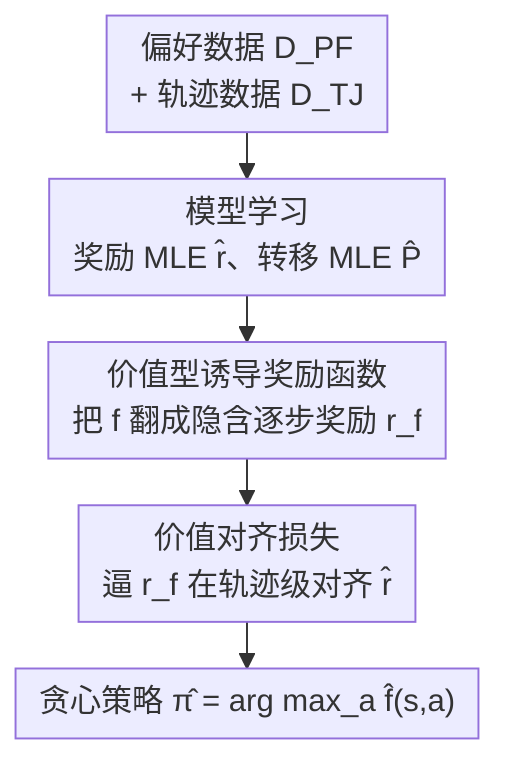

# Offline Preference-based Value Optimization

**会议**: ICLR 2026  
**OpenReview**: [https://openreview.net/forum?id=9cUdn8GKId](https://openreview.net/forum?id=9cUdn8GKId)  
**代码**: 见补充材料（supplementary material）  
**领域**: 强化学习 / 离线偏好强化学习  
**关键词**: 离线 PbRL, 偏好学习, 价值对齐损失, 诱导奖励函数, 样本复杂度

## 一句话总结
本文提出 PVO（Preference-based Value Optimization），用一个全新的「价值对齐损失」直接优化价值函数，使其与偏好反馈一致，在拿到 $O(\varepsilon^{-2})$ 速率最优样本复杂度保证的同时，无需额外偏好学习超参就在连续控制基准上稳定地超越了一众强基线。

## 研究背景与动机
**领域现状**：偏好强化学习（PbRL）通过比较轨迹对的偏好反馈来推断奖励信号，绕开了真实任务里奖励函数难以设计、需要动作捕捉等昂贵仪器的问题，已经在机器人、游戏、大模型对齐（RLHF）等场景验证有效。本文聚焦其中的**离线**设定：只用预先收集好的轨迹与偏好标注学习，不与环境实时交互——这对 PbRL 尤其重要，因为交互式收集人类偏好往往代价高昂甚至不可行。

**现有痛点**：已有的离线 PbRL 理论算法都在「可证明」和「可用」之间二选一。Zhu et al. (2023) 只支持线性函数近似；Zhan et al. (2024a) 的 FREEHAND 把 PbRL 写成一个分布鲁棒优化（distributionally robust optimization）问题，内层要在奖励、转移的置信集上做极小化搜索，计算上**根本不可行**；Kang & Oh (2025) 的 APPO 用 actor-critic 把它松弛成可解的正则优化，但样本复杂度退化到 $O(\varepsilon^{-4})$，而且实践中**训练不稳定、性能方差极大**，即便调参也可能学不出有效策略。

**核心矛盾**：PbRL 的奖励集中度（concentration）保证只在**轨迹对** $(\tau^0,\tau^1)\sim\mu$ 这个层级上成立，而不是逐状态、逐转移成立。这意味着标准 RL 里逐步的平方 Bellman 误差（TD loss）与 PbRL 在结构上**不兼容**——用它去拟合从偏好估出来的奖励，会让奖励估计误差顺着 Bellman 回传被逐层放大，造成不稳定。

**本文目标**：找一个既有速率最优样本复杂度、又训练稳定、还不引入额外超参的离线 PbRL 算法。

**切入角度**：既然集中度是轨迹级的，那损失函数也应该建立在**轨迹对级别**上；同时作者不走 actor-critic 的迭代（那是 APPO 不稳定的根源），而是借鉴 **Bellman 最优方程**直接对价值函数下手。

**核心 idea**：定义「价值型诱导奖励函数」把价值函数 $f$ 翻译成它隐含的逐步奖励，再用一个轨迹级的「价值对齐损失」逼着这个隐含奖励去对齐 MLE 估出来的奖励模型 $\hat r$，从而一步到位地把价值函数学得与偏好一致。

## 方法详解

### 整体框架
PVO 要解决的是：给定一份偏好数据集 $D_{PF}=\{(\tau^{m,0},\tau^{m,1},y_m)\}$ 和一份轨迹数据集 $D_{TJ}=\{(\tau^{n,0},\tau^{n,1})\}$，离线地学出一个 $\varepsilon$-最优策略。整条流水线分两相：先做**模型学习**（用 MLE 估出奖励模型 $\hat r$ 和转移模型 $\hat P$），再做**价值优化**（最小化价值对齐损失得到价值函数 $\hat f$，取贪心策略输出）。它的精妙之处不在于流程多复杂，而在于第二相里那个轨迹级的损失——它让价值函数无需 actor-critic 反复迭代就能与偏好一致，因此天然更稳。

### 关键设计

**1. 价值型诱导奖励函数：让价值函数直接「翻译」出隐含奖励**

PbRL 的难点是无法逐步观测奖励，因此标准 RL 的平方 Bellman 误差用不了。作者绕开「先学策略、再算价值」的 actor-critic 路线，转而对每个价值函数 $f$ 定义它**隐含的逐步奖励**：

$$r_{h,f} = f_h - P^\star_h V_{h+1,f}$$

其中 $V_{h+1,f}(s)=f_{h+1}(s,\pi_f(s))$ 是 $f$ 的贪心价值。这与 actor-critic 分析里用的「策略型诱导奖励」不同——后者扎根于针对某策略 $\pi$ 的 Bellman 方程 $Q^\pi_h=r^\star_h+P^\star_h V^\pi_{h+1}$，而这里的「价值型」定义灵感来自 **Bellman 最优方程** $Q^{\pi^\star}_h(s,a)=r^\star_h(s,a)+\mathbb{E}_{s'}[\max_{a'}Q^{\pi^\star}_{h+1}(s',a')]$。正是这个 max 形式让作者能**直接优化价值函数本身**，省掉 APPO 那种策略/价值交替迭代，从源头上消除了不稳定的来源。

**2. 价值对齐损失：在轨迹级上对齐，匹配 PbRL 的集中度结构**

有了诱导奖励，作者提出价值对齐损失（value alignment loss）：

$$\hat L_{VA}(r_f,\hat r)=\sum_{n=1}^{N}\big(r_f(\tau^{n,0})-r_f(\tau^{n,1})-\hat r(\tau^{n,0})+\hat r(\tau^{n,1})\big)^2$$

表面看它只是诱导奖励 $r_f$ 与奖励模型 $\hat r$ 之间的轨迹级平方误差，但代入定义 1 展开后会发现，它实际等于 $f$ 在**一对轨迹之间累计 Bellman 误差之差**的平方。换句话说，最小化 $\hat L_{VA}$ 是在逼 $f$ 相对 $\hat r$ 做到 Bellman 一致，从而与偏好数据对齐。它之所以比 TD loss 好，关键在于把误差**摊在整条轨迹层级**上：TD loss 会通过逐步 Bellman 回传把奖励模型误差层层放大，而价值对齐损失把误差平滑地分散到轨迹尺度，正好契合「集中度只在轨迹对上成立」这一 PbRL 结构性事实——这也是它在奖励估计必然有误的 PbRL 里更稳的理论解释。

**3. 统一框架：同一个损失同时支撑价值优化与 actor-critic**

作者进一步回看 APPO，发现它的价值更新里那一项 $\hat E(f)$ 其实是策略型诱导奖励与 $\hat r$ 之间的 $\ell_1$ 误差，可以看作价值对齐损失的 $\ell_1$ 变体。由此提出一个自然问题：把 APPO 里的 $\hat E(f)$ 换成 $\hat L_{VA}$，还能保住样本复杂度保证吗？答案是肯定的（Theorem B.1）。这说明「价值型诱导奖励 + 价值对齐损失」不是只服务于 PVO 这一种价值类算法，而是一条**可证明高效 PbRL 的统一原则**，对价值类和 actor-critic 类算法都适用，把两条原本分立的技术路线收进了同一框架。

**4. 实用深度实现：用期望分位回归 + AWR，并彻底免掉转移模型**

理论版 PVO 需要转移模型 $\hat P$ 来算诱导奖励，但实际深度实现里训练 $\hat P$ 既贵又难。作者把 PVO 适配到带折扣的标准深度 PbRL 设定（对长度 $L$ 的轨迹片段做偏好），分开参数化 $Q$ 和 $V$：$V$ 用期望分位回归 $L_V=\mathbb{E}[L_2^\tau(Q(s,a)-V(s))]$ 训练；$Q$ 用价值对齐损失 $L_Q=\mathbb{E}[(r_{Q,V}(\tau^0)-r_{Q,V}(\tau^1)-\hat r(\tau^0)+\hat r(\tau^1))^2]$ 训练，其中 $r_{Q,V}(\tau)=\sum_{l=1}^{L}(Q(s_l,a_l)-\gamma V(s_{l+1}))$。这里用 $V(s_{l+1})$ 直接替代 $\hat P V(s_l,a_l)$，**消掉了训练转移模型的需要**，实验证明这个近似的实证表现依然很好。最后策略用优势加权回归（AWR）$L_\pi=\mathbb{E}[\exp(\beta(Q(s,a)-V(s)))\log\pi(a|s)]$ 抽取。值得注意的是，整套实现与 IQL 共享完全相同的超参，**不为偏好学习引入任何新超参**。

### 损失函数 / 训练策略
- 奖励模型：负对数似然 $\hat L_{RW}(r)=-\sum_{m=1}^{M}\log\Phi\big((2y_m-1)(r(\tau^{m,1})-r(\tau^{m,0}))\big)$，其中 BTL 模型取 $\Phi=\sigma$；1000 条偏好样本训练奖励模型不到一分钟。
- 价值函数：最小化价值对齐损失（无约束、可直接用现成梯度优化器），价值/策略学习约 2 小时。
- 策略抽取：优势加权回归（AWR）。

## 实验关键数据

### 主实验
评测基准为 Meta-World（指标：成功率）与 DMControl（指标：回合回报），数据来自 Choi et al. (2024)，偏好对取长度 25 的随机片段、按真实回报生成标签。对比基线包括 IQL（学奖励模型）、APPO、Preference Transformer (PT)、DPPO、IPL。

| 方法 | 样本复杂度 | 偏好学习额外超参 | 计算可行性 | 实证稳定性 |
|------|-----------|-----------------|-----------|-----------|
| FREEHAND (Zhan 2024a) | $O(\varepsilon^{-2})$（更紧） | — | 不可行（DRO oracle） | — |
| APPO (Kang & Oh 2025) | $O(\varepsilon^{-4})$ | 保守度参数 | 可行 | 方差大、易崩 |
| DPPO / IPL | — | 平滑/保守/正则参数 | 可行 | 跨数据集不稳 |
| **PVO（本文）** | $O(\varepsilon^{-2})$ | **无（与 IQL 同参）** | 可行（免转移模型） | **稳定鲁棒** |

整体结果（Figure 1/2）：PVO 在 Meta-World medium-replay 与 medium-expert 上都一致领先；基线常出现跨数据集高方差，例如 IQL 在 medium-replay sweep 上与 PVO 相当，却在 medium-replay button-press-topdown 上完全学不出来，而 PVO 始终稳定——这正体现它对奖励模型误差的鲁棒性。

### 消融实验

| 配置 | 结果趋势 | 说明 |
|------|---------|------|
| IQL（标准 TD loss） | 基准、跨任务方差大 | 与 PVO 同架构同期望分位回归，只差损失 |
| IQL + VA = PVO | 显著提升且稳定 | 替换为价值对齐损失即 PVO |
| XQL → XQL + VA | 显著提升 | 价值类算法换 VA loss 受益 |
| TD3+BC → TD3+BC + VA | 显著提升 | actor-critic 算法换 VA loss 受益 |

### 关键发现
- **价值对齐损失是涨点核心**：在 IQL、XQL、TD3+BC 上把标准 TD loss 换成 VA loss 都带来明显提升（IQM 聚合，8 个 medium-replay 任务、1000 条偏好），证明它提供了比 TD loss 更可靠的学习信号，对价值类和 actor-critic 类都通用。
- **偏好数据极省**：约 100 条偏好样本时 PVO 即可有效学习，性能退化极小。
- **对数据质量鲁棒**：在 dial-turn 上按比例 $r\in\{0,0.25,0.5,0.75,1\}$ 混合专家与随机轨迹，各方法都随 $r$ 升高而下降，但 PVO 在所有混合比例下都保持领先，即使数据分布严重偏离最优策略。

## 亮点与洞察
- **把损失放对层级**：洞察到 PbRL 的集中度只在轨迹对上成立，于是设计轨迹级的价值对齐损失而非逐步 TD loss——这是「为什么 PVO 更稳」的根本，思路可迁移到任何「监督信号只在序列/集合级别可靠」的学习问题。
- **借 Bellman 最优方程绕开迭代**：用价值型诱导奖励（受 max 形式启发）直接优化价值函数，省掉 actor-critic 交替，既简化实现又消除不稳定来源。
- **一损通吃两条路线**：同一个价值对齐损失既给出 PVO（价值类）又能改造 APPO（actor-critic 类）并保持理论保证，提供了 PbRL 的统一视角。
- **零额外超参**：与 IQL 完全同参，工程上几乎零迁移成本，这在动辄一堆保守/正则超参的 PbRL 里很难得。

## 局限与展望
- **样本复杂度边界更松**：PVO 的界依赖更强的「均匀集中度」$C_\mu(F)$，比 FREEHAND/APPO 用的单策略集中度更强；作者坦言这是用理论紧致度换实用性与稳定性的 trade-off。
- **深度实现里的近似**：用 $V(s_{l+1})$ 替代 $\hat P V(s_l,a_l)$ 虽免掉转移模型且实证有效，但理论 PVO 仍需要 $\hat P$，这层近似的理论解释只停留在「误差被轨迹级平滑」的假设上，未严格量化。
- **依赖奖励模型 MLE**：价值优化以 $\hat r$ 为锚，若偏好反馈本身严重噪声/非 BTL，$\hat r$ 偏差仍可能传导；可探索更鲁棒的偏好学习器替换 MLE。
- **评测范围**：主要在 Meta-World / DMControl 连续控制上验证，是否能迁移到大模型对齐这类高维离散场景尚待考察。

## 相关工作与启发
- **vs FREEHAND (Zhan et al., 2024a)**：两者都拿到 $O(\varepsilon^{-2})$，但 FREEHAND 把 PbRL 写成分布鲁棒优化、需要不可行的 DRO oracle；PVO 用无约束的价值对齐损失即可，计算可行、可直接神经网络实现。
- **vs APPO (Kang & Oh, 2025)**：APPO 用 actor-critic 把 DRO 松弛成可解正则优化，但样本复杂度退化到 $O(\varepsilon^{-4})$ 且训练不稳；PVO 把 $N$ 的界收紧到 $O(\varepsilon^{-2})$、训练稳定、无额外超参，代价是用了更强的均匀集中度假设。
- **vs IQL + 学得奖励**：二者共享相同网络与期望分位回归，唯一区别是 PVO 用价值对齐损失替代 TD loss，消融显示这一替换正是稳定性与性能提升的来源。
- **vs IPL / DPPO（直接从偏好学价值/策略）**：它们直接最大化偏好似然或用偏好打分优化策略，但带额外正则/保守超参且跨数据集不稳；PVO 经由诱导奖励显式对齐，更稳且零额外超参。

## 评分
- 新颖性: ⭐⭐⭐⭐⭐ 价值型诱导奖励 + 轨迹级价值对齐损失是对 PbRL 结构的本质洞察，并统一了价值类与 actor-critic 两条路线。
- 实验充分度: ⭐⭐⭐⭐ 多基准多基线 + 损失替换/数据量/数据质量三组消融到位，但主结果多以柱状图呈现、缺精确数值表。
- 写作质量: ⭐⭐⭐⭐⭐ 动机—理论—实现—实验逻辑严密，理论与实用的 trade-off 交代诚实。
- 价值: ⭐⭐⭐⭐⭐ 简单、稳定、零额外超参且有速率最优保证，对落地离线 PbRL 很实用。

<!-- RELATED:START -->

## 相关论文

- [\[ICLR 2026\] Preference-based Policy Optimization from Sparse-reward Offline Dataset](preference-based_policy_optimization_from_sparse-reward_offline_dataset.md)
- [\[ICLR 2026\] DuPO: Enabling Reliable Self-Verification via Dual Preference Optimization](dupo_enabling_reliable_self-verification_via_dual_preference_optimization.md)
- [\[ICLR 2026\] Peng's Q($\lambda$) for Conservative Value Estimation in Offline Reinforcement Learning](pengs_qlambda_for_conservative_value_estimation_in_offline_reinforcement_learnin.md)
- [\[ICLR 2026\] Trajectory Generation with Conservative Value Guidance for Offline Reinforcement Learning](trajectory_generation_with_conservative_value_guidance_for_offline_reinforcement.md)
- [\[ICLR 2026\] Causally Robust Reward Learning from Reason-Augmented Preference Feedback](causally_robust_reward_learning_from_reason-augmented_preference_feedback.md)

<!-- RELATED:END -->
