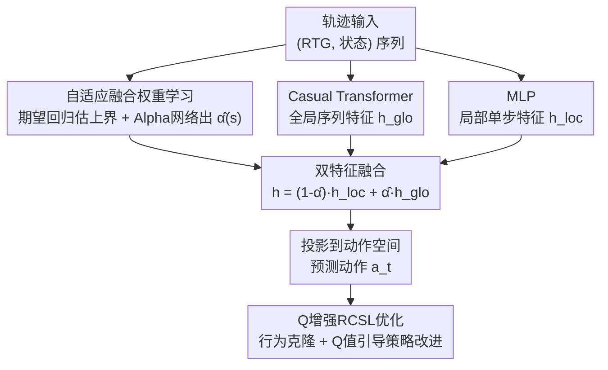

# Offline Reinforcement Learning with Adaptive Feature Fusion

**会议**: ICLR 2026  
**OpenReview**: [https://openreview.net/forum?id=uD9UT0gHLH](https://openreview.net/forum?id=uD9UT0gHLH)  
**代码**: https://github.com/wangtieru2/QDFFDT (有)  
**领域**: 离线强化学习 / 序列建模 / Decision Transformer  
**关键词**: 离线RL, RCSL, Decision Transformer, 特征融合, 轨迹拼接

## 一句话总结
这篇论文针对 Decision Transformer 这类「把强化学习当序列建模」的方法容易过拟合历史次优子轨迹、拼不出更优轨迹的问题，提出 QDFFDT：用一个可学习的、随状态变化的融合系数，把「全局序列特征」和「局部单步马尔可夫特征」自适应地加权融合，再叠加 Q 学习模块做价值引导，在 D4RL 基准上达到 SOTA。

## 研究背景与动机

**领域现状**：离线强化学习只能从一份固定的、提前采集好的数据里学策略，不能和环境交互。近年来 Transformer 被引入这一领域，催生了 Return-Conditioned Supervised Learning（RCSL）范式——以 Decision Transformer（DT）为代表，把轨迹建模成 `(回报-to-go, 状态, 动作)` 的序列，根据历史上下文和目标回报来预测动作，把 RL 变成一个监督学习问题，因而训练稳定、数据效率高。

**现有痛点**：把 RL 当成纯序列建模有一个根本缺陷——模型会过拟合到历史子轨迹里那些具体的、往往是次优的动作。结果就是，哪怕你在评测时把目标回报设得很高，模型也合成不出对应的高质量动作序列。论文给了一个直观例子（图 2）：在一个简单网格里存在两条训练轨迹 `ABCDK` 和 `AIJDE`，DT 在前期能找到最优子段 `ABCD`，但走到状态 D 时，历史上下文会把它误导回训练数据里通往 K 的轨迹，从而错过真正最优的 `ABCDE`。把 DT 序列长度设为 1 得到的单步版本（SSDT）反而 100% 找到最优解，而标准 DT（K=3）成功率为 0。

**核心矛盾**：序列建模的目标（可靠复现训练集里出现过的轨迹）和 RL 的目标（把多条轨迹的最优片段拼起来、发现超越任何单条轨迹的新策略）本质上是错位的。已有一些工作意识到长序列依赖的问题，但要么缺乏灵活平衡全局/局部信息的能力，要么需要针对每个数据集做繁琐的超参调优。即便像 QT 那样引入 Q 函数做价值引导，由于其策略目标同时要优化动作价值又要约束策略贴近行为分布，行为克隆项依然会把前面的次优子轨迹影响压不下去。

**本文目标**：设计一种能在「利用长程上下文」和「优先单步最优决策」之间自适应取舍、且不依赖逐数据集调参的离线 RL 架构。

**核心 idea**：显式地把全局序列特征和局部马尔可夫特征**分离**成两路，再用一个**依赖状态**的可学习融合权重把它们自适应地组合起来——当某个状态的训练回报明显低于其可达的最优回报时，就降低对序列特征的依赖、转而信任单步特征；同时叠加 Q 学习模块提供显式的价值引导。

## 方法详解

### 整体框架

QDFFDT 的核心是一个双路特征融合的 Decision Transformer。输入是去掉动作 token 的轨迹片段 $\tau_t = (\hat{R}_{t-K+1}, s_{t-K+1}, \dots, \hat{R}_t, s_t)$（每一项是「回报-to-go + 状态」对），输出是当前时刻动作 $a_t$。整条流程分三步：先由一个「Alpha 网络」根据状态算出一个融合系数 $\hat{\alpha}(s)$；再把同一份输入分别送进 Casual Transformer（提全局序列特征）和轻量 MLP（提局部单步特征），用 $\hat{\alpha}$ 把两路特征加权融合、投影到动作空间；最后在监督式行为克隆损失之外，再挂一个 Q 学习模块做价值引导的策略改进。前两步组成 DFFDT，加上 Q 模块就是完整的 QDFFDT。

### 关键设计

**1. 双特征融合架构：把全局与局部两种归纳偏置显式分开再融合**

痛点很明确：纯序列建模会优先「续写」历史观察到的子轨迹，哪怕存在更好的动作；纯单步建模虽然能直接挑选高回报动作、利于轨迹拼接，但在 Atari 这类像素环境里，压缩后的状态表示常常信息不足，必须靠时序上下文补全。两者各有死穴，所以论文不二选一，而是把它们做成两条并行支路。具体地，每个「回报-状态」对 $(\hat{R}_t, s_t)$ 经一个轻量 MLP 得到局部表示 $h^{\text{loc}}_t$，同时经自注意力（与 DT 相同）得到捕捉长程依赖的全局表示 $h^{\text{glo}}_t$，两路再按融合系数线性组合：

$$h = (1 - \hat{\alpha}(s_t)) \cdot h^{\text{loc}}_t + \hat{\alpha}(s_t) \cdot h^{\text{glo}}_t$$

融合前两路特征都先做 Layer Normalization 对齐尺度，避免量纲不一致让某一路主导。这个结构本身就引入了一种「优先单步动态、同时不丢长程信息」的结构性偏置，是后面所有自适应行为的载体。

**2. 自适应融合权重：用期望回归识别次优数据，动态决定信谁**

光有两路还不够，关键是「在什么状态下该多信哪一路」。论文用**期望回归（expectile regression）**来估计某个状态下回报-to-go 的经验上界。给定 $\sigma \in (0,1)$，期望回归通过非对称最小二乘 $L^\sigma_2(u) = |\sigma - \mathbb{1}(u<0)| u^2$ 求解，当 $\sigma > 0.5$ 时对偏大的样本赋更高权重。据此训练一个状态价值函数 $V_\psi(s)$ 去逼近该状态可达回报的上界：$L_V(\psi) = \mathbb{E}_{(s,\hat{R})\sim D}[L^\sigma_2(\hat{R} - V_\psi(s))]$。注意这与 IQL 用期望回归逼近最优 Q 值不同，这里 $V_\psi(s)$ 的作用是**识别次优数据**——当 $V_\psi(s)$ 明显大于实际观测到的回报 $\hat{R}(s)$，说明后续轨迹是次优的。

随后用一个 Alpha 网络产出序列特征的融合系数。它的损失把「次优程度」当作惩罚信号：

$$L_\alpha(\omega) = \mathbb{E}_{(s,\hat{R})\sim D}\left[\frac{\alpha_\omega(s) \cdot \max(V_\psi(s) - \hat{R}, 0)}{T}\right]$$

其中 $T$ 是温度超参，$\alpha_\omega(s) \in (0,1)$ 经 Sigmoid 输出，最终系数 $\hat{\alpha}(s) = \alpha_{\min} + (1-\alpha_{\min})\cdot \alpha_\omega(s)$，并用 $\alpha_{\min}$ 兜底一个最小序列权重。机制很巧妙：训练初期把 Alpha 网络最后一层初始化为零权重 + 大正偏置（如 5），让 $\alpha_\omega(s) \approx 1$，先充分依赖序列建模；之后一旦某状态 $V_\psi(s) > \hat{R}$（即数据次优），损失就压低 $\alpha_\omega(s)$，把权重让给局部马尔可夫特征；当 $V_\psi(s) \le \hat{R}$（高质量轨迹）时惩罚项消失，系数保持高位、保留序列建模的贡献。于是「该不该信历史」这件事变成了数据驱动、逐状态自适应，省掉了逐数据集手调权重的麻烦。

**3. Q 增强的 RCSL 优化：用动态规划的价值引导做显式策略改进**

RCSL 的 RTG 信号常常无法准确反映状态-动作对的真实价值，目标 RTG 与最优 RTG 的错配会让 RCSL 收敛不到理论最优。为此论文叠加一个 Q 学习模块：用五个网络（两个 Q 网络 $Q_{\phi_1}, Q_{\phi_2}$、两个目标 Q 网络、一个目标策略网络），借鉴 QT 的实现做 TD 学习，目标值 $\hat{Q}_m$ 支持 n-step 或 1-step Bellman 两种形式（实践中手动二选一，论文发现 QT 宣称的 n-step 一定更好并不总成立）。最终策略损失是行为克隆项和价值引导项的加权和：

$$L_\pi(\theta) = \lambda \cdot L_{\text{DFFDT}}(\theta) - \mathbb{E}_{\tau_t \sim D}\mathbb{E}_{s_i \sim \tau_t} Q_\phi(s_i, \pi_\theta(\tau_t)_i)$$

其中 $\lambda$ 平衡监督学习与价值改进，$L_{\text{DFFDT}}$ 是预测动作与真值动作的 MSE。仿照 TD3+BC，Q 函数做了归一化以缓解不同离线数据集间的尺度失配、避免两个目标的梯度失衡。这一项让策略不只是模仿数据，而是被显式地推向高价值区域，弥补纯回报条件信号不可靠的短板。

### 损失函数 / 训练策略
整体优化三类损失协同：价值函数 $V_\psi$ 的期望回归损失 $L_V$、Alpha 网络的次优惩罚损失 $L_\alpha$、以及策略损失 $L_\pi$（行为克隆 MSE + Q 值引导项）。Q 网络按标准 TD 学习更新。收敛性方面，作者论证 DFFDT（RCSL）部分继承了 QT 已验证的收敛到行为策略的性质，Q 增强部分遵循动态规划，二者组合虽无形式化证明但有理论根据并经实验验证。

## 实验关键数据

### 主实验
在 D4RL 基准（Gym-MuJoCo、Maze2D、AntMaze、Kitchen、Adroit）上对比大量 value-based、RCSL 及扩散/VAE 类方法，报告归一化分数。下表摘取各域平均分：

| 任务域 | 指标 | QDFFDT | 之前最好（基线） | 提升 |
|--------|------|--------|------------------|------|
| Gym MuJoCo（9 任务平均） | 归一化分数 | **94.3** | 90.3 (QCS) | +4.0 |
| Maze2D（3 任务平均） | 归一化分数 | **159.8** | 154.4 (QT) | +5.4 |
| AntMaze（6 任务平均） | 归一化分数 | **88.3** | 80.4 (QCS) | +7.9 |
| Kitchen（2 任务平均） | 归一化分数 | **64.9** | 61.6 (D-QL) | +3.3 |
| Adroit（2 任务平均） | 归一化分数 | **94.5** | 90.1 (QCS) | +4.4 |

在带马尔可夫性的次优数据集（medium、medium-replay）上对 QT 提升尤为明显，例如 halfcheetah-m 从 QT 的 51.4 提到 65.7、hopper-m 从 96.9 提到 101.4。在需要长程推理的 Maze2D / AntMaze 上同样领先，且无需 LSDT、QCS 所要求的显式目标条件。

### 消融实验

**特征分支消融**（图 4，定性结论）：

| 配置 | 表现 | 说明 |
|------|------|------|
| 纯序列（DT / QRC-Transformer） | 全可观测任务上偏弱 | 易受历史次优片段拖累，拼接与局部特征提取都受损 |
| 纯单步（RC-MLP / QRC-MLP） | Gym、AntMaze 上更强 | 强调即时信息，利于轨迹拼接 |
| 融合（DFFDT / QDFFDT） | 各基准一致最优 | 在 Atari 部分可观测任务上靠序列补全信息，在全可观测任务上靠局部避开次优 |

值得注意的是在 Atari 这类高维像素、压缩导致部分可观测的环境，序列建模反而占优（靠历史上下文补回压缩损失的信息），说明两路谁更重要确实因环境而异，正好支撑了自适应融合的必要性。

**动态 vs 静态融合系数**（表 3，Maze2D + AntMaze 平均）：

| 配置 | 平均分 | 说明 |
|------|--------|------|
| $\hat{\alpha}=0$（纯局部） | 86.9 | 完全靠单步信息 |
| $\hat{\alpha}=0.25$ | 80.4 | 固定低序列权重 |
| $\hat{\alpha}=0.5$ | 85.0 | 固定均衡 |
| $\hat{\alpha}=0.75$ | 94.9 | 固定高序列权重 |
| $\hat{\alpha}=1$（纯序列） | 101.2 | 完全靠序列 |
| **QDFFDT（动态学习）** | **105.3** | 自适应系数 |

### 关键发现
- 动态学习的融合系数（105.3）高于任何固定取值，且固定系数要在不同数据集间取得好成绩必须逐个手调，泛化性差——这正是自适应机制的价值所在。
- 环境的可观测性决定了序列与单步哪路更关键：全可观测任务里局部特征更可靠，部分可观测（Atari 像素）任务里序列特征更重要，固定权重无法同时照顾。
- 把 Q 价值学习并入纯回报条件模型（相比 DT、LSDT）在稀疏奖励环境（AntMaze）带来显著增益，凸显价值引导的重要性。

## 亮点与洞察
- **用期望回归当「次优探测器」而非「最优 Q 估计器」**：同样的统计工具，IQL 用它逼近最优 Q 值，本文却用 $V_\psi(s)$ 与实际回报的差来判断数据好坏，进而调度两路特征——同一工具换个用途，思路很可迁移。
- **Alpha 网络的零权重大偏置初始化**是个实用 trick：让训练初期先信序列建模、随后被数据驱动地逐步降权，给了一个平滑的「先全局后局部」课程，避免一上来两路打架。
- **把「全局 vs 局部」的归纳偏置做成可学习的连续权重**，比起 EDT 那种动态调上下文长度、或纯把序列截断到 1，给了更细粒度、状态级别的控制，也避免了脆弱的逐数据集超参调优。

## 局限与展望
- 论文自承组合方法（DFFDT + Q 增强）缺乏形式化收敛证明，只靠分项的理论根据加实验验证。
- n-step 与 1-step Bellman 仍需手动二选一，说明价值估计这一环并非完全免调参，自适应只解决了融合权重那一侧。
- 期望回归的 $\sigma$、温度 $T$、$\alpha_{\min}$、$\lambda$ 等仍是超参，虽然论文强调省掉了「逐数据集」调权重，但这些全局超参的敏感性论文正文未充分展开。
- 在线/真实机器人等更复杂场景的迁移性尚未验证，实验集中在 D4RL + Atari 仿真基准。

## 相关工作与启发
- **vs DT / DC / EDT（纯 RCSL）**：它们把 RL 当纯序列建模，DC 换卷积骨干、EDT 动态调上下文长度，但都没解决「过拟合历史次优子轨迹」的根本矛盾；本文显式拆出局部单步支路并自适应降权，直击轨迹拼接难题。
- **vs QT / QCS（RCSL + 价值）**：QT 把轨迹建模与 Q 值预测结合、QCS 自适应注入 Q 引导，但 QT 的策略目标里行为克隆项压不住次优子轨迹影响；本文先在**特征层面**用融合权重削弱次优序列特征，再叠加 Q 引导，从两个层面而非单靠价值项来对抗次优历史。
- **vs IQL**：同样用期望回归，IQL 用来逼近最优 Q 值做策略改进，本文用来估计回报上界、识别次优数据以调度特征融合，用途完全不同。

## 评分
- 新颖性: ⭐⭐⭐⭐ 「可学习的状态级全局/局部特征融合权重 + 期望回归当次优探测器」组合清晰且有动机，但各组件（DT、Q 增强、期望回归）多为已有积木的重组。
- 实验充分度: ⭐⭐⭐⭐ 覆盖 D4RL 五大域 + Atari，主表对比基线丰富，动态 vs 静态系数与分支消融都有，但部分消融只给定性图、超参敏感性偏弱。
- 写作质量: ⭐⭐⭐⭐ 动机用网格反例讲得直观，方法公式完整；个别记号（Alpha 网络与 Q 模块的交互）需对照原文。
- 价值: ⭐⭐⭐⭐ 免逐数据集调参、在次优与稀疏奖励数据上稳定领先，对落地离线 RL 有实用意义。

<!-- RELATED:START -->

## 相关论文

- [\[ICLR 2026\] Trajectory Generation with Conservative Value Guidance for Offline Reinforcement Learning](trajectory_generation_with_conservative_value_guidance_for_offline_reinforcement.md)
- [\[ICLR 2026\] Adaptive Scaling of Policy Constraints for Offline Reinforcement Learning](adaptive_scaling_of_policy_constraints_for_offline_reinforcement_learning.md)
- [\[ICLR 2026\] ROMI: Model-based Offline RL via Robust Value-Aware Model Learning with Implicitly Differentiable Adaptive Weighting](model-based_offline_rl_via_robust_value-aware_model_learning_with_implicitly_dif.md)
- [\[ICLR 2026\] In-Context Compositional Q-Learning for Offline Reinforcement Learning](in-context_compositional_q-learning_for_offline_reinforcement_learning.md)
- [\[ICLR 2026\] Flow Actor-Critic for Offline Reinforcement Learning (FAC)](flow_actor-critic_for_offline_reinforcement_learning.md)

<!-- RELATED:END -->
