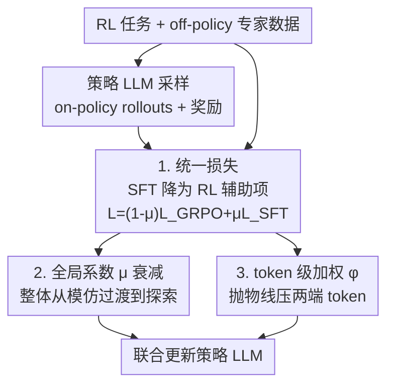

# On-Policy RL Meets Off-Policy Experts: Harmonizing Supervised Fine-Tuning and Reinforcement Learning via Dynamic Weighting

**会议**: ICLR 2026  
**OpenReview**: [https://openreview.net/forum?id=dCm9bBrk5d](https://openreview.net/forum?id=dCm9bBrk5d)  
**代码**: 有（论文声明已开源实现）  
**领域**: 对齐RLHF / LLM推理  
**关键词**: SFT与RL融合, on-policy/off-policy, 动态加权, GRPO, token级加权

## 一句话总结
本文提出 CHORD，把 SFT 从一个独立训练阶段重构为 on-policy RL 过程里**动态加权的辅助目标**，再用「全局系数 $\mu$ + token 级加权函数 $\phi(\cdot)$」的双控机制平滑吸收专家数据，在数学推理和工具调用任务上稳定超过 SFT-then-RL 等基线。

## 研究背景与动机

**领域现状**：大模型后训练主要靠两条路线——SFT 用高质量专家轨迹模仿其回答模式；RL（如 GRPO）让模型在自己生成的 on-policy 轨迹上探索、从奖励反馈中泛化。为了取二者之长，业界最常用的是顺序式的 **SFT-then-RL** 范式：先用专家数据 SFT 引导模型越过局部最优，再用 RL 缓解 SFT 的 exposure bias 和过拟合。

**现有痛点**：作者用实验戳破了「先 SFT 再 RL 一定更好」的直觉。图 1 显示 SFT-then-RL 并不稳定优于纯 RL，有时反而更差。更关键的是，对 Qwen2.5-7B-Instruct 用 DeepSeek-R1 生成的专家数据做 SFT 时，MATH-500 准确率呈现一条 **"shift-readapt-overfit"（偏移-再适应-过拟合）** 的三段式曲线：先因被强行模仿差异巨大的专家模式而**掉点**（policy shift），再慢慢适应回升（readapt），最后在有限专家数据上**过拟合**、丧失输出多样性和探索能力。

**核心矛盾**：专家数据既能带来新能力，又会**破坏模型已有的回答模式**。SFT-then-RL 把这一切压在「何时从 SFT 切到 RL」这个脆弱的时机判断上——切早了没学够，切晚了已经过拟合，而最优时机还高度依赖任务（数学题适合 SFT-best 起步，工具调用适合 SFT-light 起步）。两阶段的固有割裂让它很难调好。

**核心 idea**：不要把 SFT 当独立阶段，而是把它**降格为 on-policy RL 里一个可动态调权的辅助损失项**，用粗（全局）+ 细（token）两级旋钮精确控制专家数据的影响——既吸收知识，又不压死模型自己的探索。

## 方法详解

### 整体框架

CHORD（Controllable Harmonization of On- and Off-Policy RL via Dynamic Weighting）的输入是一份 RL 任务数据 + 一份 off-policy 专家数据，输出是一个被联合优化的策略模型 $\pi_\theta$。它的核心改动只有一处：把损失改成 RL 损失与 SFT 损失的加权和 $L = (1-\mu)L_{\text{GRPO}} + \mu L_{\text{SFT}}$，让 SFT 和 RL 在**同一步**里一起更新，而非分两个阶段。

在这个统一损失之上，CHORD 装了一套**双控机制**：先用一个随训练衰减的**全局系数 $\mu$**，holistic 地控制专家数据的整体权重，把训练从「模仿 off-policy 专家」平滑过渡到「on-policy 探索」；再用一个 **token 级加权函数 $\phi(\cdot)$**，granular 地决定专家轨迹里每个 token 值不值得学，压掉那些会扰乱已有策略的 token。整体流程如下：

### 关键设计

**1. 统一视角：把 SFT 重构为 RL 的动态加权辅助目标**

这一步直接针对 SFT-then-RL 两阶段割裂、切换时机脆弱的痛点。CHORD 不再先 SFT 后 RL，而是定义混合损失

$$L_{\text{Hybrid}}(\theta) = (1-\mu)L_{\text{GRPO}}(\theta) + \mu L_{\text{SFT}}(\theta),$$

其中 $L_{\text{GRPO}}$ 是不含 KL 项的 GRPO 损失，$L_{\text{SFT}}$ 是专家数据的负对数似然，$\mu\in[0,1]$ 调节二者权重。妙处在于这个统一视角把过去各种做法都收编成特例：SFT-then-RL 就是 $\mu$ 从 1 突变到 0 的二值调度，交替式 SFT/RL 则是周期性 $\mu$ 调度。把它们放进同一框架后，就能用更平滑的方式去控制专家数据的影响，而不是靠一次性硬切换。

**2. 全局系数 $\mu$ 的衰减调度：整体上从模仿过渡到探索**

固定 $\mu$ 会让专家数据的影响全程不变，作者证明这行不通——无论大小，固定 $\mu$ 都逊于纯 RL 或难有提升，因为模型被持续要求同时迁就两套可能冲突的推理模式，被往不同方向拉扯而无法收敛。CHORD 改用**衰减调度**：训练初期 $\mu$ 取大值（如从 0.9 起）鼓励多学专家，随训练推进衰减到小值（如 0.05），把重心移向 on-policy 探索，并在过拟合发生**之前**退火掉专家数据的影响。这套思路借鉴 scheduled sampling，把「混合专家与自生成数据」的原则从 token 级推广到了损失级，弥合 off-policy 样本训练与 on-policy rollout 之间的分布鸿沟。但作者也观察到，仅靠 $\mu$ 仍有「shift-readapt」残留，且会迫使模型整体吞下专家冗长的回答风格、覆盖掉自己原本的简洁——说明 $\mu$ 只能调整体，缺乏细粒度。

**3. token 级加权函数 $\phi(\cdot)$：只在「学习甜区」吸收专家**

为了补上 $\mu$ 的粗粒度短板，CHORD 引入 per-token 权重。一个自然的候选是重要性采样（IS）：按 $\pi_\theta/\pi_{\text{sample}}$ 比值重加权（专家分母假设为 1）。IS 通过压低低概率 token 来稳住策略，但作者发现它会让策略熵**急剧坍缩**——在压低低概率 token 的同时过度强化高概率 token、忽略新颖的低概率 token，使策略过度自信、陷入稳定但次优解。于是本文提出抛物线权重

$$\phi(y^*_t;\pi_\theta) = p_t(1-p_t), \quad p_t=\pi_\theta(y^*_t\mid x,y^*_{<t}),$$

它在 $p_t=0.5$ 处取峰、在 $p_t\to 0$ 或 $1$ 时衰减到 0，于是**同时压低两端 token**：高概率 token（防熵坍缩）和极低概率 token（防破坏）都被降权。把它代入 SFT 项得到最终目标 $L_{\text{SFT-}\phi}=-\mathbb{E}[\sum_t \phi(y^*_t;\pi_\theta)\log\pi_\theta(y^*_t\mid x,y^*_{<t})]$。从信息论看，$p_t(1-p_t)$ 正是策略对「是否生成该 token」这一二元事件的不确定度，因此学习被偏向策略最不确定的 token，形成一个「足够新颖到有信息量、又不至于破坏已有策略」的学习甜区。

### 损失函数 / 训练策略
最终目标即把混合损失里的静态 $L_{\text{SFT}}$ 换成 $L_{\text{SFT-}\phi}$，由全局 $\mu$ 控整体影响、$\phi(\cdot)$ 控 token 稳定性。论文给出两个实现：**CHORD-$\mu$**（$\mu$ 用衰减调度、不加 $\phi$）与 **CHORD-$\phi$**（$\mu$ 固定为 0.1、再叠加 $\phi$ 形成双控）。GRPO 不含 KL 项以免限制性能。

## 实验关键数据

### 主实验
数学推理用 Qwen2.5-7B-Instruct（专家 DeepSeek-R1，SFT 5k / RL 20k），评测 AMC/AIME24/AIME25/MMLU-Pro；工具调用用 LLaMA3.2-3B-Instruct，评测 BFCL。

| 方法 | AMC | AIME24 | AIME25 | MMLU-Pro | BFCL Overall |
|------|------|--------|--------|----------|--------------|
| Original Model | 43.8 | 11.7 | 6.66 | 24.7 | 46.2 |
| SFT-best | 55.9 | 15.8 | 15.2 | 38.4 | 69.8 |
| GRPO (Pure RL) | 52.1 | 13.2 | 8.54 | 45.8 | 77.1 |
| SFT-best + RL | 58.4 | 17.1 | 16.3 | 51.3 | 76.1 |
| LUFFY | 52.8 | 16.6 | 14.3 | 44.0 | 76.1 |
| SASR | 54.0 | 12.7 | 11.1 | 45.1 | 74.7 |
| **CHORD-$\mu$** | 60.8 | 18.1 | 17.9 | 43.3 | 77.6 |
| **CHORD-$\phi$** | **62.5** | **18.2** | 17.2 | **56.2** | **78.5** |

CHORD-$\mu$ 已全面超过强基线 SFT-best+RL（AMC +2.4 / AIME24 +1.0 / AIME25 +1.6）；CHORD-$\phi$ 进一步登顶，尤其 MMLU-Pro 从 51.3 拉到 56.2，说明双控更好地保住了通用推理。

### 消融实验

| 配置 | 现象 | 说明 |
|------|------|------|
| 固定 $\mu$ (0.1/0.5) | 明显劣于动态 $\mu$ | 持续迁就两套模式，互相拉扯难收敛 |
| 固定 $\mu$ (0.02) | 缓解掉点但≈纯 RL | 仅靠小权重无法兼得吸收与探索 |
| 动态 $\mu$ 衰减 | 优于所有固定 $\mu$ | 平滑过渡化解冲突 |
| 混入 off-policy 无 IS | 熵急升 | 未加权专家数据迅速破坏已有模式 |
| 加 IS | 熵急剧坍缩 | 过度强化高概率 token、过度自信 |
| $\phi=p_t(1-p_t)$ | 熵不早坍也不爆 | 在探索/利用间取得平衡 |

### 关键发现
- **token 级 $\phi$ 是把通用推理拉起来的关键**：相比 CHORD-$\mu$，CHORD-$\phi$ 在 MMLU-Pro 上多了约 13 个点，说明粗粒度 $\mu$ 会牺牲泛化，细粒度加权才能选择性吸收。
- **回答长度看出"选择性吸收"**：专家在数学题上极冗长（6132 token），CHORD-$\mu$ 几乎照搬（6081），而 CHORD-$\phi$ 收敛到更合理的 2444；工具调用上 CHORD-$\phi$ 仅 120 token，接近原模型的简洁——它能按任务自适应，而非无脑模仿专家。
- **最优 SFT/RL 平衡高度依赖任务**：数学题 SFT-best+RL 更好、工具调用 SFT-light+RL 更好，印证两阶段范式调参成本高，而 CHORD 用一套机制覆盖两类任务。

## 亮点与洞察
- **"shift-readapt-overfit" 三段式诊断**：先把 SFT-then-RL 为何失效讲透（专家模式与已有模式差异大→破坏→过拟合），再顺势提出统一框架，动机非常扎实。
- **抛物线权重 $p_t(1-p_t)$ 简洁而对称**：一个无参函数同时治住「IS 导致熵坍缩」和「无加权导致熵爆炸」两个极端，且有信息论解释（二元事件不确定度），可迁移到任何需要从异源 token 学习的场景。
- **把已有方法收编为特例**：SFT-then-RL = 二值 $\mu$、交替式 = 周期 $\mu$，这个统一视角本身就是很好的"啊哈"——很多看似不同的做法只是 $\mu$ 调度的不同形态。

## 局限与展望
- 实验集中在数学推理与单轮工具调用两类任务，专家均由 DeepSeek-R1 生成；对更多任务类型、更弱/更杂的专家数据的鲁棒性未充分验证。
- $\phi=p_t(1-p_t)$ 形式固定，峰值锁死在 $p_t=0.5$，未必对所有分布最优；reward-aware 的自适应 $\mu$（$\mu=\max(0,\tau-\text{reward\_mean})$）作者也指出仍需大量调参。
- CHORD-$\phi$ 把 $\mu$ 固定为 0.1，是否能把「衰减 $\mu$ + $\phi$」两者同时叠加做得更好，论文留作开放问题。

## 相关工作与启发
- **vs SFT-then-RL**：两阶段先模仿后探索，靠切换时机；本文合并为单阶段动态加权，避免脆弱的时机判断与阶段割裂。
- **vs LUFFY**：LUFFY 把专家示范塞进 GRPO rollout group 并重塑 IS 比值；本文不改 rollout 组成，而是在损失层用 $\mu+\phi$ 控制专家影响，且证明 IS 会导致熵坍缩、用 $\phi$ 替代。
- **vs SASR**：SASR 按输出与专家的相似度概率性交替 SFT/RL 步；本文是连续加权而非离散交替，控制更平滑细粒度。

## 评分
- 新颖性: ⭐⭐⭐⭐⭐ 统一 on/off-policy 视角 + 抛物线 token 加权，角度新且自洽
- 实验充分度: ⭐⭐⭐⭐ 覆盖数学与工具两类任务、基线齐全，但任务面与专家来源略单一
- 写作质量: ⭐⭐⭐⭐⭐ 诊断—动机—方法链条清晰，图表支撑到位
- 价值: ⭐⭐⭐⭐⭐ 给 SFT+RL 融合提供了即插即用、可解释的统一框架

<!-- RELATED:START -->

## 相关论文

- [\[ICLR 2026\] Proximal Supervised Fine-Tuning](proximal_supervised_fine-tuning.md)
- [\[ICLR 2026\] SRFT: A Single-Stage Method with Supervised and Reinforcement Fine-Tuning for Reasoning](srft_a_single-stage_method_with_supervised_and_reinforcement_fine-tuning_for_rea.md)
- [\[ICLR 2026\] BAPO: Stabilizing Off-Policy Reinforcement Learning for LLMs via Balanced Policy Optimization with Adaptive Clipping](bapo_stabilizing_off-policy_reinforcement_learning_for_llms_via_balanced_policy_.md)
- [\[ICLR 2026\] Revisiting Group Relative Policy Optimization: Insights into On-Policy and Off-Policy Training](revisiting_group_relative_policy_optimization_insights_into_on-policy_and_off-po.md)
- [\[ICLR 2026\] Off-Policy Safe Reinforcement Learning with Constrained Optimistic Exploration](off-policy_safe_reinforcement_learning_with_cost-constrained_optimistic_explorat.md)

<!-- RELATED:END -->
