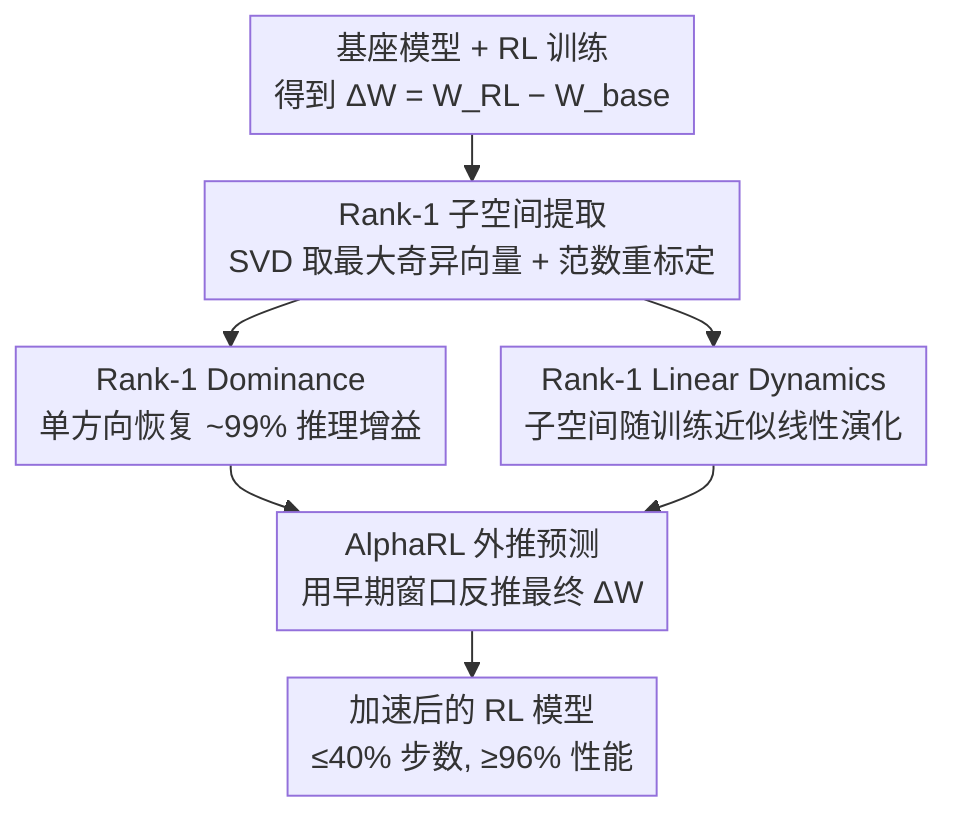

# On Predictability of Reinforcement Learning Dynamics for Large Language Models

**会议**: ICLR 2026  
**OpenReview**: [https://openreview.net/forum?id=SdHmA6BYVJ](https://openreview.net/forum?id=SdHmA6BYVJ)  
**代码**: https://github.com/caiyuchenustc/Alpha-RL  
**领域**: LLM推理 / 强化学习 / 可解释性  
**关键词**: RL训练动力学, 参数更新, 低秩结构, SVD, 训练加速

## 一句话总结
本文发现 LLM 在 RL 训练中的参数更新矩阵 $\Delta W$ 几乎被它的 Rank-1 子空间所主导（单一方向就能恢复 99% 以上的推理增益），且这个子空间随训练近似线性演化、可从早期 checkpoint 外推；据此提出免调参的加速框架 AlphaRL，用前 40% 训练步外推出最终更新，最高 2.5× 加速且保留 >96% 推理性能。

## 研究背景与动机

**领域现状**：当前 LLM 的推理能力大幅提升主要靠 RL（RLVR、GRPO、DAPO 等）。围绕 RL 训好的模型，已有不少可解释性研究，比如神经元归因、电路分析、稀疏自编码器。

**现有痛点**：这些研究几乎都是**事后（post-hoc）解释**——只盯着训练的终点（训练好的模型长什么样），而对 **RL 训练过程本身**（参数在一步步更新中如何演化）几乎没有刻画。我们既不知道 RL 引导的参数更新是否遵循某种一致的规律，也不知道这些规律如何催生出推理能力。

**核心矛盾**：RL 训练是一个复杂、多步、带噪声的优化过程，直觉上参数会在高维空间里到处乱跑，看起来是个不可预测的黑箱；但如果它背后其实由某个低维、简单的核心机制支配，那么"过程不可知"这一假设就站不住脚。问题在于：没人去系统量化过 RL 更新到底"集中"到什么程度。

**本文目标**：回答两个基本问题——(1) RL 引导的参数更新是否受一致原则支配？(2) 这些原则如何转化为推理能力？进而把"过程可不可预测"这件事讲清楚，并把它变成可用的工程工具。

**切入角度**：作者直接分析参数更新矩阵 $\Delta W$（RL 模型与基座模型的参数差），对它做 SVD，看奇异谱的能量分布。这个角度有希望，因为如果更新真的"低秩集中"，谱上就会立刻露馅。

**核心 idea**：用一句话概括——**RL 的推理增益几乎全压缩在 $\Delta W$ 的 Rank-1 方向里，而这个方向随训练线性生长，所以可以从早期 checkpoint 外推出最终更新、跳过完整训练**。

## 方法详解

### 整体框架

本文不是提出一个新网络，而是**先做机制发现、再据此造一个加速器**。整条线索围绕参数更新矩阵 $\Delta W = W_{\text{RL}} - W_{\text{base}}$ 展开：对每个模块的 $\Delta W$ 做 SVD，抽出最大奇异值对应的 Rank-1 子空间；先证明这个子空间几乎决定了全部推理增益（性质一·Rank-1 Dominance），再证明它在训练过程中近似线性演化（性质二·Rank-1 Linear Dynamics）；两个性质叠加，就意味着最终更新可以从早期一小段训练窗口外推出来——这就是加速框架 AlphaRL。

### 关键设计

**1. Rank-1 子空间的提取与范数重标定：把"哪一块更新有用"问题落到可计算的对象上**

要研究"更新集中在哪"，先得有个干净的探针。作者对每个模块的 $\Delta W$ 做奇异值分解 $\Delta W = \sum_{i=1}^{r}\sigma_i \boldsymbol{u}_i \boldsymbol{v}_i^\top$，只保留最大奇异值那一项得到 Rank-1 更新 $\Delta W^{(1)} = \sigma_1 \boldsymbol{u}_1 \boldsymbol{v}_1^\top$。直接把它加回基座会因为范数太小而欠更新，所以再做一次等范数重标定 $\Delta\hat{W}^{(1)} = \alpha\,\Delta W^{(1)}$，其中 $\alpha = \|\Delta W\|_2 / \|\Delta W^{(1)}\|_2$，让 Rank-1 更新的"力度"与完整更新一致。这样得到的评估模型 = 基座 + $\Delta\hat{W}^{(1)}$，就能干净地衡量"只留一个方向"能恢复多少能力，而不会把强弱混在一起。作者还推广到 Rank-$k\%$ 子空间以观察多方向的协同效应。

**2. Rank-1 Dominance：单一方向几乎决定全部推理增益**

这是性质一。实验上，把上面重标定后的 Rank-1 更新加回基座，跨 8 个模型、5 种 RL 算法（PPO/RLOO/GRPO/Dr.GRPO/DAPO）平均能恢复 **99.17%** 的推理能力，在 RLOO、GRPO、DAPO 上甚至超过完整训练模型；而 SFT 和蒸馏（DIST）则强烈依赖子空间秩数，必须保留更多方向才有增益。更关键的是，这个性质不只在收敛点成立，在训练的**任意中间步**都成立——早期 Rank-1 稍弱（梯度还分散、尚未收拢到稳定子空间），后期则能完全追平完整模型。作者进一步给出"为什么是 RL"的解释：相比 SFT/DIST 的更新范数大 1–2 个数量级、且 token embedding 发生明显全局漂移，RL 的更新更集中、几乎不动 embedding 空间，推理提升主要来自高层信息流的调整，而非底层表示的大改——这正对应一种 RL 独有的"近似低秩"结构。

**3. Rank-1 Linear Dynamics：主导方向随训练近似线性演化，因而可预测**

这是性质二，也是把"可解释"变成"可外推"的桥梁。作者收集每个模块在 $T$ 个 checkpoint 上的 $\boldsymbol{u}_1$ 轨迹 $U_1 = \{\boldsymbol{u}_1^{(t)}\}_{t=1}^{T}$，经 PCA+t-SNE 可视化后呈平滑、近乎直线的形态。再用偏最小二乘（PLS）回归把每个模块的 Rank-1 轨迹作自变量、对应 checkpoint 的推理准确率作因变量做线性拟合，用 $R^2$ 衡量线性度，平均 $R^2 = 0.914$，部分模块接近 1。作者还发现线性度与模块功能相关：中高层 MLP 的 $R^2$ 更高（离 reward 信号更近，能稳定保留推理相关方向），self-attention 普遍更低（信号更噪、更冗余）。按 $R^2$ 降序做滑动窗口注入更新，性能随窗口内最低 $R^2$ 下降而单调下滑——说明 $R^2$ 本身就是模块贡献的可靠度量。两点合起来：主导方向既是线性的、又强相关于准确率，所以从早期窗口就能准确预测后期状态（预测误差平均 <5%）。

**4. AlphaRL 外推预测：用早期窗口反推最终更新，免调参加速**

有了"主导且线性"这两条，加速就水到渠成。注意 $\boldsymbol{u}_1^{(t)}$ 是单位向量、丢了幅度信息，AlphaRL 改用**带尺度的 Rank-1 向量**——每个向量乘以 $\alpha^{(t)}\sigma_1^{(t)}$ 来代表更新矩阵对应列。把这些带尺度向量与各 checkpoint 的相对准确率用单分量 PLS 拟合成线性关系；给定一个目标相对准确率 $y^*$（实现中取 MATH-500 上 $y^*=1$），通过**反演**直接解出对应的更新向量，再与右奇异向量 $\boldsymbol{v}_1$ 组合，构成每个模块新的 Rank-1 更新。整个过程只需一小段早期训练窗口算出初始 Rank-1 子空间和它的线性增长率，不需要跑完整 schedule，也不引入额外模块或超参，并且与现有加速手段正交、可乘性叠加——作者称之为 RL 的"免费午餐"。

### 一个例子：从 40% 训练步外推到满血

以 Qwen3-8B-Base 上的 DAPO 为例，完整训练模型六项推理基准平均 53.38%。只训练 40% 步时平均仅 46.30%，离满血还差一截；而对这 40% checkpoint 套上 AlphaRL（用 base→当前阶段之间的 Rank-1 向量及其准确率拟合外推），平均直接拉到 **53.31%**，几乎等于完整训练，在 GPQA 上甚至达到完整模型 102% 的相对准确率。换句话说，只跑了 40% 的步数，就拿到了 100% 的效果，对应 2.5× 加速。

## 实验关键数据

### 主实验

跨 8–13 个模型（7B–32B，含 Qwen3 / Llama3 / GLM4）、5–10 种算法验证两条性质，并在 Qwen3-8B-Base 上验证 AlphaRL（RLOO/GRPO/DAPO，6 基准、32 采样、$T=0.6$）。

| 设置（Qwen3-8B-Base） | 平均准确率 | 相对完整训练 | 说明 |
|--------|------|------|------|
| DAPO 完整训练 | 53.38 | 100% | 训满全部步数 |
| DAPO 训练 40% | 46.30 | 86.7% | 未加速 baseline |
| DAPO 训练 40% + AlphaRL | 53.31 | ~99.9% | 几乎追平满血，约 2.5× 加速 |
| GRPO 训练 40% + AlphaRL | 49.42 | 95.9% | MATH-500 超过完整模型 |
| RLOO 训练 40% + AlphaRL | 48.52 | 95.5% | 保留 >96% 推理性能 |

性质量化：Rank-1 平均恢复 **99.17%** 推理能力；演化线性度平均 $R^2 = 0.914$；早期→后期预测误差平均 **<5%**。

### 消融 / 分析实验

| 分析 | 关键发现 | 说明 |
|------|---------|------|
| 各单一子空间贡献 | Rank-1 显著强于其余，随奇异值下降而递减 | 印证主导地位 |
| Scaling factor $\lambda$ | 在 $\lambda\approx 0.7$ 处达峰、之后饱和 | 核心效果由幅度决定，再加收益递减 |
| RL vs SFT/DIST 更新范数 | SFT/DIST 范数大 1–2 个数量级；RL 的 Rank-1/Rank-1% 占总范数比更高 | RL 更新更集中 |
| Embedding 漂移（PCA+t-SNE） | SFT/DIST 全局漂移大，RL 几乎不动 | RL 改高层信息流而非底层表示 |
| 模块 $R^2$ 滑窗注入 | 性能随窗口最低 $R^2$ 下降而单调下滑 | $R^2$ 可量化模块贡献 |

### 关键发现
- **Rank-1 主导是 RL 独有的**：对照实验中 SFT 和蒸馏在相同模型上都不具备这两条性质，说明低秩集中是 RL 过程的独特指纹，而非任何后训练的通性。
- **幅度比方向更关键**：scaling 实验显示 Rank-1 的核心效果主要由更新幅度（$\lambda\approx0.7$）决定，超过后收益递减——意味着方向早早就找对了。
- **线性度 ≈ 功能重要性**：高 $R^2$ 且轨迹平滑的模块（多为中高层 MLP）是 RL 真正分配有效容量的地方；低 $R^2$ 模块更多被噪声梯度驱动。

## 亮点与洞察
- **把黑箱过程证成"低维可预测"**：通常认为 RL 多步优化不可预测，本文用 SVD + PLS 两个朴素工具就揭示出"单方向主导 + 线性演化"的核心机制，挑战了 RL 黑箱观，颇有"啊哈"感。
- **发现直接变工具**：两条性质不是停在解释层面，而是顺势推出 AlphaRL——免模块、免调参、与其他加速正交可叠加，是少见的"解释→可用"闭环。
- **等范数重标定这个小技巧很关键**：直接截断 Rank-1 会因范数缩水而欠更新，作者用 $\alpha$ 把 Rank-1 拉回与完整更新同范数，才公平地暴露出"单方向就够用"，这个探针设计可迁移到其他"哪块更新有用"的分析。
- **可迁移性**：Rank-1 轨迹 + PLS 的可预测性框架，原则上可用于监控训练动态、甚至当作 reward 信号反向优化训练流程，也可能用到大规模 agent / 多模态等高成本场景。

## 局限与展望
- **缺乏严格理论**：结论主要来自大规模经验观察，作者承认两条"定律"目前没有严谨的理论支撑，未来想结合神经元归因、因果追踪建立形式化模型。
- **依赖 RL 算法的稳定性**：AlphaRL 的外推效果受 RL 算法设计与训练稳定性约束；线性假设在轨迹不稳定的模块（低 $R^2$）上会失效，纯线性外推可能不够，未来考虑非线性预测。
- **自评的潜在风险**：目标准确率用 MATH-500 单一数据集 $y^*=1$ 拟合再迁移到其他基准，跨任务难度不同，外推到差异较大的基准时的稳健性仍需更多验证。
- **改进思路**：把 Rank-1 规律与高秩修正结合，做更灵活的低秩控制；或把 Rank-1 当训练监控/奖励信号反哺优化。

## 相关工作与启发
- **vs 事后可解释性（神经元归因 / 电路分析 / 稀疏自编码器）**：它们解释训练终点的静态模型，本文转而刻画训练**过程**的参数动力学，并把规律变成可外推的预测工具。
- **vs SFT / 蒸馏**：SFT、DIST 的更新范数大、embedding 全局漂移、依赖多子空间，不具备 Rank-1 主导；本文据此论证低秩集中是 RL 特有，且可能正是 RL 少灾难性遗忘、强泛化的来源。
- **vs LoRA 等预设低秩方法**：LoRA 在训练前就限定子空间维度，本文的结论更强——即便做**全参数** RL，更新事后看仍几乎被极少数方向捕获。
- **vs 现有 RL 加速 / 算法（GRPO/DAPO/VAPO 等）**：这些改进优化目标或采样，AlphaRL 与之正交，可作为乘性加速插件叠加。

## 评分
- 新颖性: ⭐⭐⭐⭐⭐ 首次系统揭示 RL 参数更新的 Rank-1 主导 + 线性演化两条性质，并闭环成加速工具。
- 实验充分度: ⭐⭐⭐⭐ 跨 8–13 模型、多算法、多基准，含对照与消融；但理论缺位、AlphaRL 主表仅 Qwen3-8B。
- 写作质量: ⭐⭐⭐⭐ 逻辑从发现到方法层层递进，图表清晰；部分排版/笔误略多。
- 价值: ⭐⭐⭐⭐⭐ 免调参 2.5× 加速 + 对 RL 机制的洞察，对大规模 RL 训练有直接实用价值。

<!-- RELATED:START -->

## 相关论文

- [\[ICLR 2026\] Revolutionizing Reinforcement Learning Framework for Diffusion Large Language Models](revolutionizing_reinforcement_learning_framework_for_diffusion_large_language_mo.md)
- [\[ICLR 2026\] Using Reinforcement Learning to Train Large Language Models to Explain Human Decisions](using_reinforcement_learning_to_train_large_language_models_to_explain_human_dec.md)
- [\[ICLR 2026\] TROLL: Trust Regions improve Reinforcement Learning for Large Language Models](troll_trust_regions_improve_reinforcement_learning_for_large_language_models.md)
- [\[ICLR 2026\] VerifyBench: Benchmarking Reference-based Reward Systems for Large Language Models](verifybench_benchmarking_reference-based_reward_systems_for_large_language_model.md)
- [\[ICLR 2026\] AWM: Accurate Weight-Matrix Fingerprint for Large Language Models](awm_accurate_weight-matrix_fingerprint_for_large_language_models.md)

<!-- RELATED:END -->
