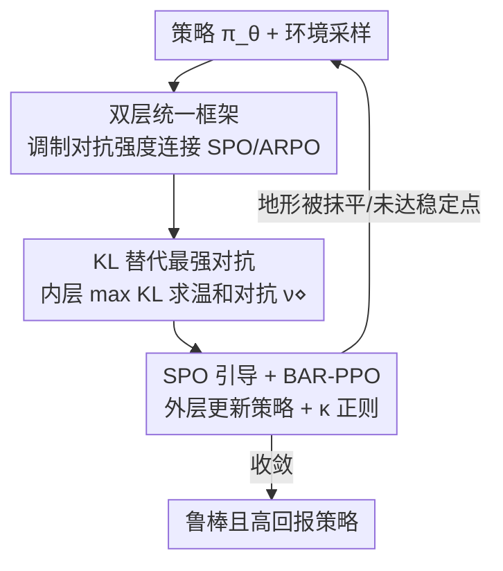

# On the Tension Between Optimality and Adversarial Robustness in Policy Optimization

**会议**: ICLR 2026  
**OpenReview**: [https://openreview.net/forum?id=ion4VYJWvo](https://openreview.net/forum?id=ion4VYJWvo)  
**代码**: https://github.com/RyanHaoranLi/BARPO  
**领域**: 强化学习 / 对抗鲁棒性 / 策略优化  
**关键词**: 对抗鲁棒强化学习, 策略梯度, 一阶稳定策略, 双层优化, 最优-鲁棒张力

## 一句话总结
这篇论文从优化视角揭示：尽管理论上"最优策略"与"鲁棒最优策略"可以一致，但在实际策略梯度训练里标准优化（SPO）与对抗鲁棒优化（ARPO）会收敛到不同的一阶稳定策略，从而产生"鲁棒性 vs 自然回报"的张力；其根因是最强对抗把优化地形重塑得崎岖、制造大量"黏滞"的次优稳定点，作者据此提出双层框架 BARPO 通过调制对抗强度抹平地形，在 MuJoCo 上同时拿到高自然回报和强鲁棒性。

## 研究背景与动机
**领域现状**：深度强化学习对状态观测上的微小扰动极其脆弱，一个肉眼不可见的扰动就能让智能体性能崩溃。为此 Zhang 等人提出 SA-MDP 框架研究对抗鲁棒性，但同时指出"最优鲁棒策略（ORP）可能不存在"，暗示最优性与鲁棒性是冲突目标。最近 Li 等人（CAR / ISA-MDP，2024-2025）从理论上证明：在大多数实际任务里存在一个 ORP，并且它恰好就是 Bellman 最优策略——也就是说**最优性和鲁棒性在原则上是对齐的**。

**现有痛点**：理论虽然说两者对齐，但实践中常规策略优化方法在对抗设置下依然学不好。一个 ORP 在理论上存在，不代表梯度方法能找到它。理论与实践之间存在一道没人填上的鸿沟：到底能不能在技术上真正实现这种对齐？

**核心矛盾**：作者把两种训练范式拿来对照——SPO 最大化标准价值 $\max_\pi V^\pi(s)$，ARPO 最大化最坏情况对抗价值 $\max_\pi \min_\nu V^{\pi\circ\nu}(s)$。二者**共享同一个全局最优鲁棒策略**，却在实践中收敛到不同的一阶稳定策略（FOSP）：SPO 偏向自然回报高但脆弱的 FOSP，ARPO 偏向鲁棒但回报低的 FOSP。这就是论文命名的"最优-鲁棒张力"，它和过去"目标本身冲突"的说法不同——目标不冲突，是优化过程把两者分开了。

**本文目标**：① 解释为什么 SPO 在理论对齐的框架下仍然脆弱；② 刻画 ARPO 牺牲回报换鲁棒的代价并找出机制根因；③ 设计一个既能保留鲁棒全局最优、又能让梯度方法走得通的实用算法。

**切入角度**：作者不去改目标函数，而是去看**优化地形（landscape）和价值几何**。直觉是：最强对抗在脆弱区域把价值压得很低、在鲁棒区域几乎不变，这种"差异化压低"会把原本平滑的地形撕出一道道深谷，把优化路径困在鲁棒但次优的盆地里。

**核心 idea**：与其用"最强对抗"把地形搞崎岖，不如**调制对抗强度**——用一个介于"无对抗（SPO）"和"最强对抗（ARPO）"之间的替代对抗，把鲁棒但低回报的区域抬高、抹平深谷，让优化既能沿鲁棒方向走、又能爬到高回报的全局最优。

## 方法详解

### 整体框架
论文逻辑分两段：**先诊断、后开方**。诊断部分（第 3 节）用收敛分析和地形几何，证明 SPO 与 ARPO 都只收敛到 FOSP 而非全局最优，并把二者的差异归因于"最强对抗的重塑效应"——对抗在脆弱区域把目标 $V^{\pi_\theta}(\mu_0)-V^{\pi_\theta\circ\nu^*}(\mu_0)$ 的缺口拉大，地形被撕出深谷，制造出大量"黏滞"的欺骗性 FOSP（在一个简单 ISA-MDP 里约有 1/3 的初始策略会收敛到一个低价值的欺骗 FOSP）。开方部分（第 4 节）就是 **BARPO**：把 ARPO 内层的"最强对抗最小化"放松成"可调强度的对抗"，并给出一个 KL 散度替代来实用化，最后融入 SPO 动力学加速收敛，落地成 PPO 之上的 BAR-PPO。

整个 BARPO 的训练是一个**双层（bilevel）嵌套循环**：内层为当前策略找一个"温和而非最强"的对抗，外层在这个对抗下更新策略并叠加 SPO 引导。下面用框架图刻画这条管线（诊断结论作为"为什么这么设计"的动机贯穿其中，不单列为节点）。

### 关键设计

**1. 重塑效应诊断：最强对抗如何制造黏滞的次优稳定点**

这是论文的科学内核，也是后面所有设计的动机来源。作者先证明（定理 3.2）ARPO 在最强对抗下只收敛到 FOSP，收敛率为 $O(K^{-1/2})$，近似误差随对抗强度增大而增大；SPO 同样以该速率收敛到标准价值的 FOSP。关键差异在收敛点的性质：命题 3.1 给出一个 ISA-MDP，使 ARPO 的稳定点 $\pi_A$ 满足 $V^{\pi_A}(\mu_0)-V^-(\mu_0) < \tfrac{1}{2}\big(V^{\pi_S}(\mu_0)-V^-(\mu_0)\big)$（$V^-$ 为最坏价值），即 ARPO 更鲁棒但自然回报常不到 SPO 的一半，这与 MuJoCo 上的实测吻合（Ant 上 ARPO 自然回报比 SPO 低 68%）。机制上，对抗满足 $V^{\pi_\theta\circ\nu^*}(\mu_0)\le V^{\pi_\theta}(\mu_0)$：在脆弱（红色）区域缺口大、价值被陡然压低，在鲁棒（蓝色）区域缺口小、几乎不动，这种差异化压低让地形变崎岖，把优化导向鲁棒 FOSP。更糟的是命题 3.2 指出鲁棒策略空间存在"割点"——去掉某个策略后空间不连通，导致 FOSP 彼此孤立、梯度无法穿越深谷，于是优化被困在黏滞的欺骗 FOSP 上。正是"重塑制造深谷、深谷困住优化"这条因果链，决定了后面要去**抹平地形**而不是换目标。

**2. 双层统一框架：用对抗强度的调制把 SPO 和 ARPO 接起来**

针对"最强对抗把地形搞崎岖"这个痛点，作者把 ARPO 的内层 $\min_\nu$ 放松成一个由通用内层目标 $G(\pi,\nu)$ 定义的"可调对抗"，得到通用双层框架：

$$\max_\theta \; V^{\pi_\theta\circ\nu^\diamond(\theta)}(\mu_0),\quad \text{s.t.}\;\; \nu^\diamond(\theta)=\arg\max_\vartheta G(\pi_\theta,\nu_\vartheta).$$

这个框架的妙处在于它把两个范式当作两个端点统一了进来：当 $\nu^\diamond(s;\theta)\equiv s$（无扰动）时退化为 SPO，当 $G(\pi,\nu)=-V^{\pi\circ\nu}(\mu_0)$（追最强对抗）时退化为 ARPO。中间的取值就是"温和对抗"，既不像 SPO 完全不管鲁棒、也不像 ARPO 把地形撕碎。更关键的是作者证明：在 ISA-MDP 设定下，**这个统一框架保留了与 SPO、ARPO 完全相同的最优鲁棒策略**——也就是说放松对抗强度不会牺牲理论上的全局最优，只是换一条更好走的路径去够它。

**3. KL 替代最强对抗：把内层最小化换成可计算的 KL 最大化**

通用框架里的 $G$ 还是抽象的，要落地必须给出一个既促进策略学习、又维持强鲁棒的具体内层目标。作者的洞察是：用**扰动前后策略之间的 KL 散度**作为最强对抗的一阶替代。定理 4.1 给出，对通过 $K$ 步梯度下降得到的强对抗，鲁棒性有下界

$$V^{\pi_\theta}(s)-V^{\pi_\theta\circ\nu_\vartheta}(s)\;\ge\;\frac{2\delta}{\lambda_{\max}(F_{s,\theta})K}\,G(s;\pi_\theta,\nu_\vartheta)+O\!\big(G^{3/2}\big),$$

其中 $G(s;\pi,\nu):=D_{\mathrm{KL}}\big(\pi(\cdot|s)\,\|\,(\pi\circ\nu)(\cdot|s)\big)$，$F_{s,\theta}$ 是对数策略关于扰动的 Fisher 信息矩阵。这说明 KL 散度从优化角度是最小化对抗价值的有效一阶替代——最大化扰动前后策略的 KL 距离，就近似在制造一个强对抗，但它可计算、可微、不需要真去解最坏价值。于是 BARPO 的实例化为：

$$\max_\theta V^{\pi_\theta\circ\nu^\diamond(\theta)}(\mu_0),\quad \text{s.t.}\;\nu^\diamond(s;\theta)=\arg\max_\vartheta D_{\mathrm{KL}}\big(\pi_\theta(\cdot|s)\,\|\,(\pi_\theta\circ\nu_\vartheta)(\cdot|s)\big).$$

实现上内层用 SGLD（随机梯度朗之万动力学）采样求扰动策略 $\nu^\diamond$，外层把内层解视作固定、并省略二阶项以提高效率。

**4. SPO 引导与 BAR-PPO 实例化：把标准优化动力学注入双层框架**

光有双层框架收敛仍偏慢、地形仍有残余崎岖。作者再把 SPO 动力学以正则权重 $\kappa$ 融进外层，进一步平滑地形、加速收敛，得到搭在 PPO 之上的实用算法 **BAR-PPO**。直觉上，SPO 引导相当于在抹平后的地形上额外给一个"往高自然回报方向走"的推力，把鲁棒但低回报的盆地抬高、连成可通行的坡道。值得注意的是论文区分了四种配置：ARPO（纯 maximin）、ARPO with guidance（maximin + SPO 引导）、BARPO without guidance（纯双层框架）、BARPO（双层 + SPO 引导）。实验显示直接给 ARPO 加 SPO 引导并不能真正消除重塑效应（黏滞 FOSP 仍在），只有 BARPO 的双层结构才从根上重塑地形——这也印证了设计 2、3 的必要性：必须先放松对抗强度，引导才有用武之地。

### 损失函数 / 训练策略
作为对照，FOSP 的定义本身就是优化目标的稳定性条件：SPO 的 FOSP 满足 $\nabla_\theta V^{\pi_\theta}(\mu_0)=0,\ \nabla^2_{\theta\theta}V^{\pi_\theta}(\mu_0)\preceq 0$；ARPO 的 FOSP 把价值换成最强对抗下的价值。训练上 BAR-PPO 在 PPO 基础上：内层用 SGLD 求 KL 最大化的对抗扰动，外层固定内层解做策略更新并叠加 $\kappa$ 权重的 SPO 正则，省略二阶项以保证效率。定理 3.3 的平坦性界还把鲁棒性和泛化联系起来——若对抗侧曲率足够平（$\|\nabla^2_{\vartheta\vartheta}V\|_F^2\le B/(2\kappa_\vartheta\epsilon^2)$），ARPO 的策略侧曲率就能匹配 SPO，即足够鲁棒可保泛化、甚至增强泛化。

## 实验关键数据

### 主实验
在 Hopper、Walker2d、HalfCheetah、Ant 四个 MuJoCo 连续控制任务上，每方法训练 17 个智能体取中位数，用 6 种攻击（Random / Critic / MAD / RS / SA-RL / PA-AD）评测最坏情况鲁棒回报。BAR-PPO 对比 PPO、SA-PPO、RADIAL-PPO、WocaR-PPO：

| 环境 | 方法 | 自然回报 | 最坏鲁棒回报 | 鲁棒性 |
|------|------|---------|------------|--------|
| Hopper | WocaR | 3629 | 1171 | -0.677 |
| Hopper | **BAR-PPO** | **3684** | **1340** (↑4%) | -0.636 |
| Walker2d | SA | 4875 | 997 | -0.795 |
| Walker2d | **BAR-PPO** | 4732 | **2699** (↑154%) | **-0.436** |
| HalfCheetah | WocaR | 4723 | 2270 | -0.519 |
| HalfCheetah | **BAR-PPO** | **4837** | **3181** (↑40%) | **-0.342** |
| Ant | SA | 5367 | 2355 | -0.539 |
| Ant | **BAR-PPO** | 5024 | **2825** (↑20%) | **-0.438** |

BAR-PPO 在最坏鲁棒回报上全面超过次优基线（4%/154%/40%/20%），并在 Walker2d、HalfCheetah、Ant 上取得最强鲁棒性，Hopper 上鲁棒性仅差 0.3%。

### 消融实验
表 3 对照 BARPO 与"ARPO + SPO 引导"，验证双层结构本身的价值：

| 环境 | 配置 | 自然回报 | 鲁棒回报变化 | 鲁棒性变化 |
|------|------|---------|------------|-----------|
| Hopper | ARPO(w g) | 3699 | — | — |
| Hopper | BARPO | 3684 (↓0.4%) | ↑19% | ↑8.4% |
| HalfCheetah | ARPO(w g) | 4997 | — | — |
| HalfCheetah | BARPO | 4837 (↓3.2%) | ↑193% | ↑56% |
| Ant | ARPO(w g) | 5390 | — | — |
| Ant | BARPO | 5024 (↓6.8%) | ↑138% | ↑43% |

另对照纯双层框架 BARPO(w/o guidance) vs ARPO：自然回报在四任务上分别提升约 75% / 104% / 156% / 113%，最坏鲁棒回报提升约 4% / 173% / 209% / 61%。

### 关键发现
- **双层结构是真正的功臣**：给 ARPO 直接叠 SPO 引导只能小幅改善、黏滞 FOSP 依然存在；只有 BARPO 的双层放松才从根上重塑地形，以 ≤7% 的自然回报代价换来最高 193% 的鲁棒回报提升。
- **SPO 引导是把双刃剑**：它在 HalfCheetah、Ant 等复杂环境显著提升自然回报，且 Hopper、Ant 上自然与鲁棒同涨；但在 Walker2d、HalfCheetah 上提升自然回报会略损最坏鲁棒性，说明引导权重需要权衡。
- **越鲁棒越能泛化**：平坦性界（定理 3.3）从曲率角度解释了为何足够鲁棒的策略反而泛化更好，把"鲁棒性"和"地形平坦性/泛化"统一到了一个理论里。

## 亮点与洞察
- **把"目标冲突"重新诊断为"优化路径冲突"**：过去认为最优性和鲁棒性是冲突目标，本文指出它们共享全局最优、是 FOSP 的差异和地形重塑把两者拆开了——视角从"改目标"转向"改地形"，很有启发。
- **重塑效应 + 黏滞 FOSP 的图景非常直观**：用"对抗在脆弱区压低价值、撕出深谷、制造割点"把一个抽象的优化失败讲成了可视的地形故事（图 1/4），1/3 初始策略落入欺骗 FOSP 的数字很有说服力。
- **KL 散度作为最强对抗的一阶替代**（定理 4.1）是可迁移的 trick：把难解的内层 maximin 换成可微的 KL 最大化，这个"用策略分布距离近似最坏价值"的思路在其他鲁棒训练里也能借鉴。
- **双层框架以 SPO/ARPO 为两端点**的统一写法很优雅，且证明放松对抗强度不丢全局最优，让"在中间找平衡"有了理论底气。

## 局限与展望
- 实验只在 MuJoCo 连续控制四任务上验证，未涉及离散动作、像素观测或更大规模任务，地形重塑的结论在高维感知任务上是否成立有待检验。
- 多处关键结论（命题 3.1/3.2、约 1/3 初始策略落入欺骗 FOSP）建立在精心构造的简单 ISA-MDP 上，从 toy 例子到神经网络策略的推广更多靠经验观察支撑，理论与实测之间仍有 gap。
- SPO 引导与鲁棒性存在权衡（Walker2d/HalfCheetah 上加引导会损鲁棒性），但论文没有给出 $\kappa$ 的自适应选择策略，实践中需要逐任务调参。
- 内层用 SGLD 采样对抗、外层省略二阶项，这些近似对最终性能和收敛性的影响缺少单独的敏感性分析。

## 相关工作与启发
- **vs SA-PPO / WocaR-PPO（KL 正则类鲁棒训练）**：它们都在最强对抗（或最坏价值估计）框架下加 KL 正则，本质仍是 ARPO 式 maximin，会落入重塑出的黏滞 FOSP；本文不在最强对抗上加正则，而是放松对抗强度本身去抹平地形，因此在最坏鲁棒回报上大幅领先。
- **vs RADIAL-PPO（鲁棒验证界正则）**：RADIAL 用 IBP 验证界引导对抗正则，关注的是认证鲁棒性的上界；本文关注的是优化地形可达性，二者一个管"能保证多鲁棒"、一个管"梯度能不能走到"。
- **vs SA-MDP / ISA-MDP（理论基础）**：SA-MDP 给出"ORP 可能不存在"的悲观结论，ISA-MDP（CAR）证明 ORP 存在且等于 Bellman 最优；本文站在 ISA-MDP 的对齐结论上，进一步回答"对齐为何在实践中实现不了、以及如何实现"，是从存在性到可达性的推进。

## 评分
- 新颖性: ⭐⭐⭐⭐⭐ 把最优-鲁棒冲突重新诊断为优化地形重塑问题，视角新且自洽。
- 实验充分度: ⭐⭐⭐⭐ MuJoCo 四任务 + 6 攻击 + 17 次中位数较扎实，但缺离散/像素任务与超参敏感性分析。
- 写作质量: ⭐⭐⭐⭐⭐ 诊断—机制—开方的逻辑链清晰，地形图与理论交织讲得很顺。
- 价值: ⭐⭐⭐⭐ 给鲁棒强化学习提供了一个可迁移的"调制对抗强度"范式与 KL 替代 trick。

<!-- RELATED:START -->

## 相关论文

- [\[ICLR 2026\] Primal-Dual Policy Optimization for Linear CMDPs with Adversarial Losses](primal-dual_policy_optimization_for_linear_cmdps_with_adversarial_losses.md)
- [\[ICLR 2026\] Single-stream Policy Optimization](single-stream_policy_optimization.md)
- [\[ICLR 2026\] Dichotomous Diffusion Policy Optimization](dichotomous_diffusion_policy_optimization.md)
- [\[ICLR 2026\] Thinking on the Fly: Test-Time Reasoning Enhancement via Latent Thought Policy Optimization](thinking_on_the_fly_test-time_reasoning_enhancement_via_latent_thought_policy_op.md)
- [\[ICLR 2026\] Relative Entropy Pathwise Policy Optimization](relative_entropy_pathwise_policy_optimization.md)

<!-- RELATED:END -->
