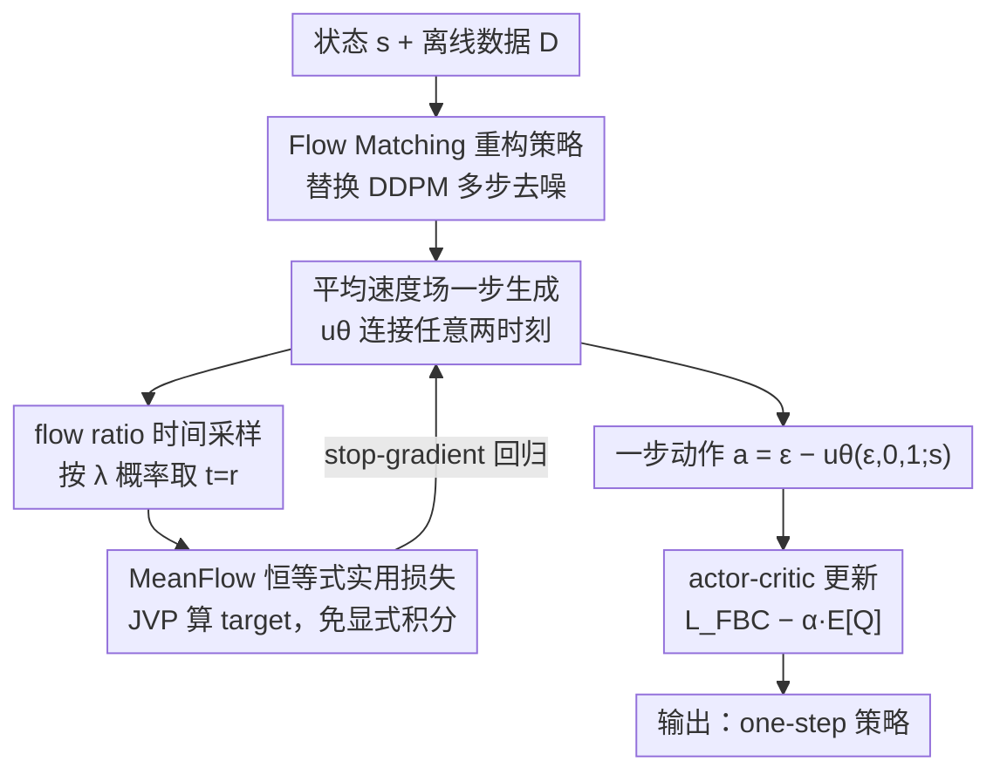

# One-Step Flow Q-Learning: Addressing the Diffusion Policy Bottleneck in Offline RL

**会议**: ICLR 2026  
**OpenReview**: [https://openreview.net/forum?id=60VgwdzxDM](https://openreview.net/forum?id=60VgwdzxDM)  
**代码**: 无  
**领域**: 强化学习 / 离线RL / 流匹配策略  
**关键词**: 离线强化学习, Diffusion Q-Learning, 流匹配, 平均速度场, 一步生成

## 一句话总结
本文把离线 RL 中表现最强但又慢又脆的 Diffusion Q-Learning（DQL）从 DDPM 多步去噪改写到流匹配框架，并用「平均速度场」替代普通流匹配的边际速度，使策略在**训练和推理时都只需一步**就能生成动作，从而在 D4RL 上既大幅加速又反超多步 DQL，达到 SOTA。

## 研究背景与动机

**领域现状**：离线 RL 的主流高性能路线是把 TD3+BC 里的高斯策略换成扩散模型——代表作 DQL 用 DDPM 当策略网络，能刻画复杂多模态动作分布，长期压过更新的扩散 planner 与策略方法，是公认的强 baseline。

**现有痛点**：DQL 的命门在它依赖的 DDPM 扩散策略。生成一个动作要走 $K$ 步反向去噪链，推理慢；训练更是「双重受罚」——critic 损失需要采下一步动作 $a'$、actor 损失需要采当前动作 $a$，每个都得跑完整 $K$ 步采样；而且 actor 用重参数化技巧对整条去噪链做 BPTT（按时间反传），梯度在长随机计算图里递归传播，既加重算力又容易数值不稳、收敛到次优。

**核心矛盾**：扩散策略本身就是瓶颈。但「直接减步数」走不通：把 $K$ 调小会破坏 $a_K$ 近似各向同性高斯的假设，性能崩塌（实验里 DQL+DDIM 一步推理掉了 76.3 分）。已有加速方案要么换更高效的 solver、要么 IQL 训练、要么训一个辅助策略再蒸馏成一步策略——这些都引入额外模块、多阶段训练或表达力/可扩展性上的妥协，治标不治本。

**本文目标**：能不能**直接训练出一个一步策略**，在训练和推理两端同时消除低效，又不靠辅助模型、蒸馏或多阶段流程？

**切入角度**：流匹配（Flow Matching, FM）把噪声沿更直、更光滑的路径映射到数据，天然比扩散更适合一步采样。但作者发现一个关键障碍：普通 FM 学的是**边际速度场**，其真值轨迹本身就是弯的（不是网络拟合不准导致的），所以即便把步长设成 1 也无法可靠地一步生成。

**核心 idea**：不学瞬时（边际）速度，改学**平均速度场**——直接刻画任意两个时刻之间的总位移，让模型一步就能从噪声跳到动作，由此甩掉迭代去噪和递归梯度，得到 One-Step Flow Q-Learning（OFQL）。

## 方法详解

### 整体框架
OFQL 的目标是：保留 DQL「behavior-regularized actor-critic」这套训练骨架不变，只把里面那个又慢又脆的 DDPM 扩散策略，换成一个**真正只跑一步**的流匹配策略。整体转动方式是：先把策略从 DDPM 重写到流匹配的线性路径上，再把训练目标从「学瞬时速度」改成「学平均速度」，配上一个免积分的实用损失和一个时间采样技巧，最后用一步生成的动作去算 critic / actor 损失。

### 关键设计

**1. Flow Matching 重构策略：把多步去噪链换成线性流路径**

DQL 慢的根在 DDPM 的马尔可夫去噪链——采样必须逐步走 $K$ 个高斯转移，且训练时还得对整条链做 BPTT。OFQL 第一步是把策略放进流匹配框架：给定数据动作 $a$、状态 $s$ 和噪声 $\epsilon\sim\mathcal N(0,I)$，定义线性路径与条件速度

$$a_t = (1-t)a + t\epsilon,\qquad v_t = \frac{da_t}{dt} = \epsilon - a,\quad t\in[0,1]$$

普通 FM 用条件流匹配损失 $L_{\mathrm{CFM}}=\mathbb E\,\|v_\theta(a_t,t;s)-v_t\|^2$ 去学**边际速度** $v_\theta$，采样时解 ODE（如 Euler）。这一步让路径比扩散更直，但还没解决问题——因为边际速度场的真值轨迹**本质上是弯的**，只有当目标分布塌成 delta、或显式做 rectification 时才会变直。直接令 $\Delta t=1$ 做一步采样仍会有大的离散化误差。所以 FM 重构只是「换了赛道」，真正的突破在下一个设计。

**2. 平均速度场一步生成：直接学任意两时刻间的总位移**

为了让一步生成真正准，作者不再把 $v(a_t,t;s)$ 当成训练目标，而是把它重新理解为「瞬时速度」，转而建模**平均速度**——它直接连接任意两个时刻 $r$ 与 $t$：

$$u(a_t,r,t;s)\triangleq\frac{1}{t-r}\int_r^t v(a_\tau,\tau;s)\,d\tau,\qquad 0\le r\le t\le1$$

即「区间总位移除以时长」。这个 $u$ 完全由瞬时速度场 $v$ 决定、与网络无关，因此作为真值用网络 $u_\theta$ 去拟合。一旦学好，动作就能通过一次「端点映射」直接得到：

$$a = T_\theta(\epsilon,s) = \epsilon - u_\theta(\epsilon,\,r{=}0,\,t{=}1;\,s),\quad \epsilon\sim\mathcal N(0,I)$$

它彻底省掉了 ODE 数值积分，连带消除离散化误差。学到的策略是高斯先验经端点映射的 push-forward $\pi_\theta=(T_\theta)_\#\,\mathcal N(0,I)$；当它作为正则项时等价于对行为策略做行为克隆，而且**因为继承了流匹配的非线性传输映射，仍能刻画复杂多模态动作分布**——这正是 DQL 当初用扩散换高斯所追求的表达力，OFQL 没有为了「一步」而牺牲它。

**3. MeanFlow 恒等式实用损失：用 JVP 免掉那个积不动的积分**

平均速度的定义式（式 10）含一个积分，优化时不可计算。OFQL 借 MeanFlow 恒等式把它改写成一个等价、可微的形式：

$$u(a_t,r,t;s) = v(a_t,t;s) - (t-r)\frac{d}{dt}u(a_t,r,t;s)$$

其中全导数展开为 $\frac{d}{dt}u = v\cdot\partial_{a_t}u + \partial_t u$，这部分可用 Jacobian–vector product（JVP）高效算出；当 $t=r$ 时 $u$ 退化为瞬时速度。训练时把式中的 $v$ 用条件速度 $v_t=\epsilon-a$ 现场近似，得到目标

$$u_{\mathrm{tgt}} = v_t - (t-r)\big(v_t\cdot\partial_{a_t}u_\theta + \partial_t u_\theta\big)$$

最终损失对目标做 stop-gradient（$\mathrm{sg}$）以避免高阶梯度：

$$L_{\mathrm{FBC}}(\theta) = \mathbb E_{t,r,(a,s),\epsilon}\,\big\|u_\theta(a_t,r,t;s) - \mathrm{sg}(u_{\mathrm{tgt}})\big\|_2^2$$

这一步是把「学平均速度」从理论落到可训练，关键在于绕开显式积分、用 JVP 把代价压住。

**4. flow ratio 时间采样正则：用 $\lambda$ 概率取 $t=r$ 来稳住自举**

由于目标平均速度依赖瞬时速度的估计（式 13），瞬时速度估得准不准直接决定平均速度学得好不好。OFQL 在采样 $(t,r)$ 时引入一个 **flow ratio** $\lambda$——即令 $t=r$ 的概率。当 $t=r$ 时目标退化成纯瞬时速度，于是模型被「偏置」去先学好瞬时速度，同时仍保留对平均速度的回归，从而改善自举（bootstrapping）的稳定性。消融显示 $\lambda$ 取两端都差：$\lambda=1$ 退化成纯流匹配、$\lambda=0$ 完全不学瞬时速度都会明显掉点，$\lambda=0.5$ 最稳最好，相当于一个有效的正则器。$(t,r)$ 本身从 logit-normal 分布 $(-0.4,1.0)$ 采样，策略网络在标准时间步嵌入 $t$ 外额外拼接目标步 $r$ 的位置嵌入。

### 损失函数 / 训练策略
OFQL 直接套用 DQL 的 actor-critic，唯一改动是行为正则项与动作采样都只需一步：

$$L(\phi)=\mathbb E\Big[\big(r+\gamma\min_{i\in\{1,2\}}Q_{\phi'_i}(s',a') - Q_{\phi_i}(s,a)\big)^2\Big],\quad a'\sim\pi_{\theta'}$$
$$L(\theta)=L_{\mathrm{FBC}}(\theta) - \alpha\,\mathbb E_{s,\,a\sim\pi_\theta}\big[Q_\phi(s,a)\big]$$

动作采样 $a=\epsilon-u_\theta(\epsilon,0,1;s)$ 是可微的一步操作。$\alpha$ 按 $Q$ 值尺度自适应归一化（$\alpha=\eta/\mathbb E[\|Q\|]$，分母视作常数），$\eta$ 在 $\{0.001,0.01,0.1,0.3,0.5\}$ 上网格搜索；优化器 Adam，学习率 $3\times10^{-4}$，其余超参与 DQL 保持一致。

## 实验关键数据

### 主实验
在 D4RL 三大类任务上对比，OFQL 全面领先（normalized score 均值）：

| 域 | BC | TD3-BC | IQL | DQL | FQL（一步蒸馏） | OFQL（本文） |
|----|----|--------|-----|-----|------|------|
| MuJoCo (locomotion) | 51.9 | 75.3 | 77.0 | 87.9 | 79.2 | **92.5** |
| AntMaze | 0.2 | 3.5 | 57.1 | 64.6 | 79.0 | **84.6** |
| Kitchen | 44.8 | 0.0 | 48.7 | 61.6 | 53.1 | **67.0** |

OFQL 把 DQL 在 MuJoCo 上从 87.9 提到 92.5（medium/medium-replay 这些含次优噪声轨迹的任务提升最明显），AntMaze 从 64.6 大幅拉到 84.6，Kitchen 从 61.6 到 67.0，且全面超过一步蒸馏方法 FQL（MuJoCo 上 +13.3）。

### 消融实验

**一步生成策略对比（9 个 MuJoCo 任务均值，Table 2）**：

| 方法（步数） | DQL (5) | DQL+DDIM (1) | FBRAC (1) | FQL (1) | OFQL (1) |
|------|------|------|------|------|------|
| Score | 87.9 | 11.6 (-76.3) | 67.1 (-20.8) | 79.2 (-8.7) | **92.6 (+4.7)** |

只有 OFQL 在一步条件下反超 DQL；直接拿 DDIM 一步推理几乎崩溃，FBRAC、FQL 虽好转但仍低于 DQL。

**flow ratio 消融（HalfCheetah，Table 3）**：$\lambda=0.5$ 在 Medium-Expert / Medium / Medium-Replay 上分别取得 95.2 / 63.8 / 51.2 的最佳，$\lambda=1$（纯流匹配）和 $\lambda=0$ 都明显退化（如 Medium-Replay 在 $\lambda=0$ 时掉到 10.5）。

### 关键发现
- **平均速度参数化是一步生成的关键**：toy 数据上 u-param 一步生成就有强模式覆盖、贴合目标分布，而 v-param（边际速度）要多步才达到可比质量、步数少时易模式塌缩。
- **效率碾压**：训练 1M 步，OFQL 仅 6.3 小时，DQL 5 步要 11.7 小时、50 步要 49.5 小时；推理决策频率 OFQL 达 846.5 Hz，远超 5 步 DQL 的 238.7 Hz 与 50 步 DQL 的 35.5 Hz。即便对比同样一步推理的 FQL，OFQL 训练更快（FQL 训练仍需多 NFE 构造蒸馏目标），且性能更高。
- **为什么提升**：作者归因于两点——策略仍保留对复杂动作分布的表达力，以及 Q-learning 中避免了 BPTT，带来更稳的值估计与更好收敛；这在稀疏奖励、需要稳定 Q 引导的 AntMaze 上尤为关键。

## 亮点与洞察
- **精准定位瓶颈**：不是泛泛地「加速扩散」，而是把矛头指向「扩散策略本身」，并论证「轨迹弯曲是边际速度场的内在性质、不是拟合误差」，从根上解释了为何简单减步数必然失败。
- **平均速度场的迁移价值**：把生成模型里的 MeanFlow 思想引入 RL 策略，并独到地结合 Q 梯度引导速度学习（而非纯监督），这套「学任意两时刻位移→端点映射一步采样」可迁移到任何需要快速、可微动作/样本生成的控制场景。
- **几乎零成本接入**：OFQL 复用 DQL 全套架构与训练流程，只在策略输入上拼一个目标步 $r$ 的位置嵌入，把行为正则与采样改成一步——工程改动极小却同时拿下速度与性能。

## 局限与展望
- 评测集中在 D4RL（MuJoCo/AntMaze/Kitchen）等仿真基准，未涉及高维视觉输入或真实机器人，论文宣称的「高频实时控制」潜力尚未在真机验证。
- flow ratio $\lambda$、$\eta$ 等超参仍需按数据集网格搜索，$\lambda$ 取端值会显著掉点，说明对采样正则较敏感，自动化调参留作后续。
- 平均速度的目标依赖瞬时速度的现场近似（用条件速度替代），其偏差对最终策略质量的影响缺少更细的理论刻画；一步生成在更复杂/更高维动作空间下能否始终保持表达力，仍待检验。

## 相关工作与启发
- **vs DQL（多步扩散策略）**：DQL 用 DDPM 多步去噪 + BPTT，慢且脆；OFQL 改用流匹配 + 平均速度场，一步生成、无 BPTT，性能反超且训练/推理大幅提速。
- **vs FQL（一步蒸馏流策略）**：FQL 先训多步流模型再蒸馏成一步策略，训练时仍需反复查询多步模型构造蒸馏目标；OFQL **直接训练**一步策略，无蒸馏阶段，训练更快、性能更高（多域均值领先）。
- **vs IDQL / EDP（高效/IQL 类）**：它们以牺牲最终性能换效率（普遍低于 DQL），OFQL 在提速同时还涨点，避免了这种 trade-off。
- **vs 普通 Flow Matching / Consistency Models**：普通 FM 边际速度轨迹弯曲、一步不准；Consistency Models 一步生成但训练不稳。OFQL 借 MeanFlow 的平均速度参数化绕开两者的短板。

## 评分
- 新颖性: ⭐⭐⭐⭐⭐ 把「平均速度场」首次系统性引入离线 RL 策略，并结合 Q 梯度引导，根治扩散策略瓶颈
- 实验充分度: ⭐⭐⭐⭐ D4RL 三域 + 一步策略对比 + flow ratio/效率/toy 多维消融充分，但缺真实机器人与视觉任务
- 写作质量: ⭐⭐⭐⭐⭐ 动机层层递进，把「为何弯曲、为何一步失败、为何平均速度有效」讲得很透
- 价值: ⭐⭐⭐⭐⭐ 同时拿下速度与性能，对高频实时控制与可扩展部署有直接实用意义

<!-- RELATED:START -->

## 相关论文

- [\[ICLR 2026\] Mean Flow Policy with Instantaneous Velocity Constraint for One-step Action Generation](mean_flow_policy_with_instantaneous_velocity_constraint_for_one-step_action_gene.md)
- [\[ICLR 2026\] Guided Flow Policy: Learning from High-Value Actions in Offline Reinforcement Learning](guided_flow_policy_learning_from_high-value_actions_in_offline_reinforcement_lea.md)
- [\[ICLR 2026\] Flow Actor-Critic for Offline Reinforcement Learning (FAC)](flow_actor-critic_for_offline_reinforcement_learning.md)
- [\[AAAI 2026\] One-Step Generative Policies with Q-Learning: A Reformulation of MeanFlow](../../AAAI2026/reinforcement_learning/one-step_generative_policies_with_q-learning_a_reformulation_of_meanflow.md)
- [\[ICLR 2026\] Beyond Penalization: Diffusion-based Out-of-Distribution Detection and Selective Regularization in Offline Reinforcement Learning](beyond_penalization_diffusion-based_out-of-distribution_detection_and_selective_.md)

<!-- RELATED:END -->
