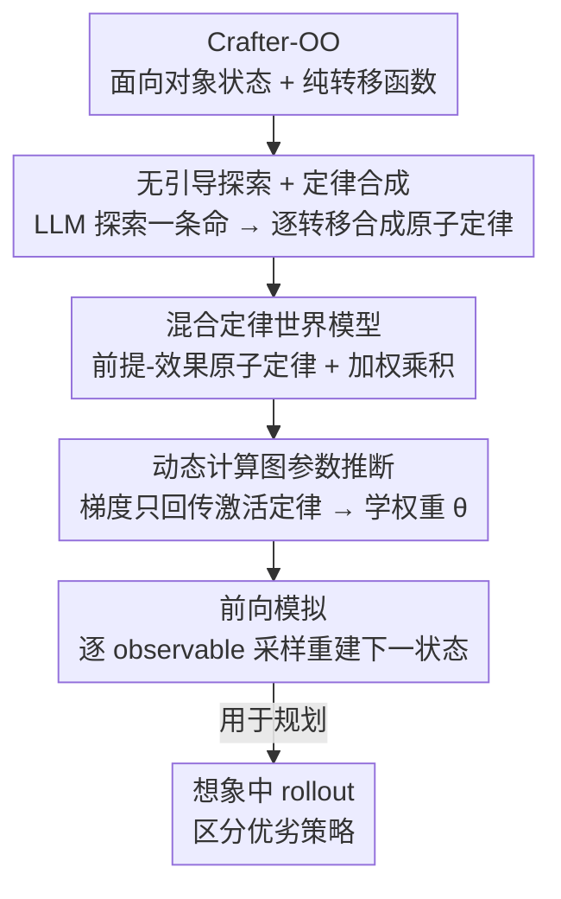

# One Life to Learn: Inferring Symbolic World Models for Stochastic Environments from Unguided Exploration

**会议**: ICLR 2026  
**OpenReview**: [https://openreview.net/forum?id=UQ36IrVCw2](https://openreview.net/forum?id=UQ36IrVCw2)  
**代码**: https://onelife-worldmodel.github.io  
**领域**: 强化学习 / 世界模型 / 程序合成  
**关键词**: 符号世界模型, 概率程序, 单次探索, 信用分配, Crafter

## 一句话总结
本文提出 ONELIFE，让智能体在一个复杂、危险、随机的开放世界里只跑「一条命」（单个无引导 episode），仅靠观测就把环境的转移动力学 $p(s_{t+1}\mid s_t,a_t)$ 反推成一堆可执行的概率「定律」程序，靠「前提-效果」结构构造按需激活的动态计算图、把梯度只回传给真正相关的定律，从而在 Crafter-OO 的 23 个机制中有 16 个上超过强基线 PoE-World。

## 研究背景与动机
**领域现状**：符号世界模型（symbolic world model）想把环境的转移动力学写成一段可读、可改、可验证的代码，而不是黑箱神经网络。以往工作（WorldCoder、Code World Models、PoE-World）多用 LLM 合成程序，但都假设环境**简单、确定、数据充裕、还有人给引导**——比如网格世界、Atari，给定 reward/goal，可以反复交互几千步。

**现有痛点**：真实的开放世界沙盒（MineCraft、RuneScape，乃至本文用的 Crafter）违背这些假设：① **不可约的随机性**——同一个动作的结果是抽签（僵尸怎么追玩家是概率的）；② **没有外部奖励**——玩家自己定目标，没有「赢」的判据；③ **探索代价极高**——乱走进危险区域会死，意味着不能靠海量交互去试错。现有方法在这三条上同时失灵。

**核心矛盾**：要把世界写成程序，需要大量「状态转移」样本做监督；但危险随机的环境恰恰只给你极少、还带噪声的样本，且没有 reward 告诉你哪条假设对。如何在「一条命」的预算下、无引导地把整套规则逆向工程出来，是本质冲突。

**本文目标**：让智能体像做**自主科学发现**一样，在一个 episode 内仅靠观测推断出转移函数，既要能区分「合理 vs 不合理」的未来状态（state ranking），又要能生成「接近真实」的未来状态（state fidelity）。

**切入角度**：作者观察到，把世界写成「一整段大程序」（WorldCoder、PoE-World）会让信用分配很糟——任何一次转移只动了状态的一小块，但整段程序里无关的部分也在对所有属性瞎猜，污染后验。于是改成把转移函数**拆成一堆原子小定律**，每条只管状态的一个窄切片，且带「前提」决定何时生效。

**核心 idea**：用「带前提-效果的概率定律混合体」代替「单一大程序」，让每次转移只激活相关定律、形成专属计算图，梯度只流经激活的定律，从而在巨大的层级状态空间上做到**精准信用分配**。

## 方法详解

### 整体框架
ONELIFE 把环境建模为一个纯但随机的转移函数 $T:\mathcal{S}\times\mathcal{A}\to\Delta(\mathcal{S})$，并用一组**模块化概率定律**的混合来逼近它。整条管线是：先用一个 LLM 驱动的**无引导探索策略**在环境里跑一条命、收集 $(s_t,a_t,s_{t+1})$ 转移数据（没有奖励）；再用一个**定律合成器**逐条转移地对比前后状态、把每个变化的属性交给 LLM 写成一个含「前提+效果」的 Python 定律类，得到一大池候选定律（含错误假设）；接着用**参数推断**对每条定律学一个权重 $\theta_i$，靠最大化观测似然把无效定律的权重压到零、让有效定律投票；最后用学到的模型做**前向模拟**，给定 $(s_t,a_t)$ 采样出下一状态用于规划。为支撑评测，作者还重写了 Crafter 得到 **Crafter-OO**——一个暴露结构化面向对象状态、转移是纯函数的测试床。

### 关键设计

**1. Crafter-OO：把复杂沙盒改造成可被符号方法处理的纯函数测试床**

以往符号世界模型的隐含前提是「能拿到面向对象的世界状态」，但这只在 Minigrid/BabyAI 这种玩具环境，或靠 OCAtari 这种额外工程暴露 Atari 内部状态时才成立——缺一个比网格世界复杂、机制比 Atari 多样、又暴露结构化状态的环境，导致这条路线根本没法在复杂环境上评测。作者把 Hafner 的 Crafter 重写为 Crafter-OO：所有计算下一状态所需的信息都装进一个**结构化、层级化、面向对象的文本状态**里（填满后有 100+ 键值对），转移是一个不含任何「隐藏变量」的纯函数 $T(s,a)\to s'$。状态用 Python/JSON 描述而非 PDDL，理由是作者发现 PDDL 表示这种复杂状态会膨胀到代价惊人，而且 LLM 写 Python 远比写 Probabilistic PDDL 强（PDDL 在预训练语料里更稀有）。这套表示天然可被 LLM 读写，让它们能通过「写代码修改结构化状态」来重建转移函数。

**2. 混合定律世界模型：把转移函数拆成带前提-效果的原子概率定律**

针对「单一大程序信用分配差」的痛点，ONELIFE 把转移函数写成一堆原子定律 $L_i=(c_i,e_i)$ 的混合：前提 $c_i(s,a)\to\{\text{true},\text{false}\}$ 决定该定律是否适用，效果 $e_i(s,a)\to\Delta(\mathcal{S})$ 只给出状态某个**窄切片**上的概率分布。配套引入一个 **observable extractor** $E:\mathcal{S}\to\mathcal{O}$，把复杂状态映射成一组原始值 observable（如 `player.position`、`zombie.position`、`inventory`），让预测状态和真实状态可比较；每条定律只对一小撮 observable 发表意见。对某个 observable $o$，取其当前激活的相关定律集合 $I_o(s,a)$，用**加权乘积**组合它们的预测：

$$p(o=v\mid s,a;\theta)\propto\prod_{i\in I_o(s,a)}\phi_{i,o}(o=v\mid s,a)^{\theta_i}$$

假设各 observable 在给定 $(s,a)$ 下条件独立，完整下一状态分布就是各 observable 分布之积 $p(s'\mid s,a;\theta)=\prod_{o\in\mathcal{O}}p(o\mid s,a;\theta)$。可学权重 $\theta$ 在做**模型选择**：合成器会产出大量含错误假设的原子定律，优化会把无效定律权重推向零、同时让多条合理定律投票聚合。这与 PoE-World 的根本区别在于**原子性**——PoE-World 每个 expert 预测整个下一状态，复杂环境里无关 expert 对它们建模不好的属性贡献近乎均匀的噪声、污染后验；ONELIFE 每条定律只管一个最小子集（只管玩家血量、或只管某块地图 tile），才使得下面的动态计算图成为可能，并能扩展到库存、地图 tile、NPC 状态等远超「位置/速度」的多样属性。

**3. 无引导探索 + 单一通用合成器：在没有规则先验的情况下边玩边发现机制**

无奖励设定下既没有现成离线数据集、也没有人给目标，而 Crafter-OO 这种敌对环境里**纯随机策略活不够久**、体验不到足够多样的机制。作者因此用一个 LLM 驱动的探索策略（基于 Balrog 的 agent 脚手架，维护近期状态-动作滑窗，并让 agent 边玩边维护一份对世界规则的临时理解假设）。关键是区分两类知识：**通用品类先验**（开放生存类游戏都有的高层概念，如「存在敌对实体」「能采集资源」「能合成工具」）给 agent，避免随机乱走；而**环境特定动力学**（精确规则，如「僵尸追玩家」「做镐子要木头」）严格不给，逼 agent 从零逆向工程。合成器则是一个**单一通用合成器**：逐转移系统性对比面向对象状态、自动找出变化的属性（无需手工指定 track 什么），对每个变化让 LLM 输出一个含 `precondition`/`effect` 方法的 Python 类，自动把一次复杂战斗事件拆成「掉血定律」「敌人移动定律」等多条原子定律。这与 PoE-World 用 30+ 个针对预定义机制定制 prompt 的专用合成器形成对比——ONELIFE 不预知规则、用 JSON 通吃整张地图/实体/库存。

**4. 动态计算图上的稀疏信用分配：梯度只流经被激活的定律**

有了原子定律，推断阶段就能利用「前提-效果」结构为**每一次转移单独构造一张计算图**，从而做到精准信用分配。学习目标是最大化观测转移数据集 $\mathcal{D}=\{(s_t,a_t,s_{t+1})\}$ 的对数似然；按 observable 条件独立，单条转移的负对数似然分解为各 observable 之和 $\mathcal{L}(\theta;s,a,s')=-\sum_{o\in\mathcal{O}}\log p(v_o^*\mid s,a;\theta)$，其中 $v_o^*=E(s')_o$ 是真实下一状态里该 observable 的取值。组合的未归一化对数分数是激活定律的加权和 $\ell_o(v\mid s,a;\theta)=\sum_{i\in I_o(s,a)}\theta_i\log\phi_{i,o}(o=v\mid s,a)$，归一化用 log-softmax 在该 observable 的离散支撑集 $\mathrm{supp}(o)$ 上做。优化的精妙处在于：对每个转移、每个 observable，损失梯度**只对激活定律 $i\in I_o(s_t,a_t)$ 的权重计算**，把某个结果的信用专门路由给真正对它发表了预测的定律——这比那些用全局权重、按聚合结果更新的方法（PoE-World 的「静态图」）信用分配精准得多。优化器用 L-BFGS。在 Fig. 2 的例子里，玩家右移、僵尸独立左移这一次转移只牵涉 PlayerMovementLaw 和 ZombieMovementLaw、不牵涉 InventoryUpdateLaw，于是损失只是 $\theta_1,\theta_2$ 的函数。

### 一个例子：僵尸追玩家
设当前状态 $s_t$ 里玩家在某格、附近有个僵尸，动作 $a_t=$「向右移动」。前向模拟时，模型为每个 observable 找激活定律：`player.pos.x`/`player.pos.y` 由 PlayerMovementLaw 解释（前提「有玩家 + 移动动作」满足），`zombie.pos.x`/`zombie.pos.y` 由 ZombieMovementLaw 解释；InventoryUpdateLaw 前提不满足、不激活。对僵尸位置，模型并不输出一个确定值，而是一个离散分布——比如「上 0.60 / 左 0.20 / 右 0.05 / 下 0.05 / 不动 0.10」，因为真实僵尸移动本身就服从一个分布。模型把各 observable 的预测分布按权重组合，采样出 $\hat{v}_o$，再由重建函数（observable 抽取的逆过程）拼回完整的结构化下一状态 $\hat{s}_{t+1}$。这样即便无法精确预测僵尸落点，世界模型也无监督地捕获了「追玩家」这个倾向。

## 实验关键数据

### 主实验
在 Crafter-OO 上对比各方法（均使用 ONELIFE 的探索策略和定律合成器，只在参数推断上不同），10 次试验平均：

| 定律合成 | 参数推断 | Rank@1 ↑ | MRR ↑ | Raw Edit Dist. ↓ | Norm. Edit Dist. ↓ |
|---|---|---|---|---|---|
| Random World Model | — | 8.5% | 0.322 | 121.538 | 0.809 |
| WorldCoder | — | 0.0% | 0.264 | 27.180 | 0.181 |
| ONELIFE | PoE-World | 10.8% | 0.351 | 10.634 | 0.071 |
| ONELIFE | No Inference | 13.0% | 0.429 | **8.540** | **0.057** |
| ONELIFE | ONELIFE | **18.7%** | **0.479** | 8.764 | 0.058 |

ONELIFE 在「区分合理/不合理未来状态」的判别指标上优势最大：Rank@1 达 18.7%、MRR 达 0.479，比 PoE-World 推断基线分别高 **+7.9 个百分点**和 **+0.128**。生成保真度（edit distance）与 No Inference 持平、略逊一点点，但作者强调生成指标单独优化并不能换来更好用的世界模型——PoE-World 把 edit distance 降到 1/10，Rank@1 却只比随机高约 2%。

评测协议用两类指标：**State Ranking**（用 mutator 程序性地把真实下一状态篡改成「非法」的干扰项，看模型能否把真状态排在前面；候选集大小 $N=7\sim11$，MRR 因 $1/r$ 缩放对漏掉 top-1 惩罚重、且不受 $N$ 影响而被偏好）和 **State Fidelity**（预测状态到真实状态的 JSON Patch 编辑距离，Raw 与按状态元素数归一化的 Norm 两种）。

### 消融实验

| 配置 | Rank@1 | MRR | 说明 |
|---|---|---|---|
| ONELIFE（完整） | 18.7% | 0.479 | 含可学定律权重 $\theta$ |
| No Inference | 13.0% | 0.429 | 去掉参数推断、定律不加权 |

去掉参数推断后 Rank@1 掉 5.7 个百分点、MRR 掉 0.05，证明权重对「把有效定律从错误假设里挑出来」是必需的。

### 关键发现
- **细粒度评测**：Fig. 4 按机制把 23 个场景（资源采集、工具生产、生命维护、世界操纵、战斗、移动、物理）分组，ONELIFE 在其中 **16/23** 上 MRR 超过 PoE-World，且提升来自对多样规则的稳健理解、而非只在少数简单机制上刷分。
- **判别 > 生成**：精确生成复杂未来状态依然很难（edit distance 改善有限），但模型确实学到了准确的规则理解，能给合法转移高概率、非法转移低概率——这正是规划真正需要的。
- **规划用途**：把不同策略的 rollout 完全在世界模型内部模拟，模型能在多步目标导向任务里区分出更优策略，验证了「想象中规划」的可用性。

## 亮点与洞察
- **原子定律 + 动态计算图**是核心洞见：把「整段程序」换成「一堆只管窄切片的小定律」，让每次转移的梯度只流经激活定律，把信用分配从「全局糊弄」变成「按需精准」，这套思路可迁移到任何「稀疏激活、局部生效」的结构化预测问题。
- **「一条命」设定**把符号世界建模重新框为自主科学发现：单 episode、无奖励、无规则先验，逼近真实智能体进入陌生环境的处境，比反复刷数据的设定更有野心。
- **通用先验 vs 特定规则的刻意切割**很巧妙：给品类直觉防止瞎走、藏起精确规则逼真逆向工程，既保证探索效率又不泄露答案，是无引导设定下一个干净的实验控制。
- **Crafter-OO 本身是可复用资产**：暴露面向对象状态 + 纯转移函数 + 30+ 可执行场景 + 一池能生成非法干扰态的 mutator，为后续符号世界建模和程序化 RL 铺了路。

## 局限与展望
- 作者承认精确生成完整未来状态仍困难（state fidelity 提升有限），当前实现只覆盖类别型/离散分布，连续分布只是「原则上可扩展」。
- 评测依赖人工设计的 mutator 来造干扰项，干扰项的「难度」由设计者决定，可能高估或低估真实判别能力；候选集只有 $N=7\sim11$，比真实的天文数字非法状态空间小得多。
- 探索和合成都重度依赖 LLM——探索策略靠 LLM 不乱走、合成器靠 LLM 写对 Python 定律；LLM 能力/成本会直接决定上限，论文未充分讨论换不同 LLM 的敏感性。
- 仍局限在 Crafter 这一个环境，「单 episode 学会规则」能否迁移到 MineCraft 级别的真·开放世界尚待验证。

## 相关工作与启发
- **vs WorldCoder / Code World Models（Tang et al. 2024；Dainese et al. 2024）**：他们合成**单一、确定性**的整段转移程序，本文拆成**概率原子定律混合体**；WorldCoder 在随机环境里 Rank@1 直接掉到 0%，说明确定性程序无法表达 Crafter 的随机性。
- **vs PoE-World（Piriyakulkij et al. 2025）**：同是 product-of-experts，但 PoE-World 每个 expert 预测整个状态、用 30+ 定制合成器、限于物理属性、静态计算图；本文每条定律只管最小子集、单一通用合成器、动态计算图按需路由梯度，故能扩到库存/地图/NPC 等多样属性并做精准信用分配。
- **vs 隐式/潜在世界模型（Dreamer 系、TWM 等）**：他们学非符号的潜在世界模型靠内在动机驱动探索，本文学**显式、可读、可验证**的符号规则，把学习框为「逆向工程系统规则」，与策略/奖励/技能正交、可服务任意下游目标。
- **vs PDDL 域推断（Cresswell 等；Zhuo & Kambhampati）**：经典域推断多用确定性 PDDL，本文用 Python 概率程序形式，理由是标准 PDDL 难表达随机动力学、且 LLM 写 Python 远好于写 Probabilistic PDDL。

## 评分
- 新颖性: ⭐⭐⭐⭐⭐ 「单条命 + 无引导 + 随机开放世界」的符号世界建模设定，加原子定律动态计算图，是真正的新框架而非增量。
- 实验充分度: ⭐⭐⭐⭐ 23 场景细粒度评测 + 消融 + 规划验证较扎实，但只在单一环境、候选集偏小、缺 LLM 敏感性分析。
- 写作质量: ⭐⭐⭐⭐ 动机清晰、公式与图配合好，符号略多但逻辑自洽。
- 价值: ⭐⭐⭐⭐⭐ Crafter-OO + 评测套件 + 框架均开源，为程序化 RL 和符号世界建模打了可复用的地基。

<!-- RELATED:START -->

## 相关论文

- [\[ICLR 2026\] Distributional value gradients for stochastic environments](distributional_value_gradients_for_stochastic_environments.md)
- [\[ICLR 2026\] One Model for All Tasks: Leveraging Efficient World Models in Multi-Task Planning](one_model_for_all_tasks_leveraging_efficient_world_models_in_multi-task_planning.md)
- [\[ICLR 2026\] EGG-SR: Embedding Symbolic Equivalence into Symbolic Regression via Equality Graph](egg-sr_embedding_symbolic_equivalence_into_symbolic_regression_via_equality_grap.md)
- [\[CVPR 2026\] DreamSAC: Learning Hamiltonian World Models via Symmetry Exploration](../../CVPR2026/reinforcement_learning/dreamsac_learning_hamiltonian_world_models_via_symmetry_exploration.md)
- [\[ICML 2026\] Flow-Equivariant World Models: Memory for Partially Observed Dynamic Environments](../../ICML2026/reinforcement_learning/flow_equivariant_world_models_memory_for_partially_observed_dynamic_environments.md)

<!-- RELATED:END -->
