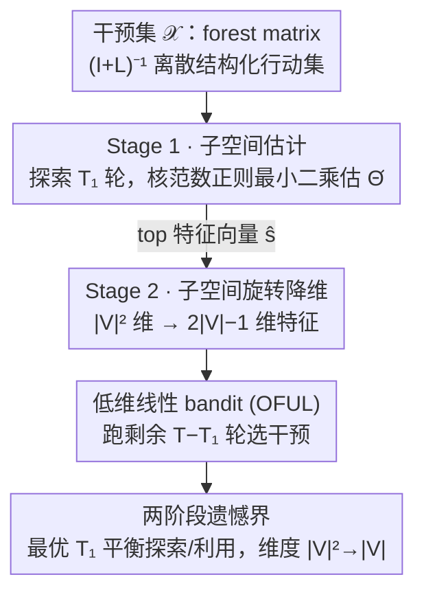

# Online Minimization of Polarization and Disagreement via Low-Rank Matrix Bandits

**会议**: ICLR 2026  
**arXiv**: [2510.00803](https://arxiv.org/abs/2510.00803)  
**代码**: [GitHub](https://github.com/FedericoCinus/online-min-pol)  
**领域**: online learning, social network  
**关键词**: 观点极化, Friedkin-Johnsen模型, 低秩矩阵bandit, 遗憾最小化, 社交网络干预

## 一句话总结

将Friedkin-Johnsen观点动力学模型下极化+分歧最小化问题首次形式化为在线低秩矩阵bandit问题（OPD-Min），提出两阶段算法OPD-Min-ESTR通过子空间估计将维度从 $|V|^2$ 降至 $O(|V|)$，在合成和真实网络上显著优于全维度线性bandit基线。

## 研究背景与动机

**领域现状**：社交媒体可加剧观点极化和社会分裂。Friedkin-Johnsen (FJ) 模型是研究观点动力学的经典模型：每个agent的表达观点是其内在观点与邻居表达观点的加权平均，最终收敛到唯一均衡 $\bm{z}^* = (\mathbf{I} + \mathbf{L})^{-1}\bm{s}$，其中 $\mathbf{L}$ 是图Laplacian，$\bm{s}$ 是内在观点向量。

**现有痛点**：Musco et al. (2018)开创了在FJ均衡处最小化极化和分歧的研究，但假设完全知道所有agent的内在观点。现实中获取内在观点代价高昂，可能需要广泛的用户调查或行为分析，在隐私约束下甚至不可能。

**核心矛盾**：已有部分放松假设的工作——二值内在观点（Chen et al., 2018）、SDP上界优化（Chaitanya et al., 2024）、有限查询推理（Cinus et al., 2025）——但均未解决真正的在线设置：内在观点完全未知且不可查询，仅能通过每次干预后的标量反馈（极化+分歧值）来学习。

**本文方案**：将问题形式化为Online Polarization and Disagreement Minimization (OPD-Min)，建立社交媒体算法干预与多臂bandit理论的关键连接。利用目标函数的秩一结构 $f(\mathbf{X}) = \langle \bm{s}\bm{s}^\top, \mathbf{X} \rangle$，设计高效的低秩矩阵bandit算法。

## 方法详解

### 整体框架

本文把社交网络干预包装成一个秩一矩阵bandit：每一步 $t$ 学习器从有限干预集 $\mathcal{L}$ 中选一个图Laplacian $\mathbf{L}_t$（等价于选 forest matrix $\mathbf{X}_t = (\mathbf{I} + \mathbf{L}_t)^{-1}$），Friedkin-Johnsen（FJ）动力学收敛后只回传一个含噪标量损失 $Y_t = \langle \mathbf{\Theta}^*, \mathbf{X}_t \rangle + \eta_t$，其中未知参数 $\mathbf{\Theta}^* = \bm{s}\bm{s}^\top$ 是内在观点的秩一外积，目标是最小化累积遗憾 $R_T = \sum_{t=1}^T [f(\mathbf{X}_t) - f(\mathbf{X}^*)]$。算法 OPD-Min-ESTR（Explore-Subspace-Then-Refine）分两阶段：Stage 1 先花 $T_1$ 轮探索，用核范数正则最小二乘把 $\mathbf{\Theta}^*$ 的方向 $\hat{\bm{s}}$ 估出来；Stage 2 借这个方向把 $|V|^2$ 维问题旋转压成 $O(|V|)$ 维，在低维空间里跑标准线性bandit（OFUL）选干预、跑完剩下的 $T - T_1$ 轮。两阶段的探索预算 $T_1$ 由遗憾分析最优地划定。

### 关键设计

**1. 子空间估计：把 $|V|^2$ 维探索压成方向估计问题**

朴素做法是把矩阵拉直成 $|V|^2$ 维线性bandit，遗憾界会膨胀到 $\tilde{O}(|V|^2\sqrt{T})$；而现成的低秩矩阵bandit又默认能从高斯之类的连续分布采样，对 forest matrix 这种离散结构化行动集失效。本文在 Stage 1 用核范数正则化最小二乘直接估计参数矩阵，$\widehat{\mathbf{\Theta}} = \arg\min_{\mathbf{\Theta}} \frac{1}{2T_1} \sum_{t=1}^{T_1} (Y_t - \langle \mathbf{X}_t, \mathbf{\Theta} \rangle)^2 + \lambda_{T_1} \|\mathbf{\Theta}\|_{\text{nuc}}$，取正则系数 $\lambda_{T_1} = 2\sqrt{2\log(2|V|/\delta)/T_1}$，让核范数惩罚把解逼向低秩。关键是不假设外部给定"良好探索分布"，而是针对 forest matrix 集合直接证明限制强凸性（Restricted Strong Convexity, RSC）成立——其曲率参数 $\kappa = \kappa_{\min}(\mathcal{X})$ 度量行动集自身的多样性，再用 Talagrand 集中不等式和 Rademacher 过程压住统计偏差，从而得到估计误差 $\|\widehat{\mathbf{\Theta}} - \mathbf{\Theta}^*\|_F^2 \leq \frac{36\log(2|V|/\delta)}{\kappa^2 T_1}$，随探索轮数 $T_1$ 衰减。

**2. 子空间旋转降维：用估出的方向把线性bandit从 $|V|^2$ 维降到 $O(|V|)$ 维**

拿到 $\widehat{\mathbf{\Theta}}$ 后取其首特征向量（top eigenvector）$\hat{\bm{s}}$，补成正交基 $[\hat{\bm{s}}, \hat{\mathbf{S}}_\perp]$，对每个 arm 做旋转 $\mathbf{X}' = [\hat{\bm{s}}, \hat{\mathbf{S}}_\perp]^\top \mathbf{X} [\hat{\bm{s}}, \hat{\mathbf{S}}_\perp]$，只保留旋转后的第一行和第一列，拼成 $k = 2|V|-1$ 维特征 $\bm{x}_{\text{sub}}$，在这 $O(|V|)$ 维空间里跑标准线性bandit（如 OFUL）。之所以能这么砍维度，是因为 $\mathbf{\Theta}^*$ 秩一、信号全部集中在 $\bm{s}$ 方向，丢掉的正交补分量的投影误差可由 Davis-Kahan $\sin\theta$ 定理控制，并随 $T_1$ 增大而消失，于是降维几乎不损失信息。

**3. 两阶段遗憾界：用最优探索预算把 $|V|^2$ 换成 $|V|$**

把两阶段串起来，Stage 1 的探索代价随 $T_1$ 线性增长、Stage 2 的剩余遗憾随 $T_1$ 增大而下降，两者权衡给出最优探索预算 $T_1 \asymp \frac{1}{\|\bm{s}\|^2 \kappa} \sqrt{T \log(2|V|/\delta)}$。Theorem 4.1 在 RSC 条件下证明总遗憾为 $R_T = \widetilde{\mathcal{O}}\left(\max\left\{\frac{1}{\kappa}, \sqrt{|V|}\right\}\sqrt{|V| \cdot T}\right)$——对时间 $\sqrt{T}$ 已是最优阶，而维度因子从朴素做法的 $|V|^2$ 降到 $|V|$，统计与计算两头同时受益。

## 实验关键数据

### 主实验：合成网络上的累积遗憾

| 方法 | $|V|=8$ ER (regret/runtime) | $|V|=16$ ER (regret/runtime) | $|V|=8$ SBM | $|V|=16$ SBM |
|------|----------------------------|------------------------------|-------------|-------------|
| OPD-Min (本文) | 低遗憾 / **快** | 低遗憾 / **快** | 低遗憾 / **快** | 低遗憾 / **快** |
| Full-dim OFUL | 高遗憾 / 慢 | **显著**更高遗憾 / **极慢** | 高遗憾 / 慢 | 高遗憾 / 慢 |
| Oracle Subspace | 最低遗憾 / 快 | 最低遗憾 / 快 | 最低遗憾 / 快 | 最低遗憾 / 快 |

$|V|=16$ 时差距尤为明显：OFUL遗憾和运行时间均显著更差，OPD-Min紧密追踪oracle基线。

### 消融实验：RSC参数验证

| 图类型 | Arm regime | $|V|=32$ | $|V|=128$ | $|V|=1024$ |
|-------|-----------|----------|-----------|------------|
| ER | Diverse | 0.393 | 0.410 | 0.499 |
| ER | Local | $1.68 \times 10^{-5}$ | $1.49 \times 10^{-7}$ | $2.21 \times 10^{-7}$ |
| SBM | Diverse | 0.386 | 0.476 | 0.462 |
| SBM | Local | $2.97 \times 10^{-6}$ | $8.05 \times 10^{-7}$ | $1.05 \times 10^{-7}$ |

Diverse arm regime下 $\kappa$ 合理（≈0.4-0.5），Local regime因arm近共线导致 $\kappa$ 极小。

### 关键发现

- OPD-Min在所有网络拓扑和参数设置下均一致优于全维度OFUL，且运行时间优势随 $|V|$ 增大更显著
- 算法可扩展至 $|V|=1024$ 节点
- 在真实网络（Florentine families, Karate club, Les Misérables）上结果一致
- 在线算法可快速超越离线SDP基线（Chaitanya et al., 2024），仅约250次干预后即可找到更优策略
- 极化分布（bimodal opinions）下干预更容易识别和利用

## 亮点与洞察

- 首次将观点极化最小化与在线学习/bandit理论连接，开创全新研究方向
- 针对forest matrix的结构化行动集提供自洽的RSC分析，不依赖已有低秩bandit的连续采样假设
- 从 $|V|^2$ 到 $O(|V|)$ 的维度降低同时改善统计效率和计算效率
- 仅需标量反馈（全局极化+分歧值），无需观测个体观点，隐私友好

## 局限与展望

- RSC参数 $\kappa$ 在Local arm regime下极小，理论界可能过于悲观
- 仅考虑标量均衡反馈，更丰富的信号（如社区级极化）可改善性能
- 假设FJ动力学在干预之间收敛到均衡，忽略了非均衡状态的影响
- 内在观点随时间不变的假设在现实中可能过强
- 行动集限于无向图Laplacian，未覆盖有向图或其他干预形式

## 相关工作与启发

- **Musco et al. (2018)**：开创离线极化最小化，本文将其推广到在线设置
- **LowESTR**（Lu et al., 2021）和**G-ESTT**（Kang et al., 2022）：本文在其ESTR框架基础上针对OPD-Min的特殊结构做定制化分析
- **LowPopArt**（Jang et al., 2024）：基于optimal design的低秩bandit方法，但计算复杂度 $O(|V|^6)$ 在社交网络中不可行
- 对推荐系统干预设计的启发：可将类似框架应用于内容推荐中的极化缓解

## 评分

- 新颖性: ⭐⭐⭐⭐⭐ 首次建立观点动力学与在线bandit理论的连接，问题建模极为精巧
- 实验充分度: ⭐⭐⭐⭐ 合成+真实网络实验丰富，含RSC验证和可扩展性分析，但缺乏真实平台数据
- 写作质量: ⭐⭐⭐⭐ 理论推导严谨完整，主文与附录组织清晰
- 价值: ⭐⭐⭐⭐ 开创性工作，但实际部署到社交平台仍有距离

<!-- RELATED:START -->

## 相关论文

- [\[ICLR 2026\] QeRL: Quantization-enhanced Low-rank Reinforcement Learning for LLMs](qerl_beyond_efficiency_-_quantization-enhanced_reinforcement_learning_for_llms.md)
- [\[ICLR 2026\] Revisiting Matrix Sketching in Linear Bandits: Achieving Sublinear Regret via Dyadic Block Sketching](revisiting_matrix_sketching_in_linear_bandits_achieving_sublinear_regret_via_dya.md)
- [\[ACL 2026\] GeoRA: Geometry-Aware Low-Rank Adaptation for RLVR](../../ACL2026/reinforcement_learning/geora_geometry-aware_low-rank_adaptation_for_rlvr.md)
- [\[AAAI 2026\] Beyond the Lower Bound: Bridging Regret Minimization and Best Arm Identification in Lexicographic Bandits](../../AAAI2026/reinforcement_learning/beyond_the_lower_bound_bridging_regret_minimization_and_best_arm_identification_.md)
- [\[ICLR 2026\] Single Index Bandits: Generalized Linear Contextual Bandits with Unknown Reward Functions](single_index_bandits_generalized_linear_contextual_bandits_with_unknown_reward_f.md)

<!-- RELATED:END -->
