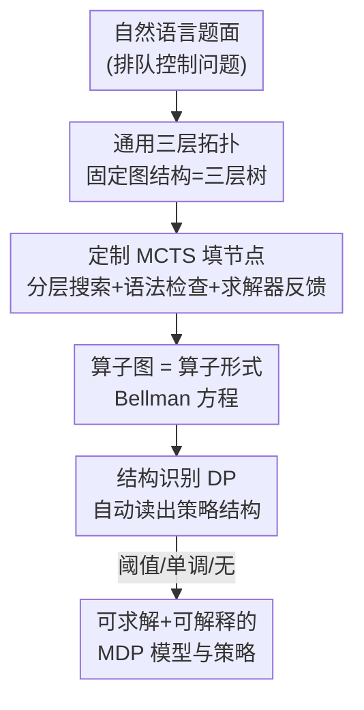

# Operator Theory-Driven Autoformulation of MDPs for Control of Queueing Systems

**会议**: ICLR 2026  
**OpenReview**: [https://openreview.net/forum?id=hPOImB2mZW](https://openreview.net/forum?id=hPOImB2mZW)  
**代码**: 论文称随文公开数据集与代码（"available here"），具体仓库以原文为准  
**领域**: 强化学习 / 序贯决策 / 运筹优化  
**关键词**: 自动建模, MDP, 算子理论, 排队系统, 蒙特卡洛树搜索

## 一句话总结
本文用大语言模型把自然语言描述的排队控制问题自动翻译成"算子图"形式的 Bellman 方程，借助一条被严格证明的"通用三层拓扑"把巨大的建模搜索空间砍小，再用定制 MCTS 搭图、用低复杂度动态规划自动识别最优策略的结构（如阈值型/单调型），在自建 36 题数据集上把建模正确率从基线的个位数提到 83.3%。

## 研究背景与动机
**领域现状**：Autoformulation（自动建模）是个新兴方向——让 LLM 把"用大白话描述的决策问题"自动翻译成可求解的数学模型，把运筹学（OR）建模能力开放给非专家。但现有工作几乎都聚焦于**数学优化**这类"一次性决策"问题（一次求解就完事）。

**现有痛点**：现实里大量问题是**序贯的、随机演化的**，天然该建模成马尔可夫决策过程（MDP）。可 MDP 的自动建模比优化难得多：① 候选公式的搜索空间大得多，还多出状态、转移概率这些组件，以及"状态非负""状态相关的动作集"等**隐式约束**——这些常常根本不写在题面里，模型得自己推断出来；② 即便公式写对了，MDP 还要面对维度灾难，求解本身就很贵；③ MDP 的最优策略是高维状态-动作映射，**可解释性差**，人很难看懂"为什么这么决策"。

**核心矛盾**：优化问题"建好即解决"，而 MDP 的"建模"和"求解"是两个阶段，且求解阶段被维度灾难卡死。如果建模阶段只盯着"写对公式"，完全不为下游求解和可解释性留接口，那建出来的模型即使正确也难用。

**本文目标**：在排队控制这个对医疗、物流极其关键、又非常吃专业知识的场景里，做一套自动建模框架，**同时**解决建模正确性、计算可解性、解的可解释性三件事。

**切入角度**：作者搬出运筹学里的**算子理论**（Koole 1998/2007）——它把 Bellman 方程看成一串"算子"的串联，每个算子是对值函数的一次可解释变换，对应某个事件（到达、离开、路由……）。这个视角天生可解释，又给"识别最优策略结构"提供了理论抓手。

**核心 idea**：第一次把 Bellman 方程表示成**算子的有向无环图（算子图）**，并证明一大类 MDP 的算子图都服从同一个"通用三层拓扑"，从而把"在所有可能图里搜索"压缩成"在固定拓扑里填节点"，再用 MCTS 填图、用动态规划自动读出策略结构。

## 方法详解

### 整体框架
框架要解决的是"自然语言题面 → 可求解且可解释的 MDP 模型"。它分两大阶段：**建模阶段**用 LLM + MCTS 生成并评估算子图（即算子形式的 Bellman 方程），**求解/分析阶段**对建好的算子图跑结构识别算法，自动判定最优策略是不是阈值型、单调型等。

关键的事件型 MDP（event-based MDP）把状态 $s=(x,e)$ 拆成可控分量 $x$（如队列长度）和外生不可控分量 $e$（如到达事件），转移概率分解为 $P[(x',e')|(x,e),a]=P_x[x'|(x,e),a]\cdot P_e(e'|x')$。在此结构下，整张算子图固定成三层：底层是每个事件一个的**事件算子** $T_{e_j}$，中间是把各事件按概率加权汇合的**均匀化算子** $T_{\text{unif}}$，顶层是加上即时代价、乘上折扣的**代价算子** $T_{\text{cost}}$。一次值迭代写成 $V^*_{n+1}(x)=T_{\text{cost}}\{T_{\text{unif}}(T_{e_1}[V^*_n(x)],\dots,T_{e_\ell}[V^*_n(x)])\}$。

### 关键设计

**1. 算子图 + 通用三层拓扑：把"图随便连"压成"固定树填空"**

朴素地把"问题建模"看成"在所有算子图里搜索"是灾难性的：$N$ 个节点、单出点的 DAG 数量约以 $2^{N^2}$ 增长（$N=2\dots9$ 时已是 $1,2,15,316,16885,2174586,654313415,450179768312$）。本文的核心理论贡献（定理 4.1）证明：**任何**事件型 MDP，其 Bellman 方程都能由一个固定的三层树拓扑构造——根是代价算子 $T_{\text{cost}}[U(x)]=c(x)+\gamma U(x)$，根的唯一孩子是均匀化算子 $T_{\text{unif}}[U_1,\dots,U_\ell]=\sum_j P(e_j|x)\,U_j(x)$，叶子是各事件算子 $T_{e_j}[V^*_n(x)]=V_{n+1}(x,e_j)$。这一步不仅固定了"怎么连"，还固定了每层"放哪类算子"，搜索空间从"任意拓扑×任意算子"骤降到"在三层树里填正确节点"。作者强调这个结果非平凡：事件型 MDP 也可能存在别的拓扑，而非事件型 MDP 甚至**无法**用这个通用拓扑构造，因此它精确刻画了方法的适用边界。

**2. 定制 MCTS：按依赖层级搜索，语法检查 + 求解器反馈给稠密奖励**

知道了拓扑还要填对节点，而各组件之间有依赖，单轮 prompt 一把梭根本搞不定。本文把搜索按依赖层级拆成四层——问题参数（队列规模，$m_1$）、状态变量与约束（$m_2$）、事件/动作/代价及其概率（$m_3$）、算子（$m_4$）——让 MCTS 沿这个层级逐层展开。它走标准的"选择—扩展—评估—回传"循环，但在回传上做了两处关键改造。终端奖励上，为了压住 LLM 自评的偏差，把 LLM 偏好分 $\text{score}_{\text{LLM}}\in[0,1]$ 与求解器是否收敛 $\text{score}_{\text{converged}}\in\{0,1\}$ 相乘：$\text{score}_{\text{final}}=\text{score}_{\text{LLM}}\times\text{score}_{\text{converged}}$——求解器不收敛直接判零，提供客观信号。中间奖励上，借鉴 AlphaZero 的思路给中间节点按**语法正确性**打分：部分公式一旦违反语法约束就提前终止该 rollout 并给零奖励，从而尽早剪掉无效分支，不必跑完整条昂贵的 rollout。考虑到语法错误常常是局部的、不该一棒打死，框架还允许 LLM 用错误信息当上下文最多自我修正五次；五次仍失败才把错误归因到更早的步骤并回传零奖励。

**3. 结构识别动态规划：自动读出最优策略的可解释结构**

建好算子图后，要判断最优策略有没有好用的结构（如"动作在状态上单调""阈值型"），这通常靠分析值函数 $V^*(x)$ 的性质——比如 $V^*$ 在 $x$ 上凸，则最优策略在 $x$ 上递减。说一个算子"传播"某性质，指若 $V_n$ 满足该性质则 $T[V_n]$ 也满足；难点在于 $V^*_n$ 要穿过整张算子图，需要找到**被图中所有算子共同传播**的性质，而暴力做法要在交集闭包上枚举指数级多的可能。本文提出一个动态规划算法（算法 1–3）：关键观察是任何共同传播空间都能写成"每个算子初始传播性质的某个子集的交集"，于是不去构造完整闭包，而是反复**剔除**那些不可能出现在该交集里的性质，直到性质族稳定，其交集既保证是共同传播空间、又是最小的那个。定理 4.2 保证该算法能识别框架内所有可检测的结构，且内存/时间复杂度仅为 $O(N\cdot|G|)$ 与 $O(N\cdot|G|^2)$（$|G|$ 为算子数，$N$ 为单算子传播性质数的上界），把"指数暴力"降成"低多项式"。这一步直接缓解维度灾难（可只在单调/阈值策略里搜），并让解可解释。

### 一个完整示例
以题面里的医院两病房为例：危重（C）与普通（G）两条并行队列共享床位，到达可控（CA）、离开不可控（D），状态取可控分量 $x=(x_C,x_G)$。框架先按四层依赖确定参数、状态、事件，再填算子：危重到达算子 $T_{CAC}[U(x)]=\min\{U[(x_C{+}1,x_G)],\,c_C+U(x)\}$（要么收治入队、要么付拒收代价 $c_C$ 后维持现状），危重离开算子 $T_{DC}[U(x)]=U[((x_C{-}1)^+,x_G)]$（普通病人同理）；均匀化算子按各事件率 $\lambda_C,\lambda_G,\mu_C,\mu_G$ 加权汇合；代价算子加上保持代价 $\rho_h(x_C+x_G)/(\lambda+\alpha)$ 并乘折扣 $\gamma$。组合起来正是 $V^*_{n+1}(x)=T_{\text{cost}}\{T_{\text{unif}}(T_{CAC}[V^*_n],T_{CAG}[V^*_n],T_{DC}[V^*_n],T_{DG}[V^*_n])\}$。MCTS 在搜索中若把一个病房错拆成"床上+候诊"两条队列，会被求解器/语法检查或 LLM 自评识别为变量定义错误而扣分；建好图后结构识别 DP 再读出该问题最优策略的阈值结构。

## 实验关键数据

### 主实验
数据集为自建的 36 条排队控制自然语言题面，按状态空间大小/形状与事件类型数划分难度，并分三类：有可证结构的、有经验观测但不可证结构的、无结构的；题目改编自医院管理、电信、货运调度、装配线、交通控制等真实文献。每题跑多轮 MCTS、贪心选最高分路径，用动态规划求解器验证（不收敛即判错），值函数与真值在容差内才算对。

| 方法（12 Rollouts） | 建模正确率 | completion tokens |
|--------|------|------|
| GPT-4o（单 prompt + 求解器反馈 SF） | 0% | 38k |
| CoT（单 prompt + SF） | 2.7% | 50k |
| GPT-4o（分步 prompt + SF） | 8.3% | 42k |
| CoT（分步 prompt + SF） | 11.0% | 85k |
| GPT-4o（分步 prompt + SF + 语法检查 SC） | 72.0% | 80k |
| CoT（分步 prompt + SF + SC） | 75.2% | 180k |
| **MCTS（+SF +SC，本文）** | **83.3%** | 96k |

单 prompt 方法几乎全军覆没（即便加 CoT）；CoT 作为 test-time scaling 既更费算力又不如 MCTS。MCTS 在相同反馈条件下表现更好，且首轮虽贵，后续因复用历史计算而越来越高效。

### 消融实验

| 配置（12 Rollouts） | 正确率 | 说明 |
|------|---------|------|
| MCTS（w/o SF & SC） | 16.0% | 去掉求解器反馈与语法检查 |
| MCTS（w. SF, w/o SC） | 41.6% | 加求解器反馈，无语法检查 |
| MCTS（w. SF & SC） | 83.3% | 完整模型 |

语法检查（SC）是提升主力：加上后 MCTS 提出的公式全部可被求解器执行，基本根除了"语法有效性"这一类失败。剩余错误几乎都来自**语义误解**。

### 关键发现
- 失败 rollout 的错误分布：均匀化错误 33%、变量定义错误 26%、缺失约束 24%、事件动力学错误 12%、参数识别错误 5%——可见瓶颈在语义层（尤其均匀化，如把并行/串行处理的概率搞错），而非语法层。
- 典型语义错误很具体：LLM 常给单个病房多开一条不必要的队列（变量定义错误）；缺失约束多源于题面隐含假设（如病人数非负），可由求解器报"状态空间无界"来发现。
- 结构识别在 74% 的案例中成功识别出结构属性，说明算子图对"结构可表达性"这一挑战也很有效；失败主要来自前序建模错误、算子误标、以及个别正确公式本身不暴露结构。

## 亮点与洞察
- **把"搜索图"变成"证明拓扑再填空"**：定理 4.1 用一条理论结论直接把 $2^{N^2}$ 量级的图搜索空间塌缩成固定三层树，这是"用数学先验给 LLM 搜索剪枝"的范例，比单纯堆 prompt/采样高明。
- **求解器当裁判**：用"求解器是否收敛"作为客观二值奖励去乘 LLM 自评分，巧妙对冲了 LLM 自我打分的乐观偏差——这个"外部可验证信号 × 模型偏好"的乘法奖励可迁移到任何"建模-求解"闭环任务。
- **中间语法检查给稠密监督**：把 AlphaZero 式中间奖励搬到形式建模上，让无效分支早死，是消融里贡献最大的单一组件（41.6%→83.3%）。
- **建模阶段就为求解/可解释铺路**：先识别策略结构（阈值/单调）再求解，把维度灾难前置缓解，思路对一切序贯决策的自动建模都有借鉴意义。

## 局限与展望
- 适用边界明确限于**事件型 MDP**：定理 4.1 的通用拓扑对非事件型 MDP 不成立，框架对这类问题不适用。
- 评测规模偏小（36 题、排队控制单一领域），且依赖自建数据集与特定求解器/容差判定，跨领域泛化性待验证。
- 剩余瓶颈在语义层：均匀化与变量定义错误占多数，**算子误标**是结构识别仅存的主要瓶颈——LLM 把状态动力学建对却给算子起错名时，结构就读不出来。
- 部分正确公式"结构不可表达"，提示同一问题的不同正确建模在可分析性上有优劣，如何引导 LLM 偏好"利于结构分析"的建模是开放问题。

## 相关工作与启发
- **vs 数学优化自动建模（ORLM、Autoformulator）**：它们只处理一次性决策的优化问题、且只解建模挑战；本文处理离散与连续时间 MDP，并额外解计算与可解释性挑战。
- **vs 动态规划自动建模（DPLM, Zhou et al. 2025）**：最接近的工作，靠合成数据 + 微调，但不碰计算与可解释挑战；本文用 prompting + 算子图搜索，无需微调，并补上后两类挑战。
- **vs 高效求解 MDP 的工作（近似 DP、强化学习、结构性质利用）**：这些是互补的——本文在建模阶段识别出结构后，可与它们串联加速下游求解。

## 评分
- 新颖性: ⭐⭐⭐⭐⭐ 首次把 Bellman 方程当算子图，并证明通用三层拓扑，理论与方法都很新。
- 实验充分度: ⭐⭐⭐⭐ 基线/消融/错误分析齐全，但数据集仅 36 题、单领域，规模偏小。
- 写作质量: ⭐⭐⭐⭐ 三大挑战-贡献对应清晰，理论与示例结合好，部分细节压在附录。
- 价值: ⭐⭐⭐⭐⭐ 为序贯决策的自动建模打开"理论剪枝 + 可解释结构识别"的新路子，落地于医疗/物流等高价值场景。

<!-- RELATED:START -->

## 相关论文

- [\[ICLR 2026\] VerifyBench: Benchmarking Reference-based Reward Systems for Large Language Models](verifybench_benchmarking_reference-based_reward_systems_for_large_language_model.md)
- [\[ICLR 2026\] UME-R1: Exploring Reasoning-Driven Generative Multimodal Embeddings](ume-r1_exploring_reasoning-driven_generative_multimodal_embeddings.md)
- [\[ICLR 2026\] Is Pure Exploitation Sufficient in Exogenous MDPs with Linear Function Approximation?](is_pure_exploitation_sufficient_in_exogenous_mdps_with_linear_function_approxima.md)
- [\[ICLR 2026\] Optimal Robust Subsidy Policies for Irrational Agent in Principal-Agent MDPs](optimal_robust_subsidy_policies_for_irrational_agent_in_principal-agent_mdps.md)
- [\[ICLR 2026\] APC-RL: Exceeding Data-Driven Behavior Priors with Adaptive Policy Composition](apc-rl_exceeding_data-driven_behavior_priors_with_adaptive_policy_composition.md)

<!-- RELATED:END -->
