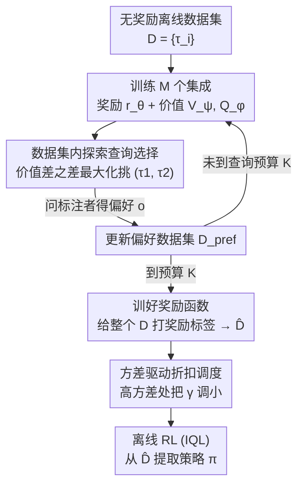

# OPRIDE：通过数据集内探索实现高效的离线偏好强化学习

**会议**: ICLR 2026  
**OpenReview**: [https://openreview.net/forum?id=QLDHukpozh](https://openreview.net/forum?id=QLDHukpozh)  
**代码**: 无  
**领域**: 强化学习 / 离线RL / 偏好学习  
**关键词**: 偏好强化学习, 离线RL, 查询效率, 探索, 折扣调度

## 一句话总结
OPRIDE 针对离线偏好强化学习（PbRL）"问人太贵"的问题，提出用**价值差之差**来挑选最有信息量的偏好查询、再用**基于方差的折扣调度**抑制学到的奖励被过度优化，在 Meta-World 和 AntMaze 上只用约 10 条偏好就显著超过此前 SOTA。

## 研究背景与动机

**领域现状**：很多真实任务的奖励函数极难手工设计，偏好强化学习（PbRL）改成让人对两条轨迹做"哪条更好"的成对比较，再用 Bradley-Terry 模型从这些偏好里反推出奖励函数，最后用标准（离线）RL 学策略。这种相对判断比打分更符合人的直觉，也更省事。

**现有痛点**：人类偏好标注既慢又贵，所以"用尽量少的查询学到好策略"——即**查询效率**——是 PbRL 落地的关键瓶颈。作者把离线 PbRL 查询效率低归结为两个具体原因：一是**探索低效**，现有挑查询的办法（如基于奖励模型分歧、基于信息增益）会把标注预算花在"把奖励估准"上，但奖励估得准的区域很可能和最优策略毫无关系；二是**奖励过优化**，学到的奖励函数本身有噪声，离线 RL 又天然容易高估价值，二者叠加会让策略被一个"虚高"的奖励带偏。

**核心矛盾**：把查询效率理解为"减少奖励函数的不确定性"是错的目标。真正要减少的是**关于最优策略**的不确定性——奖励函数类的 Eluder 维度 $d_{\text{Elu}}(\mathcal{R})$ 通常远大于最优价值函数类的 $d_{\text{Elu}}(\mathcal{V}^*)$，盯着前者去标注是在做无用功。

**本文目标**：(1) 设计一个挑查询的准则，让每条偏好最大化关于**最优策略**的信息增益；(2) 在用学到的奖励做策略提取时，压住过优化导致的价值高估。

**核心 idea**：用"价值差之差"作为数据集内的探索准则去挑查询，再用方差驱动的折扣因子调度做悲观正则——**优化时乐观探索、提策略时悲观利用**。

## 方法详解

### 整体框架

OPRIDE 是一个两阶段算法，建立在"已有一批无奖励的离线轨迹数据集 $\mathcal{D}=\{\tau_i\}_{i=1}^N$"之上。**阶段一（查询选择）**是一个迭代循环：用当前偏好数据集 $\mathcal{D}_{\text{pref}}$ 训练 $M$ 个 bootstrap 集成的奖励函数 $\{r_{\theta_i}\}$ 和对应的价值函数 $\{V_{\psi_i}, Q_{\phi_i}\}$（用 IQL 这类离线算法），然后按探索准则从数据集里挑出最有信息量的一对轨迹 $(\tau^{k,1},\tau^{k,2})$ 去问标注者，把得到的偏好 $o_k$ 加回 $\mathcal{D}_{\text{pref}}$，如此循环 $K$ 次（$K$ 是查询预算）。**阶段二（策略提取）**：用最终的偏好数据训好奖励函数，给整个无奖励数据集打上奖励标签得到 $\hat{\mathcal{D}}$，再根据价值方差把折扣因子从 $\gamma$ 下调成 $\hat\gamma$，最后用标准离线 RL（IQL）从 $\hat{\mathcal{D}}$ 抽出策略。

### 关键设计

**1. 数据集内探索：用"价值差之差"挑最能区分最优策略的查询**

针对"挑查询时把预算浪费在与最优策略无关的奖励区域"这个痛点，OPRIDE 不去最小化奖励函数的不确定性，而是直接最小化**价值函数不确定集的直径**。具体做法：训 $M$ 个集成奖励与价值后，选使下式最大的一对轨迹：

$$\arg\max_{(\tau_1,\tau_2)\in\mathcal{D}}\ \arg\max_{i,j\in[M]}\ \big|\,(V_{\psi_i}(\tau_1)-V_{\psi_j}(\tau_1))-(V_{\psi_i}(\tau_2)-V_{\psi_j}(\tau_2))\,\big|$$

直观上，内层 $V_{\psi_i}(\tau)-V_{\psi_j}(\tau)$ 衡量两个候选价值函数在同一条轨迹上的分歧，外层再取两条轨迹分歧之差最大的一对——也就是找一对轨迹，存在一个奖励强烈偏好 $\tau_1$、又存在另一个奖励强烈偏好 $\tau_2$。问这一对的偏好最能"逼"集成收敛，等价于最大化关于最优策略的信息增益。作者用信息比 $\Gamma$ 把它和不确定集直径联系起来：$\text{diam}(\mathcal{R})\le \Gamma_\delta\sqrt{I(\mathcal{R};\mathcal{D})}$，最大化信息增益 $I$ 直接对应缩小直径。关键优势是其样本复杂度由 $d_{\text{Elu}}(\mathcal{V}^*)$ 决定，而非由通常大得多的 $d_{\text{Elu}}(\mathcal{R})$ 决定。

**2. 方差驱动的折扣调度：在不确定处变悲观，压住奖励过优化**

针对"学到的奖励有噪声、离线 RL 又会高估价值"这个痛点，OPRIDE 在策略提取时按价值估计的方差**逐样本**调小折扣因子。判据是：若某个 $(s,a)$ 上集成 Q 值的方差排进当前 batch 的前 $m\%$，就认为这里的奖励有过估计噪声，把折扣调小：

$$\hat\gamma(s,a)=\begin{cases}\gamma_{\text{small}}, & \text{若 } \mathrm{Var}\{Q_{\phi_i}(s,a)\}_{i=1}^M > \text{Top-}m\%\\ \gamma, & \text{否则}\end{cases}$$

为什么有效：更小的折扣因子等价于缩短有效时域，会给出更悲观、更鲁棒的价值估计。偏好反馈是二元且稀疏的，比普通奖励更容易触发过优化，所以"哪里方差大就在哪里更悲观"恰好把高估的源头按下去，避免策略被虚高奖励带偏。论文还在附录给了一个更平滑的"软置信折扣"变体。

**3. 两阶段结构 + 可证明的探索保证**

OPRIDE 刻意保留"先学奖励、再用成熟离线 RL 提策略"的两阶段结构（区别于 IPL/CPL/DPPO 这类绕开显式奖励建模的单阶段方法），从而能直接复用 IQL 等离线 RL 算法的成熟实现。理论侧，作者把探索准则形式化为：构造奖励函数的置信集 $\mathcal{C}_k(\mathcal{R})$ → 用悲观价值构造候选策略集 $\Pi_k$ → 在候选集内挑一对价值分歧最大的策略去查询，并证明在温和假设下其次优性上界为

$$\text{SubOpt}(\bar\pi)\le O\Big(\sqrt{\tfrac{C^\dagger \log(N|\mathcal{Q}||\Pi|)}{N(1-\gamma)^2}}+\sqrt{\tfrac{\kappa\, d_{\text{Elu}}(\Delta\mathcal{R},1/K)\log(K|\Delta\mathcal{R}|)}{K(1-\gamma)}}\Big)$$

上界分成"离线误差"（受数据集大小 $N$ 控制）与"偏好误差"（受查询数 $K$ 控制）两项。关键洞察是：相比纯在线学习，偏好误差被缩小了 $1/(1-\gamma)$ 倍——因为离线数据集本身蕴含了丰富的动力学信息、缩短了问题的有效时域。这从理论上解释了实验里"约 10 条查询就够用"的现象。

### 损失函数 / 训练策略
奖励/返回函数用 Bradley-Terry 偏好模型下的交叉熵损失训练：$P(\tau_i\succ\tau_j)=1/(\exp(R(\tau_j)-R(\tau_i))+1)$，$R(\tau)=\sum_t\gamma^t r(s_t,a_t)$；为简化分析直接学返回（return）模型而非逐步奖励模型。集成用 bootstrap，所有任务 segment 长度取 50，查询预算默认 10，底层离线 RL 统一用 IQL 以保证公平比较。

## 实验关键数据

### 主实验
在 Meta-World 与 D4RL 的 AntMaze 上，所有方法统一只给 **10 条查询**、统一用 IQL 做后续离线训练，报 5 个随机种子的归一化回报。

| 任务集 | 指标 | OPRIDE | 最强基线 | 提升 |
|--------|------|--------|----------|------|
| Meta-World（11 任务均值） | 归一化分数 | **65.3** | 57.0 (IDRL) | +8.3 |
| AntMaze（6 任务均值） | 归一化分数 | **56.8** | 52.8 (IDRL) | +4.0 |

部分单任务差距极大：peg-insert-side 上 OPRIDE 79.0 vs OPRL 3.5 / PT 16.8；sweep 上 78.5 vs OPRL 6.8 / PT 8.0，说明在难任务上挑对查询的收益更突出。

### 消融实验
表 3 拆开两个模块（IDE=数据集内探索，VDS=方差折扣调度），对比不同查询选择 + 策略提取组合：

| 配置 | peg-insert-side | sweep | faucet-close | 说明 |
|------|-----------------|-------|--------------|------|
| PT（随机查询，无 PDS） | 16.8 | 8.0 | 57.8 | 基础两阶段 |
| PDS + 随机查询 | 12.4 | 8.0 | 46.2 | 只加折扣/数据共享 |
| VDS + 随机查询 | 13.8 | 28.7 | 59.4 | 只加方差折扣 |
| VDS + 分歧查询 | 9.7 | 18.2 | 48.7 | 折扣 + 旧的分歧式挑查询 |
| **OPRIDE (VDS+IDE)** | **79.0** | **78.5** | **73.1** | 完整模型 |

可见只换掉任一模块都会大幅掉点——尤其把 IDE 换成"分歧式查询"后 peg-insert-side 从 79.0 崩到 9.7，证明**挑查询的探索准则是性能主因**，而非单纯靠折扣调度。

### 关键发现
- **数据集内探索（IDE）贡献最大**：去掉它（换成分歧式查询）在多个难任务上几乎归零，说明"对准最优策略而非奖励"的挑查询思路是核心。
- **查询极省**：Meta-World 上约 10 条查询即可达到强性能，与理论里偏好误差被 $1/(1-\gamma)$ 缩小的结论一致。
- 表 4 还对比了"survival instinct"（零奖励/随机奖励/负奖励）等退化基线，OPRIDE 在 sweep（78.5 vs 29.0）、push-wall（102.2 vs 81.9）等任务上明显更强，说明学到的奖励确实有效而非靠环境先验。

## 亮点与洞察
- **把"挑查询"的目标从奖励搬到价值**：用价值差之差衡量信息增益，巧妙地把样本复杂度从 $d_{\text{Elu}}(\mathcal{R})$ 降到 $d_{\text{Elu}}(\mathcal{V}^*)$，这是"少查询也能学好"的根因。
- **逐样本悲观**：方差驱动折扣调度只在高不确定处变悲观，是一种比"全局调小 $\gamma$"更精细的正则，可迁移到任何用集成估方差的离线 RL 上。
- **乐观探索 + 悲观利用的组合范式**：阶段一乐观地去探索信息量大的查询、阶段二悲观地用奖励，这套"两阶段一收一放"的设计对其他主动学习/RLHF 场景有借鉴意义。

## 局限与展望
- **依赖集成**：探索准则和折扣判据都建立在训练 $M$ 个奖励/价值集成上，集成数与训练成本会随任务变大而上升，论文未深入讨论计算开销与 $M$ 的敏感性。
- **实验域偏控制类**：评测集中在 Meta-World 与 AntMaze 这类 locomotion/manipulation/navigation，未验证在 LLM 对齐这类高维偏好场景的效果（虽动机里提到 RLHF）。
- **理论与实现的差距**：Algorithm 2 的可证明版本（构造置信集、候选策略集、解 min-max）与实际跑的 Algorithm 1（价值差之差近似）之间存在简化，超参 $\gamma_{\text{small}}$、$m\%$ 的选取对结果影响值得更系统的分析。

## 相关工作与启发
- **vs OPRL（分歧式查询）**：OPRL 按奖励模型间的分歧挑查询，目标是把奖励估准；OPRIDE 按价值差之差挑，目标是把最优策略对准——消融里这正是性能差距的主要来源。
- **vs IDRL（信息导向）**：IDRL 用 Laplacian 近似 + Hessian 做后验计算，实现复杂；OPRIDE 直接用 critic 价值挑查询，更易实现且实证更强。
- **vs IPL / CPL / DPPO（单阶段）**：它们绕开显式奖励建模、直接从偏好导出策略；OPRIDE 反其道保留两阶段结构，以便复用成熟离线 RL 算法。
- **vs PDS（数据共享/折扣）**：PDS 提供悲观折扣的思路，OPRIDE 把它升级为按价值方差逐样本调度的 VDS。

## 评分
- 新颖性: ⭐⭐⭐⭐ "价值差之差挑查询 + 方差折扣调度"是对离线 PbRL 查询效率的实质性新解法，并配可证明保证
- 实验充分度: ⭐⭐⭐⭐ Meta-World + AntMaze 多任务、5 种子、含模块消融与退化基线对比，但域偏控制类
- 写作质量: ⭐⭐⭐⭐ 动机—方法—理论—实验链条清晰，理论与实现的近似关系交代略简
- 价值: ⭐⭐⭐⭐ 把标注预算压到约 10 条，对 PbRL 落地是实打实的效率收益

<!-- RELATED:START -->

## 相关论文

- [\[ICLR 2026\] Toward Conservative Planning from Human-AI Preferences in Reinforcement Learning](toward_conservative_planning_from_human-ai_preferences_in_reinforcement_learning.md)
- [\[ICLR 2026\] Spectral Bellman Method: Unifying Representation and Exploration in RL](spectral_bellman_method_unifying_representation_and_exploration_in_rl.md)
- [\[ICLR 2026\] Flow Actor-Critic for Offline Reinforcement Learning (FAC)](flow_actor-critic_for_offline_reinforcement_learning.md)
- [\[ICLR 2026\] Offline Reinforcement Learning with Adaptive Feature Fusion](offline_reinforcement_learning_with_adaptive_feature_fusion.md)
- [\[ICLR 2026\] Trajectory Generation with Conservative Value Guidance for Offline Reinforcement Learning](trajectory_generation_with_conservative_value_guidance_for_offline_reinforcement.md)

<!-- RELATED:END -->
