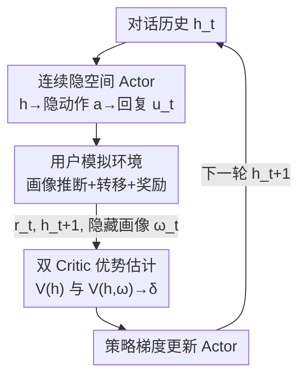

# PAMDP: Interact to Persona Alignment via a Partially Observable Markov Decision Process

**会议**: ICLR 2026  
**OpenReview**: [https://openreview.net/forum?id=tNWZVoVPzZ](https://openreview.net/forum?id=tNWZVoVPzZ)  
**代码**: 待确认  
**领域**: 强化学习 / 对齐 / 个性化对话  
**关键词**: 人格对齐, POMDP, 双 Critic, 连续隐动作, 多轮对话

## 一句话总结
把"在多轮交互中逐步对齐到用户人格"这件事建模成一个用户画像不可观测的部分可观测马尔可夫决策过程（PAMDP），用一个连续隐空间动作的轻量 Actor 加上"部分状态 + 全状态"的双 Critic 做无偏优势估计，在离线数据集和在线模拟器上都拿到了更高的对齐胜率与累计回报。

## 研究背景与动机

**领域现状**：当前 LLM 对齐的主流做法是 SFT + RLHF，用一个统一的奖励模型把模型拉向"有用、无害、诚实"这类通用人类偏好。

**现有痛点**：人类偏好天然是异质的——不同用户群体、不同个体的偏好差异巨大，甚至同一个用户在不同上下文下偏好也会微妙变化。一个单一奖励模型会把多用户数据里的偏好多样性抹平，导致模型只能对齐"平均偏好"，无法贴合具体某个人。直接喂用户画像、历史、行为数据做个性化又受隐私限制，拿不到足够的用户专属数据。

**核心矛盾**：真正贴近真实对话的个性化不是"读到一份完整画像再回答"，而是"在不知道用户底牌的情况下，靠一轮轮交互慢慢摸清并适应他"。可用户画像在部署时对助手是隐藏的，这本质上是一个**部分可观测**问题，用普通 MDP / 单 Critic RL 根本套不进去。

**本文目标**：把"边交互边对齐人格"这个长期目标显式建成一个决策过程，并设计一个既能在训练时利用到隐藏画像、又能保证部署时只靠对话历史决策的 RL 框架。

**切入角度**：作者借鉴 POMDP 里"离线学习、在线执行"的非对称 actor-critic 范式——训练时画像是可见的（来自数据/模拟器），部署时不可见。于是让 Actor 只看对话历史，Critic 可以额外看到画像，从而在训练阶段"偷看答案"提升价值估计，又不破坏部署时的可执行性。

**核心 idea**：把用户画像 $\omega$ 当作不可观测环境变量，推导出 PAMDP 的 Bellman 方程，并用"部分状态值 $V(h)$ + 全状态值 $V(h,\omega)$"构成的双 Critic 给出优势函数的**无偏**估计，再配一个连续隐空间动作的 Actor 来优化策略。

## 方法详解

### 整体框架

PAMDP 要解决的问题是：助手在每一轮只看得到对话历史 $h_t=(q_0,u_0,\dots,q_t)$，看不到用户真实画像 $\omega_t$；它要通过不断交互去推断画像、逐步把回复对齐到用户的真实偏好，并最大化整条对话轨迹的折扣回报 $\sum_t \gamma^t r(h_t,\omega_t,u_t)$。

整体流转是一个闭环：**Actor** 读对话历史 $h_t$，先把它编码成一个低维连续动作向量 $a$，再解码（注入回 LLM）成助手回复 $u_t$；**环境**（用户）根据 $h_t$、$u_t$ 和隐藏画像 $\omega_t$ 做状态转移到 $h_{t+1}$，同时吐出即时奖励 $r_t$；**双 Critic** 分别用部分状态值 $V_\phi(h)$ 和全状态值 $V_\xi(h,\omega)$ 估计价值，组合出优势 $\hat A=\delta(h,\omega,u)$；最后用策略梯度 $\nabla_\theta J=\mathbb{E}[\delta(h,\omega,u)\nabla_\theta\log\pi_\theta(u|h)]$ 更新 Actor。如此循环，助手对用户的信念分布逐轮收敛，回复越来越个性化。

### 关键设计

**1. PAMDP：把人格对齐建成画像不可观测的部分可观测决策过程**

本文针对的痛点是"用户画像在部署时拿不到、却又是驱动偏好的关键潜变量"。作者把对话个性化形式化为一个 POMDP 元组 $(S,H,U,\Omega,D(\omega))$，其中 $\Omega$ 是不可观测的画像变量，状态被拆成可观测部分 $s_o$ 和不可观测部分 $\omega$，且在对话场景里令 $h=s_o$（对话历史就是可观测状态）。助手是 agent，回复 $u_i$（一串 token）是动作，用户是驱动状态转移的环境。作者强调一个本质约束（Remark 1）：助手只能从历史推断出一个"似是而非"的画像 $c_t=I(h_t)\neq\omega_t$，这种部分可观测性使得 PAMDP **无法退化成普通 MDP**。基于"Persona Interaction Process"的概率图，作者对可观测状态、画像、动作逐步分解，推导出 PAMDP 的 Bellman 方程：

$$V(h)=\sum p(\omega|h)\sum \pi(u|h)\Big(r(h,\omega,u)+\gamma\sum p(h'|h,\omega,u)V(h')\Big),$$

其中 $V(h,\omega)$ 是画像条件值、$Q(h,\omega,u)$ 是同时依赖可观测状态和隐藏画像的动作值，$h'=h\oplus u\oplus q'$ 是执行动作并收到用户下一句后的新历史。这一步是后面所有算法设计的理论地基。

**2. 连续隐空间 Actor：用轻量 planner 代替 token 级动作**

如果直接把"整段回复 $u_i$"当动作，动作空间随 token 数和词表规模爆炸，价值估计和策略优化都难以处理。作者改用一个连续动作表示：策略写成 $u=F(q_\theta(a|h))$，先用一个预训练 LLM 对历史 $h$ 编码取隐状态，再降维得到低维动作向量 $a$：

$$q_\theta(a|h)=H(h)\times A_1,\quad A_1\in\mathbb{R}^{d\times d_a},\ d_a\ll d,$$

然后 $F(\cdot)$ 把 $a$ 升回 LLM 原生隐维度、作为 embedding 注入，引导 LLM 自回归生成连贯回复 $u=F(a)=D(a\times A_2)$。关键一点是：动作获取过程**只喂对话历史、不喂画像 $\omega$**——这正是 Remark 1 的设计意图，强制策略靠交互去推断上下文线索，而真实画像在训练时对策略保持不可见。Actor 的损失由策略梯度导出，并加 KL 正则防止 RL 后分布偏离过远：

$$l_a=-\mathbb{E}[\delta(h,\omega,u)\log q_\theta(a|h)]+\lambda\,\mathrm{KL}(q_\theta(a|h)\,\|\,q_b(a|h)),$$

$q_b$ 是行为克隆初始化得到的初始策略分布，保证动作映射后输出更连贯。

**3. 双 Critic 无偏优势估计：训练时偷看画像，又不引入偏差**

非对称 A2C（Asymmetric A2C / UAAC / DCRL）通过线性组合 $V(h)$ 与 $V(h,\omega)$ 来利用隐藏信息，但作者证明这类组合对优势的估计是**有偏**的。本文给出的 PAMDP 优势估计采用一种更简洁的双 Critic TD 形式（Theorem 2）：

$$\hat A\triangleq\delta(h,\omega,u)=r(h,\omega,u)+\gamma V(h')-V(h,\omega),$$

第一项 $r+\gamma V(h')$ 捕捉环境的马尔可夫动态、用**部分状态值** $V(h')$，第二项 $V(h,\omega)$ 是**全状态值**、量化画像带来的偏置。Theorem 3 证明它对原对称 A2C 的优势 $A$ 是无偏估计：$\mathbb{E}_{\omega|h}[\hat A-A]=\mathbb{E}_{\omega|h}[V(h,\omega)-V(h)]=0$；而非对称 A2C 的偏差 $\mathbb{E}_{\omega|h}[A_{asy}-A]=\beta\gamma(V(h',\omega')-V(h'))\neq0$。实现上用两个标量头分别估计部分/全状态值：

$$V_\phi(h)=v_m\cdot\sigma(H(h)\times B_1),\quad V_\xi(h,\omega)=v_m\cdot\sigma(H(h,\omega)\times B_2),$$

$\sigma$ 为 tanh、$v_m$ 为最大状态值，两个 Critic 用各自的 TD 目标 $R(h,u)$、$R(h,\omega,u)$ 做回归优化。"全状态 Critic 偷看画像、部分状态 Critic 只看历史"的搭配，让训练既榨干了隐藏信息又保持无偏，是本文相对 UAAC/DCRL 的核心理论优势。

**4. 在线用户模拟环境与 BC 初始化**

为了在没有真人参与的情况下训练并评估"边交互边对齐"，作者仿照 PPDPP 用 LLM prompt 搭了一个自适应用户环境，由三个模块组成：**Profile Infer**（从历史 $h$ 生成上下文相关的画像描述，驱动转移与奖励）、**User Simulator**（持有完整画像但每轮只选择性透露部分内容，据历史回应助手或开启新话题，是状态转移的执行者）、**Reward Generator**（用与离线一致的奖励范式，对照当前画像给助手回复打分）。奖励信号本身用 Qwen2.5-72B-Instruct 打分：先生成 ground-truth 回复 $u_g$，再判定候选回复哪个更贴合当前画像，优者 $+1$、劣者 $-1$、相当 $+0.5$。训练前先用离线专家轨迹做行为克隆（BC）预训练 Actor 作为热启动，给后续 RL 一个稳健起点。

### 损失函数 / 训练策略
- **Actor**：$l_a=-\mathbb{E}[\delta\log q_\theta(a|h)]+\lambda\,\mathrm{KL}(q_\theta\|q_b)$，策略梯度 + KL 正则。
- **双 Critic**：$l_c=\alpha_1\mathbb{E}\|V_\phi(h)-R(h)\|^2+\alpha_2\mathbb{E}\|V_\xi(h,\omega)-R(h,\omega)\|^2$，两路 TD 回归。
- **初始化**：行为克隆（BC）预训练 Actor；底座 LLM 为 Qwen2.5-7B / Llama3-8B。

## 实验关键数据

### 主实验

离线设置在 ALOE 与 PrefEval 两个数据集上，用 Qwen2.5-72B-Instruct 把各方法回复与 Vanilla 基座输出对比，算成功率 $r_w=\frac{N_w-N_l}{N_w+N_l+N_e}$（平局计入分母，稀释胜负影响）。

| 数据集 | 底座 | 指标 | 本文 | 最强 baseline (BC) | 提升 |
|--------|------|------|------|--------------------|------|
| PrefEval | Qwen2.5-7B | $r_w$ | **0.439** | 0.296 | +0.143 |
| ALOE | Qwen2.5-7B | $r_w$ | **0.1046** | 0.0901 (CoT) | +0.0145 |
| PrefEval | Llama3-8B | $r_w$ | **0.3776** | 0.3265 | +0.0511 |
| ALOE | Llama3-8B | $r_w$ | **0.2671** | 0.1945 | +0.0726 |

在线设置从 ALOE 采 256 个用户做训练、128 个做评估，最大交互 6 步，记录各轮累计回报，与同为 POMDP 技术的 UAAC、DCRL 对比：

| 方法 | step 1 | step 3 | step 6（终轮） |
|------|--------|--------|----------------|
| UAAC | 0.1446 | 0.6636 | 1.5784 |
| DCRL | 0.1836 | 0.6419 | 1.4305 |
| **本文** | **0.2265** | **0.7302** | **1.7389** |

终轮平均回报 1.7389，超过 UAAC 0.1605、DCRL 0.3084；首轮就领先 +0.0819 / +0.0429，说明即便单轮问答也已占优。

### 消融 / 对比分析

| 配置 | 关键现象 | 说明 |
|------|---------|------|
| Prompt | 与 Vanilla 平局最多 | 画像提示帮助理解但对回复质量影响边际 |
| FPFT → CoT | CoT 一致更优（如 Qwen/PrefEval +0.0306） | 显式推断画像再回答能加深理解 |
| BC 初始化 | Llama 上 0.1945/0.3265 | 专家轨迹热启动给 RL 稳健底座 |
| 本文（连续隐动作 + 双 Critic） | 全面超越 | 隐空间动作缓解文本动作高维难解 |

### 关键发现
- **连续隐空间动作是拉开差距的关键**：把高维文本动作投影到紧凑 embedding，规避了计算上的不可解，是本文超过所有 baseline 的直接原因。
- **BC 热启动价值明显**：用监督学习预训练 Actor 再上 RL，比纯 RL 起点稳健得多。
- **越交互越对齐**：所有方法终轮回报都在涨，但本文的增益放大（0.6173）最大，说明它能用更少轮次"摸清"用户人格。

## 亮点与洞察
- **把个性化对齐重新框成"部分可观测"问题**：一句"用户画像不可观测"就把问题和单 Critic RLHF 划清界限，给出干净的 Bellman 推导，视角新颖且自洽。
- **双 Critic 无偏性有证明**：不是工程 trick，而是给出 $\mathbb{E}_{\omega|h}[\hat A-A]=0$ 的证明，并指出非对称 A2C 的残差偏置 $\beta\gamma(V(h',\omega')-V(h'))$，理论上比 UAAC/DCRL 更稳。
- **"训练偷看、部署不看"范式可迁移**：Actor 只看历史、Critic 看全状态的非对称设计，可直接搬到任何"训练期有特权信息、部署期没有"的对话/决策任务。

## 局限与展望
- **强依赖 LLM 评委与模拟器**：奖励打分、用户模拟、画像推断全由 LLM（Qwen2.5-72B / prompt）承担，评测与训练信号都可能带评委偏置；缺真人评估。
- **规模与底座有限**：仅 7B/8B 两个底座、在线只用两百多个 persona，是否在更大模型、更长对话、真实部署中依旧无偏有效待验证。
- **连续隐动作的可解释性弱**：动作被压成低维向量再注入 LLM，难以直接审视"助手到底学到了什么策略"，画像推断是否真"对"也没有直接度量。
- **改进思路**：引入对画像信念 $c_t$ 收敛性的显式监督、用真人小样本校准 LLM 奖励、把双 Critic 推广到多目标/多约束的人格对齐。

## 相关工作与启发
- **vs RLHF（单奖励模型）**：RLHF 用一个奖励对齐平均偏好，抹平多用户多样性；本文把画像设为隐变量、靠交互逐轮推断，对齐到具体个体而非平均人。
- **vs Wu et al.（ALOE，显式推断画像）**：他们建 persona + 多轮偏好数据微调 LLM 显式推断偏好；本文不把推断画像当显式输出，而是用 RL 优化长期对齐回报，画像始终不可观测。
- **vs UAAC / DCRL（非对称 actor-critic）**：两者都用全状态 Critic 提供特权信息，但对优势的组合是有偏的；本文的双 Critic TD 形式被证明对优势无偏，且在线终轮回报均超过它们。
- **vs PPDPP（对话策略 planner）**：PPDPP 用可调 LLM 插件做主动对话策略规划；本文借其在线模拟范式，但把策略落到连续隐动作 + 双 Critic 的 PAMDP 框架里。

## 评分
- 新颖性: ⭐⭐⭐⭐⭐ 首次把人格对齐建成 PAMDP，并给出双 Critic 无偏优势的理论。
- 实验充分度: ⭐⭐⭐⭐ 离线两数据集两底座 + 在线模拟器对比 POMDP 基线，但规模偏小、缺真人评估。
- 写作质量: ⭐⭐⭐⭐ 推导完整、定理清晰；符号密集，部分实现细节略简。
- 价值: ⭐⭐⭐⭐ "训练偷看、部署不看"的非对称对齐范式与无偏双 Critic 有较强可迁移性。

<!-- RELATED:START -->

## 相关论文

- [\[ICLR 2026\] Solving General-Utility Markov Decision Processes in the Single-Trial Regime with Online Planning](solving_general-utility_markov_decision_processes_in_the_single-trial_regime_wit.md)
- [\[ICLR 2026\] Analysis of Approximate Linear Programming Solution to Markov Decision Problem with Log Barrier Function](analysis_of_approximate_linear_programming_solution_to_markov_decision_problem_w.md)
- [\[ICML 2025\] PIGDreamer: Privileged Information Guided World Models for Safe Partially Observable RL](../../ICML2025/reinforcement_learning/pigdreamer_privileged_information_guided_world_models_for_safe_partially_observa.md)
- [\[ICML 2025\] Learning Utilities from Demonstrations in Markov Decision Processes](../../ICML2025/reinforcement_learning/learning_utilities_from_demonstrations_in_markov_decision_processes.md)
- [\[ICLR 2026\] Reasoning Boosts Opinion Alignment in LLMs](reasoning_boosts_opinion_alignment_in_llms.md)

<!-- RELATED:END -->
