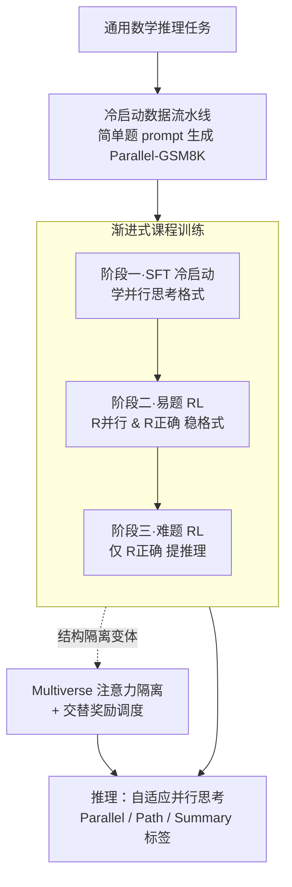

# Parallel-R1: Towards Parallel Thinking via Reinforcement Learning

**会议**: ICLR 2026  
**OpenReview**: [https://openreview.net/forum?id=wOmjeBN6hP](https://openreview.net/forum?id=wOmjeBN6hP)  
**代码**: 待开源（作者承诺整理后放出）  
**领域**: LLM推理 / 强化学习  
**关键词**: 并行思考、强化学习、课程训练、奖励设计、数学推理

## 一句话总结
Parallel-R1 提出第一个用强化学习（而非纯 SFT）在真实数学推理任务上注入「并行思考」能力的框架：用「简单题 prompt 生成冷启动数据 → SFT 学格式 → 易题 RL 稳格式 → 难题 RL 提性能」的渐进课程绕过冷启动难题，配合交替奖励，在 AIME/AMC/MATH 上比直接 RL 的顺序基线平均高 8.4%，并发现并行思考可作为「中期训练探索脚手架」带来高达 42.9% 的提升。

## 研究背景与动机
**领域现状**：并行思考（parallel thinking）指模型在推理时并发展开多条独立推理分支、再汇总成一个结论，Gemini 在 IMO 上的成功就部分归功于此。当前激活这种能力主要有两条路：推理期策略（self-consistency、ToT、MCTS 等）只在推断时临时生效、并不把能力「内化」进模型；训练期方法则几乎都靠对合成轨迹做监督微调（SFT）。

**现有痛点**：基于 SFT 的训练方法有三个硬伤——(i) 依赖昂贵的多阶段流水线把长 CoT 改写成并行轨迹；(ii) 除了推理变快之外很难带来真正的性能增益；(iii) 通过 teacher-forcing 模仿已知模式，而非自由探索，导致模型只会复刻固定套路、泛化能力很差。

**核心矛盾**：RL 本该是更可扩展、靠探索发现新推理行为的路线，但当前自回归 LLM 在预训练/SFT 阶段从未见过并行思考轨迹，根本无法原生产出这类样本——于是 RL 必须有一个「冷启动」阶段先播种这种能力，而冷启动需要大规模高质量并行数据，这对复杂真实问题极其稀缺且难以合成。这正是为什么此前 RL 做并行思考只能局限在 CountDown 这类狭窄合成任务上。此外，奖励怎么设也是开放问题：只给结果奖励会让模型走捷径绕过真正的并行思考，强行给结构奖励又会让模型在不必要时也硬塞并行。

**本文目标**：在通用数学推理任务上，用 RL 真正「教会」LLM 自适应的并行思考，并搞清楚这种能力在训练中如何演化、为何有用。

**切入角度**：作者的关键观察是——虽然轻量 prompt 在 DAPO 这类难题上几乎生成不出合规的并行轨迹（0%），但在 GSM8K 这类简单题上却高度有效（83.7%）。既然简单题的冷启动数据「白捡」，就可以用它先把格式学会，再靠 RL 把能力迁移到难题，从而彻底避开为难题合成数据。

**核心 idea**：用「易题播种格式 + RL 在难题上探索泛化」的渐进课程，把并行思考从合成任务推广到真实数学推理，并把并行思考当作 RL 的探索脚手架。

## 方法详解

### 整体框架
Parallel-R1 要解决的是「自回归 LLM 没见过并行思考、RL 无从冷启动」这个死结。整体思路是把学习拆成三件互不干扰的事——**学格式、稳行为、提推理**——并用一条由易到难的课程把它们串起来：先用一个轻量数据流水线在简单题上批量造出冷启动语料 Parallel-GSM8K，再做 SFT 让模型会写并行思考的特殊标签，然后在简单题上做一轮小规模 RL 把格式用稳，最后在通用难题上做大规模 RL 真正提升推理水平。训练完的模型在推理时能自适应地在「关键步骤」触发并行分支、汇总后继续主线。作者还探索了两个变体：不改架构的自回归版 **Parallel-R1-Seen**，和用 Multiverse 注意力掩码显式隔离各路径的 **Parallel-R1-Unseen**。

### 关键设计

**1. 轻量冷启动数据流水线：用简单题白捡高质量并行轨迹**

冷启动需要的「大规模高质量并行思考语料」对难题几乎不可得，而此前方法靠复杂的多阶段流水线把长 CoT 改写成并行轨迹——这种改写出来的轨迹本质是 teacher-induced 的模仿样本，违背了「让 RL 通过探索自己长出并行思考」的科学目标。作者的破局点来自一个对比实验：同样的 prompt 模板和采样设置下，DeepSeek-R1-0528-Qwen-3-8B 在 GSM8K 上有 **83.7%** 的样本能自然产出合规并行思考格式，而在更难的 DAPO 上是 **0.0%**。于是他们只在简单题上做文章：用该模型给 GSM8K 的 7,473 条训练样本配上详细 prompt，生成并行思考轨迹，抽出其中非思考部分作为 gold 标注，构成冷启动语料 **Parallel-GSM8K**。对需要严格格式的结构化变体，还额外加一道 Parallel Thinking Format Check（Algorithm 1）过滤。这条流水线的价值不在于「能做」，而在于它只用最便宜的简单题就解决了「RL 没有起点」的根本障碍。

**2. 渐进式课程训练：把学格式、稳行为、提推理拆成三段**

直接在难题上做 RL，模型既要从零发现并行思考行为、又要提升数学能力，优化目标过重而难以收敛。Parallel-R1 把训练拆成三个递进阶段。**冷启动阶段**：在 Parallel-GSM8K 上做 SFT，让模型具备产出正确并行思考格式的基本能力。**易题 RL**：由于特殊标签从未在预训练中出现、SFT 后行为并不稳定，再用 GRPO 在同一批 GSM8K 题上做小规模 RL 强化格式，奖励取 $R_{\text{final}} = R_{\langle\text{Parallel}\rangle}\,\&\,R_{\text{acc}}$——只有「输出含至少一个并行思考单元 **且** 最终答案正确」才给 +1，否则 -1，用这种严格的二值奖励逼模型把并行格式用稳。**难题 RL**：在 DAPO 上做大规模 RL，这一阶段只用准确率奖励 $R_{\text{acc}}$，因为目标已转为纯粹提升推理性能，产出主力变体 Parallel-Seen。消融显示，去掉易题 RL 平均掉 2.3%，去掉冷启动 SFT 则并行行为几乎不被激活、策略退化回顺序生成——三段缺一不可。

**3. 并行思考的形式化与控制标签：让模型自己决定何时分叉**

人在遇到「关键步骤」（confusion/uncertainty）时会同时探索多条候选路径。作者把这一过程形式化为两阶段循环：**Exploration**——模型识别到关键步骤时暂停主线，并发生成 $N$ 条独立推理分支；**Summary**——汇总所有分支、提炼各自独有洞见、化解冲突得到结论，再自动恢复主线并把结论注入。为落地，引入三组控制标签 `<Parallel>…</Parallel>`、`<Path>…</Path>`、`
…
`，分别对应探索阶段、各独立路径的隔离、以及汇总。推理时模型沿主线自回归生成，一旦预测出 `<Parallel>` 就暂停主线、在各 `<Path>` 块内并发生成多条线程，全部完成后自动合并成 `
`，再用汇总上下文恢复主线。与「开头就开多条、结尾才合并」或「固定间隔交换」的暴力并行不同，这里分叉与汇总的时机由推理进度本身决定，是真正自适应的。

**4. Multiverse 结构隔离与交替奖励：显式隔离路径并平衡并行率与性能**

自回归变体 Parallel-Seen 并不显式隔离各路径，训练时前向计算和反向梯度会跨路径互相干扰。结构化变体 Parallel-Unseen 借鉴 Multiverse，把归纳偏置直接写进注意力层：**注意力掩码**让 `<Path>` 块内的 token 只能看到自己这条路径和共享上下文，阻断兄弟路径间的信息泄漏；**共享位置编码**给每条路径分配一组互不相交的位置索引，使各并行路径能从相同位置开始解码而互不干扰；同时保留对共享 `
` 块的可见性以便跨路径整合。作者发现把 Seen 的课程直接套到结构化变体上无效（易题注意力掩码泛化不到难题），于是去掉阶段一 RL 并重设奖励：采用 **交替奖励（S2）**，在固定 $W=10$ 步窗口内，80% 的步用纯准确率奖励，20% 的步用分层奖励（含并行单元且答对 +1.2；不含并行但答对 +1.0；答错 -1.0）。这样既给并行思考一个「校准过的」激励，又不让它主导训练。消融印证了奖励设计的关键作用：纯准确率奖励并行率仅 13.6%，纯并行奖励并行率冲到 80.3% 却显著掉点，交替策略在 63.0% 并行率下取得最佳平衡。

### 损失函数 / 训练策略
RL 算法统一采用 GRPO（Group Relative Policy Optimization），rollout 走多轮交互框架，在「顺序生成 ↔ 并行探索 ↔ 顺序汇总」间交替。骨干为 Qwen-3-4B-Base，实现改自 VERL 官方 recipe，未做超参调优。冷启动 SFT：batch 128、lr 1e-5、weight decay 0.01、cosine 调度、warm-up 比例 0.1（Seen/Unseen 分别 58/230 步）。易题 RL：batch 1024、5 rollouts、lr 1e-6、35 步。难题 RL：DAPO 上 300 步、batch 512、8 rollouts、lr 1e-6。

## 实验关键数据

### 主实验
在 AIME25 / AIME24 / AMC23 用 Mean@16 与 Pass@16，MATH 用 Mean@1，骨干均为 Qwen-3-4B-Base。

| 方法 | 并行率 | AIME25 (Mean@16) | AIME24 (Mean@16) | AMC23 (Mean@16) | MATH | Avg. |
|------|--------|------|------|------|------|------|
| Qwen3-4B-Base | 0.0 | 5.5 | 10.0 | 39.3 | 54.0 | 27.2 |
| GRPO (DAPO) | 0.0 | 14.8 | 18.5 | 63.6 | 83.5 | 45.1 |
| GRPO + RL on GSM8K | 0.0 | 13.3 | 18.8 | 66.4 | 82.6 | 45.3 |
| **Parallel-R1-Seen** | 27.3 | **19.2** | 19.4 | 70.5 | **86.7** | **48.9** |
| Parallel-R1-Unseen (S1) | 13.6 | 17.7 | 18.3 | 69.7 | 82.6 | 47.1 |
| Parallel-R1-Unseen (S2) | 63.0 | 19.0 | 16.3 | 67.5 | 84.5 | 46.8 |

Parallel-R1-Seen 平均分 48.9，比最强 RL 顺序基线（45.1）高约 8.4%（相对），且在 AIME25/MATH 上都是最佳；自回归版整体优于显式改架构的 Multiverse 版，说明结构修改虽仍优于顺序基线、但会给 RL 训练带来负担。

### 消融实验

| 配置 | AIME25 | AIME24 | AMC23 | MATH | Avg. |
|------|--------|--------|-------|------|------|
| Parallel-R1-Seen（完整） | 19.2 | 19.4 | 70.5 | 86.7 | 48.9 |
| - 去掉易题 RL (w/o RL on GSM8K) | 17.9 | 19.0 | 65.0 | 84.5 | 46.6 |
| Parallel-R1-Unseen (S1) | 17.7 | 18.3 | 69.7 | 82.6 | 47.1 |
| - 给 Unseen 加易题 RL | 14.4 | 12.9 | 52.3 | 74.4 | 38.5 |
| - 去掉并行思考 prompt | 20.4 | 16.5 | 66.7 | 84.8 | 47.1 |

奖励消融（Unseen S2 下）：纯 Accuracy 并行率 13.6%、Avg 较高但并行行为几乎消失；纯 Parallel 并行率冲到 80.3% 却明显掉点；交替策略并行率 63.0%、AIME25 达 19.0，取得最佳平衡。

### 关键发现
- **自回归 vs 结构化训练 recipe 相反**：去掉易题 RL，自回归 Seen 平均掉 2.3%；但给结构化 Unseen 加同一段易题 RL 反而暴跌 8.6%（48.9→38.5 量级），因为易题上学到的注意力掩码泛化不到难题、过拟合到表面模式。两类变体需要不同的训练配方。
- **并行思考的角色会演化**：`<Parallel>` 块的相对位置随训练步数单调后移——早期把并行当作高方差的「计算探索」去发现解，后期推理能力变强后转为先用单条高置信路径求解、再用并行做「多视角验证」的风险规避策略。
- **中期探索脚手架（最大彩蛋）**：设计两阶段课程——Stage-1（0–200 步）用交替奖励猛推探索，Stage-2（200 步后）切回纯准确率奖励做利用。即便 Stage-2 里并行率持续下降，AIME25 准确率仍一路爬到 **25.6%**，比 GRPO 顺序基线高 **42.9%**。说明并行思考的收益不只来自显式结构，更来自它在探索期把策略推进到了一个更优的策略空间区域。
- **路径确有多样性**：并行块内各路径的两两 BLEU（0.0627）与语义余弦相似度（0.6083）均低，说明分支不是简单复制，而是真正不同的推理轨迹。

## 亮点与洞察
- **「难题没数据就别在难题上造数据」**：用 GSM8K 83.7% vs DAPO 0% 的悬殊对比，把冷启动彻底搬到简单题上、再靠 RL 迁移，是绕开「真实任务并行数据稀缺」最优雅的一招，可复用到任何「目标行为在难任务上难标注、但在易任务上易触发」的场景。
- **并行思考当「探索脚手架」是真正反直觉的洞见**：最终模型并行率下降、性能反而更高，意味着并行结构的价值部分是「过程性」的——它在训练中期把策略带到更好的区域后即可功成身退。这把并行思考从一种「推理结构」重新定义成一种「RL 探索机制」。
- **交替奖励窗口（80% 准确 / 20% 分层并行）**是平衡「结构 vs 性能」的实用 trick：把行为奖励限制在少数步内、并用 +1.2/+1.0/-1.0 的分层而非二值激励，避免模型为拿奖励无脑塞并行。
- **格式/行为/推理三件事分阶段学**的课程拆解，对任何「模型从未见过的新输出格式 + 还要靠 RL 提性能」的任务都有借鉴意义。

## 局限与展望
- 作者把「中期脚手架」明确称为 preliminary evidence，200 步切换点是经验选的、并非理论最优，机制解释（policy space 更优区域）仍是假设。
- 实验仅在 Qwen-3-4B-Base 单一骨干、纯数学推理（答案为数字）任务上验证；为避免评测 artifact 还过滤掉了含 LaTeX 的题目、max response length 限到 3000，迁移到代码、开放域、更大模型的效果只在附录有初步迹象。
- 结构化 Multiverse 变体训练开销显著更大（~6 天 vs Seen 的 ~3.5 天，8×40GB），因为要在每个 RL rollout 步在线构造 4D 注意力掩码；且整体性能还不如不改架构的自回归版，结构隔离的收益与代价尚不划算。
- 冷启动数据由单一教师模型（DeepSeek-R1-0528-Qwen-3-8B）生成，并行思考的「风格」可能被教师偏置带偏，作者也承认这是需要 RL 探索去突破的地方。

## 相关工作与启发
- **vs Multiverse（Yang et al., 2025b）**：Multiverse 主打「无损」把单条长 CoT 转成自适应并行形式、偏效率，离线预处理 4D 掩码；本文借用其注意力机制做 Unseen 变体，但核心主张是「用 RL 探索发现新推理行为」而非无损转换，且在线构造掩码。本文优势是能长出新行为、劣势是结构化变体训练更贵。
- **vs CountDown 上的 RL 并行（Pan et al., 2025）**：此前 RL 做并行思考只在 CountDown 这类合成任务上验证；本文是第一个把它推到通用数学推理的真实任务。
- **vs 测试期并行策略（ToT / MCTS / self-consistency / Group Think）**：那些方法靠手工启发式或外部验证器在推断时临时并行、不内化能力；本文通过训练把自适应分叉/汇总的时机「学」进模型权重。
- **vs RLVR 主线（DeepSeek-R1 等）**：标准 RLVR 无法直接注入并行思考（自回归模型本就不会产出此类轨迹），本文是把 RLVR 扩展到并行思考的第一项工作。

## 评分
- 新颖性: ⭐⭐⭐⭐⭐ 第一个在真实数学推理上用 RL 注入并行思考的框架，且「并行思考即探索脚手架」是真正新颖的视角。
- 实验充分度: ⭐⭐⭐⭐ 四个 benchmark + 多组消融 + 行为演化/多样性分析扎实，但限于单骨干单领域。
- 写作质量: ⭐⭐⭐⭐⭐ 动机推导清晰，把「为何 RL 难、如何冷启动、奖励怎么设」讲得有条理。
- 价值: ⭐⭐⭐⭐⭐ 渐进课程 + 交替奖励 + 探索脚手架三个 takeaway 都可迁移到更广的 RL 推理训练。

<!-- RELATED:START -->

## 相关论文

- [\[ACL 2026\] DPEPO: Diverse Parallel Exploration Policy Optimization for LLM-based Agents](../../ACL2026/reinforcement_learning/dpepo_diverse_parallel_exploration_policy_optimization_for_llm-based_agents.md)
- [\[ICLR 2026\] J1: Incentivizing Thinking in LLM-as-a-Judge via Reinforcement Learning](j1_incentivizing_thinking_in_llm-as-a-judge_via_reinforcement_learning.md)
- [\[NeurIPS 2025\] PARCO: Parallel AutoRegressive Models for Multi-Agent Combinatorial Optimization](../../NeurIPS2025/reinforcement_learning/parco_parallel_autoregressive_models_for_multi-agent_combinatorial_optimization.md)
- [\[ICLR 2026\] R1-Reward: Training Multimodal Reward Model Through Stable Reinforcement Learning](r1-reward_training_multimodal_reward_model_through_stable_reinforcement_learning.md)
- [\[ICLR 2026\] RM-R1: Reward Modeling as Reasoning](rm-r1_reward_modeling_as_reasoning.md)

<!-- RELATED:END -->
