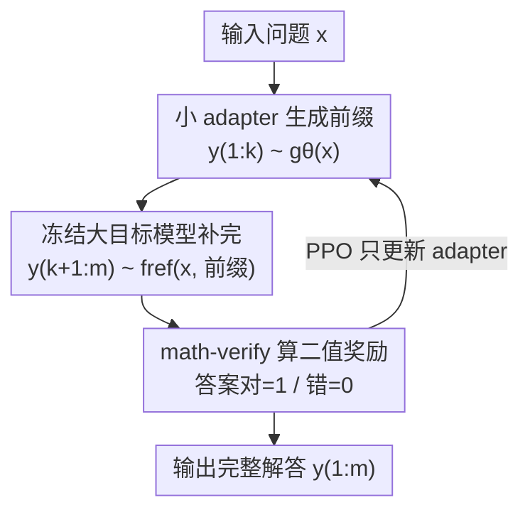

# Parameter-Efficient Reinforcement Learning using Prefix Optimization

**会议**: ICLR 2026  
**OpenReview**: [https://openreview.net/forum?id=SLhLUdlaqc](https://openreview.net/forum?id=SLhLUdlaqc)  
**代码**: https://github.com/ItamarRocha/Prefix-RL  
**领域**: LLM推理 / 强化学习 / 参数高效微调  
**关键词**: RLVR, 前缀优化, 数学推理, 参数高效, PPO

## 一句话总结
本文提出只优化回答的前 $k$ 个 token（前缀），把后续生成全部交给冻结的参考模型来完成，借此说明 RLVR 在数学推理上的相当一部分增益其实来自"挑了个更好的解题策略/格式"，并由此衍生出一个极省算力的参数高效 RL 方法 Prefix-RL：用一个 1B 小 adapter 生成前缀去引导 7B~72B 大模型，仅训练 adapter 就能在 MATH-500 上把 Qwen-7B 从 67.4% 提到 74.4%。

## 研究背景与动机

**领域现状**：RLVR（Reinforcement Learning with Verifiable Rewards）是当下提升大模型数学推理能力的主流手段——给模型一道题，让它生成解答，再用一个可验证的奖励（答案对/错的二值信号）做 PPO 之类的策略梯度微调。各家的 reasoning 模型大多都靠这套流程拿到了 benchmark 上的提升。

**现有痛点**：但有一个长期含糊的问题没人说清——RLVR 的提升到底是因为模型"真的变会推理了"（算术更准、证明步骤执行更好、数学事实记得更牢），还是仅仅因为 RL 把输出分布往那些"本来就在预训练分布里、恰好准确率更高的解答格式/策略"上挪了一挪？近期工作（Zhao et al. 2025；Yue et al. 2025）已经观察到，从零预训练的模型经过 RL 后会把输出集中到某些特定的生成格式上，暗示后者的成分不小。

**核心矛盾**：如果增益主要来自"上调已有好策略的权重"，而非"教会新推理技能"，那么为了这点提升去做全模型 RL 微调就太奢侈了——全模型 RL 既要做推理 rollout、又要反向传播穿过整个大模型，算力随模型规模线性增长，对 70B 级模型而言往往超出常规预算。

**本文目标**：(1) 设计一个能把"策略上调"成分单独隔离出来的实验，量化它在 RL 增益里占多少；(2) 把这个洞察转化成一个真正省算力、参数高效的 RL 替代方案。

**切入角度**：解答的"解题策略和格式"几乎完全由开头的前几个 token 决定——比如以 `## Step 1: To...` 开头就意味着要走分步推理。所以只要只改前 $k$ 个 token、其余全由参考模型补完，就能把"换策略"和"提升推理"两种来源干净地分开：因为绝大多数 token 都出自冻结的参考模型，任何提升都只能归因于"换了个更好的开头"。

**核心 idea**：用"只优化前缀"代替"优化整条序列"，既当作诊断 RL 增益来源的探针，又当作一个把训练成本从大模型解耦出去的参数高效 RL 方法。

## 方法详解

### 整体框架
本文把"优化整条回答"收窄成"只优化回答的前 $k$ 个 token"。形式化地：输入问题 $x_1,\dots,x_n$，用某个模型 $g_\theta$ 生成前缀 $y_1,\dots,y_k \sim g_\theta(x)$，再让冻结的参考模型 $f_{\text{ref}}$ 在给定输入和前缀的条件下补完剩余 $y_{k+1},\dots,y_m \sim f_{\text{ref}}(x, y_{1:k})$，最后对整条 $y_{1:m}$ 算可验证奖励 $r(\cdot)$（答案对为 1、错为 0）。

围绕"怎么得到前缀"，作者给了两条路线：一条是 **Prefix Clustering（前缀聚类）**——完全不训练，从参考模型采样一堆前缀、聚类、挑一个在训练集上奖励最高的"全局固定前缀"，对所有题都用同一个开头；另一条是 **Prefix-RL**——用一个轻量 adapter 模型按输入条件地生成前缀，并用 PPO 只训练这个 adapter，大目标模型全程冻结、只跑推理。后者是本文真正主推的参数高效方法，pipeline 清晰，如下图：

### 关键设计

**1. 前缀优化设定：用"只改前 k 个 token"把 RL 增益的来源拆开**

这是全文的方法论基石，针对的是"RL 增益究竟来自换策略还是真推理"这一含糊问题。作者把可优化范围严格限制在前 $k$ 个 token（主结果用 $k\in\{32,64\}$），其余 $y_{k+1:m}$ 全部从冻结的参考模型 $f_{\text{ref}}$ 采样。由于参考模型权重一动不动、只负责补 token，整个流程里任何准确率变化都不可能来自"教会 backbone 新的 token 级技能"，只能来自"怎么起这个头"。换句话说，这个设定天然隔离了"上调参考分布里已有好策略"这一成分。实验（Llama-1B 自我前缀优化 vs 全序列 RL）显示：全序列 RL 最终最高，但只优化前缀就已经能把准确率拉起来一大截，说明 RL 的相当一部分好处确实是"把模型引导到更有效的回答格式"而非"增强推理能力"。

**2. Prefix Clustering：一个 0 训练的固定前缀诊断基线**

这一设计回答"是否存在某个固定开头就能搬动准确率"。做法极简：对训练集 $D$ 里每道题从参考模型采一个输出，取所有输出长度为 $k$（实测用 $k{=}16$）的前缀，用 k-means 聚成 $c$ 个簇（簇数由肘部法则 elbow method 自动选，通常 5~6 个），得到候选前缀 $\{(y^{(1)}_{1:k}),\dots,(y^{(c)}_{1:k})\}$，再选训练集上奖励最高的那个：

$$i_{\max} = \arg\max_i\ \mathbb{E}_{x\sim D}\big[\,r\big(f_{\text{ref}}(x_1,\dots,x_n, y^{(i)}_{1},\dots,y^{(i)}_{k})\big)\,\big]$$

然后把这个**与输入无关**的固定前缀 $y^{(i_{\max})}_{1:k}$ 拼在所有测试题前面。它的价值不是当实用方法，而是当"格式上调"效应的探针：在 Llama 家族上，一个固定的 step-by-step 开头就能带来可观提升（如 Llama-8B 在 AMC23 上 +13.1、Llama-70B-FP8 在 AIME 上 +15.2），说明这些模型只要被引导进显式分步格式就能受益；但在 Qwen 上它常常严重掉点（Qwen-7B 在 MATH-500 上 −8.0），因为 Qwen 偏好的开头更依赖具体输入。这种脆性正好反衬出需要"按输入条件生成前缀"的 Prefix-RL。

**3. Prefix-RL：把训练成本从大模型解耦到小 adapter 上**

这是本文的主方法，直接对应痛点"全模型 RL 算力随 backbone 规模线性增长"。它用一个约 1B 参数的小 adapter $g_\theta$ 来生成前缀，引导一个大得多的目标模型 $f_{\text{ref}}$ 完成解答；rollout 时先 $y_{1:k}\sim g_\theta(x)$、再 $y_{k+1:m}\sim f_{\text{ref}}(x,y_{1:k})$，用 PPO 针对整条奖励 $r(y_{1:m})$ 只优化 $g_\theta$，目标模型全程冻结、只需要推理访问。关键收益在于：参数高效微调里 LoRA/QLoRA 虽然只更新少量参数，但 RL 时梯度仍要反传穿过整个目标网络，训练 FLOPs 还是随 backbone 规模走；而 Prefix-RL 的反传只发生在独立的小 adapter 上，**训练算力与目标模型规模解耦**。Table 2 给出对比：标准 RL 训练计算约 $C_{\text{train}}N_t R T$，Prefix-RL 仅 $C_{\text{train}}N_a R k$（$N_t,N_a$ 为目标/adapter 参数量，$R$ 为 rollout 数，$T,k$ 为 token 数）——adapter 小、前缀短，省得很。实践上甚至能用 8 张 GPU（4 训 adapter + 4 服务目标）微调 70B 模型，而标准 RLHF 同配置通常要 32 张，约 4× 的 GPU 节省。它还顺带带来两个不改权重的好处：避免灾难性遗忘/对齐税/语言漂移，且不同任务可挂不同 adapter 互不干扰，甚至能套在只有 API 推理访问的闭源模型上。

> 一个重要约束：adapter 与目标模型必须**同家族**（如 Qwen-1.5B adapter 配 Qwen-7B 目标）。作者观察到跨家族（如 Qwen adapter 配 Llama 目标）会明显掉点，推测是因为有效引导依赖共享的回答模式。

### 损失函数 / 训练策略
用 OpenRLHF 流水线 + PPO（Schulman et al. 2017），KL 惩罚系数 $\beta=0.001$、熵奖励 $\alpha=-0.001$、默认不加权重衰减；rollout 温度 0.7（vLLM），训练/rollout batch 均 512，每题采 8 个回答（即每个 rollout step 做 8 次梯度更新）；actor/critic 学习率分别 5e-7 / 9e-6。奖励是 math-verify 给出的二值正确性。adapter 用 Llama-3.1-1B-Instruct 或 Qwen2.5-1.5B，目标用 Llama-3.1-8B/70B-FP8、Qwen2.5-7B/72B；每个实验 4×H100，训 10 个 episode（Llama adapter 约 140 步、Qwen adapter 约 170 步）。

## 实验关键数据

### 主实验
在四个数学推理 benchmark（MATH-500 / AIME / AMC23 / Minerva）上对比各目标模型微调前后（节选，括号内为相对基线增量）：

| 目标模型 | 方法 | MATH-500 | AIME | AMC23 | Minerva |
|----------|------|----------|------|-------|---------|
| Qwen-7B | 基线 | 67.4 | 23.0 | 40.3 | 19.1 |
| Qwen-7B | +Prefix-RL (k=32) | 74.4 (+7.0) | 25.8 (+2.8) | 50.0 (+9.7) | 22.4 (+3.3) |
| Qwen-7B | +Prefix Clustering (k=16) | 59.4 (−8.0) | 24.4 (+1.4) | 42.2 (+1.9) | 29.4 (+10.3) |
| Qwen-7B | +LoRA | 70.2 (+2.8) | 24.4 (+1.4) | 36.2 (−4.0) | 20.9 (+1.8) |
| Qwen-7B | +Prefix-Tuning (SFT) | 45.4 (−22.0) | 4.93 (−18.07) | 20.62 (−19.68) | 13.97 (−5.13) |
| Llama-70B-FP8 | +Prefix-RL (k=32) | 67.8 (+5.8) | 49.1 (+16.3) | 46.2 (+1.2) | 34.6 (+5.5) |
| Qwen-72B | +Prefix-RL (k=32) | 84.0 (+2.0) | 40.6 (−0.5) | 66.6 (+9.7) | 29.0 (+5.9) |

对 Qwen-7B，作者还把 Prefix-RL 的 74% 与 SimpleRL 报告的全模型 RL 78% 对比（同在 MATH-500）：全 RL 涨 10 点、Prefix-RL 以远低成本拿到 7 点，恢复了大部分增益。

### 消融与分析

| 配置 | 关键现象 | 说明 |
|------|---------|------|
| Prefix Clustering | 时好时坏 | Llama 家族大涨、Qwen 上严重掉点，仅作诊断探针 |
| LoRA (RL) | 小幅提升但不稳 | MATH +2.8，但 AMC23 −4.0，且需反传穿全 7B |
| Prefix-Tuning (SFT) | 大幅崩坏 | MATH-500 −22.0，连续向量 SFT 不适配该任务 |
| 前缀长度 $k$ 扫描 | $k\geq4$ 稳健 | $k{=}1$ 在 OOD 上掉点（AIME −1.0），$k\in\{4{-}64\}$ 一致提升，$k{=}32$ 通用 |
| 4 随机种子 | 统计稳健 | 每个种子都超基线，效应量是标准差的 2~25× |
| OOD 物理 (OCW/UGPhysics) | 可迁移 | 仅用 MATH 训的前缀在物理题上也提升，$k\approx8{-}32$ 最强 |

### 关键发现
- **格式上调是 RL 增益的重要来源**：只优化前缀就能拿到全序列 RL 增益的一大部分（Qwen-7B 上 7/10 点），证明 RL 不少好处来自"选对解题策略"而非"提升推理"。
- **Prefix-RL 比同类参数高效基线更好更稳**：LoRA 和 Prefix-Tuning(SFT) 要么提升微弱要么崩坏，且训练成本与全 RL 同量级（要反传穿全 backbone）；Prefix-RL 只更新 1.5B adapter 却增益更大更一致。
- **在量化 FP8 目标上增益最大**：Llama-70B-FP8 在 AIME 上 +16.3，且把量化模型与全精度模型在 MATH-500 上 5% 的差距收窄到约 1%——这是首次用小 adapter 的 RL 去引导冻结 FP8 量化模型。
- **$k{=}1$ 太短会脆**：单 token 不足以编码完整策略，OOD 上甚至掉点；$k\geq4$ 才稳。

## 亮点与洞察
- **把"诊断探针"和"实用方法"合二为一**：同一个"只改前缀"的设定，先用来科学地隔离 RL 增益来源，再顺势变成省算力的参数高效 RL，论证和方法相互印证，很优雅。
- **训练成本与目标规模解耦**这一点很实在：LoRA 这类方法在 RL 下其实没省到训练 FLOPs（仍要反传穿全模型），Prefix-RL 把反传彻底挪到小 adapter 上，才真正让"8 卡微调 70B"成为可能。
- **冻结目标模型带来的副作用全是好的**：不改权重 → 无灾难性遗忘/对齐税/语言漂移，多任务可挂不同 adapter，甚至能套在闭源 API 模型上做用户专属 RL，这条路线想象空间很大。
- **量化模型可被 RL 引导**这个结论意外且实用：FP8 模型权重没法直接做梯度更新，但用一个全精度小 adapter 在外面引导，就把量化模型也纳入了 RL 可优化的范畴。

## 局限与展望
- 作者明确不主张 Prefix-RL 能追平全模型 RL，它是"用性能换算力"的折中；而且受预算所限，无法在 70B 上做 Prefix-RL 与全 RL 的并排对比。
- 只研究 RLVR 下的单遍生成，没覆盖会回溯/修订/分支的多遍反思式求解——那种场景里后期反思可能推翻早期前缀设定的计划，本文框架捕捉不到。
- adapter 与目标必须同家族，跨家族会掉点；作者寄望于"大模型多有行为相近的蒸馏变体"来缓解这一约束。
- 自己的观察：所有实验都集中在数学（+少量物理 OOD），奖励是干净的二值可验证信号；对于奖励稀疏/不可验证、或解题策略不那么被开头决定的任务（如开放式写作、多轮 agent），"前缀决定策略"的前提是否成立尚待验证。

## 相关工作与启发
- **vs Prefix-Tuning (Li & Liang 2021)**：同叫"前缀"，但 Prefix-Tuning 是通过监督训练优化拼在输入前的**连续 embedding 向量**；本文优化的是**回答（answer）的离散 token 前缀**，且用可验证奖励的 RL 直接优化解题策略，实验里 SFT 版 Prefix-Tuning 在该任务上大幅崩坏。
- **vs LoRA/QLoRA 等参数高效微调**：它们只更新插入的小模块，但 RL 时梯度仍反传穿整个目标网络，训练 FLOPs 随 backbone 规模走；Prefix-RL 把更新限制在独立小 adapter，训练成本与目标规模解耦。
- **vs IPA（Inference-Time Policy Adapters, Lu et al. 2023）**：同样冻结 backbone，但 IPA 在每一步 rescale logits、推理成本随序列长度增长，且面向风格/毒性控制；Prefix-RL 只在开头干预一次，测试时严格更便宜，且专注可验证奖励的数学推理。
- **vs 可控生成（PPLM/GeDi/DExperts）与 prompt 优化（RLPrompt/Retroformer）**：前者每个 token 都要留在解码回路里增加延迟，后者优化输入 prompt（跨域脆弱）；Prefix-RL 在 backbone 开始解码前就定好前缀，续写以冻结模型原速进行，且优化的是更贴任务解空间的答案前缀。

## 评分
- 新颖性: ⭐⭐⭐⭐ 用"只优化前缀"同时当诊断探针和参数高效方法，且首次 RL 引导冻结 FP8 量化模型，角度新巧。
- 实验充分度: ⭐⭐⭐⭐ 覆盖 2 家族 4 规模、4 数学 benchmark + OOD 物理、$k$ 扫描与 4 种子稳健性，较扎实；缺 70B 上 Prefix-RL vs 全 RL 的并排对比。
- 写作质量: ⭐⭐⭐⭐ 动机—方法—结论一线贯通，公式与算力分析清晰。
- 价值: ⭐⭐⭐⭐ 既加深了"RL 增益来自格式上调"的理解，又给出资源受限下可落地的省算力 RL 替代方案。

<!-- RELATED:START -->

## 相关论文

- [\[ICLR 2026\] PROS: Towards Compute-Efficient RLVR via Rollout Prefix Reuse](pros_towards_compute-efficient_rlvr_via_rollout_prefix_reuse.md)
- [\[ICLR 2026\] QuRL: Low-Precision Reinforcement Learning for Efficient Reasoning](qurl_low-precision_reinforcement_learning_for_efficient_reasoning.md)
- [\[ICLR 2026\] Efficient Morphology-Control Co-Design via Stackelberg Proximal Policy Optimization](efficient_morphology-control_co-design_via_stackelberg_proximal_policy_optimizat.md)
- [\[ICLR 2026\] Solving Parameter-Robust Avoid Problems with Unknown Feasibility using Reinforcement Learning](solving_parameter-robust_avoid_problems_with_unknown_feasibility_using_reinforce.md)
- [\[ICLR 2026\] PolicyFlow: Policy Optimization with Continuous Normalizing Flow in Reinforcement Learning](policyflow_policy_optimization_with_continuous_normalizing_flow_in_reinforcement.md)

<!-- RELATED:END -->
