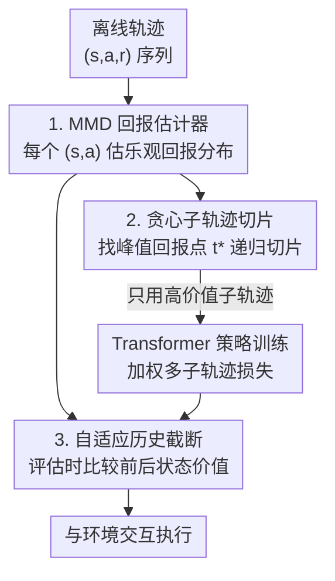

# Peak-Return Greedy Slicing: Subtrajectory Selection for Transformer-based Offline RL

**会议**: ICLR 2026  
**OpenReview**: [https://openreview.net/forum?id=7vpehpWnnY](https://openreview.net/forum?id=7vpehpWnnY)  
**代码**: https://github.com/deligentfool/PRGS  
**领域**: 强化学习 / 离线RL  
**关键词**: 离线强化学习, Decision Transformer, 子轨迹选择, 拼接能力, MMD回报估计

## 一句话总结
PRGS 给 Transformer 类离线 RL 加了一个"在时间步级别挑好片段"的前处理：先用 MMD 回报估计器给每个状态-动作对算出乐观的未来回报分布，再贪心地把每条轨迹切成"峰值回报子轨迹"用于训练，评估时再自适应地截断历史，使其在 D4RL / BabyAI / AuctionNet 等多个基准上平均提升 15.8%。

## 研究背景与动机
**领域现状**：离线 RL 只从固定数据集学策略、不与环境交互，特别适合自动驾驶、机器人、推荐这类交互昂贵或危险的场景。近年把轨迹当作 token 序列、用 Transformer 建模的做法（Decision Transformer、Trajectory Transformer 等）凭借强大的长程依赖建模能力成为主流新范式。

**现有痛点**：这类方法几乎都是"条件于整条轨迹的最终回报"来学习——把整条 $\tau=\{(s_t,a_t,r_t)\}$ 喂进去，用 return-to-go 当条件信号。但数据集里轨迹质量参差不齐：一条整体结局很差的轨迹里，往往仍然藏着局部高价值的片段。以轨迹为单位的粗粒度处理无法把不同轨迹里的优质片段"拼接"（stitching）起来，结果是学出来的策略很难超过数据集里任何单条轨迹。

**核心矛盾**：拼接能力的瓶颈在"粒度"。已有的轨迹重采样、价值引导、条件建模等改进仍停留在**轨迹级**或隐式 latent 表示上，没有一个机制能在**时间步级别**显式地把一条轨迹切成"好子轨迹"和"坏子轨迹"。难点在于：在一条轨迹内部找到合适的切分点本身就很难。

**切入角度**：作者从人类决策的方式出发——人不会只看一段经历的最终结果好坏，而是会区分长经历里哪些片段有价值、哪些没价值，然后保留好的片段、丢掉坏的，并把好片段重新组合成新经验。这正是 Transformer 离线 RL 缺失的能力。

**核心 idea**：用一个乐观的回报估计器找到每条轨迹里"回报峰值"所在的时间步当切分点，贪心地把轨迹递归切成多个子轨迹，只用高价值子轨迹训练，从而在时间步粒度上实现显式的子轨迹选择与拼接。

## 方法详解

### 整体框架
PRGS 是一个可以即插即用地套在现有 Transformer 离线 RL 算法（BC、DT、PDiT 等）上的训练框架，由三个紧密衔接的模块组成：训练前用 **MMD 回报估计器**给每个 $(s_t,a_t)$ 估一个乐观的未来回报分布；训练时用**贪心子轨迹切片**把整条轨迹按"峰值回报"递归切成若干子轨迹、只学高价值片段；评估时用**自适应历史截断**动态决定保留还是丢弃历史，使推理过程和训练时的"从中间状态起步"保持一致。三个模块共享同一个回报估计器：切片靠它定切分点，评估截断也靠它比较前后状态的价值。

### 关键设计

**1. MMD 回报估计器：在单个状态-动作对粒度上给出乐观回报分布**

要在时间步级别比较"哪一段更值钱"，先得有一个细粒度、且能反映"潜力"的价值信号。传统做法要么用整条轨迹的 return-to-go（受无关历史影响），要么用期望值的标量价值函数（丢掉了同一个 $(s,a)$ 可能导致多种未来回报的不确定性）。作者改用**最大均值差异（MMD）**来非参数地拟合回报分布：MMD 在再生核希尔伯特空间里度量两个分布的距离，$\mathrm{MMD}^2(X,Y)=\mathbb{E}_{x,x'}[k(x,x')]+\mathbb{E}_{y,y'}[k(y,y')]-2\mathbb{E}_{x,y}[k(x,y)]$。估计器 $Z_\psi(s_t,a_t)=\{z_1,\dots,z_N\}$ 直接输出 $N$ 个标量粒子来近似回报分布，而不是单一期望值。训练时最小化预测分布和 TD 目标分布 $Z_{\text{target}}=r_t+\gamma Z_{\psi^-}(s_{t+1},a_{t+1})$ 之间的 MMD 损失（核函数取 $k(x,y)=-\lVert x-y\rVert^2$，$\psi^-$ 是延迟更新的目标网络）。关键在于它只看当前 $(s,a)$、不依赖整条历史，因此能更纯粹地刻画该状态-动作对的内在价值，为后续切片提供可靠信号。

**2. 贪心子轨迹切片：用对齐到起点的峰值回报递归切分轨迹**

有了分布估计，还要把它变成"在哪切"的决策。这一模块分估计、切片、训练三步。**估计**：把每个时间步的 $N$ 个粒子降序排列，取前 $n$ 个的均值作为乐观价值 $\tilde{Q}^{(n)}_t(s_t,a_t)=\frac{1}{n}\sum_{i=1}^{n}z_{t,(i)}$——$n$ 越小越乐观（接近上分位数），$n$ 越大越保守，从而避免个别糟糕实现拖低整段的评估。为了让不同时间步可比，再把它对齐到轨迹起点视角，加上 $t$ 之前已实现的累计回报：$\hat{R}^t_0=\sum_{i=0}^{t-1}\gamma^i r_i+\tilde{Q}^{(n)}_t$，含义是"沿观测轨迹走到第 $t$ 步、再在 $s_t$ 执行 $a_t$ 时，能拿到的乐观总回报"。**切片**：找出使 $\hat{R}^t_0$ 最大的时间步 $t^*=\arg\max_t \hat{R}^t_0$ 当作切分点，因为 $t^*$ 之后的任何片段都只会拉低这个估计，所以 $\tau_{0:t^*}$ 就是这条轨迹里近似最优的子轨迹。**训练**：只保留 $\tau_{0:t^*}$ 内的时间步算损失、其余 mask 掉，剩下的 $\tau_{t^*+1:K}$ 再用同样的贪心策略递归切分，直到覆盖所有时间步。整条轨迹最终被切成 $M$ 个不相交子轨迹，总损失按递归顺序加权 $L_{\text{total}}=\sum_{m=1}^{M}\lambda^{m-1}L_m$，越靠后的子轨迹权重越低（$\lambda\in[0,1]$，$\lambda=0$ 时只学第一段，$\lambda=1$ 时所有段等权），既让模型聚焦高价值的 $\hat{R}_0$ 片段，又保证每个时间步都参与训练。

**3. 自适应历史截断：让评估时的历史长度和训练时的"从中间起步"对齐**

训练时模型学的是"从某个中间状态起步的子轨迹"，每个子轨迹的初始状态都很关键、而它前面的历史并没有显式进入训练。如果评估时无条件地保留全部历史，就会造成训练-评估不一致，反而拖累性能。为此 PRGS 在评估的每一步 $t\ge1$ 都用回报估计器算当前状态的乐观价值 $V_t(s_t)=\tilde{Q}^{(n)}_{t-1}(s_{t-1},a_{t-1})$，并和上一步比较 $\Delta V_t=V_t(s_t)-V_{t-1}(s_{t-1})$。若 $\Delta V_t>0$，说明当前状态比上一状态更有潜力、之前的历史已不再提供有用信息，于是丢弃历史、只把当前状态当作新起点；否则继续累积历史。即 $H_t=\{s_t\}$ 当 $\Delta V_t>0$，否则 $H_t=H_{t-1}\cup\{s_t\}$。这样评估阶段也能像训练时那样动态地从中间状态重置历史，消除无关或低质量历史对当前决策的干扰。

### 损失函数 / 训练策略
回报估计器用 MMD 损失 $L_{\text{MMD}}$ 拟合 TD 目标分布；策略在每个被选中的子轨迹上沿用 Transformer 离线 RL 的统一自回归目标 $L_1(\theta)=-\mathbb{E}_\tau\sum_{t=0}^{t^*}\log\pi_\theta(a_t\mid\tau_{0:t^*})$（连续动作等价于 MSE、离散动作等价于交叉熵），整条轨迹的总损失为各子轨迹损失的几何衰减加权和 $L_{\text{total}}=\sum_{m=1}^{M}\lambda^{m-1}L_m$。关键超参是粒子取顶端数 $n$（控制乐观程度）和权重系数 $\lambda$。

## 实验关键数据

### 主实验
PRGS 被即插即用地接到 BC、DT、PDiT 三类 Transformer 离线 RL 上（记作 X-PRGS），在 D4RL（Gym/Adroit/Kitchen/Maze2D/AntMaze）、BabyAI、AuctionNet 上评估，覆盖连续和离散动作空间。整体平均提升约 15.8%。

| 数据集（域均值） | DT | DT-PRGS | 提升 |
|--------|------|---------|------|
| D4RL Gym | 75.3 | 82.9 | ↑7.6 |
| Adroit | 30.9 | 35.2 | ↑4.3 |
| Kitchen | 50.1 | 65.5 | ↑15.4 |
| Maze2D | 40.9 | 100.1 | ↑59.2 |
| AntMaze | 33.4 | 48.7 | ↑15.3 |

在最需要拼接和长程规划的 Maze2D 上提升最猛：DT-PRGS 在 maze2d-large 上拿到 127.5，超过所有对比方法。与专门强调拼接能力的 QDT、EDT、CGDT 相比（Gym medium/medium-replay），PRGS 平均 72.1、比 vanilla DT 提升 10.9 点，在噪声大、需要跨轨迹重组的 medium-replay 任务上尤为突出（hopper-medium-replay 98.1、walker2d-medium-replay 81.1 均居首）。

### 消融实验

| 配置 | 关键现象 | 说明 |
|------|---------|------|
| 粒子数 $n$ 太小 | 性能次优 | MMD 估计器易出离群估计、损害精度 |
| 粒子数 $n$ 太大 | 性能退化 | 退化成普通价值估计、丢失乐观偏置 |
| w/o AHT | 明显掉点 | 去掉自适应历史截断，训练-评估失配 |
| Top 10% / 20% 轨迹过滤 | 不一定优于原算法（BC 上尤其明显） | 证明增益来自时间步级切分而非简单筛轨迹 |

### 关键发现
- **乐观程度要适中**：$n$ 是控制乐观偏置的旋钮，太小被离群粒子带偏、太大退化成保守期望估计，存在一个甜点区间。
- **自适应历史截断不可省**：PRGS w/o AHT 明显掉点，说明训练时"从中间状态起步"和评估时的历史长度必须对齐，否则增益被失配吃掉。
- **赢在粒度而非筛选**：在 Maze2D 上只保留 Top 10%/20% 高质量整轨训练并不能稳定超过原算法（BC 上甚至更差），而 PRGS 在 BC/DT/PDiT 三个底座上都稳定超过这些筛选策略，验证增益来自时间步级的显式子轨迹切分。
- **可视化佐证**：maze2d-medium 上，$\tilde{Q}$ 估计的整体趋势与 return-to-go 一致，但在远离目标的区域能额外区分价值变化；PRGS 选出的第一个子轨迹总是包含高价值区域、丢弃偏离目标的低质量片段。

## 亮点与洞察
- **"峰值回报"当切分点的直觉很干净**：把每个时间步的乐观回报对齐到统一起点视角 $\hat{R}^t_0$，峰值之后只会拉低估计，所以峰值点天然就是"再往后就不划算"的最优截断处——一个简单的 argmax 就把"在哪切"说清楚了。
- **用 MMD 粒子 + Top-$n$ 均值实现可调乐观度**：把分布式价值估计和"取上分位数"结合，用一个 $n$ 就在乐观和保守之间连续滑动，比固定分位数回归更灵活。
- **训练-评估一致性被当成一等公民**：很多序列建模方法忽略"训练切片、评估却看全历史"的隐性失配，PRGS 用同一个估计器在评估时复刻训练时的历史重置逻辑，思路可迁移到其他需要变长上下文的序列决策方法。
- **即插即用**：不改 Transformer 主干、只改训练样本的组织方式，能直接套在 BC/DT/PDiT 上，工程上很友好。

## 局限与展望
- **依赖回报估计器质量**：整个切片和评估截断都建立在 MMD 估计器之上，估计器若不准（粒子离群、分布拟合差）会直接影响切分点和历史决策；AntMaze 的 medium/large-diverse 等难任务上 PRGS 增益就很小甚至为负（PDiT-PRGS 在 AntMaze 均值 ↓1.6）。
- **只适用 Transformer 序列建模范式**：作者明确指出推广到非 Transformer 方法是未来方向，当前框架与 token 化的自回归损失绑定。
- **超参敏感**：$n$ 和 $\lambda$ 都需要按任务调，$n$ 的甜点区间随数据集变化，缺少自动选取机制。
- **贪心切分的局部最优风险**：每次取当前峰值递归切分是贪心策略，不保证全局最优的子轨迹划分，复杂长程任务里可能错过更好的组合。

## 相关工作与启发
- **vs DT / Trajectory Transformer**：它们条件于整条轨迹的最终回报、轨迹级处理；PRGS 在时间步级显式切出高价值子轨迹再训练，赢在"拼接"所需的细粒度。
- **vs EDT**：EDT 在评估时估计过去观测的价值、自适应决定有效上下文长度；PRGS 不仅评估时截断历史，更在训练时就把轨迹切成子轨迹，训练和评估两端都做了对齐。
- **vs QDT / CGDT 等价值引导序列建模**：它们把价值估计融进序列建模引导片段组合，但仍偏轨迹级或隐式；PRGS 给出一个可解释的"找切分点 + 直接选子轨迹"机制，且兼容多种 Transformer 离线 RL 底座。
- **vs CQL / IQL 等经典离线 RL**：经典方法靠策略约束或保守价值正则压制 OOD 动作；PRGS 不碰价值优化目标，纯从"训练数据怎么切"入手提升拼接能力。

## 评分
- 新颖性: ⭐⭐⭐⭐ 时间步级"峰值回报切片 + MMD 乐观估计 + 评估历史截断"的组合是新颖且自洽的视角。
- 实验充分度: ⭐⭐⭐⭐ 覆盖 D4RL/BabyAI/AuctionNet 多域、三类底座，消融区分了"切粒度 vs 筛轨迹"，但难任务上增益不稳。
- 写作质量: ⭐⭐⭐⭐ 三模块叙事清晰、图示到位，公式和动机对应明确。
- 价值: ⭐⭐⭐⭐ 即插即用、平均提升 15.8%，对 Transformer 离线 RL 的拼接瓶颈给出了实用解法。

<!-- RELATED:START -->

## 相关论文

- [\[ICLR 2026\] Recurrent Action Transformer with Memory](recurrent_action_transformer_with_memory.md)
- [\[ICLR 2026\] The State of Reinforcement Finetuning for Transformer-based Agents](the_state_of_reinforcement_finetuning_for_transformer-based_agents.md)
- [\[ICLR 2026\] ReFORM: Reflected Flows for On-support Offline RL via Noise Manipulation](reform_reflected_flows_for_on-support_offline_rl_via_noise_manipulation.md)
- [\[ICLR 2026\] Less is More: Clustered Cross-Covariance Control for Offline RL](less_is_more_clustered_cross-covariance_control_for_offline_rl.md)
- [\[ICLR 2026\] STAIRS-Former: Spatio-Temporal Attention with Interleaved Recursive Structure Transformer for Offline Multi-Task Multi-Agent Reinforcement Learning](stairs-former_spatio-temporal_attention_with_interleaved_recursive_structure_tra.md)

<!-- RELATED:END -->
