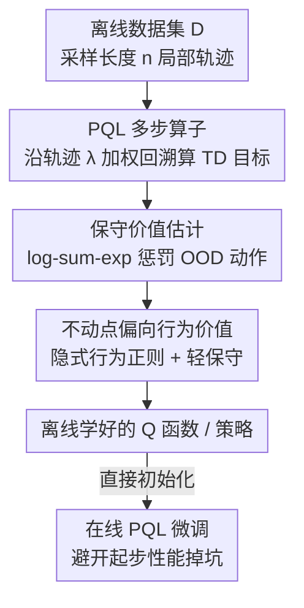

# Peng's Q($\lambda$) for Conservative Value Estimation in Offline Reinforcement Learning

**会议**: ICLR 2026  
**OpenReview**: [https://openreview.net/forum?id=Ml4AtrrfQT](https://openreview.net/forum?id=Ml4AtrrfQT)  
**代码**: https://github.com/oh-lab/CPQL  
**领域**: 强化学习 / 离线RL  
**关键词**: 离线强化学习, 多步算子, 保守价值估计, Peng's Q(λ), 离线到在线

## 一句话总结
CPQL 把在线 RL 里的多步算子 Peng's Q($\lambda$) 首次搬进离线 RL，用它替换 CQL 里的单步 Bellman 算子做保守价值估计，靠"PQL 不动点天然贴近行为策略价值"这一性质缓解过度悲观，在 D4RL 上稳定超过一众单步基线，并能无缝迁移到离线到在线微调。

## 研究背景与动机
**领域现状**：离线 RL 要从一份固定数据集里学策略而不再和环境交互，主流做法是给价值函数加保守性约束。CQL 是代表作，它对学习策略诱导出的分布外（OOD）动作惩罚 Q 值，把没见过的动作压低。后续一大批工作（MCQ、CSVE、EPQ 等）在 CQL 基础上修补它"过度悲观"的毛病。

**现有痛点**：这些改进几乎都靠**外挂额外组件**——要么估计未知的行为策略来处理 OOD 动作，要么引入额外网络去学一个分位数或状态价值函数。外挂带来三类副作用：估计出的行为策略和数据集分布不匹配、需要大量调参、训练变慢。更关键的是，几乎所有 model-free 离线方法都只把轨迹拆成**一个个单步转移**来用，白白丢掉了轨迹本身跨多个时间步的信息。

**核心矛盾**：保守性是把双刃剑——太弱压不住 OOD 动作的高估 Q 值（分布漂移），太强又把正常的 in-distribution 动作也一起压死（过度悲观）。CQL 对保守系数 $\alpha$ 极度敏感，$\alpha$ 稍微动一点性能就大幅波动。

**本文目标**：能不能设计一个**利用多步信息**的离线 RL 价值估计方法，既压住分布漂移又不过度悲观，还不用外挂额外的模型？

**切入角度**：在线 RL 里早有多步 TD 算子（Retrace、Tree-backup、Peng's Q(λ) 等）把单步 Q-learning 推广到利用整段轨迹。作者注意到一个被在线 RL 当作"缺点"的性质：在**固定行为策略**（恰好就是离线设定）下，Peng's Q($\lambda$)（PQL）算子的不动点会收敛到行为策略与目标策略**混合策略**的 Q 函数，从而天然贴近行为策略价值。在线 RL 嫌它收敛不到最优 $Q^*$，但在离线 RL 里这个"偏向行为策略"恰好就是想要的隐式行为正则。

**核心 idea**：用 PQL 算子替换 CQL 损失里的单步 Bellman 算子，让不动点向行为价值偏移，这样只需**很轻的保守性**就能压住分布漂移导致的高估，无需外挂任何行为策略估计或额外网络。

## 方法详解

### 整体框架
CPQL（Conservative Peng's Q($\lambda$)）输入是离线数据集 $D$ 里采样出的长度为 $n$ 的局部轨迹，输出是一个保守、偏向行为策略的 Q 函数和对应的学习策略。整条流程可以理解为：先把 CQL 的"单步 TD 目标 + log-sum-exp 保守惩罚"这套骨架保留下来，再把其中**计算 TD 目标**那一步从单步 Bellman 换成沿轨迹回溯的 PQL 多步算子，最后照常更新 critic 和 actor。

PQL 算子定义为对各阶 $n$-step return 做 $\lambda$ 加权：$T^{\pi_\beta,\pi}_\lambda Q := (1-\lambda)\sum_{n=1}^\infty \lambda^{n-1} T^{\pi_\beta,\pi}_n Q$，其中 $T^{\pi_\beta,\pi}_n Q := (T^{\pi_\beta})^{n-1} T^\pi Q$。它的不动点满足 $Q^{\pi_\beta,\pi} = (\lambda T^{\pi_\beta} + (1-\lambda)T^\pi)Q^{\pi_\beta,\pi}$，在固定经验行为策略 $\hat\pi_\beta$ 下收敛到混合策略 $\lambda\hat\pi_\beta + (1-\lambda)\pi$ 的 Q 函数，收敛速率 $\beta = \frac{\gamma(1-\lambda)}{1-\gamma\lambda}$。

### 关键设计

**1. 用 PQL 算子替换 Bellman 算子：把不动点拉向行为价值**

针对"单步方法丢掉轨迹信息、且保守性难拿捏"这个痛点，CPQL 把 CQL 迭代式里的 $T^\pi$ 换成 PQL 算子 $T^{\hat\pi_\beta,\pi_k}_\lambda$，得到更新式：

$$\hat Q_{k+1} \in \arg\min_Q \tfrac{1}{2}\mathbb{E}_{s,a,s'\sim D}\big[(Q(s,a) - T^{\hat\pi_\beta,\pi_k}_\lambda \hat Q_k(s,a))^2\big] + \alpha\big(\mathbb{E}_{s\sim D,a\sim\pi_k}[Q(s,a)] - \mathbb{E}_{s,a\sim D}[Q(s,a)]\big).$$

为什么这样有效：PQL 不动点收敛到混合策略 $\lambda\hat\pi_\beta + (1-\lambda)\pi$ 的价值，而非纯学习策略的价值，所以它本身就**偏向数据里真实出现的行为价值**，等于免费送了一层隐式行为正则。学习策略对 Q 值估计的影响被 $\lambda$ 稀释了，于是只要很温和的 $\alpha$ 就足以压住分布漂移引起的高估——这正是 CQL 做不到、要靠大 $\alpha$ 硬压因而过度悲观的地方。和 Retrace 等需要重要性采样、要估行为策略的多步算子不同，PQL **不做重要性采样**，因此避开了"行为策略估计不准导致分布不匹配"的连锁问题。

**2. 沿轨迹递归回溯计算多步目标，并只在末步加熵奖励**

PQL 目标不是闭式的无穷和，而是沿长度 $n$ 的局部轨迹**从后往前递归**算出来。对 $i = n-1$ 到 $0$：

$$\hat Q^i_{\theta_j} = r_i + \gamma Q_{\theta_j^-}(s_{i+1}, \pi_\phi(s_{i+1})) + \gamma\lambda\big(\hat Q^{i+1}_{\theta_j} - Q_{\theta_j^-}(s_{i+1}, \pi_\phi(s_{i+1}))\big),$$

最终目标 $y = \min_{j=1,2}\hat Q^0_{\theta_j} - \gamma^n \alpha_{td}\log\pi_\phi(\cdot|s_n)$。实现里一个关键技巧是：虽然底座是 SAC，但**只在轨迹末步**（Line 7）保留熵奖励项 $\alpha_{td}$，中间所有步都设 $\alpha_{td}=0$。因为多步回溯会把每一步的熵奖励层层累加，放大数值尺度、扰乱价值估计的稳定性；只在末步加一次就避免了这种放大。论文里把 $n=5$ 作为局部轨迹长度上限。

**3. 复用 CQL 的 log-sum-exp 保守惩罚，但只需更小的 $\alpha$**

保守项沿用 CQL 的写法：critic 更新最小化 $\alpha\,\mathbb{E}_{s\sim D}[\log\sum_a \exp(Q_{\theta_j}(s,a)) - \mathbb{E}_{a\sim\hat\pi_\beta}[Q_{\theta_j}(s,a)]]$ 加上 TD 平方误差。它的作用是抬高数据内动作、压低 OOD 动作的 Q 值。关键区别在于：由于设计 1 已经把不动点拉向行为价值、削弱了学习策略对 Q 的影响，这个保守项只需要"补刀"而非"主力"，因此 CPQL 在很小的 $\alpha$ 下就能稳定训练，绕开了 CQL 对 $\alpha$ 极度敏感、容易把少观测状态的 Q 值惩罚过头的毛病。

**4. 三条理论保证：下界、超越行为策略、缩小次优间隙**

CPQL 给出了一套前人保守方法做不到的理论里程碑。**定理 1**（价值下界）：CPQL 学到的状态价值 $\hat V^{\lambda\hat\pi_\beta+(1-\lambda)\pi}(s)$ 在足够大 $\alpha$ 下是真实价值的下界，保证不会高估。**定理 2**（超越行为策略）：混合策略 $\lambda\hat\pi_\beta+(1-\lambda)\hat\pi$ 在真实 MDP 下的回报不低于行为策略 $\hat\pi_\beta$，即

$$J_M(\lambda\hat\pi_\beta+(1-\lambda)\hat\pi) \geq J_M(\hat\pi_\beta) + \tfrac{\alpha(1-\lambda)}{1-\gamma}\mathbb{E}\big[\mathbb{E}_{a\sim\hat\pi}[\tfrac{\hat\pi(a|s)}{\hat\pi_\beta(a|s)}-1]\big].$$

**定理 3**（次优间隙）：最优策略 $\pi^*$ 与 CPQL 混合策略的回报差被一个含 $\lambda$ 和 $\alpha$ 的界控制住，$\lambda$ 在两项之间起平衡作用——当行为策略 $\hat\pi_\beta$ 接近 $\pi^*$ 时取大 $\lambda$ 能进一步缩小间隙，反之适当调 $\lambda$ 比 CQL 更有效。三条定理合起来说明：CPQL 既不高估、又至少和数据里的行为一样好、还能往最优逼近，这是之前的保守方法没能同时拿到的。

### 损失函数 / 训练策略
critic 损失 = 保守 log-sum-exp 项 + 多步目标 $y$ 的 TD 平方误差；actor 通过最大化 $\mathbb{E}_{s\sim D,a\sim\pi_\phi}[\min_{j}Q_{\theta_j}(s,a) - \alpha_{pol}\log\pi_\phi(\cdot|s)]$ 更新；目标网络软更新 $\theta_j^- \leftarrow \tau\theta_j + (1-\tau)\theta_j^-$。离线评测统一跑 1M 梯度步，$n=5$，5 个种子取均值。

## 实验关键数据

### 主实验
D4RL 全套基准（MuJoCo 运动、Adroit 操作、AntMaze 导航），CPQL 在 29 个任务里 22 个达到最高分附近。三大类总分均居首：

| 任务大类 | CQL | IQL | MCQ | EPQ | CPQL (ours) |
|----------|-----|-----|-----|-----|-------------|
| MuJoCo Total | 1010.2 | 1033.1 | 1188.4 | 1193.7 | **1252.1** |
| Adroit Total | 93.6 | 118.1 | 124.3 | 128.7 | **166.7** |
| AntMaze Total | 303.6 | 378.0 | 278.3 | 326.2 | **397.6** |

代表性单任务（归一化分）：halfcheetah-random 从 CQL 的 17.5 提到 38.8；walker2d-medium-replay 81.8→97.4；door-cloned 0.4→6.4；antmaze-large-diverse 14.9→46.6。在稀疏奖励的 AntMaze 上提升尤其明显。

### 消融实验

| 配置 / 问题 | 现象 | 说明 |
|------------|------|------|
| 小 $\alpha$ 敏感性（Q ii）| CQL 随 $\alpha$ 剧烈波动，CPQL 在 $\alpha\in[0.1,0.9]$ 稳定 | PQL 削弱学习策略影响，温和保守即可 |
| 换其他多步算子（Q iii）| N-step / Retrace / Tree-backup 前 0.2M 步快但随后崩 | Retrace 依赖行为策略估计、Tree-backup 在连续空间 $\ln\pi$ 不稳、N-step 过度限制 OOD 探索 |
| 离线到在线（Q iv）| CPQL→PQL 起步不掉坑、Q 值平稳上升 | 无需额外校准/对齐即可迁移到在线 PQL |

### 关键发现
- **多步算子里 PQL 独一份**：N-step、Retrace、Tree-backup 都会在早期达峰后掉点，只有 CPQL 在保守估计下既稳又强，原因是 PQL 不做重要性采样、不依赖行为策略估计。
- **离线到在线零额外机制**：CQL→SAC 在大 $\alpha$ 下起步性能严重下跌，Cal-QL 虽不掉但回升慢；CPQL 预训练的 Q 函数让在线 PQL 直接接手，Q 值随微调平稳上升。
- **$\lambda$ 是隐式正则旋钮**：$\lambda$ 越大不动点越贴行为价值，配合数据质量与覆盖度可调节次优间隙。

## 亮点与洞察
- **把"缺点"变"优点"**：在线 RL 嫌 PQL 不动点收敛不到 $Q^*$，CPQL 反过来利用"它偏向行为策略"这点当隐式行为正则——同一个数学性质换个场景就成了卖点，思路很巧。
- **省掉外挂网络**：相比 CSVE/EPQ 要额外学状态价值或行为策略，CPQL 只换了一个算子就拿到下界 + 超越行为策略 + 缩小次优间隙三条保证，工程上更干净。
- **末步加熵的小技巧可迁移**：多步回溯里"只在末步保留熵奖励、中间清零"避免数值放大，这一招对任何想把 SAC 类熵正则塞进多步目标的方法都有参考价值。

## 局限与展望
- 作者承认多步回溯带来额外计算开销（但实测开销和耗时增长都很小）。
- 在**低质量数据集**上多步算子可能反而掉点，单步更新更优；不过 CPQL 在 $\lambda=0$ 时可退化为单步 TD，相当于保留了后路。
- 自己的观察：$\lambda$ 的选择对结果有实质影响，论文给的是"行为策略接近最优就取大 $\lambda$"的定性建议，缺少在未知行为策略质量下自动选 $\lambda$ 的机制；局部轨迹长度 $n=5$ 也是固定超参，未探讨自适应轨迹长度。

## 相关工作与启发
- **vs CQL**：同样用 log-sum-exp 保守惩罚，但 CQL 用单步 Bellman、对 $\alpha$ 极度敏感、易过度悲观；CPQL 换成 PQL 多步算子，把不动点拉向行为价值，小 $\alpha$ 就稳，并多了超越行为策略、缩小次优间隙的理论保证。
- **vs Retrace / Tree-backup**：它们都是截断轨迹 + 重要性采样的多步算子，需要估行为策略且在连续空间不稳；PQL 利用整段轨迹、不做重要性采样，规避了估计误差。
- **vs Cal-QL（离线到在线）**：Cal-QL 靠校准价值函数避免起步掉坑但回升慢；CPQL 在离线阶段就压住了过度悲观，迁移到在线 PQL 不需任何额外校准/对齐，起步更顺、回升更快。

## 评分
- 新颖性: ⭐⭐⭐⭐⭐ 首次把多步算子引入离线 RL 做保守估计，视角新且有完整理论。
- 实验充分度: ⭐⭐⭐⭐ D4RL 三大类全覆盖 + 多步算子对比 + 离线到在线，扎实；低质量数据场景讨论偏少。
- 写作质量: ⭐⭐⭐⭐ 动机与理论推导清晰，三定理层层递进。
- 价值: ⭐⭐⭐⭐⭐ 用更简洁的算子替换拿到更强更稳的结果，且无缝衔接离线到在线，实用性高。

<!-- RELATED:START -->

## 相关论文

- [\[ICLR 2026\] Trajectory Generation with Conservative Value Guidance for Offline Reinforcement Learning](trajectory_generation_with_conservative_value_guidance_for_offline_reinforcement.md)
- [\[ICLR 2026\] Guided Flow Policy: Learning from High-Value Actions in Offline Reinforcement Learning](guided_flow_policy_learning_from_high-value_actions_in_offline_reinforcement_lea.md)
- [\[ICLR 2026\] Offline Preference-based Value Optimization](offline_preference-based_value_optimization.md)
- [\[ICLR 2026\] Who Matters Matters: Agent-Specific Conservative Offline MARL](who_matters_matters_agent-specific_conservative_offline_marl.md)
- [\[ICLR 2026\] Toward Conservative Planning from Human-AI Preferences in Reinforcement Learning](toward_conservative_planning_from_human-ai_preferences_in_reinforcement_learning.md)

<!-- RELATED:END -->
